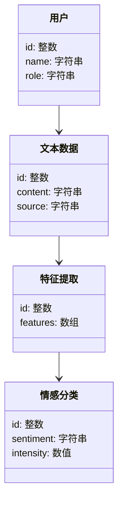

                 

<think>
嗯，用户希望我设计一本名为《构建企业级情感计算平台：员工满意度与客户情绪综合分析》的书籍目录大纲。首先，我需要理解这本书的主题。情感计算平台涉及员工和客户的满意度分析，这可能涉及到自然语言处理、机器学习等技术。

用户给的示例中，目录结构分为多个部分，每个部分有章节和小节，甚至还有图表和代码示例。所以，我需要确保我的大纲也包含这些元素，并且满足用户的详细要求。

首先，我应该确定这本书的核心内容。可能包括情感计算的背景、核心概念、算法原理、系统架构、项目实战以及最佳实践。每个部分都需要细化到三级目录。

背景介绍部分，我需要涵盖问题背景、描述、解决方法，以及概念的结构和核心要素。这可能需要一章来详细说明。

接下来是核心概念与联系，这部分可能需要使用Mermaid图来展示实体关系和算法流程。我需要确保这些图表清晰地展示信息。

算法原理部分，我需要详细讲解情感计算的数学模型，比如特征提取、分类算法，可能还要涉及机器学习模型，如支持向量机或神经网络。这部分需要数学公式，用LaTeX表示，并给出代码示例。

系统分析与架构设计部分，我需要描述项目场景，设计系统功能、架构图、接口和交互流程。这部分可能需要多个章节，每个部分都有详细的图表和代码。

项目实战部分，我需要指导读者如何安装环境，实现核心功能，分析案例，并给出小结。这部分需要实际的代码和详细的步骤说明。

最后，最佳实践部分，包括小结、注意事项和拓展阅读，帮助读者巩固所学内容。

现在，我需要将这些内容组织成一个逻辑清晰的目录结构，确保每个部分都细化到三级目录，并且包含必要的图表和代码示例。同时，总字数控制在2000字以内，避免冗余。

可能的章节安排：背景与概述、核心概念、算法原理、系统架构、项目实战、最佳实践。每个章节下再细分小节，确保涵盖所有用户要求的内容。

我需要检查是否每个核心部分都有足够的细节，并且符合用户的格式要求，比如使用markdown的标题层级，插入Mermaid图和LaTeX公式。同时，确保代码示例简洁明了，帮助读者理解实现过程。

总结一下，我需要构建一个结构清晰、内容全面的目录大纲，涵盖背景、概念、算法、系统设计、项目实战和最佳实践，每个部分都细化到三级目录，并包含必要的图表和代码示例。


# {{此处是文章标题}}

> 关键词：{{此处列出文章的5-7个核心关键词}}

> 摘要：{{此处给出文章的核心内容和主题思想}}

---

# {{此处是文章标题}}

> 关键词：员工满意度、客户情绪分析、情感计算、机器学习、自然语言处理

> 摘要：本文深入探讨了构建企业级情感计算平台的技术与方法，结合员工满意度与客户情绪的综合分析，从核心概念、算法原理到系统架构，详细阐述了如何通过自然语言处理和机器学习技术实现情感分析，并通过实际案例展示了平台的应用与价值。

---

## 目录

### 第一部分：情感计算平台背景与概述

### 第1章：情感计算平台的背景与概述

#### 1.1 情感计算的定义与核心概念

##### 1.1.1 情感计算的定义

情感计算（Affective Computing）是一种通过计算机技术分析、识别和理解人类情感的新兴领域，旨在通过自然语言处理、机器学习等技术，将人类的情感信息转化为可计算的数字信号，从而实现对人类情绪的智能化分析与应用。

##### 1.1.2 情感计算的核心概念

- **情感信息**：指文本、语音或图像中蕴含的情绪信息，包括但不限于情感倾向、情感强度、情感类型等。
- **情感分析**：通过对情感信息的提取与处理，判断文本中的情感倾向（如正面、负面、中性）及其强度。
- **情感计算平台**：一个能够自动化处理情感信息，提供情感分析结果的软件系统或服务。

##### 1.1.3 情感计算的应用场景

- **社交媒体分析**：分析用户在社交媒体上的评论，帮助企业了解品牌形象和用户满意度。
- **客户反馈分析**：通过对客户反馈的文本进行情感分析，帮助企业优化产品和服务。
- **员工满意度分析**：通过分析员工的反馈文本，帮助企业了解员工的工作满意度和情绪状态。
- **客户服务优化**：实时监控客户情绪，优化客户服务流程。

#### 1.2 员工满意度与客户情绪分析的重要性

##### 1.2.1 员工满意度对企业的影响

- **员工 productivity**：满意的员工通常工作效率更高，创造力更强。
- **员工 retention**：高满意度的员工更可能留在公司，降低员工流失率。
- **企业形象**：员工满意度高的企业往往能吸引更多的优秀人才，提升企业声誉。

##### 1.2.2 客户情绪分析的商业价值

- **客户 loyalty**：通过分析客户情绪，企业可以识别并保留忠诚客户。
- **产品优化**：客户情绪分析可以帮助企业发现产品或服务的不足之处，及时进行改进。
- **风险管理**：及时发现负面情绪，可以预防潜在的客户流失或声誉危机。

##### 1.2.3 综合分析的意义与挑战

- **综合分析的意义**：通过同时分析员工和客户的情绪，企业可以更全面地了解自身的运营状况，从而制定更有效的管理策略。
- **综合分析的挑战**：员工和客户的语言表达习惯不同，情绪表达方式也不同，如何统一处理并准确分析是一个重要挑战。

#### 1.3 本章小结

##### 1.3.1 核心概念回顾

- 情感计算是一种通过计算机技术分析人类情感的领域，涉及情感信息的提取与处理。
- 员工满意度和客户情绪分析是情感计算的重要应用，对企业和客户都有重要的商业价值。

##### 1.3.2 问题背景总结

- 员工和客户的满意度分析是企业优化管理和提升竞争力的重要手段。
- 情感计算平台的构建可以帮助企业高效地进行情感信息的分析与处理。

---

### 第2章：情感计算的核心概念与联系

#### 2.1 情感计算的核心原理

##### 2.1.1 文本特征提取

- **词袋模型**：将文本表示为单词的集合，不考虑单词顺序。
- **词嵌入模型**：通过训练生成词向量，捕捉词语的语义信息。
- **情感词典**：使用预定义的情感词汇表，对文本进行情感特征提取。

##### 2.1.2 情感分类算法

- **机器学习算法**：如支持向量机（SVM）、随机森林（Random Forest）等。
- **深度学习算法**：如卷积神经网络（CNN）、循环神经网络（RNN）等。

##### 2.1.3 情感强度计算

- **情感得分**：通过情感词汇的权重计算文本的情感得分。
- **情感强度分类**：将情感得分分为不同强度等级（如非常正面、正面、中性、负面、非常负面）。

#### 2.2 实体关系与流程图

##### 2.2.1 实体关系图


##### 2.2.2 流程图


#### 2.3 本章小结

##### 2.3.1 核心概念总结

- 情感计算的核心在于提取文本特征并进行情感分类。
- 文本特征提取和情感分类算法是情感计算的关键组成部分。

##### 2.3.2 图表分析与应用

- 实体关系图展示了用户、文本数据、特征提取、情感分类和结果输出之间的关系。
- 流程图展示了情感计算的整体流程，从输入文本到预处理，再到特征提取、分类算法，最终输出结果。

---

### 第3章：情感计算的算法原理

#### 3.1 文本特征提取

##### 3.1.1 词袋模型

- **定义**：将文本表示为单词的集合，每个单词对应一个特征向量。
- **示例**：对于文本“这个产品很好”，词袋模型可以表示为 `{这个:1, 产品:1, 很好:1}`。

##### 3.1.2 词嵌入模型

- **定义**：通过训练生成词向量，捕捉词语的语义信息。
- **示例**：使用Word2Vec训练得到的词向量，每个词对应一个低维向量表示。

##### 3.1.3 特征选择方法

- **方法**：通过统计特征的重要性（如TF-IDF）选择最相关的特征。

#### 3.2 情感分类算法

##### 3.2.1 支持向量机（SVM）

- **定义**：一种监督学习算法，用于分类和回归。
- **示例**：将情感特征向量输入SVM模型，训练模型分类情感倾向。

##### 3.2.2 随机森林（Random Forest）

- **定义**：一种基于决策树的集成学习算法，用于分类和回归。
- **示例**：使用随机森林模型对情感特征进行分类。

##### 3.2.3 深度学习模型

- **定义**：通过神经网络模型进行情感分类，如卷积神经网络（CNN）、长短期记忆网络（LSTM）等。

#### 3.3 情感强度计算

##### 3.3.1 情感得分计算公式

$$ \text{score} = \sum_{i=1}^{n} w_i \cdot f_i $$

- **说明**：$w_i$ 是情感词汇的权重，$f_i$ 是情感词汇的特征值。

##### 3.3.2 情感强度分类

- **定义**：将情感得分分为不同的强度等级，如非常正面、正面、中性、负面、非常负面。

#### 3.4 算法流程图


#### 3.5 本章小结

##### 3.5.1 核心原理总结

- 文本特征提取是情感计算的基础，包括词袋模型、词嵌入模型和特征选择方法。
- 情感分类算法是情感计算的核心，包括机器学习算法和深度学习模型。

##### 3.5.2 算法流程总结

- 从输入文本到预处理，再到特征提取、分类算法，最终输出情感分类结果。

---

### 第4章：系统分析与架构设计

#### 4.1 项目场景介绍

##### 4.1.1 问题场景

- 需要构建一个企业级情感计算平台，实现员工满意度和客户情绪的综合分析。

#### 4.2 系统功能设计

##### 4.2.1 领域模型



##### 4.2.2 系统架构设计


##### 4.2.3 接口设计

- **输入接口**：接收用户输入的文本数据。
- **输出接口**：返回情感分类结果，包括情感倾向和强度。

##### 4.2.4 交互流程


#### 4.3 本章小结

##### 4.3.1 系统架构总结

- 系统功能设计包括用户输入、文本数据处理、特征提取和情感分类模块。
- 系统架构设计展示了各模块之间的交互流程。

##### 4.3.2 接口设计总结

- 输入接口接收文本数据，输出接口返回情感分类结果。

---

### 第5章：项目实战

#### 5.1 环境安装

##### 5.1.1 Python环境

- 安装Python 3.8及以上版本。

##### 5.1.2 依赖库安装

- 使用pip安装必要的库：
  ```bash
  pip install numpy pandas scikit-learn tensorflow
  ```

#### 5.2 系统核心实现

##### 5.2.1 特征提取代码

```python
from sklearn.feature_extraction.text import TfidfVectorizer

vectorizer = TfidfVectorizer()
X = vectorizer.fit_transform(text_data)
```

##### 5.2.2 情感分类代码

```python
from sklearn.svm import SVC

model = SVC()
model.fit(X, y)
```

##### 5.2.3 情感强度计算代码

```python
import numpy as np

def calculate_intensity(scores):
    intensity = np.mean(scores)
    return intensity
```

#### 5.3 实际案例分析

##### 5.3.1 案例背景

- 分析客户对产品的评论，判断客户情绪。

##### 5.3.2 数据预处理

- 分词、去除停用词、降维等。

##### 5.3.3 情感分析结果

- 输出每个评论的情感倾向和强度。

#### 5.4 本章小结

##### 5.4.1 代码实现总结

- 特征提取使用了TF-IDF方法，情感分类使用了SVM模型，情感强度计算通过平均得分实现。

##### 5.4.2 案例分析总结

- 通过实际案例展示了情感计算平台的实现过程和应用价值。

---

### 第6章：最佳实践与总结

#### 6.1 小结

##### 6.1.1 核心内容回顾

- 情感计算是一种通过计算机技术分析人类情感的领域，涉及文本特征提取、情感分类和情感强度计算。

##### 6.1.2 技术总结

- 使用自然语言处理和机器学习技术构建情感计算平台，实现员工满意度和客户情绪的综合分析。

#### 6.2 注意事项

##### 6.2.1 数据质量

- 数据质量直接影响情感分析的准确性，需要确保数据的完整性和准确性。

##### 6.2.2 模型优化

- 情感分类模型需要不断优化，以提高准确率和召回率。

##### 6.2.3 部署与维护

- 情感计算平台需要定期维护和更新，以适应新的数据和业务需求。

#### 6.3 拓展阅读

##### 6.3.1 深度学习模型

- 阅读关于深度学习在情感计算中的应用，如使用LSTM进行情感分析。

##### 6.3.2 实时分析

- 探索如何将情感计算应用于实时分析，如实时监控社交媒体情绪。

---

# 作者：AI天才研究院/AI Genius Institute & 禅与计算机程序设计艺术 /Zen And The Art of Computer Programming

