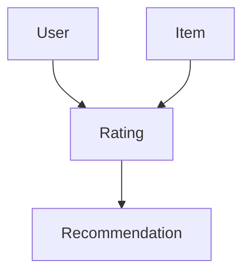

                 


# 《构建企业级推荐引擎：跨平台个性化用户体验》

## 关键词：推荐引擎, 个性化推荐, 机器学习, 系统架构, 跨平台体验

## 摘要：  
本文深入探讨企业级推荐引擎的构建过程，从核心算法原理到系统架构设计，结合跨平台的个性化用户体验，系统地解析推荐引擎的技术实现和应用实践。文章内容包括推荐引擎的背景、核心概念、算法原理、系统架构、项目实战及优化建议，旨在帮助读者全面掌握构建高效推荐系统的方法。

---

## 第一部分: 推荐引擎背景与核心概念

## 第1章: 推荐引擎概述

### 1.1 推荐引擎的定义与核心概念
#### 1.1.1 推荐引擎的定义
推荐引擎是一种基于用户行为、偏好和数据挖掘技术，为用户提供个性化内容或产品的技术系统。它通过分析海量数据，预测用户的兴趣和需求，从而实现精准推荐。

#### 1.1.2 推荐引擎的核心概念
- **用户(User)**：推荐系统的目标用户，具有明确的特征（如年龄、性别、兴趣等）。
- **物品(Item)**：推荐系统中的推荐对象，可以是商品、视频、新闻等。
- **评分(Rating)**：用户对物品的偏好程度，通常以分数形式表示。
- **推荐(Recommendation)**：系统基于历史数据生成的个性化推荐结果。

#### 1.1.3 个性化推荐的背景与意义
个性化推荐已成为企业提升用户粘性和转化率的重要手段。随着数据量的爆炸式增长和算法的不断优化，推荐系统在电商、社交媒体、流媒体等领域发挥着越来越重要的作用。

### 1.2 推荐引擎的应用场景
#### 1.2.1 电商推荐系统
通过分析用户的购买历史、浏览行为和偏好，推荐相关商品，提升用户购买转化率。

#### 1.2.2 视频流媒体推荐
基于用户的观看历史和偏好，推荐个性化的内容，提高用户观看时长和满意度。

#### 1.2.3 社交网络推荐
通过分析用户的社交行为和兴趣，推荐潜在的朋友或相关内容，增强用户活跃度。

#### 1.2.4 新闻推荐系统
根据用户的阅读历史和兴趣，推荐相关的新闻或文章，提升用户粘性。

### 1.3 推荐引擎的核心问题
#### 1.3.1 问题背景与挑战
推荐系统的核心挑战包括数据稀疏性、冷启动问题、实时性要求以及模型的可解释性。

#### 1.3.2 数据稀疏性问题
数据稀疏性指用户对大部分物品的评分缺失，导致推荐系统的准确性和稳定性下降。

#### 1.3.3 推荐系统的性能瓶颈
随着数据量和用户的增加，推荐系统的计算复杂度和响应时间面临挑战。

#### 1.3.4 个性化与多样性的平衡
如何在个性化推荐中保持多样性，避免推荐过于单一的内容，是推荐系统设计中的重要问题。

---

## 第2章: 推荐引擎的核心概念与联系

### 2.1 推荐引擎的核心原理
推荐引擎的核心原理包括协同过滤、基于内容的推荐和混合推荐模型。

#### 2.1.1 协同过滤
协同过滤是一种基于用户相似性或物品相似性的推荐方法。它通过分析用户的行为数据，找到相似的用户或物品，进行推荐。

#### 2.1.2 基于内容的推荐
基于内容的推荐方法通过分析物品的属性（如商品描述、视频标签等），找到与用户兴趣相符的内容进行推荐。

#### 2.1.3 混合推荐模型
混合推荐模型结合了协同过滤和基于内容的推荐方法，通过集成多种推荐策略，提升推荐系统的准确性和多样性。

### 2.2 推荐引擎的核心要素对比
以下是推荐算法的对比表格：

| 算法类型         | 优点                       | 缺点                         | 适用场景                     |
|------------------|----------------------------|------------------------------|------------------------------|
| 协同过滤         | 高准确性                   | 数据稀疏性                   | 电商、视频推荐               |
| 基于内容的推荐   | 高多样性                   | 需要高质量内容               | 新闻、视频推荐               |
| 混合推荐模型       | 高鲁棒性                   | 复杂性较高                   | 综合推荐场景                 |

### 2.3 推荐引擎的实体关系图
以下是推荐引擎的实体关系图：



---

## 第3章: 推荐引擎的算法原理

### 3.1 协同过滤算法
#### 3.1.1 基于用户的协同过滤
基于用户的协同过滤通过分析用户的行为数据，找到相似的用户，推荐他们喜欢的物品。

#### 3.1.2 基于物品的协同过滤
基于物品的协同过滤通过分析物品的属性和用户行为数据，找到相似的物品，进行推荐。

#### 3.1.3 协同过滤的数学模型
协同过滤的相似度计算公式如下：

$$
sim(i,j) = \frac{\sum_{k} r_{ik} r_{jk}}{\sqrt{\sum_{k} r_{ik}^2} \sqrt{\sum_{k} r_{jk}^2}}
$$

### 3.2 基于矩阵分解的推荐算法
#### 3.2.1 矩阵分解原理
矩阵分解是一种通过分解用户-物品评分矩阵，提取隐含特征的推荐方法。

#### 3.2.2 SVD算法
SVD（奇异值分解）是一种常用的矩阵分解算法，广泛应用于推荐系统中。

#### 3.2.3 矩阵分解的数学模型
矩阵分解的公式如下：

$$
R = P \times Q^T
$$

其中，R为用户-物品评分矩阵，P为用户特征矩阵，Q为物品特征矩阵。

### 3.3 基于深度学习的推荐算法
#### 3.3.1 神经网络在推荐系统中的应用
深度学习模型（如神经网络）通过分析用户行为和物品特征，生成推荐结果。

#### 3.3.2 基于注意力机制的推荐
注意力机制通过聚焦重要的用户行为或物品特征，提升推荐的准确性。

#### 3.3.3 深度学习模型的优缺点
- 优点：高表达能力，可以处理复杂的特征关系。
- 缺点：计算复杂度高，需要大量的训练数据。

---

## 第4章: 推荐引擎的系统分析与架构设计

### 4.1 系统架构设计
推荐引擎的系统架构通常包括数据层、算法层和应用层。

#### 4.1.1 数据层
数据层负责存储和管理用户行为数据、物品特征数据等。

#### 4.1.2 算法层
算法层负责实现推荐算法，生成推荐结果。

#### 4.1.3 应用层
应用层负责与用户交互，展示推荐结果。

### 4.2 系统接口设计
推荐引擎需要与前端和后端进行交互，提供推荐结果和用户行为数据。

### 4.3 系统交互流程
推荐引擎的系统交互流程包括数据采集、特征提取、推荐计算和结果展示。

---

## 第5章: 推荐引擎的项目实战

### 5.1 电商推荐系统案例
以电商推荐系统为例，详细解读推荐引擎的实现过程。

#### 5.1.1 环境安装
需要安装Python、TensorFlow、Pandas等工具。

#### 5.1.2 核心代码实现
以下是协同过滤算法的Python实现示例：

```python
import numpy as np

def user_based_collaborative_filtering(ratings, user_id, item_id):
    # 计算用户相似度
    user_ratings = ratings.pivot(index='user_id', columns='item_id', values='rating')
    user_similarity = user_ratings.corr(method='pearson')
    
    # 获取目标用户的相似用户
    similar_users = user_similarity[user_id].sort_values(ascending=False)
    
    # 获取目标用户未评分的物品
    target_user_ratings = ratings[ratings['user_id'] == user_id]
    target_user_unrated_items = ratings[~ratings['item_id'].isin(target_user_ratings['item_id'])]['item_id'].unique()
    
    # 生成推荐结果
    recommendations = []
    for item in target_user_unrated_items:
        score = similar_users.dot(user_ratings[item].values)
        recommendations.append((item, score))
    
    return recommendations

# 示例调用
ratings = pd.DataFrame({
    'user_id': [1, 2, 3, 1, 2, 3],
    'item_id': [101, 102, 103, 104, 105, 106],
    'rating': [4, 3, 5, 2, 4, 1]
})
user_id = 1
item_id = 101

recommendations = user_based_collaborative_filtering(ratings, user_id, item_id)
print(recommendations)
```

#### 5.1.3 代码解读与分析
上述代码实现了基于用户的协同过滤算法，计算用户相似度，生成推荐结果。

---

## 第6章: 推荐引擎的优化与总结

### 6.1 最佳实践
- 数据预处理：清洗和特征提取。
- 算法选择：根据具体场景选择合适的推荐算法。
- 系统优化：提升推荐系统的性能和响应速度。

### 6.2 小结
推荐引擎的构建需要综合考虑算法选择、系统架构和用户体验，通过不断优化和调整，才能实现高效的个性化推荐。

### 6.3 注意事项
- 数据隐私：注意用户数据的隐私保护。
- 模型可解释性：提升推荐系统的可解释性，增强用户体验。

### 6.4 拓展阅读
推荐阅读《推荐系统实践》、《机器学习实战》等书籍，深入学习推荐系统的核心技术。

---

## 作者：AI天才研究院/AI Genius Institute & 禅与计算机程序设计艺术 /Zen And The Art of Computer Programming

---

以上是《构建企业级推荐引擎：跨平台个性化用户体验》的技术博客文章目录大纲。希望这篇文章能为读者提供全面的推荐系统知识，帮助读者掌握构建高效推荐系统的方法和技巧。

