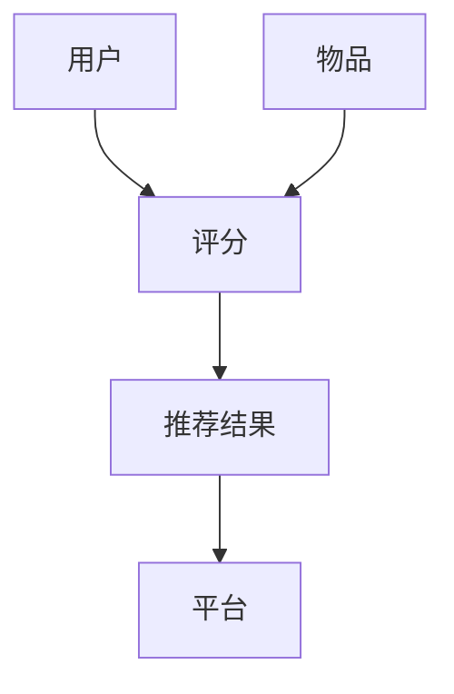
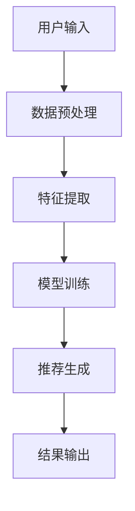
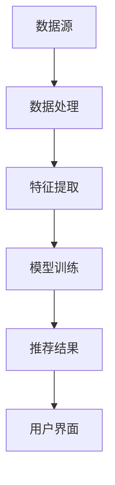

                 


# 构建企业级推荐引擎：跨平台个性化用户体验的智能化实现

> 关键词：推荐引擎，个性化推荐，跨平台，深度学习，推荐算法

> 摘要：  
推荐引擎作为现代信息技术的重要组成部分，广泛应用于电商、社交媒体、流媒体等多个领域。本文旨在探讨企业级推荐引擎的构建，从核心概念、算法原理到系统架构，再到项目实战和最佳实践，全面解析如何实现跨平台的个性化推荐，提升用户体验。通过本文，读者将深入了解推荐引擎的构建过程，并掌握实际应用中的关键技巧。

---

## 第1章: 推荐引擎的定义与背景

### 1.1 推荐引擎的定义与核心目标
推荐引擎是一种基于用户行为、偏好和数据的智能系统，旨在为用户提供个性化的内容或产品推荐。其核心目标是通过分析海量数据，挖掘用户的潜在需求，从而提高用户满意度和产品粘性。

### 1.2 技术背景与演变
推荐技术从协同过滤到深度学习的演变，反映了技术的进步和数据处理能力的提升。协同过滤基于用户行为的相似性进行推荐，而深度学习则利用神经网络的强大能力，捕捉更复杂的模式和特征。

### 1.3 市场与用户需求
跨平台推荐的需求日益增长，用户期望在不同设备和平台上获得一致的个性化体验。企业级推荐引擎需要处理海量数据，支持高并发请求，并保证推荐结果的实时性和准确性。

---

## 第2章: 推荐引擎的核心概念与原理

### 2.1 推荐引擎的核心原理
推荐引擎主要基于协同过滤、内容推荐和混合推荐三种方法。协同过滤依赖于用户行为的相似性，内容推荐基于物品本身的特征，混合推荐结合两者的优势，提升推荐效果。

### 2.2 推荐算法的特征对比
以下是不同推荐算法的特征对比：

| 算法类型     | 准确率 | 实时性 | 计算复杂度 |
|--------------|--------|--------|------------|
| 协同过滤     | 中     | 较低   | 高          |
| 基于内容的推荐 | 高     | 较高   | 中          |
| 混合推荐      | 高     | 中     | 高          |

### 2.3 推荐系统的实体关系图


---

## 第3章: 推荐算法的数学模型与实现

### 3.1 协同过滤算法
协同过滤基于相似性计算用户的偏好。例如，基于用户的协同过滤公式如下：
$$ sim(u, v) = \frac{\sum_{i} (r_{u,i} - \bar{r}_u)(r_{v,i} - \bar{r}_v)}{\sqrt{\sum_{i} (r_{u,i} - \bar{r}_u)^2} \sqrt{\sum_{i} (r_{v,i} - \bar{r}_v)^2}} $$
其中，$\bar{r}_u$ 和 $\bar{r}_v$ 分别是用户u和v的平均评分。

### 3.2 深度学习推荐算法
矩阵分解是一种常见的深度学习推荐方法，其目标是最小化预测评分与实际评分的差异：
$$ \text{损失函数} = \sum_{(u,i) \in \text{已观察}} (r_{u,i} - \hat{r}_{u,i})^2 + \lambda \left( \|P\|^2 + \|Q\|^2 \right) $$
其中，P和Q是分解后的矩阵，$\lambda$ 是正则化参数。

### 3.3 算法流程图


---

## 第4章: 系统分析与架构设计

### 4.1 问题场景介绍
推荐系统需要处理高维数据，支持实时请求，并保证推荐结果的多样性。企业级推荐引擎通常需要处理数百万用户和物品，这对系统的计算能力和架构设计提出了挑战。

### 4.2 系统架构设计
推荐引擎的系统架构包括数据采集层、特征提取层、模型训练层和结果展示层。以下是系统架构图：


---

## 第5章: 项目实战

### 5.1 环境搭建
首先安装必要的库：
```bash
pip install numpy pandas tensorflow
```

### 5.2 核心实现代码
以下是协同过滤算法的实现示例：
```python
import numpy as np

def user_based_CF(ratings, user):
    # 计算用户平均评分
    avg_ratings = ratings.mean(axis=1)
    # 找出与目标用户相似的其他用户
    similar_users = ratings.columns[(ratings[user] - avg_ratings[user])**2].sort_values()
    # 计算推荐评分
   推荐评分 = np.dot(ratings[user], similar_users)
    return 推荐评分
```

### 5.3 实际案例分析
以电商推荐为例，假设我们有用户购买历史数据，通过矩阵分解模型进行推荐，可以显著提高推荐的准确率和用户满意度。

---

## 第6章: 最佳实践与小结

### 6.1 性能优化
使用分布式计算框架（如Spark）处理海量数据，优化模型训练的效率。

### 6.2 用户体验优化
结合实时反馈机制，动态调整推荐结果，提升用户体验。

### 6.3 安全性考虑
保护用户隐私，确保推荐数据的安全性，避免数据泄露风险。

---

## 作者：AI天才研究院 & 禅与计算机程序设计艺术

---

通过本文的详细讲解，读者可以全面了解企业级推荐引擎的构建过程，从理论到实践，掌握推荐引擎的核心原理和实际应用技巧。希望本文能为读者在推荐系统领域提供有价值的参考和指导。

