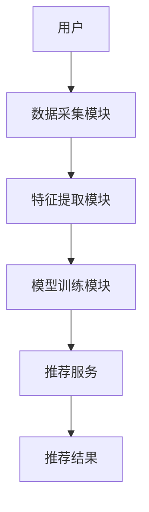
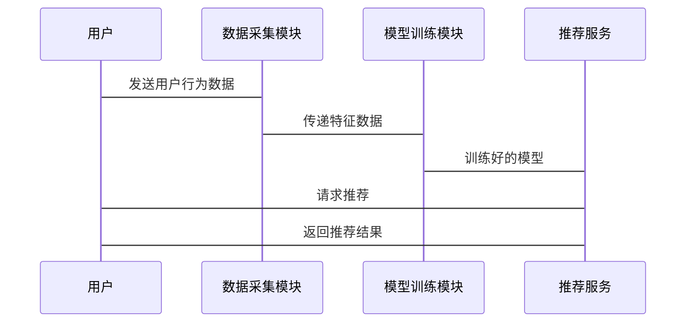

                 


# 《构建企业级推荐引擎：跨平台用户行为分析与个性化推荐》

> 关键词：推荐引擎，用户行为分析，个性化推荐，协同过滤，矩阵分解，深度学习

> 摘要：本文深入探讨了企业级推荐引擎的构建过程，从跨平台用户行为分析到个性化推荐算法的实现。文章首先介绍了推荐引擎的核心概念和应用场景，然后详细讲解了协同过滤和基于内容的推荐算法，接着通过矩阵分解模型推导了推荐系统的数学基础。在系统架构设计部分，文章讨论了推荐引擎的模块划分和交互流程。最后，通过一个基于协同过滤的推荐系统实现案例，展示了如何从数据预处理到模型训练，再到服务部署，完整构建一个推荐系统。本文适合技术总监、架构师和数据科学家阅读，旨在帮助读者掌握构建高效推荐引擎的关键技术。

---

# 第一部分: 背景介绍与核心概念

## 第1章: 推荐引擎的背景与定义

### 1.1 推荐引擎的定义与特点
#### 1.1.1 推荐引擎的定义
推荐引擎是一种基于用户行为和偏好，自动为用户推荐相关内容或产品的技术。它通过分析用户的历史行为、偏好和交互数据，生成个性化的推荐列表。

#### 1.1.2 推荐引擎的核心特点
- **个性化**：根据用户的兴趣和行为，提供定制化的内容或产品。
- **实时性**：能够快速响应用户的请求，提供实时推荐。
- **可扩展性**：适用于大规模数据和用户基数。

#### 1.1.3 推荐引擎与个性化推荐的关系
推荐引擎是实现个性化推荐的核心技术，通过算法和模型生成个性化推荐结果。

### 1.2 推荐引擎的应用场景
#### 1.2.1 电商推荐
基于用户的购买历史和浏览行为，推荐相关商品。

#### 1.2.2 视频推荐
根据用户的观看历史和偏好，推荐电影、电视剧等视频内容。

#### 1.2.3 音乐推荐
根据用户的听歌历史和喜好，推荐音乐或歌手。

#### 1.2.4 新闻推荐
根据用户的阅读历史和兴趣，推荐相关新闻文章。

### 1.3 推荐引擎的技术演变
#### 1.3.1 早期推荐系统
基于简单的规则或基于频率的推荐，例如“销量最高的商品”。

#### 1.3.2 基于协同过滤的推荐
通过用户相似性或物品相似性，找到相似用户的偏好或相似物品的推荐。

#### 1.3.3 基于深度学习的推荐
利用神经网络模型，从大量数据中学习复杂的用户偏好和物品特征。

## 第2章: 企业级推荐引擎的核心要素

### 2.1 用户行为分析
#### 2.1.1 用户行为的分类
- **显式行为**：用户的点击、收藏、购买等操作。
- **隐式行为**：用户的浏览、停留时间、滑动等行为。

#### 2.1.2 用户行为数据的采集与处理
- 数据采集：通过日志记录用户的行为数据。
- 数据处理：清洗、去重、归并用户行为数据。

#### 2.1.3 用户行为分析的工具与方法
- 工具：日志分析工具（如ELK）、数据分析工具（如Pandas）。
- 方法：统计分析、关联规则挖掘、聚类分析。

### 2.2 特征工程
#### 2.2.1 特征的定义与提取
- 用户特征：用户的年龄、性别、地理位置。
- 物品特征：商品的类别、价格、品牌。
- 行为特征：用户的点击频率、购买时间。

#### 2.2.2 特征的维度与层次
- 时间维度：用户在特定时间段的行为。
- 空间维度：用户的地理位置对推荐的影响。
- 关系维度：用户之间的相似性或物品之间的相似性。

#### 2.2.3 特征的标准化与归一化
- 标准化：将特征值标准化到同一范围，例如使用z-score标准化。
- 归一化：将特征值归一化到[0,1]范围。

### 2.3 推荐模型
#### 2.3.1 协同过滤模型
- 基于用户的协同过滤：找到与目标用户相似的用户，推荐他们喜欢的物品。
- 基于物品的协同过滤：找到与目标用户喜欢的物品相似的物品，推荐给用户。

#### 2.3.2 基于内容的推荐模型
- 基于物品内容的推荐：分析物品的属性和特征，推荐相似的物品。
- 基于用户的描述性信息推荐：分析用户的兴趣和描述，推荐相关的内容。

#### 2.3.3 混合推荐模型
- 综合协同过滤和基于内容的推荐，结合多种特征进行推荐。

### 2.4 评价指标
#### 2.4.1 精确率与召回率
- 精确率：推荐列表中实际被用户接受的比例。
- 召回率：实际被用户接受的推荐数量占所有可能被接受的推荐数量的比例。

#### 2.4.2 F1分数
- F1分数：精确率和召回率的调和平均数，综合衡量推荐系统的性能。

#### 2.4.3 准确性与多样性
- 准确性：推荐列表中用户的实际行为概率。
- 多样性：推荐列表中物品的多样性，避免推荐过于相似的物品。

---

# 第二部分: 推荐引擎的核心概念与原理

## 第3章: 协同过滤推荐算法

### 3.1 协同过滤的原理
#### 3.1.1 基于用户的协同过滤
- 找到与目标用户相似的用户，推荐这些用户喜欢的物品。

#### 3.1.2 基于物品的协同过滤
- 找到与目标用户喜欢的物品相似的物品，推荐给用户。

#### 3.1.3 混合协同过滤
- 综合基于用户和基于物品的协同过滤，提高推荐的准确性和多样性。

### 3.2 协同过滤的实现步骤
#### 3.2.1 数据预处理
- 数据清洗：处理缺失值和异常值。
- 特征提取：提取用户、物品和行为特征。

#### 3.2.2 相似性计算
- 基于用户的相似性计算：使用余弦相似度或皮尔逊相关系数。
- 基于物品的相似性计算：使用余弦相似度或协同过滤。

#### 3.2.3 推荐生成
- 根据相似性计算结果，生成推荐列表。

---

## 第4章: 基于内容的推荐

### 4.1 基于内容的推荐原理
- 分析物品的属性和特征，推荐相似的物品。

### 4.2 基于内容的推荐实现
#### 4.2.1 特征提取
- 使用文本挖掘技术提取物品的关键词和主题。

#### 4.2.2 相似性计算
- 使用余弦相似度计算物品之间的相似性。

#### 4.2.3 推荐生成
- 根据相似性计算结果，生成推荐列表。

---

## 第5章: 推荐算法的数学模型

### 5.1 矩阵分解模型
#### 5.1.1 模型推导
- 推荐问题可以表示为用户-物品的评分矩阵，通过矩阵分解将其分解为用户特征矩阵和物品特征矩阵。

#### 5.1.2 算法实现
- 使用交替最小二乘法（ALS）或梯度下降法优化矩阵分解模型。

#### 5.1.3 推荐结果
- 根据分解后的矩阵，预测用户对未评分物品的评分，生成推荐列表。

---

# 第三部分: 系统分析与架构设计

## 第6章: 系统架构设计

### 6.1 系统架构模块划分
- 数据采集模块：采集用户行为数据。
- 特征提取模块：提取用户、物品和行为特征。
- 模型训练模块：训练推荐模型。
- 服务部署模块：部署推荐服务，提供推荐接口。

### 6.2 系统架构图


### 6.3 系统交互流程


---

# 第四部分: 项目实战

## 第7章: 项目实战：基于协同过滤的推荐系统实现

### 7.1 环境搭建
- 安装Python和相关库（如numpy、pandas、scikit-learn）。

### 7.2 数据预处理
```python
import pandas as pd

# 加载数据
data = pd.read_csv('user_behavior.csv')

# 数据清洗
data.dropna()
data = data.drop_duplicates()
```

### 7.3 模型训练
```python
from sklearn.metrics.pairwise import cosine_similarity

# 提取用户和物品特征
user_features = data[['user_id', 'item_id', 'rating']]
item_features = data[['item_id', 'item_category']]

# 计算用户相似性
user_similarity = cosine_similarity(user_features)
```

### 7.4 服务部署
```python
from flask import Flask, request, jsonify

app = Flask(__name__)

@app.route('/recommend', methods=['POST'])
def recommend():
    user_id = request.json['user_id']
    # 根据用户_id生成推荐列表
    recommendations = get_recommendations(user_id)
    return jsonify({'recommendations': recommendations})

if __name__ == '__main__':
    app.run()
```

### 7.5 结果分析
- 使用精确率和召回率评估推荐系统的性能。
- 分析推荐结果的多样性和用户体验。

---

# 第五部分: 最佳实践与总结

## 第8章: 最佳实践

### 8.1 关键点总结
- 用户行为分析是推荐系统的核心。
- 特征工程和模型调优是提高推荐准确性的关键。
- 系统架构设计要考虑可扩展性和性能优化。

### 8.2 注意事项
- 数据质量对推荐系统的影响至关重要。
- 需要平衡推荐的准确性和多样性。
- 实时推荐需要高效的计算能力和优化的算法。

### 8.3 拓展阅读
- 深度学习在推荐系统中的应用。
- 实时推荐系统的设计与实现。

---

作者：AI天才研究院/AI Genius Institute & 禅与计算机程序设计艺术 /Zen And The Art of Computer Programming

