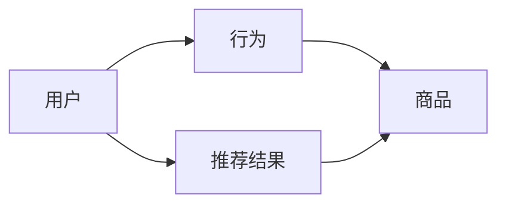
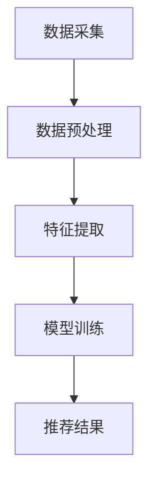
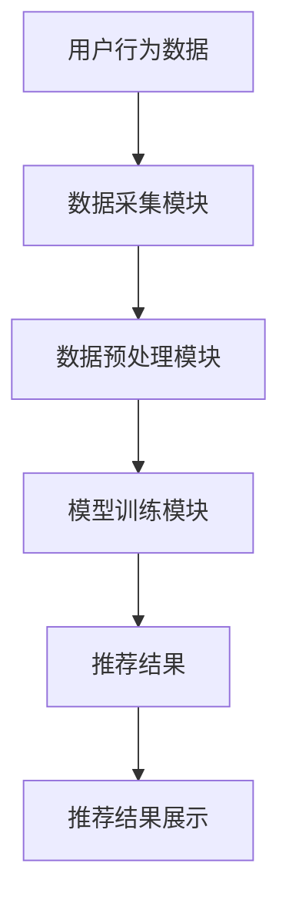

                 


# 构建企业级推荐引擎：跨渠道用户行为分析与个性化推荐

**关键词：推荐引擎，用户行为分析，个性化推荐，协同过滤，混合推荐模型，深度学习**

**摘要：**  
在当今数据驱动的商业环境中，企业级推荐引擎已成为提升用户体验和业务转化的核心技术。本文深入探讨了如何构建一个高效的企业级推荐引擎，重点分析了跨渠道用户行为数据的整合与个性化推荐算法的设计。通过理论与实践相结合的方式，本文详细讲解了推荐引擎的算法原理、系统架构、项目实战以及最佳实践，帮助读者全面掌握构建企业级推荐引擎的关键技术和方法。

---

# 目录大纲

## 第1章: 推荐引擎的背景与意义

### 1.1 问题背景
- 1.1.1 企业级推荐引擎的需求
- 1.1.2 跨渠道用户行为分析的必要性
- 1.1.3 个性化推荐的核心价值

### 1.2 问题描述
- 1.2.1 用户行为数据的复杂性
- 1.2.2 推荐系统的挑战
- 1.2.3 跨渠道数据整合的难点

### 1.3 问题解决
- 1.3.1 跨渠道数据整合的解决方案
- 1.3.2 个性化推荐算法的选择
- 1.3.3 系统架构的设计与优化

### 1.4 边界与外延
- 1.4.1 推荐引擎的边界
- 1.4.2 相关领域的外延
- 1.4.3 系统集成的注意事项

### 1.5 核心要素组成
- 1.5.1 数据采集与处理
- 1.5.2 用户行为分析
- 1.5.3 个性化推荐算法
- 1.5.4 系统架构设计

---

## 第2章: 推荐引擎的核心概念

### 2.1 推荐引擎的原理
- 2.1.1 协同过滤
- 2.1.2 基于内容的推荐
- 2.1.3 混合推荐模型

### 2.2 核心概念对比
- 2.2.1 协同过滤与基于内容推荐的对比
- 2.2.2 混合推荐模型的优缺点
- 2.2.3 跨渠道数据整合的复杂性

### 2.3 实体关系图


### 2.4 算法流程图


---

## 第3章: 推荐引擎的算法原理

### 3.1 协同过滤算法
- 3.1.1 基于用户的协同过滤
- 3.1.2 基于物品的协同过滤
- 3.1.3 深度学习模型在协同过滤中的应用

### 3.2 基于内容的推荐算法
- 3.2.1 文本挖掘与特征提取
- 3.2.2 基于向量空间模型的推荐
- 3.2.3 深度学习在内容推荐中的应用

### 3.3 混合推荐模型
- 3.3.1 混合推荐的优缺点
- 3.3.2 混合推荐模型的实现步骤
- 3.3.3 深度学习与协同过滤的结合

### 3.4 数学公式与算法实现
- 协同过滤的数学模型：
  $$\text{相似度} = \frac{\sum_{i=1}^{n} (r_{ui} - \bar{r_u})(r_{vi} - \bar{r_v})}{\sqrt{\sum_{i=1}^{n} (r_{ui} - \bar{r_u})^2} \cdot \sqrt{\sum_{i=1}^{n} (r_{vi} - \bar{r_v})^2}}$$
- 基于内容的推荐模型：
  $$\text{相似度} = \frac{\sum_{i=1}^{m} w_i \cdot f_i(x_i, y_i)}{\sum_{i=1}^{m} w_i}$$

### 3.5 Python代码实现
```python
def collaborative_filtering(user_item_matrix, user_id):
    # 计算用户之间的相似度
    user_similarity = {}
    for user in user_item_matrix:
        if user != user_id:
            similarity = calculate_similarity(user_item_matrix[user_id], user_item_matrix[user])
            user_similarity[user] = similarity
    return user_similarity
```

---

## 第4章: 推荐引擎的系统架构设计

### 4.1 系统功能设计
- 4.1.1 数据采集模块
- 4.1.2 数据预处理模块
- 4.1.3 模型训练模块
- 4.1.4 推荐结果展示模块

### 4.2 系统架构设计


### 4.3 接口设计
- RESTful API接口设计
- 微服务架构实现

---

## 第5章: 项目实战——构建企业级推荐引擎

### 5.1 环境搭建
- 5.1.1 安装依赖
- 5.1.2 数据集准备

### 5.2 核心代码实现
```python
import numpy as np
from sklearn.metrics.pairwise import cosine_similarity

def train_model(data_matrix):
    # 计算相似度矩阵
    similarity_matrix = cosine_similarity(data_matrix)
    return similarity_matrix

def make_recommendation(user_id, similarity_matrix, data_matrix):
    # 获取用户相似度最高的用户的商品偏好
    user_similarities = similarity_matrix[user_id]
    # 找到相似度最高的用户
    similar_user = np.argmax(user_similarities)
    # 返回该用户的推荐列表
    return data_matrix[similar_user]
```

### 5.3 实际案例分析
- 案例背景
- 数据处理
- 模型训练
- 结果分析

### 5.4 项目总结
- 项目成果
- 经验与教训
- 改进方向

---

## 第6章: 最佳实践与未来趋势

### 6.1 最佳实践
- 数据质量的重要性
- 模型调优的技巧
- 系统性能优化建议

### 6.2 未来趋势
- 深度学习在推荐系统中的应用
- 跨模态推荐的发展
- 实时推荐系统的挑战

### 6.3 注意事项
- 数据隐私保护
- 系统可扩展性设计
- 业务场景与技术的结合

### 6.4 小结
- 推荐引擎的核心价值
- 未来发展的潜力

---

## 作者：AI天才研究院/AI Genius Institute & 禅与计算机程序设计艺术/Zen And The Art of Computer Programming

