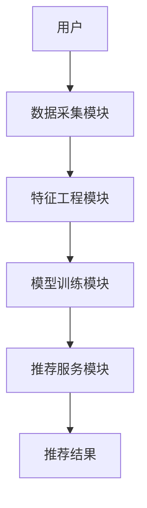

                 


# 《构建企业级推荐系统：个性化产品与服务推荐》

## 关键词：企业级推荐系统、个性化推荐、深度学习、协同过滤、系统架构、推荐算法、项目实战

## 摘要：
在当今高度竞争的商业环境中，企业级推荐系统已成为提升用户体验和商业效率的关键技术。本文从推荐系统的背景、核心算法、系统架构到项目实战，系统地探讨如何构建高效、可靠的个性化推荐系统。通过分析协同过滤、基于内容的推荐以及深度学习算法的原理与应用，结合企业级系统的实际需求，提供从理论到实践的全面指导。

---

# 第1章: 推荐系统的背景与重要性

## 1.1 推荐系统的定义与核心概念

### 1.1.1 什么是推荐系统
推荐系统是一种利用数据挖掘、机器学习等技术，基于用户行为、偏好和产品特征，为用户推荐个性化产品或服务的系统。其核心目标是通过分析海量数据，预测用户的潜在需求，提供精准的推荐结果。

### 1.1.2 推荐系统的核心要素
- **用户特征**：用户的属性、行为、偏好等，例如年龄、性别、购买记录等。
- **产品特征**：产品的属性、类别、评分等，例如书籍的分类、电影的评分。
- **交互数据**：用户与产品之间的互动数据，例如点击、收藏、购买等。
- **推荐结果**：基于上述数据生成的推荐列表。

### 1.1.3 推荐系统的分类与应用场景
- **协同过滤推荐**：基于用户之间的相似性进行推荐，适用于用户行为数据丰富的场景。
- **基于内容的推荐**：基于产品本身的特征进行推荐，适用于产品特征明确的场景。
- **混合推荐**：结合协同过滤和内容推荐的优点，适用于复杂场景。

### 1.1.4 推荐系统的实体关系图（ER图）

```mermaid
erDiagram
    actor User {
        +int userId
        +string username
        +string password
    }
    class Product {
        +int productId
        +string productName
        +string productCategory
        +float productScore
    }
    class Interaction {
        +int userId
        +int productId
        +string interactionType
        +datetime interactionTime
    }
    class Recommendation {
        +int userId
        +int productId
        +float recommendationScore
    }
    User --> Interaction : 产生
    Product --> Interaction : 关联
    Interaction --> Recommendation : 生成
```

---

## 1.2 企业级推荐系统的重要性

### 1.2.1 提升用户体验与用户粘性
个性化推荐能够满足用户需求，提升用户满意度和粘性，降低用户流失率。

### 1.2.2 数据驱动的商业决策
通过分析推荐系统生成的数据，企业可以优化产品策略、营销策略等，实现数据驱动的商业决策。

### 1.2.3 企业级推荐系统的挑战
- **数据稀疏性**：用户行为数据不足时，推荐系统的准确性和覆盖率会下降。
- **实时性要求**：企业级系统需要实时生成推荐结果，对计算能力要求高。
- **模型复杂性**：复杂场景下，推荐系统需要结合多种算法和模型。

---

## 1.3 推荐系统的技术演进

### 1.3.1 从简单推荐到智能推荐的演变
- **基于规则的推荐**：早期推荐系统通过人工设定规则，例如“购买过同类产品的用户也会购买该产品”。
- **协同过滤推荐**：利用用户行为数据，基于相似性进行推荐。
- **基于内容的推荐**：结合产品特征和用户偏好，生成推荐结果。
- **深度学习推荐**：利用神经网络和深度学习算法，提取复杂特征，生成个性化推荐。

### 1.3.2 大数据与人工智能对推荐系统的影响
- **大数据技术**：支持海量数据的采集、存储和处理。
- **人工智能技术**：通过机器学习算法，提升推荐系统的准确性和智能化。

### 1.3.3 企业级推荐系统的未来趋势
- **多模态推荐**：结合文本、图像等多种数据类型，提升推荐的精准度。
- **实时推荐**：基于实时数据流，快速生成推荐结果。
- **可解释性推荐**：提供可解释的推荐结果，增强用户信任。

---

## 1.4 本章小结

通过本章的介绍，我们了解了推荐系统的定义、核心要素、分类以及企业级推荐系统的重要性。推荐系统在提升用户体验、数据驱动商业决策等方面具有重要意义，同时面临着数据稀疏性、实时性、模型复杂性等挑战。接下来，我们将深入探讨推荐系统的核心算法与原理。

---

# 第2章: 推荐系统的核心算法与原理

## 2.1 协同过滤算法

### 2.1.1 基于用户的协同过滤
- **原理**：基于用户之间的相似性，推荐与相似用户喜欢的产品。
- **计算相似性**：使用余弦相似度、皮尔逊相关系数等方法计算用户相似性。
- **步骤**：
  1. 计算用户相似性矩阵。
  2. 找到相似用户的推荐列表。
  3. 综合相似用户的评分，生成推荐结果。

### 2.1.2 基于物品的协同过滤
- **原理**：基于产品的相似性，推荐与当前产品相似的产品。
- **计算相似性**：使用余弦相似度、皮尔逊相关系数等方法计算产品相似性。
- **步骤**：
  1. 计算产品相似性矩阵。
  2. 找到目标产品的相似产品。
  3. 综合相似产品的评分，生成推荐结果。

### 2.1.3 混合协同过滤模型
- **原理**：结合基于用户的协同过滤和基于物品的协同过滤，优势互补。
- **实现方式**：将两种方法生成的推荐结果进行加权融合。

### 2.1.4 协同过滤算法的优缺点
- **优点**：简单易懂，计算效率较高。
- **缺点**：数据稀疏性问题，冷启动问题（新用户或新产品的推荐困难）。

---

## 2.2 基于内容的推荐算法

### 2.2.1 基于物品特征的推荐
- **原理**：基于产品的属性、类别等特征，推荐相似产品。
- **实现方式**：使用文本挖掘、TF-IDF等技术提取产品特征。

### 2.2.2 基于用户偏好的内容推荐
- **原理**：基于用户的偏好，推荐符合用户兴趣的内容。
- **实现方式**：使用自然语言处理技术分析用户行为数据，提取关键词和主题。

### 2.2.3 内容与协同过滤的结合
- **原理**：结合内容推荐和协同过滤，提升推荐的准确性和多样性。

---

## 2.3 基于深度学习的推荐算法

### 2.3.1 基于神经网络的推荐模型
- **原理**：利用神经网络提取数据中的深层特征，生成推荐结果。
- **实现方式**：使用多层感知机（MLP）、卷积神经网络（CNN）等模型。

### 2.3.2 基于矩阵分解的推荐算法
- **原理**：通过矩阵分解技术，将用户-产品评分矩阵分解为用户特征和产品特征，生成推荐结果。
- **数学模型**：
  $$
  R_{u,i} = \sum_{k=1}^n U_{u,k} V_{i,k}
  $$
  其中，$U$是用户特征矩阵，$V$是产品特征矩阵，$R$是推荐评分矩阵。

### 2.3.3 基于注意力机制的推荐模型
- **原理**：通过注意力机制，动态调整用户特征和产品特征的重要性，生成推荐结果。
- **数学模型**：
  $$
  attention(u, i) = \frac{exp(a_u^T b_i)}{\sum_{i} exp(a_u^T b_i)}
  $$
  其中，$a_u$是用户注意力向量，$b_i$是产品注意力向量。

---

## 2.4 算法优缺点对比

### 2.4.1 协同过滤算法
- **优点**：简单易懂，计算效率较高。
- **缺点**：数据稀疏性问题，冷启动问题。

### 2.4.2 基于内容的推荐算法
- **优点**：不受数据稀疏性影响，推荐结果具有可解释性。
- **缺点**：需要高质量的内容特征，计算复杂度较高。

### 2.4.3 深度学习推荐算法
- **优点**：能够处理复杂特征，推荐结果精准。
- **缺点**：计算复杂度高，需要大量数据支持。

---

## 2.5 本章小结

通过本章的介绍，我们深入探讨了协同过滤、基于内容的推荐以及基于深度学习的推荐算法的原理与实现方式。不同算法有不同的优缺点，企业在实际应用中需要根据自身需求选择合适的算法。

---

# 第3章: 推荐系统的系统架构与实现

## 3.1 推荐系统的整体架构

### 3.1.1 系统模块划分
- **数据采集模块**：采集用户行为数据、产品特征数据等。
- **特征工程模块**：对数据进行清洗、特征提取和特征工程。
- **模型训练模块**：基于特征数据，训练推荐模型。
- **推荐服务模块**：根据输入请求，生成推荐结果。

### 3.1.2 系统架构图



---

## 3.2 系统设计的关键点

### 3.2.1 数据采集
- **数据来源**：用户行为数据、产品特征数据等。
- **数据格式**：结构化数据、非结构化数据。

### 3.2.2 特征工程
- **特征提取**：从数据中提取有用的特征。
- **特征变换**：对特征进行标准化、归一化等处理。

### 3.2.3 模型训练
- **模型选择**：根据需求选择合适的推荐算法。
- **模型调优**：通过参数调整，提升模型性能。

### 3.2.4 服务部署
- **服务接口**：定义推荐服务的接口，例如REST API。
- **服务优化**：优化服务性能，提升响应速度。

---

## 3.3 系统实现的步骤

### 3.3.1 数据预处理
- **数据清洗**：处理缺失值、异常值等。
- **特征提取**：从数据中提取特征，例如文本特征、用户特征等。

### 3.3.2 模型训练
- **选择算法**：根据需求选择协同过滤、内容推荐或深度学习算法。
- **训练模型**：基于特征数据，训练推荐模型。

### 3.3.3 服务部署
- **接口设计**：设计推荐服务的接口，例如REST API。
- **服务实现**：基于接口实现推荐服务，支持实时请求。

---

## 3.4 系统优化

### 3.4.1 数据优化
- **数据压缩**：减少数据存储空间。
- **数据分区**：将数据按用户、时间等维度进行分区。

### 3.4.2 模型优化
- **模型简化**：优化模型结构，减少计算复杂度。
- **模型融合**：结合多种算法，提升推荐效果。

### 3.4.3 服务优化
- **负载均衡**：提升服务的并发处理能力。
- **缓存优化**：减少重复计算，提升响应速度。

---

## 3.5 本章小结

通过本章的介绍，我们了解了推荐系统的整体架构、系统设计的关键点以及系统实现的步骤。企业在实际应用中需要根据自身需求，设计合理的系统架构，优化系统性能。

---

# 第4章: 推荐系统项目实战

## 4.1 项目背景与目标

### 4.1.1 项目背景
- **行业背景**：当前行业对个性化推荐的需求日益增长。
- **项目目标**：构建一个高效的个性化推荐系统，提升用户体验。

### 4.1.2 项目需求
- **用户需求**：用户希望获得个性化的产品推荐。
- **业务需求**：企业希望通过推荐系统提升销售额和用户粘性。

---

## 4.2 项目实施步骤

### 4.2.1 环境搭建
- **开发环境**：安装Python、Jupyter Notebook等开发工具。
- **数据存储**：使用MySQL或MongoDB存储数据。
- **模型训练**：使用Python机器学习库（如scikit-learn、TensorFlow）进行模型训练。

### 4.2.2 数据采集与预处理
- **数据采集**：通过爬虫、API等方式采集用户行为数据。
- **数据清洗**：处理缺失值、异常值等。
- **特征提取**：从数据中提取有用的特征。

### 4.2.3 模型实现
- **选择算法**：根据需求选择协同过滤、内容推荐或深度学习算法。
- **训练模型**：基于特征数据，训练推荐模型。
- **模型评估**：通过准确率、召回率等指标评估模型性能。

### 4.2.4 服务部署
- **接口设计**：设计推荐服务的接口，例如REST API。
- **服务实现**：基于接口实现推荐服务，支持实时请求。
- **服务测试**：测试服务性能，确保响应速度和准确性。

---

## 4.3 项目案例分析

### 4.3.1 案例背景
- **行业**：电子商务。
- **目标**：推荐用户可能感兴趣的商品。

### 4.3.2 数据分析
- **数据来源**：用户行为数据、商品特征数据。
- **数据预处理**：清洗、特征提取。

### 4.3.3 模型实现
- **选择算法**：基于协同过滤的推荐算法。
- **模型实现**：基于用户相似性，推荐相似用户的商品。
- **模型优化**：通过参数调整，提升推荐准确率。

### 4.3.4 服务部署
- **接口设计**：设计REST API，支持用户ID输入，返回推荐商品列表。
- **服务实现**：基于接口实现推荐服务，支持实时请求。

---

## 4.4 本章小结

通过本章的项目实战，我们了解了推荐系统从数据采集到服务部署的整个流程。在实际应用中，企业需要根据自身需求，选择合适的算法和系统架构，优化系统性能。

---

# 第5章: 推荐系统的优化与扩展

## 5.1 系统优化策略

### 5.1.1 数据优化
- **数据压缩**：减少数据存储空间。
- **数据分区**：将数据按用户、时间等维度进行分区。

### 5.1.2 模型优化
- **模型简化**：优化模型结构，减少计算复杂度。
- **模型融合**：结合多种算法，提升推荐效果。

### 5.1.3 服务优化
- **负载均衡**：提升服务的并发处理能力。
- **缓存优化**：减少重复计算，提升响应速度。

---

## 5.2 推荐系统的扩展

### 5.2.1 多模态推荐
- **原理**：结合文本、图像等多种数据类型，提升推荐的精准度。
- **实现方式**：使用多模态深度学习模型，例如BERT、ResNet等。

### 5.2.2 实时推荐
- **原理**：基于实时数据流，快速生成推荐结果。
- **实现方式**：使用流处理框架，例如Kafka、Flink等。

### 5.2.3 可解释性推荐
- **原理**：提供可解释的推荐结果，增强用户信任。
- **实现方式**：通过可视化工具，展示推荐的依据和理由。

---

## 5.3 本章小结

通过本章的优化与扩展，我们了解了如何优化推荐系统的性能，以及如何扩展推荐系统的功能。企业在实际应用中需要根据自身需求，选择合适的优化策略和扩展方案。

---

# 第6章: 推荐系统的最佳实践与总结

## 6.1 推荐系统的最佳实践

### 6.1.1 数据质量管理
- **数据清洗**：处理缺失值、异常值等。
- **数据存储**：选择合适的数据库，优化数据存储结构。

### 6.1.2 模型选择与调优
- **模型选择**：根据需求选择合适的推荐算法。
- **模型调优**：通过参数调整，提升模型性能。

### 6.1.3 系统设计与优化
- **系统架构设计**：设计合理的系统架构，支持扩展和优化。
- **系统性能优化**：优化系统性能，提升响应速度。

---

## 6.2 推荐系统的未来发展趋势

### 6.2.1 多模态推荐
- **趋势**：结合文本、图像等多种数据类型，提升推荐的精准度。
- **技术**：多模态深度学习模型，例如BERT、ResNet等。

### 6.2.2 实时推荐
- **趋势**：基于实时数据流，快速生成推荐结果。
- **技术**：流处理框架，例如Kafka、Flink等。

### 6.2.3 可解释性推荐
- **趋势**：提供可解释的推荐结果，增强用户信任。
- **技术**：可视化工具，展示推荐的依据和理由。

---

## 6.3 本章小结

通过本章的总结，我们了解了推荐系统的最佳实践以及未来发展趋势。企业在实际应用中需要根据自身需求，选择合适的推荐算法和系统架构，优化系统性能，提升用户体验。

---

# 作者信息

作者：AI天才研究院/AI Genius Institute  
联系方式：[联系邮箱/联系方式]  
版权声明：本文版权归作者所有，转载请注明出处。  
---

通过以上目录大纲，我们可以系统地构建一篇关于企业级推荐系统的技术博客文章。从背景、算法、系统架构到项目实战，全面覆盖推荐系统的各个方面，帮助读者深入了解推荐系统的构建与应用。

