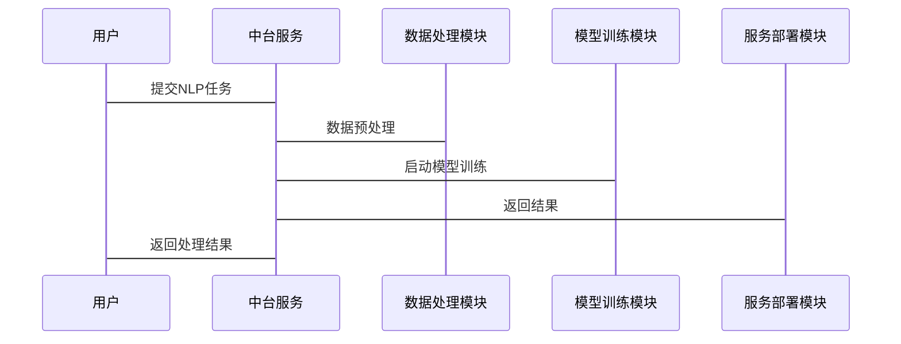

                 


# 构建企业级自然语言处理中台：多语言、多领域支持

## 关键词：自然语言处理中台，多语言支持，多领域应用，深度学习，企业级架构

## 摘要：  
本文详细探讨了构建企业级自然语言处理中台的核心技术与实现方法，重点分析了多语言与多领域支持的关键挑战与解决方案。文章从背景、核心概念、算法原理、系统架构到项目实战，层层深入，结合实际案例，为企业构建高效、灵活的NLP中台提供理论支持与实践指导。

---

# 第一部分: 自然语言处理中台概述

## 第1章: 自然语言处理中台的背景与概念

### 1.1 问题背景与挑战

#### 1.1.1 企业级NLP应用的痛点
- 数据孤岛：企业内部数据分散在不同部门，难以统一处理。
- 模型碎片化：不同领域（如客服、医疗、金融）的NLP模型独立开发，缺乏共享与复用。
- 训练数据不足：小语种或特定领域的数据稀缺，导致模型性能不佳。
- 开发效率低：重复开发同一功能（如分词、实体识别），资源浪费。

#### 1.1.2 多语言与多领域支持的需求
- 全球化企业需要支持多种语言，满足跨国业务需求。
- 企业内部涉及多个业务领域，NLP系统需具备灵活性与通用性。
- 实际场景中，跨语言、跨领域的NLP任务日益增多。

#### 1.1.3 中台架构的提出与意义
- 中台架构通过标准化接口、统一数据处理流程，降低开发成本。
- 支持快速部署与扩展，满足企业动态需求。
- 促进技术复用，提升模型训练效率。

### 1.2 自然语言处理中台的核心概念

#### 1.2.1 中台架构的定义与特点
- **定义**：中台架构是一种将企业级共性技术能力沉淀为共享服务的架构模式。
- **特点**：
  - **标准化**：统一接口规范，便于不同模块集成。
  - **灵活性**：支持多种语言与领域扩展。
  - **高效性**：通过复用共享资源，提升开发效率。

#### 1.2.2 NLP中台的功能模块与组成
- **数据处理模块**：负责数据清洗、标注与预处理。
- **模型训练模块**：支持多语言与多领域模型的训练与优化。
- **服务部署模块**：提供RESTful API，支持线上服务部署。
- **任务管理模块**：监控任务执行状态，提供日志与性能分析。

#### 1.2.3 中台架构与传统NLP系统的区别
| **对比维度** | **传统NLP系统** | **NLP中台** |
|--------------|-----------------|-------------|
| 数据处理     | 针对特定任务     | 统一接口处理 | 
| 模型训练     | 重复开发         | 复用共享资源 |
| 服务部署     | 独立部署         | 统一平台部署 |

### 1.3 本章小结
本章从企业级NLP应用的痛点出发，提出了构建NLP中台的必要性，并详细阐述了中台架构的核心概念与组成部分。

---

# 第二部分: 自然语言处理中台的核心技术

## 第2章: 多语言支持的实现原理

### 2.1 多语言NLP的挑战与解决方案

#### 2.1.1 多语言数据处理的难点
- 数据稀疏性：小语种数据不足，影响模型训练效果。
- 语言间的差异性：语法结构、词汇差异大，增加处理难度。
- 计算资源限制：多语言训练需要更多计算资源。

#### 2.1.2 多语言模型训练的策略
- **预训练模型迁移**：利用大规模多语言预训练模型（如mBert、XLM-R），通过迁移学习适应特定领域。
- **多语言词表共享**：在多语言模型中共享词嵌入，降低参数量。
- **跨语言迁移学习**：利用一种语言的模型参数初始化另一种语言的模型。

#### 2.1.3 跨语言迁移学习的原理
$$P(y|x) = f_{\theta}(x,y)$$  
其中，$f_{\theta}$是通过跨语言迁移学习得到的共享模型参数。

---

## 第3章: 多领域支持的技术实现

### 3.1 多领域NLP的挑战与解决方案

#### 3.1.1 领域数据的多样性与稀疏性
- 数据分布不均：部分领域数据少，难以训练高质量模型。
- 领域术语差异大：不同领域有特定术语，需要定制化处理。

#### 3.1.2 领域模型的通用性与专属性
- **通用性**：模型需在多个领域通用。
- **专属性**：针对特定领域优化。

#### 3.1.3 跨领域模型的迁移与适配
- 使用领域适配层，对通用模型进行微调。
- 通过领域知识图谱增强模型理解能力。

---

# 第三部分: 自然语言处理中台的算法原理

## 第4章: 基于深度学习的NLP算法

### 4.1 神经网络基础

#### 4.1.1 RNN与LSTM的原理
- RNN通过循环结构处理序列数据。
- LSTM通过门控机制解决RNN的梯度消失问题。

#### 4.1.2 Transformer的结构与特点
- **自注意力机制**：捕捉序列中全局关系。
- **多头注意力**：通过多个注意力头捕获不同类型的语义信息。

#### 4.1.3 BERT模型的创新与应用
- 预训练目标：遮蔽词预测（MLM）和下文理解（NSP）。
- 应用场景：文本分类、问答系统、实体识别等。

### 4.2 NLP任务的数学模型

#### 4.2.1 词嵌入的数学表示
$$
\text{嵌入向量} = W_{\text{embed}} \cdot \text{词索引}
$$

#### 4.2.2 注意力机制的公式推导
$$
\alpha_i = \frac{\exp(s_i)}{\sum_{j} \exp(s_j)}
$$  
其中，$s_i$是第i个词的注意力得分。

---

# 第四部分: 系统架构与设计

## 第5章: 自然语言处理中台的系统架构

### 5.1 系统功能设计

#### 5.1.1 数据处理模块
- 数据清洗：去除噪声数据，提取有效信息。
- 数据标注：标注实体、关系等信息，便于模型训练。
- 数据预处理：分词、停用词处理等。

#### 5.1.2 模型训练模块
- 支持多语言与多领域的模型训练。
- 提供超参数调节功能，优化模型性能。
- 支持模型版本管理，便于回滚与对比。

#### 5.1.3 服务部署模块
- 提供RESTful API接口，支持HTTP请求。
- 支持容器化部署，便于扩展与维护。
- 提供监控功能，实时监控服务状态。

### 5.2 系统架构设计

#### 5.2.1 分层架构的设计思路
- **数据层**：存储原始数据与处理后的数据。
- **服务层**：提供NLP服务接口，供上层调用。
- **应用层**：整合NLP能力，提供用户-facing功能。

#### 5.2.2 微服务架构的实现方案
- 每个功能模块独立部署，便于扩展。
- 使用API Gateway统一接口管理，提升安全性与性能。

#### 5.2.3 高可用性与扩展性的设计
- 使用负载均衡，分担服务压力。
- 采用分布式存储，提升数据可靠性。

## 第6章: 系统接口与交互设计

### 6.1 系统接口设计

#### 6.1.1 数据接口
- **输入接口**：接收原始文本数据。
- **输出接口**：返回处理后的结果，如分词结果、实体识别结果。

#### 6.1.2 模型接口
- **训练接口**：接收训练数据与参数，启动模型训练。
- **推理接口**：接收输入文本，返回模型推理结果。

### 6.2 系统交互设计

#### 6.2.1 用户交互流程
1. 用户提交请求，系统接收文本数据。
2. 数据处理模块对文本进行清洗与预处理。
3. 模型训练模块根据需求选择合适的模型。
4. 服务部署模块返回处理结果。

#### 6.2.2 交互序列图


---

# 第五部分: 项目实战

## 第7章: 项目实战与优化

### 7.1 环境安装与配置

```bash
pip install transformers torch
```

### 7.2 核心代码实现

#### 7.2.1 数据处理模块
```python
import torch
from transformers import BertTokenizer, BertModel

tokenizer = BertTokenizer.from_pretrained('bert-base-multilingual-cased')
model = BertModel.from_pretrained('bert-base-multilingual-cased')

def process_text(text):
    inputs = tokenizer(text, return_tensors='pt')
    outputs = model(**inputs)
    return outputs.last_hidden_state
```

#### 7.2.2 模型训练模块
```python
import torch
from torch import nn

class NLPModel(nn.Module):
    def __init__(self, vocab_size):
        super(NLPModel, self).__init__()
        self.embedding = nn.Embedding(vocab_size, 100)
        self.fc = nn.Linear(100, 10)
    
    def forward(self, x):
        embed = self.embedding(x)
        output = self.fc(embed)
        return output

model = NLPModel(vocab_size=10000)
criterion = nn.CrossEntropyLoss()
optimizer = torch.optim.Adam(model.parameters(), lr=0.001)
```

#### 7.2.3 服务部署模块
```python
from flask import Flask, request, jsonify

app = Flask(__name__)

@app.route('/nlp', methods=['POST'])
def process_request():
    data = request.json
    text = data['text']
    # 处理文本并返回结果
    return jsonify({'result': 'processed text'})
```

### 7.3 实际案例分析

#### 7.3.1 多语言实体识别
- 使用mBert模型，在中文、英文、法语等多语言数据上进行训练。
- 通过跨语言迁移学习，提升小语种实体识别的准确率。

#### 7.3.2 多领域文本分类
- 在金融、医疗、法律等多个领域数据上训练模型。
- 使用领域适配层，提升模型在特定领域的性能。

### 7.4 项目小结
通过实际案例，验证了NLP中台在多语言与多领域支持上的有效性，同时也发现了一些优化空间，如模型训练效率的提升与接口优化。

---

# 第六部分: 总结与展望

## 第8章: 总结与展望

### 8.1 本章总结
- 本文详细探讨了企业级NLP中台的构建方法，重点分析了多语言与多领域支持的技术挑战与解决方案。
- 通过系统架构设计与项目实战，验证了中台架构的有效性与实用性。

### 8.2 未来展望
- **技术优化**：探索更高效的模型训练方法，如并行计算与分布式训练。
- **应用场景扩展**：将NLP中台应用于更多领域，如智能客服、精准营销等。
- **生态建设**：构建开放的NLP中台生态，促进技术共享与合作。

---

作者：AI天才研究院/AI Genius Institute & 禅与计算机程序设计艺术 /Zen And The Art of Computer Programming

