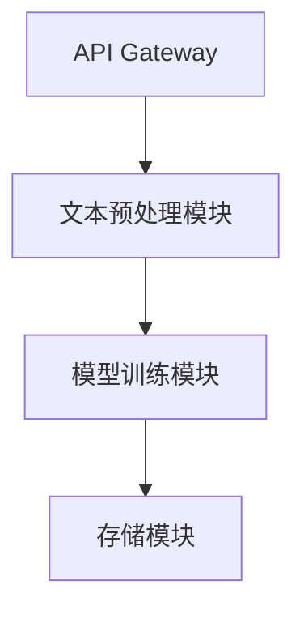
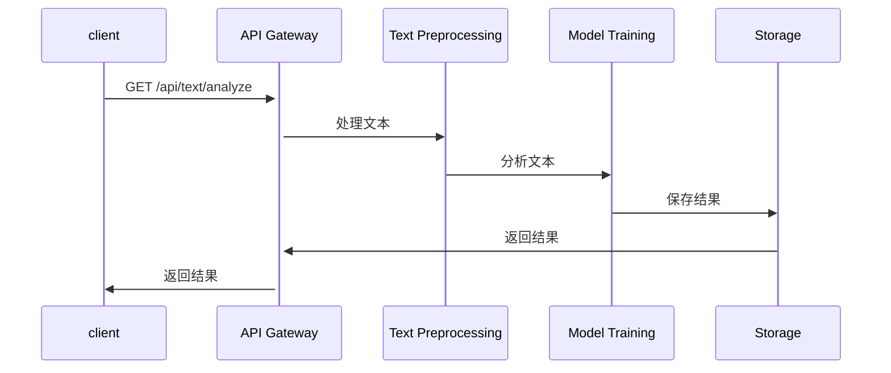

                 


# 构建企业级自然语言处理平台：从文本分析到对话系统

## 关键词：企业级NLP、自然语言处理、文本分析、对话系统、预训练模型、系统架构

## 摘要：本文详细探讨了构建企业级自然语言处理平台的各个方面，从基础的文本分析到高级的对话系统，涵盖核心概念、算法原理、系统架构设计及项目实战。通过系统化的分析与实践，帮助读者掌握构建高效企业级NLP平台的关键技术与方法。

---

# 第一部分：企业级自然语言处理平台概述

## 第1章：自然语言处理概述

### 1.1 自然语言处理的基本概念

#### 1.1.1 什么是自然语言处理
自然语言处理（NLP）是人工智能领域的重要分支，致力于让计算机能够理解、处理和生成人类语言。NLP的核心目标是解决“语言理解”和“语言生成”两大问题。

#### 1.1.2 NLP的核心任务与应用场景
- **核心任务**：
  - 文本分类
  - 信息提取
  - 机器翻译
  - 情感分析
  - 对话系统
- **应用场景**：
  - 客户服务自动化
  - 金融风险评估
  - 医疗信息处理
  - 智能助手

#### 1.1.3 企业级NLP平台的定义与目标
企业级NLP平台旨在为企业提供高效、可靠的自然语言处理能力，支持内部应用开发和外部服务提供。其目标是构建一个可扩展、易维护的NLP技术栈。

#### 1.1.4 企业级NLP平台的核心要素
- **数据处理**：文本预处理、数据清洗
- **模型训练**：基于深度学习的预训练模型
- **平台架构**：模块化设计、高可用性

### 1.2 企业级NLP平台的背景与需求

#### 1.2.1 当前企业对NLP技术的需求
- **自动化处理**：快速处理大量文本数据
- **智能决策支持**：基于文本分析提供决策依据
- **用户体验优化**：提升人机交互效率

#### 1.2.2 企业级NLP平台的构建目标
- 提供统一的NLP服务接口
- 支持多种语言和方言
- 支持大规模数据处理

#### 1.2.3 企业级NLP平台的边界与外延
- **边界**：专注于NLP相关功能，不涉及其他AI任务
- **外延**：支持与企业现有系统的集成，如CRM、ERP

### 1.3 本章小结
本章介绍了NLP的基本概念、企业级NLP平台的背景与需求，并总结了其核心要素和构建目标。

---

# 第二部分：自然语言处理核心概念与技术

## 第2章：自然语言处理的核心概念

### 2.1 词法分析与句法分析

#### 2.1.1 词法分析的基本原理
词法分析是将文本分解为词汇单位的过程，包括分词、词性标注等。例如，中文分词需要处理“分词歧义”问题。

#### 2.1.2 句法分析的树状结构
句法分析构建句子的语法结构树，常用工具如依存句法分析。例如，句子“猫追狗”可以解析为“猫”为主语，“追”为谓语，“狗”为宾语。

#### 2.1.3 语义分析的核心要素
语义分析关注词语的实际含义，常用WordNet等词典进行语义相似度计算。

### 2.2 预训练模型与语言表示

#### 2.2.1 BERT模型的基本原理
BERT通过双向Transformer架构进行预训练，能够捕捉文本的上下文信息。例如，BERT可以用于情感分析任务。

#### 2.2.2 GPT模型的应用场景
GPT模型擅长生成任务，如对话系统和文本生成。例如，使用GPT生成连贯的对话回复。

#### 2.2.3 预训练模型的迁移学习
迁移学习通过在特定任务上的微调，提升模型性能。例如，在医疗领域使用预训练的BERT模型进行疾病分类。

### 2.3 分布式语义表示与向量空间模型

#### 2.3.1 TF-IDF的基本原理
TF-IDF用于衡量词在文本中的重要性，公式为：
$$ TF-IDF(t,d) = TF(t,d) \times ID(d) $$
其中，$TF(t,d)$是词$t$在文档$d$中的频率，$ID(d)$是逆文档频率。

#### 2.3.2 Word2Vec的训练方法
Word2Vec通过连续词袋模型或跳跃式分布模型生成词向量。例如，Word2Vec可以将“king”和“queen”表示为向量，捕捉它们的语义关系。

#### 2.3.3 BERT的语义表示机制
BERT通过多层Transformer结构，同时考虑词的上下文信息，生成丰富的语义表示。

### 2.4 本章小结
本章详细介绍了NLP中的核心概念，包括词法分析、句法分析、语义分析，以及预训练模型如BERT和GPT的基本原理和应用场景。

---

# 第三部分：自然语言处理算法原理

## 第3章：基础NLP算法与实现

### 3.1 词袋模型与文本相似度计算

#### 3.1.1 词袋模型的实现原理
词袋模型将文本表示为词袋，不考虑词序。例如，文本“我爱自然语言处理”可以表示为{“我”:1, “爱”:1, “自然语言处理”:1}。

#### 3.1.2 TF-IDF的计算公式
TF-IDF计算词的重要性，公式为：
$$ TF-IDF(t,d) = TF(t,d) \times \log\left(1 + \frac{N}{DF(t)}\right) $$
其中，$N$是文档总数，$DF(t)$是词$t$的文档频率。

#### 3.1.3 余弦相似度的计算公式
余弦相似度衡量两个向量的相似性，公式为：
$$ \cos\theta = \frac{\vec{A} \cdot \vec{B}}{|\vec{A}| |\vec{B}|} $$

### 3.2 余弦相似度与文本匹配

#### 3.2.1 余弦相似度的计算原理
通过计算两个文本向量的余弦相似度，判断文本的相似性。例如，比较两篇新闻文章的相似度。

#### 3.2.2 基于余弦相似度的文本匹配实现
使用TF-IDF向量计算两篇文章的余弦相似度，判断它们是否属于同一主题。

### 3.3 基于K-近邻的文本分类

#### 3.3.1 K-近邻算法的基本原理
K-近邻算法通过找到训练集中与测试样本最接近的K个样本，进行投票分类。

#### 3.3.2 K-近邻算法的实现步骤
1. 计算测试样本与训练样本之间的距离。
2. 找出距离最近的K个样本。
3. 根据K个样本的类别进行投票，确定测试样本的类别。

#### 3.3.3 K-近邻算法的优缺点分析
- **优点**：简单易实现，适用于小数据集。
- **缺点**：计算开销大，不适用于大数据集。

### 3.4 本章小结
本章详细介绍了基础NLP算法，包括词袋模型、TF-IDF、余弦相似度和K-近邻算法的原理与实现。

---

## 第4章：进阶NLP算法与实现

### 4.1 朴素贝叶斯分类器

#### 4.1.1 朴素贝叶斯的基本原理
朴素贝叶斯基于概率论，假设特征之间相互独立。例如，用于垃圾邮件分类。

#### 4.1.2 朴素贝叶斯的实现步骤
1. 计算每个类别的先验概率。
2. 计算每个特征在每个类别下的条件概率。
3. 对测试样本进行分类。

#### 4.1.3 朴素贝叶斯的优缺点分析
- **优点**：计算简单，适用于小数据集。
- **缺点**：假设特征独立，可能影响分类效果。

### 4.2 支持向量机（SVM）

#### 4.2.1 SVM的基本原理
SVM通过构造最大间隔超平面，实现数据的线性或非线性分类。

#### 4.2.2 SVM的核函数
- **线性核**：适用于线性可分的数据。
- **多项式核**：适用于高阶多项式关系。
- **径向基函数（RBF）核**：适用于非线性数据。

#### 4.2.3 SVM的实现步骤
1. 数据预处理。
2. 选择合适的核函数。
3. 调整参数，训练模型。

### 4.3 长短时记忆网络（LSTM）

#### 4.3.1 LSTM的基本原理
LSTM通过门控机制，有效处理序列数据中的长距离依赖关系。

#### 4.3.2 LSTM的结构
- **输入门**：控制信息的输入。
- **遗忘门**：决定哪些信息需要遗忘。
- **输出门**：生成输出。

#### 4.3.3 LSTM的应用场景
- 文本生成
- 机器翻译
- 情感分析

### 4.4 本章小结
本章介绍了进阶NLP算法，包括朴素贝叶斯、SVM和LSTM的原理、实现步骤及应用场景。

---

# 第四部分：企业级NLP平台系统架构

## 第5章：企业级NLP平台的系统架构设计

### 5.1 系统功能设计

#### 5.1.1 文本预处理模块
- **功能**：文本清洗、分词、词性标注。
- **实现**：使用jieba进行中文分词，使用spaCy进行英文分词。

#### 5.1.2 模型训练模块
- **功能**：支持多种NLP任务的模型训练，如文本分类、情感分析。
- **实现**：基于TensorFlow或PyTorch框架，使用预训练模型进行微调。

#### 5.1.3 应用接口模块
- **功能**：提供RESTful API，供其他系统调用NLP服务。
- **实现**：使用Flask或Django框架，构建API接口。

### 5.2 系统架构设计

#### 5.2.1 系统架构图


#### 5.2.2 系统交互流程
1. 客户端通过API Gateway提交文本请求。
2. 文本预处理模块对文本进行清洗和分词。
3. 模型训练模块对预处理后的文本进行分析，生成结果。
4. 结果返回给客户端。

### 5.3 系统接口设计

#### 5.3.1 RESTful API设计
- **GET /api/text/analyze**: 提交文本进行分析。
- **POST /api/model/train**: 提交训练数据，训练模型。
- **GET /api/result/{id}**: 获取分析结果。

#### 5.3.2 接口交互流程


### 5.4 本章小结
本章详细介绍了企业级NLP平台的系统架构设计，包括功能模块、系统架构图和接口设计。

---

# 第五部分：项目实战

## 第6章：企业级NLP平台的实现

### 6.1 环境搭建

#### 6.1.1 安装开发环境
- **Python**：安装最新版本的Python。
- **虚拟环境**：使用venv或Anaconda创建虚拟环境。

#### 6.1.2 安装依赖库
- **NLP库**：jieba、spaCy、TensorFlow。
- **Web框架**：Flask、Django。
- **存储库**：MongoDB、Redis。

#### 6.1.3 配置开发环境
- **IDE**：PyCharm、VS Code。
- **代码管理**：使用Git进行版本控制。

### 6.2 系统核心实现

#### 6.2.1 文本预处理模块的实现
```python
import jieba

def chinese_tokenizer(text):
    return list(jieba.lcut(text))
```

#### 6.2.2 模型训练模块的实现
```python
import tensorflow as tf
from tensorflow.keras import layers

model = tf.keras.Sequential([
    layers.Embedding(vocab_size, 16),
    layers.GlobalAveragePooling1D(),
    layers.Dense(1, activation='sigmoid')
])
model.compile(optimizer='adam', loss='binary_crossentropy', metrics=['accuracy'])
```

#### 6.2.3 应用接口模块的实现
```python
from flask import Flask, request, jsonify

app = Flask(__name__)

@app.route('/api/text/analyze', methods=['POST'])
def analyze_text():
    data = request.json
    text = data['text']
    # 进行文本分析
    result = {"status": "success", "message": "Text analyzed successfully"}
    return jsonify(result)
```

### 6.3 项目实战案例

#### 6.3.1 情感分析案例
- **任务**：判断用户评论的情感倾向（正面、负面、中性）。
- **实现**：
  1. 数据预处理：清洗评论文本。
  2. 模型训练：使用预训练的BERT模型进行微调。
  3. 接口调用：通过API提交评论，获取情感分析结果。

#### 6.3.2 对话系统案例
- **任务**：构建一个简单的问答系统。
- **实现**：
  1. 数据收集：整理常见问题和答案对。
  2. 模型训练：使用预训练的GPT模型进行微调。
  3. 接口调用：通过API提交问题，获取回答。

### 6.4 项目总结与优化

#### 6.4.1 项目总结
- **成果**：成功构建了一个企业级NLP平台，支持文本分析和对话系统。
- **经验**：模块化设计使系统易于扩展和维护。

#### 6.4.2 优化方向
- **性能优化**：优化模型训练速度，提升API响应效率。
- **功能扩展**：增加多语言支持，集成更多NLP任务。

### 6.5 本章小结
本章通过实际案例展示了企业级NLP平台的实现过程，包括环境搭建、核心模块实现和项目总结。

---

# 第六部分：最佳实践与总结

## 第7章：最佳实践与总结

### 7.1 最佳实践

#### 7.1.1 数据处理
- **数据清洗**：去除噪声数据，确保数据质量。
- **数据增强**：通过数据增强技术提升模型的泛化能力。

#### 7.1.2 模型选择
- **任务匹配**：选择适合任务的模型，如使用BERT进行文本分类。
- **性能优化**：通过模型压缩和量化技术提升模型效率。

#### 7.1.3 系统设计
- **模块化设计**：便于维护和扩展。
- **高可用性**：通过负载均衡和容错设计提升系统可靠性。

### 7.2 小结

#### 7.2.1 项目经验总结
- 企业级NLP平台的构建需要综合考虑数据、算法、系统架构等多个方面。
- 模块化设计和高可用性是确保平台稳定运行的关键。

#### 7.2.2 项目中的注意事项
- **数据隐私**：确保处理的数据符合隐私保护法规。
- **模型更新**：定期更新模型，保持平台的先进性。

### 7.3 未来展望

#### 7.3.1 NLP技术的发展趋势
- **多模态NLP**：结合视觉、听觉等多模态信息，提升理解能力。
- **可解释性NLP**：提高模型的可解释性，增强用户信任。

#### 7.3.2 企业级NLP平台的未来方向
- **智能化升级**：引入自监督学习和强化学习技术。
- **生态化发展**：构建开放的NLP生态系统，支持更多应用领域。

### 7.4 本章小结
本章总结了项目中的最佳实践，提供了未来的发展方向和建议。

---

# 作者：AI天才研究院 & 禅与计算机程序设计艺术

---

通过以上章节的详细展开，本文系统地介绍了企业级自然语言处理平台的构建过程，从基础概念到系统架构，再到实际项目实现，帮助读者全面掌握相关知识和技能。

