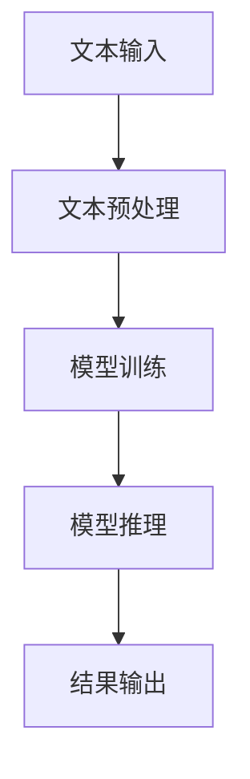

                 


```markdown
# 构建企业级自然语言处理引擎：多语言支持与领域适应

> 关键词：自然语言处理，企业级应用，多语言支持，领域适应，深度学习，NLP引擎

> 摘要：本文详细探讨了构建企业级自然语言处理引擎的关键技术，特别是多语言支持与领域适应的实现。从核心概念到算法原理，再到系统架构和项目实战，系统性地分析了企业级NLP引擎的构建过程，提供了丰富的技术细节和实践经验。

---

## 第一部分: 自然语言处理引擎的背景与核心概念

### 第1章: 自然语言处理的背景与发展

#### 1.1 自然语言处理的定义与核心概念
自然语言处理（Natural Language Processing, NLP）是人工智能领域的重要分支，致力于使计算机能够理解、生成和处理人类语言。核心概念包括：
- **文本处理**：如分词、句法分析、命名实体识别。
- **语义理解**：如情感分析、意图识别、信息抽取。
- **语言生成**：如机器翻译、文本摘要、对话生成。

#### 1.2 企业级NLP应用的重要性
企业级NLP引擎在多个场景中发挥重要作用：
- **客户支持**：智能客服系统通过NLP技术处理用户查询。
- **信息检索**：帮助企业快速找到所需信息。
- **数据分析**：从海量文本中提取关键信息，辅助决策。

#### 1.3 多语言支持与领域适应的必要性
- **多语言支持**：企业在全球化背景下，需要处理多种语言的文本。
- **领域适应**：不同行业（如医疗、金融）对NLP的需求不同，需要定制化的解决方案。

---

### 第2章: 企业级NLP引擎的核心需求

#### 2.1 企业级应用的特殊要求
- **高可用性**：系统需稳定运行，支持高并发请求。
- **多语言支持**：处理多种语言文本，支持国际化。
- **领域适应**：针对特定领域优化模型，提高准确率。

#### 2.2 多语言支持的技术选型
- **多语言模型**：如多语言BERT（mBERT）、XLM。
- **语言检测**：自动识别文本语言，选择合适的处理流程。

#### 2.3 领域适应的技术挑战
- **领域数据稀疏性**：特定领域数据量少，影响模型泛化能力。
- **领域知识库**：需要整合行业知识库，提升模型理解能力。

---

## 第二部分: 核心概念与原理

### 第3章: 自然语言处理的核心原理

#### 3.1 语言模型的构建与训练
- **词嵌入**：通过Word2Vec、GloVe等算法将词语映射为向量。
- **语言模型训练**：使用循环神经网络（RNN）或变换器（Transformer）模型训练语言模型。

#### 3.2 多语言NLP的核心原理
- **跨语言迁移学习**：利用预训练的多语言模型，在特定领域进行微调。
- **多语言分词与句法分析**：处理不同语言的分词和语法结构。

#### 3.3 领域适应的核心原理
- **领域数据增强**：通过数据增强技术，扩展领域数据量。
- **领域特定模型微调**：在预训练模型的基础上，针对特定领域数据进行微调。

---

## 第三部分: 算法原理与数学模型

### 第4章: 词嵌入算法原理

#### 4.1 Word2Vec算法原理
- **CBOW模型**：通过上下文预测词。
- **Skip-Gram模型**：通过词预测上下文。
- **训练目标**：最小化预测误差，优化词向量。

#### 4.2 Word2Vec的实现
```python
import numpy as np

class Word2Vec:
    def __init__(self, vocab_size, embedding_dim):
        self.W = np.random.randn(vocab_size, embedding_dim)
        self.b = np.zeros(embedding_dim)
    
    def forward(self, input_idx):
        return self.W[input_idx] + self.b
    
    def backward(self, dE, input_idx):
        dE = dE.reshape(-1, 1)
        self.W[input_idx] -= dE
```

#### 4.3 词嵌入的数学模型
$$ E(w_i) = W_{i} $$  
其中，$W_{i}$ 是词 $w_i$ 的词向量。

---

### 第5章: 序列模型与语言模型

#### 5.1 循环神经网络（RNN）原理
- **RNN结构**：通过循环处理序列数据，维护隐藏状态。
- **训练目标**：最小化预测错误，优化权重参数。

#### 5.2 Transformer模型原理
- **自注意力机制**：计算词与词之间的相关性，生成注意力权重。
- **多头注意力**：通过多个子空间的注意力，提升模型表达能力。

#### 5.3 Transformer的数学模型
$$ \text{Attention}(Q, K, V) = \text{softmax}\left(\frac{QK^T}{\sqrt{d_k}}\right)V $$

---

## 第四部分: 系统分析与架构设计

### 第6章: 系统需求分析

#### 6.1 功能需求
- **文本预处理**：分词、清洗、格式化。
- **模型训练**：支持多语言和领域适应的模型训练。
- **API接口**：提供RESTful API，方便其他系统调用。

#### 6.2 性能需求
- **响应时间**：保证快速响应，支持高并发。
- **资源利用率**：合理分配计算资源，降低能耗。

#### 6.3 安全需求
- **数据加密**：保护用户隐私数据。
- **访问控制**：限制API访问权限。

---

### 第7章: 系统架构设计

#### 7.1 系统架构图


#### 7.2 功能模块设计
- **文本预处理模块**：负责文本清洗、分词。
- **模型训练模块**：支持多语言和领域适应的模型训练。
- **模型推理模块**：处理输入文本，生成输出结果。

#### 7.3 接口设计
- **API接口**：提供HTTP接口，支持JSON格式请求。
- **回调机制**：支持异步处理，返回处理结果。

---

## 第五部分: 项目实战

### 第8章: 环境安装与配置

#### 8.1 安装依赖
```bash
pip install numpy
pip install tensorflow
pip install transformers
```

#### 8.2 配置环境变量
```bash
export PYTHONPATH=$PYTHONPATH:.
```

---

### 第9章: 核心功能实现

#### 9.1 多语言支持实现
```python
from transformers import AutoTokenizer, AutoModelForMaskedLM

tokenizer = AutoTokenizer.from_pretrained("bert-base-multilingual-cased")
model = AutoModelForMaskedLM.from_pretrained("bert-base-multilingual-cased")
```

#### 9.2 领域适应实现
```python
from transformers import AutoTokenizer, AutoModelForSequenceClassification
from datasets import load_dataset

# 加载领域数据集
dataset = load_dataset("custom_dataset", "text")
# 训练领域特定模型
model = AutoModelForSequenceClassification.from_pretrained("bert-base-uncased", num_labels=3)
model.fit(...)
```

---

## 第六部分: 最佳实践与总结

### 第10章: 最佳实践

#### 10.1 数据预处理
- **数据清洗**：去除噪声数据，确保数据质量。
- **数据增强**：通过数据增强技术，提升模型鲁棒性。

#### 10.2 模型优化
- **模型调参**：通过网格搜索优化模型参数。
- **模型融合**：结合多个模型的结果，提升准确率。

#### 10.3 系统优化
- **负载均衡**：合理分配任务，避免资源瓶颈。
- **缓存优化**：利用缓存技术，减少重复计算。

---

### 第11章: 小结与展望

#### 11.1 小结
本文详细探讨了构建企业级自然语言处理引擎的关键技术，包括多语言支持与领域适应的实现。通过理论分析与实战案例，展示了如何高效构建和优化NLP引擎。

#### 11.2 展望
未来，随着AI技术的发展，企业级NLP引擎将更加智能化，支持更多语言和领域，为企业创造更大的价值。

---

## 作者

**作者：AI天才研究院/AI Genius Institute**  
**联系：contact@aignitus.com**  
**博客：https://aignitus.com**

---

以上是完整的文章大纲和内容。通过系统的分析和详细的代码示例，本文为企业级自然语言处理引擎的构建提供了全面的技术指导。
```

