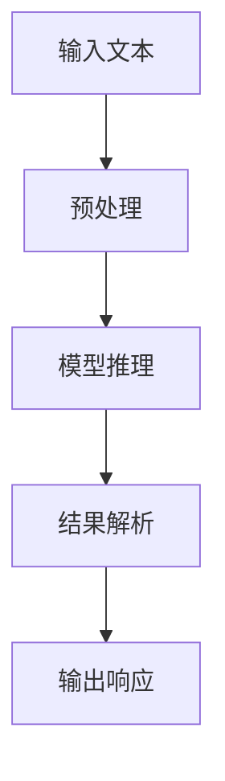
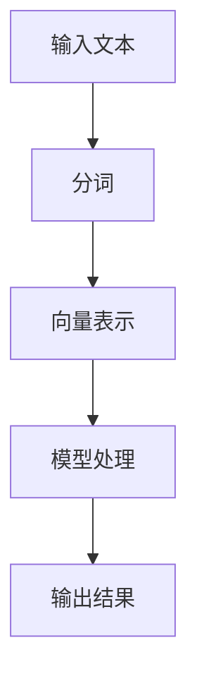
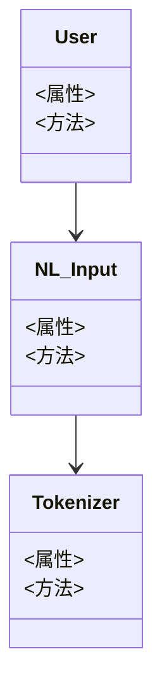
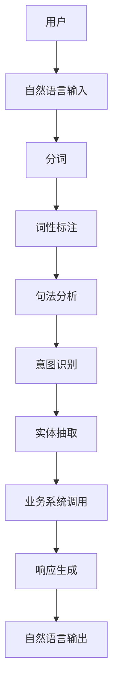

                 


# 构建企业级自然语言接口：复杂业务系统的智能交互层

## 关键词：
- 自然语言处理
- 企业级系统
- 智能交互层
- 意图识别
- 实体抽取
- 深度学习

## 摘要：
自然语言接口（NLI）作为企业级系统中智能交互层的关键技术，正在成为复杂业务系统中不可或缺的部分。本文从背景介绍、核心概念、算法原理、系统架构、项目实战到总结，全面探讨如何构建企业级自然语言接口，以满足复杂业务系统的智能交互需求。文章通过详细的技术分析和实际案例，揭示了自然语言处理技术在企业应用中的潜力和挑战。

---

# 第1章：背景介绍

## 1.1 问题背景

### 1.1.1 自然语言处理的起源与发展
自然语言处理（NLP）是人工智能领域的重要分支，旨在让计算机能够理解、生成和处理人类语言。自20世纪50年代以来，NLP经历了从基于规则的传统方法到基于深度学习的现代方法的转变，取得了显著的进步。

### 1.1.2 企业级系统中的交互需求
随着企业信息化的深入，用户对系统交互的需求日益增加。传统的基于按钮和表单的交互方式已无法满足用户对智能化、个性化交互的需求。企业级系统需要一种更自然、更高效的交互方式，即自然语言接口。

### 1.1.3 当前自然语言接口的痛点
尽管自然语言处理技术取得了长足进步，但在企业级系统中的应用仍面临诸多挑战，如意图识别的准确性、实体抽取的完整性、多轮对话的支持能力等。

## 1.2 问题描述

### 1.2.1 传统交互方式的局限性
传统交互方式依赖于固定的按钮和表单，用户需要了解系统功能的结构和操作流程，这对普通用户来说可能不够友好，尤其是在处理复杂业务时。

### 1.2.2 复杂业务系统中的交互复杂性
复杂业务系统涉及多个模块和流程，用户可能需要处理多个步骤和条件，传统的交互方式难以支持这种复杂的交互需求。

### 1.2.3 自然语言接口的潜在价值
自然语言接口能够简化用户的操作流程，提高用户体验，同时降低对用户操作能力的要求，使得复杂业务系统的交互更加便捷。

## 1.3 问题解决

### 1.3.1 自然语言处理的核心技术
自然语言处理的核心技术包括分词、词性标注、句法分析、意图识别和实体抽取等。这些技术共同支持自然语言接口的实现。

### 1.3.2 企业级自然语言接口的设计目标
企业级自然语言接口的设计目标是提供准确、高效、稳定的交互能力，支持多轮对话和上下文理解，同时能够处理复杂业务系统的多样化需求。

### 1.3.3 解决方案的实现路径
实现路径包括数据采集与预处理、模型训练与优化、接口设计与实现，以及系统的集成与测试。

## 1.4 边界与外延

### 1.4.1 自然语言接口的边界
自然语言接口的边界包括输入输出的文本范围、支持的语言种类、系统的响应时间等。

### 1.4.2 与相关技术的区分
自然语言接口与对话系统、搜索引擎等技术的区别在于其基于自然语言理解的核心能力，能够支持复杂的业务逻辑。

### 1.4.3 企业级系统的扩展性
企业级系统的扩展性要求自然语言接口能够灵活扩展，支持新的业务场景和交互需求。

## 1.5 概念结构与核心要素

### 1.5.1 自然语言接口的核心要素
自然语言接口的核心要素包括输入处理、意图识别、实体抽取、业务逻辑调用和输出生成。

### 1.5.2 业务系统的交互层结构
业务系统的交互层结构包括用户输入、自然语言理解、业务逻辑处理和系统响应。

### 1.5.3 智能交互层的实现框架
智能交互层的实现框架包括自然语言处理模型、业务逻辑引擎和交互界面。

---

# 第2章：核心概念与联系

## 2.1 自然语言处理的原理

### 2.1.1 语言模型的基本原理
语言模型通过概率统计的方法，计算给定条件下文本出现的概率。常用的语言模型包括n-gram模型和变换器模型（如BERT）。

### 2.1.2 词法分析与句法分析
词法分析将文本分割为词语，并标注词性；句法分析则分析词语之间的语法关系。

### 2.1.3 意图识别与实体抽取
意图识别旨在理解用户的意图，实体抽取则是从文本中提取关键实体信息。

## 2.2 实体关系图


## 2.3 算法流程图



---

# 第3章：算法原理讲解

## 3.1 算法原理

### 3.1.1 基于深度学习的自然语言处理
深度学习通过构建神经网络模型，从大量数据中学习语言的特征和模式，从而实现自然语言理解。

### 3.1.2 预训练语言模型的原理
预训练语言模型通过对大规模文本数据进行无监督学习，生成能够理解语言的模型，如BERT和GPT。

### 3.1.3 意图识别与实体抽取的算法实现
意图识别通常采用基于机器学习的分类算法，实体抽取则采用基于规则或深度学习的模型。

## 3.2 算法流程图



## 3.3 数学模型与公式

### 3.3.1 词嵌入的数学表示
词嵌入通过将词语映射为向量表示，例如Word2Vec中的词向量表示：

$$\text{词向量} = \text{模型参数} \times \text{输入向量}$$

### 3.3.2 模型训练的损失函数
模型训练的目标是最小化损失函数，例如交叉熵损失：

$$\text{损失} = -\sum_{i=1}^{n} \log P(y_i|x_i)$$

### 3.3.3 意图识别的概率计算
意图识别通过计算条件概率来确定用户的意图：

$$P(y|x) = \frac{P(x|y)P(y)}{P(x)}$$

---

# 第4章：系统分析与架构设计

## 4.1 系统分析

### 4.1.1 问题场景介绍
系统需要支持用户通过自然语言输入进行业务操作，例如查询订单状态、处理客户投诉等。

### 4.1.2 系统功能设计
系统功能包括用户输入解析、意图识别、实体抽取、业务逻辑调用和结果输出。

## 4.2 系统架构设计

### 4.2.1 领域模型类图



### 4.2.2 系统架构图



### 4.2.3 系统接口设计
系统接口包括自然语言输入接口、业务逻辑调用接口和自然语言输出接口。

### 4.2.4 系统交互序列图


---

# 第5章：项目实战

## 5.1 环境安装

### 5.1.1 安装Python
安装Python 3.8及以上版本。

### 5.1.2 安装依赖库
安装必要的库，如numpy、pandas、transformers。

## 5.2 系统核心实现

### 5.2.1 模型训练
使用预训练语言模型进行微调，以适应特定的业务需求。

### 5.2.2 代码实现
以下是自然语言接口的核心代码示例：

```python
from transformers import pipeline

# 初始化模型
nlp = pipeline("text-classification", model="bert-base-cased")

# 处理输入文本
input_text = "我需要查询订单状态。"
result = nlp(input_text)

# 提取意图和实体
intent = result[0]['label']
entities = nlp.entityRecognizer(input_text)
```

## 5.3 案例分析

### 5.3.1 案例介绍
以智能客服系统为例，用户输入“我需要取消订单”，系统需要识别意图并调用取消订单的业务逻辑。

### 5.3.2 代码解读与分析
代码实现包括分词、意图识别和实体抽取，最终调用业务系统并返回响应。

## 5.4 项目总结

### 5.4.1 项目小结
通过项目实战，验证了自然语言接口在复杂业务系统中的可行性，同时发现了需要优化的地方。

---

# 第6章：总结与展望

## 6.1 最佳实践

### 6.1.1 关键技术点
准确的意图识别和高效的实体抽取是实现自然语言接口的关键。

### 6.1.2 注意事项
在实际应用中，需要考虑数据质量、模型性能和业务逻辑的复杂性。

## 6.2 未来展望

### 6.2.1 技术发展
随着深度学习技术的不断进步，自然语言接口将更加智能化和个性化。

### 6.2.2 应用场景
自然语言接口将在更多复杂业务系统中得到广泛应用，如智能客服、智能推荐等。

---

# 附录

## 附录A：参考文献

1. BERT: Pre-training of Deep Bidirectional Transformers for Natural Language Processing
2. GPT: Pre-training with Masked Language Models

## 附录B：工具推荐

- Hugging Face Transformers
- spaCy
- NLTK

---

# 作者：AI天才研究院/AI Genius Institute & 禅与计算机程序设计艺术 /Zen And The Art of Computer Programming

---

通过以上内容，我们详细探讨了构建企业级自然语言接口的核心概念、算法原理、系统架构和项目实战。希望本文能为读者提供有价值的见解和指导，帮助他们在复杂业务系统中实现智能交互层的构建。

