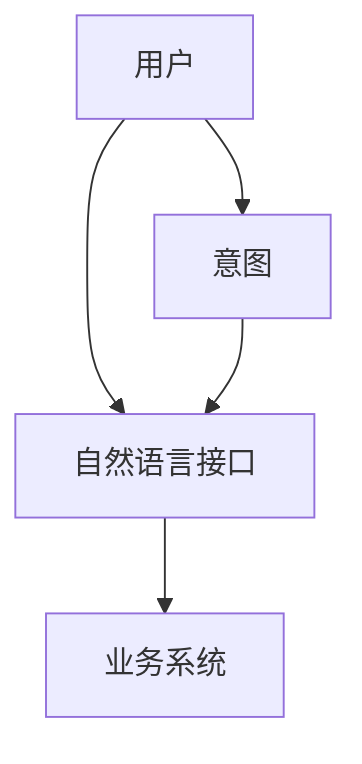
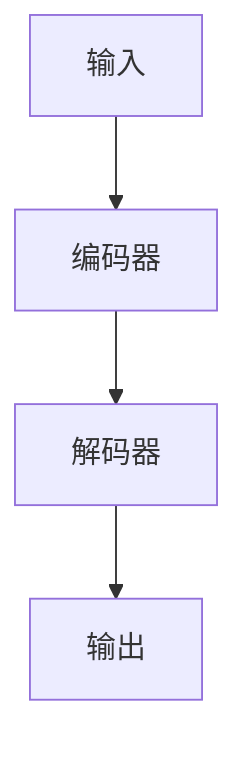
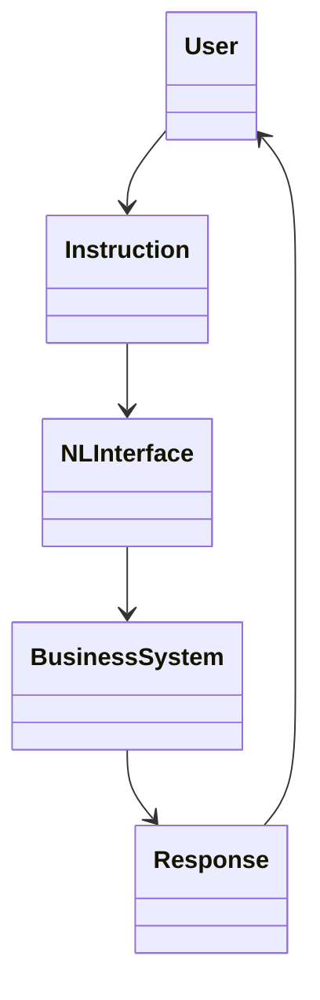
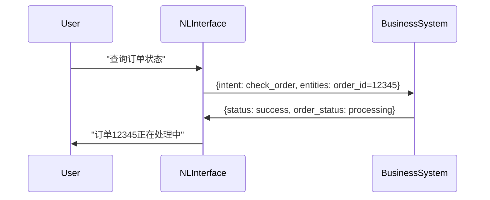

                 


# 构建企业级自然语言接口：简化复杂业务系统操作的智能层

## 关键词：自然语言接口，企业级应用，自然语言处理，系统架构，智能层

## 摘要：自然语言接口（NLI）作为企业级应用的智能层，通过自然语言处理技术简化了复杂业务系统的操作。本文详细探讨了NLI的核心概念、算法原理、系统架构设计以及项目实战，旨在帮助企业构建高效、智能的交互层。

---

## 第1章：企业级自然语言接口的背景与问题背景

### 1.1 问题背景

#### 1.1.1 传统业务系统操作的复杂性
传统业务系统通常需要用户通过复杂的菜单和多步操作完成任务，这不仅降低了效率，还容易导致用户错误。

#### 1.1.2 用户与复杂系统交互的障碍
用户面对复杂的系统界面，往往难以快速找到所需功能，导致效率低下。

#### 1.1.3 自然语言接口的引入动机
引入自然语言接口，使用户能够通过自然语言指令完成操作，提升用户体验和效率。

### 1.2 问题描述

#### 1.2.1 业务系统操作的复杂性对企业的影响
操作复杂性增加了培训成本，降低了员工效率，并可能导致错误操作。

#### 1.2.2 用户与系统交互中的痛点
用户难以快速找到所需功能，操作步骤繁琐，容易出错。

#### 1.2.3 自然语言接口的目标与核心问题
目标是通过自然语言指令简化操作，核心问题是准确理解用户意图并生成正确的系统响应。

### 1.3 问题解决

#### 1.3.1 自然语言处理技术的核心作用
NLP技术用于解析用户指令，提取意图和实体，生成系统响应。

#### 1.3.2 自然语言接口的设计原则
设计原则包括准确理解意图、高效响应、确保安全性和稳定性。

#### 1.3.3 企业级应用中的具体实现路径
结合NLP技术和企业业务系统，设计高效的接口架构。

### 1.4 边界与外延

#### 1.4.1 自然语言接口的边界定义
仅处理文本交互，不涉及图片或视频。

#### 1.4.2 与相关技术的区分
与语音识别和自然语言生成区分，明确应用场景。

#### 1.4.3 企业级应用中的外延扩展
支持多语言、多领域应用，提升智能化水平。

### 1.5 概念结构与核心要素

#### 1.5.1 自然语言接口的基本组成
包括用户、接口、业务系统，通过文本交互完成任务。

#### 1.5.2 核心要素及其相互关系
用户指令、意图解析、系统响应，形成闭环。

#### 1.5.3 企业级应用中的特殊要求
高可用性、安全性、可扩展性。

### 1.6 本章小结
介绍了NLI的背景和问题，明确了设计原则和边界。

---

## 第2章：自然语言接口的核心概念与原理

### 2.1 核心概念原理

#### 2.1.1 自然语言处理技术的基本原理
包括分词、语法分析、意图识别和实体识别。

#### 2.1.2 语言模型在接口中的作用
用于生成自然语言响应，处理上下文。

#### 2.1.3 对话系统的设计逻辑
基于用户意图生成响应，支持多轮对话。

### 2.2 核心概念属性对比

| 技术 | 描述 |
|------|------|
| 语音识别 | 转换语音为文本 |
| 自然语言生成 | 将结构化数据生成文本 |
| 对话系统 | 支持自然语言交互 |

### 2.3 ER实体关系图



### 2.4 本章小结
详细讲解了NLI的核心概念和相关技术。

---

## 第3章：自然语言接口的算法原理

### 3.1 模型训练过程

#### 3.1.1 数据预处理
包括分词、去除停用词、特征提取。

#### 3.1.2 模型训练
使用深度学习模型（如LSTM、Transformer）进行训练。

#### 3.1.3 模型优化
通过反向传播和梯度下降优化参数。

### 3.2 解码过程



### 3.3 数学模型

#### 编码器-解码器结构
编码器将输入序列编码为向量，解码器生成输出序列。

#### 注意力机制
通过注意力权重生成位置相关的上下文表示。

### 3.4 本章小结
讲解了NLI的算法原理和数学模型。

---

## 第4章：自然语言接口的系统分析与架构设计

### 4.1 系统分析

#### 4.1.1 问题场景
用户查询订单状态，系统需解析指令并返回结果。

### 4.2 系统功能设计

#### 4.2.1 领域模型



### 4.3 系统架构设计


### 4.4 接口设计

#### 4.4.1 请求格式
```json
{
    "intent": "check_order",
    "entities": {
        "order_id": "12345"
    }
}
```

#### 4.4.2 响应格式
```json
{
    "status": "success",
    "order_status": "processing"
}
```

### 4.5 交互流程



### 4.6 本章小结
详细设计了系统架构和接口，确保高效交互。

---

## 第5章：自然语言接口的项目实战

### 5.1 环境安装

#### 5.1.1 安装Python库
```bash
pip install numpy
pip install transformers
pip install sentence-tokenizer
```

### 5.2 核心代码实现

#### 5.2.1 分词和模型加载
```python
from transformers import pipeline

nlp = pipeline('text-classification', model='bert-base')
```

#### 5.2.2 意图分类
```python
intent = nlp("查询订单状态")[0]['label']
```

#### 5.2.3 实体识别
```python
from flair.models import SequenceTagger
from flair.data import Sentence

tagger = SequenceTagger.load('flair/ner')
sentence = Sentence("订单号是12345")
tagger.predict(sentence)
entities = {ent.type: ent.text for ent in sentence.get_spans('ner')}
```

#### 5.2.4 系统调用
```python
import requests

url = 'http://business-system/api'
data = {
    "intent": intent,
    "entities": entities
}
response = requests.post(url, json=data)
```

#### 5.2.5 响应生成
```python
response_text = "您的订单正在处理中。"
```

### 5.3 代码解读与分析
详细分析每一步的作用，确保代码逻辑清晰。

### 5.4 实际案例分析
以查询订单状态为例，展示如何处理用户指令，调用业务系统，返回结果。

### 5.5 本章小结
通过实战案例，展示了NLI的具体实现过程。

---

## 第6章：总结与展望

### 6.1 总结

#### 6.1.1 核心优势
提升用户体验，提高效率，降低使用门槛。

#### 6.1.2 需要注意的问题
模型准确性和系统安全性。

### 6.2 最佳实践 tips

#### 6.2.1 模型选择
选择合适的预训练模型，确保准确性。

#### 6.2.2 系统设计
模块化设计，便于扩展和维护。

#### 6.2.3 安全性
保护用户数据，防止恶意攻击。

### 6.3 小结
回顾了NLI的优势和实际应用中的注意事项。

### 6.4 注意事项
关注模型训练数据的质量，系统稳定性。

### 6.5 拓展阅读
推荐相关书籍和论文，深入学习NLP技术。

### 6.6 本章小结
总结了NLI的重要性和未来发展方向。

---

## 作者：AI天才研究院/AI Genius Institute & 禅与计算机程序设计艺术 /Zen And The Art of Computer Programming

---

这篇文章详细介绍了自然语言接口在企业级应用中的构建过程，从背景到算法，再到实际应用，确保内容全面且易于理解。希望这篇文章能帮助读者更好地理解和应用自然语言接口技术，简化复杂业务系统的操作。

