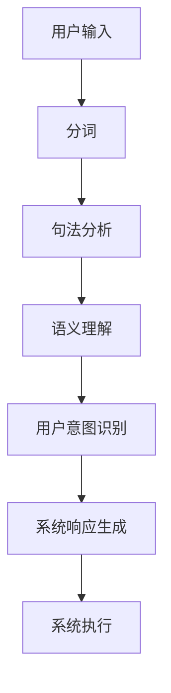
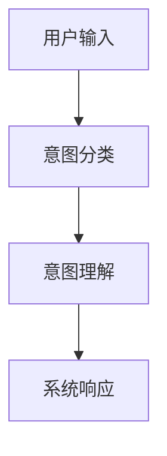
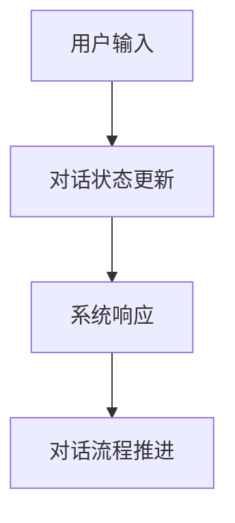
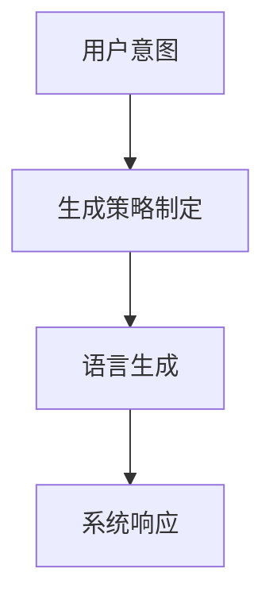
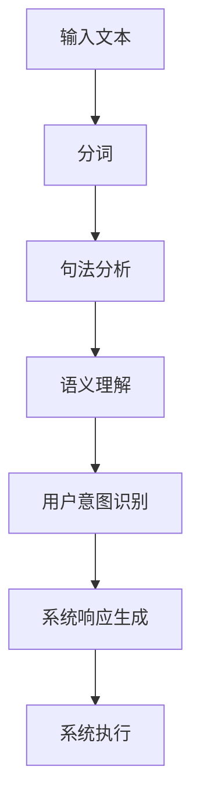
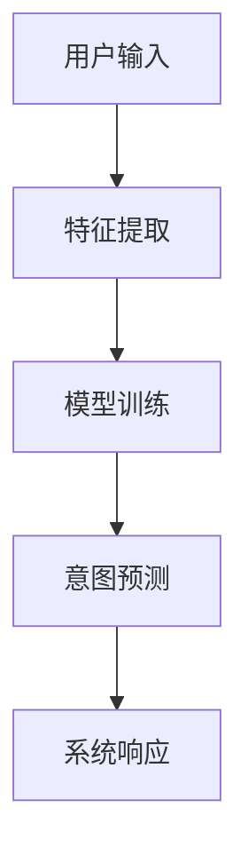
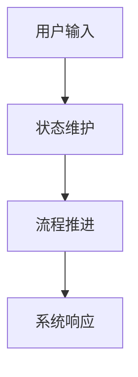
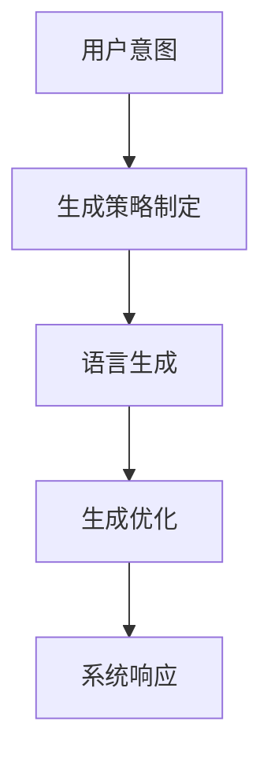
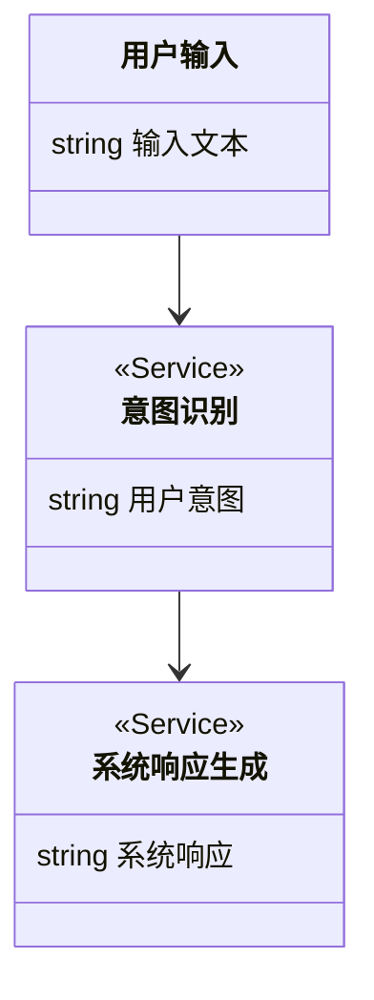
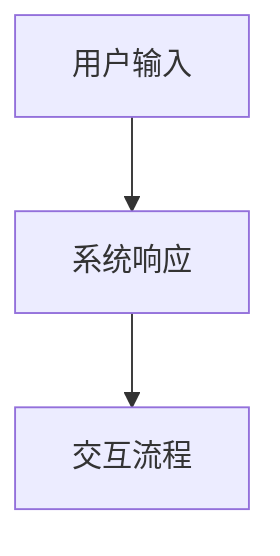

                 


# 构建企业级自然语言接口：简化复杂系统操作

> 关键词：自然语言处理，企业级系统，用户交互，意图识别，对话管理

> 摘要：随着企业级系统的复杂性不断增加，用户与系统交互的效率和体验成为关键问题。自然语言接口（NLI）通过理解和生成自然语言，简化了复杂系统的操作。本文详细探讨了构建企业级自然语言接口的核心概念、算法原理、系统架构设计以及项目实战，为企业级系统的设计者和开发者提供深度的技术指导。

---

# 第一部分：自然语言接口概述

## 第1章：自然语言接口的背景与概念

### 1.1 问题背景
自然语言接口（NLI）的目标是通过自然语言（如口语或文本）与计算机系统进行交互，替代传统的命令行或图形界面。在企业级系统中，复杂的操作流程和不友好的交互方式常常导致用户体验差，效率低下。NLI通过将用户的自然语言转化为系统可执行的指令，简化了复杂系统的操作。

#### 1.1.1 复杂系统操作的痛点
- 传统交互方式（命令行或图形界面）对用户的技术要求较高。
- 系统功能复杂，用户难以快速掌握操作流程。
- 交互效率低，用户需要多次尝试才能完成任务。

#### 1.1.2 自然语言接口的提出
- 提供更直观、更自然的交互方式。
- 降低用户学习成本，提高操作效率。
- 支持多语言、多场景的应用需求。

#### 1.1.3 企业级应用的需求
- 高可用性：系统需要稳定运行，支持高并发用户。
- 高准确性：准确理解用户意图，减少误操作。
- 高可扩展性：支持多种场景和功能模块的扩展。

### 1.2 问题描述
自然语言接口的核心问题是如何准确理解和生成自然语言，同时满足企业级系统的需求。

#### 1.2.1 系统操作的复杂性
- 系统功能模块多，操作流程复杂。
- 用户可能对系统功能不熟悉，需要通过自然语言进行指导。

#### 1.2.2 用户与系统交互的障碍
- 用户可能不具备技术背景，难以使用命令行或图形界面。
- 中文自然语言理解的复杂性，如歧义性、多义词等。

#### 1.2.3 自然语言接口的目标
- 提供直观的交互方式，降低用户操作难度。
- 提高系统操作效率，减少用户误操作。

### 1.3 问题解决
#### 1.3.1 自然语言处理技术的应用
- 利用自然语言处理技术（如分词、句法分析、语义理解）实现用户意图识别。
- 通过机器学习模型提高意图识别的准确性。

#### 1.3.2 企业级系统的适配
- 针对企业级系统的复杂性，设计高效的系统架构。
- 确保系统的高可用性和可扩展性。

#### 1.3.3 简化操作的具体实现
- 提供自然语言指令的解析和执行。
- 支持多种交互方式（如语音、文本）。

### 1.4 边界与外延
#### 1.4.1 自然语言接口的适用范围
- 支持企业级系统的日常操作。
- 适用于需要简化操作的复杂系统。

#### 1.4.2 与传统交互方式的对比
- 传统交互方式：命令行或图形界面，用户需要学习特定的操作方式。
- 自然语言接口：通过自然语言进行交互，用户无需学习特定的操作方式。

#### 1.4.3 系统复杂性的边界
- 自然语言接口的设计需要考虑系统的复杂性，但不能无限扩展。
- 系统复杂性与用户需求之间需要找到平衡点。

### 1.5 核心要素组成
#### 1.5.1 自然语言理解模块
- 负责解析用户的自然语言输入，提取用户意图。
- 使用自然语言处理技术（如分词、句法分析、语义理解）进行解析。

#### 1.5.2 用户意图识别
- 通过机器学习模型识别用户的意图。
- 支持多意图识别，提高系统的灵活性。

#### 1.5.3 系统响应生成
- 根据用户意图生成系统响应。
- 支持自然语言生成，提高系统的智能化水平。

---

## 第2章：自然语言接口的核心概念

### 2.1 自然语言处理原理
自然语言处理（NLP）是自然语言接口的核心技术，主要包括以下步骤：
1. **分词**：将用户输入的自然语言分割成词语或短语。
2. **句法分析**：分析句子的语法结构，确定词语之间的关系。
3. **语义理解**：理解句子的语义，提取用户意图。

#### 2.1.1 自然语言处理的流程图


#### 2.1.2 自然语言处理的数学模型
- **分词模型**：基于概率的分词模型（如HMM）。
- **句法分析模型**：基于上下文的句法树构建。
- **语义理解模型**：基于深度学习的语义理解（如BERT模型）。

### 2.2 用户意图识别
用户意图识别是自然语言接口的核心任务，主要包括以下步骤：
1. **意图分类**：将用户的输入分为不同的意图类别。
2. **意图理解**：根据上下文理解用户的深层意图。

#### 2.2.1 用户意图识别的流程图


#### 2.2.2 意图识别的算法选择
- **基于规则的意图识别**：适用于特定场景的意图识别。
- **基于机器学习的意图识别**：适用于复杂场景的意图识别。

### 2.3 对话管理
对话管理是自然语言接口的重要组成部分，主要包括以下步骤：
1. **对话流程设计**：设计对话的流程，确保对话的连贯性。
2. **对话状态维护**：维护对话的状态，确保对话的上下文一致性。

#### 2.3.1 对话管理的流程图


### 2.4 自然语言生成
自然语言生成是自然语言接口的重要组成部分，主要包括以下步骤：
1. **生成策略制定**：根据用户意图生成系统响应。
2. **语言生成优化**：优化生成语言的流畅性和准确性。

#### 2.4.1 自然语言生成的流程图


### 2.5 核心概念对比
#### 2.5.1 意图识别与对话管理的对比
| 对比维度 | 意图识别 | 对话管理 |
|----------|----------|----------|
| 目标     | 确定用户的意图 | 管理对话流程 |
| 输入     | 用户输入 | 对话状态 |
| 输出     | 用户意图 | 系统响应 |

#### 2.5.2 语言理解与语言生成的对比
| 对比维度 | 语言理解 | 语言生成 |
|----------|----------|----------|
| 目标     | 理解用户输入 | 生成系统响应 |
| 输入     | 用户输入 | 用户意图 |
| 输出     | 用户意图 | 系统响应 |

#### 2.5.3 不同技术的优缺点分析
| 技术       | 优点 | 缺点 |
|------------|------|------|
| 基于规则的意图识别 | 实现简单，适用于特定场景 | 适应性差，难以处理复杂场景 |
| 基于机器学习的意图识别 | 适应性强，精度高 | 实现复杂，需要大量数据支持 |
| 基于深度学习的意图识别 | 精度高，适应性强 | 计算资源需求高，实现复杂 |

---

## 第3章：自然语言接口的算法原理

### 3.1 自然语言处理算法概述
自然语言处理算法主要包括以下几类：
1. **统计模型**：如隐马尔可夫模型（HMM）。
2. **基于规则的模型**：如基于词典的分词模型。
3. **基于深度学习的模型**：如循环神经网络（RNN）、 transformer模型。

#### 3.1.1 自然语言处理算法的流程图


### 3.2 用户意图识别算法
用户意图识别算法主要包括以下步骤：
1. **特征提取**：提取用户的输入特征。
2. **模型训练**：训练意图分类模型。
3. **意图预测**：根据模型预测用户的意图。

#### 3.2.1 用户意图识别的流程图


### 3.3 对话管理算法
对话管理算法主要包括以下步骤：
1. **状态维护**：维护对话的状态。
2. **流程推进**：根据对话状态推进对话流程。
3. **响应生成**：生成系统响应。

#### 3.3.1 对话管理的流程图


### 3.4 自然语言生成算法
自然语言生成算法主要包括以下步骤：
1. **生成策略制定**：制定生成策略。
2. **语言生成**：生成自然语言。
3. **生成优化**：优化生成语言的流畅性和准确性。

#### 3.4.1 自然语言生成的流程图


---

## 第4章：自然语言接口的系统架构设计

### 4.1 问题场景介绍
企业级系统通常具有复杂的功能模块和操作流程，用户可能需要通过自然语言与系统进行交互，简化操作流程。

### 4.2 系统功能设计
系统功能设计包括以下部分：
1. **用户输入处理**：处理用户的自然语言输入。
2. **意图识别**：识别用户的意图。
3. **系统响应生成**：生成系统响应。

#### 4.2.1 系统功能设计的领域模型


### 4.3 系统架构设计
系统架构设计包括以下部分：
1. **前端交互层**：负责用户与系统的交互。
2. **业务逻辑层**：负责处理业务逻辑。
3. **数据访问层**：负责数据的存储和访问。

#### 4.3.1 系统架构设计的架构图


### 4.4 系统接口设计
系统接口设计包括以下部分：
1. **用户输入接口**：接收用户的自然语言输入。
2. **系统响应接口**：返回系统的自然语言响应。

#### 4.4.1 系统接口设计的序列图


### 4.5 系统交互设计
系统交互设计包括以下部分：
1. **用户输入**：用户输入自然语言。
2. **系统响应**：系统生成自然语言响应。
3. **交互流程**：用户与系统之间的交互流程。

#### 4.5.1 系统交互设计的流程图


---

## 第5章：自然语言接口的项目实战

### 5.1 项目介绍
本项目旨在构建一个企业级自然语言接口，用于简化复杂系统的操作。

### 5.2 环境安装
#### 5.2.1 安装Python环境
```bash
python --version
pip install -r requirements.txt
```

### 5.3 核心代码实现
#### 5.3.1 意图识别模块
```python
def intent_recognition(user_input):
    # 分词
    words = tokenize(user_input)
    # 词性标注
    pos_tags = pos_tagging(words)
    # 句法分析
    parse_tree = syntactic_analysis(pos_tags)
    # 语义理解
    user_intent = semantic_understanding(parse_tree)
    return user_intent
```

#### 5.3.2 系统响应生成模块
```python
def system_response(user_intent):
    # 生成策略制定
    response_strategies = generate_strategies(user_intent)
    # 语言生成
    response = generate_language(response_strategies)
    # 生成优化
    optimized_response = optimize_response(response)
    return optimized_response
```

### 5.4 代码解读与分析
#### 5.4.1 意图识别模块解读
- **分词**：将用户输入分割成词语或短语。
- **词性标注**：对每个词语进行词性标注。
- **句法分析**：分析句子的语法结构。
- **语义理解**：理解句子的语义，提取用户意图。

#### 5.4.2 系统响应生成模块解读
- **生成策略制定**：根据用户意图制定生成策略。
- **语言生成**：生成自然语言。
- **生成优化**：优化生成语言的流畅性和准确性。

### 5.5 案例分析
#### 5.5.1 用户输入
用户输入：“请帮我查询明天的天气。”

#### 5.5.2 意图识别
意图识别模块识别出用户的意图是“查询天气”。

#### 5.5.3 系统响应
系统响应生成模块生成响应：“明天的天气预报如下：晴，25℃到30℃。”

### 5.6 项目小结
本项目通过自然语言接口技术，成功实现了用户与企业级系统的自然语言交互，简化了复杂系统的操作流程。

---

## 第6章：最佳实践

### 6.1 小结
自然语言接口是企业级系统的重要组成部分，通过自然语言处理技术，可以显著提高系统的操作效率和用户体验。

### 6.2 注意事项
- 确保系统的高可用性和可扩展性。
- 注意数据安全和用户隐私保护。
- 定期更新和优化系统，提高意图识别的准确性和生成语言的流畅性。

### 6.3 拓展阅读
- 《自然语言处理实战：基于Python的机器学习和深度学习》
- 《企业级系统设计：架构与实现》
- 《对话系统：原理与应用》

---

## 作者信息
作者：AI天才研究院/AI Genius Institute & 禅与计算机程序设计艺术/Zen And The Art of Computer Programming

---

以上内容为《构建企业级自然语言接口：简化复杂系统操作》的技术博客文章。如需进一步修改或补充，请随时告知！

