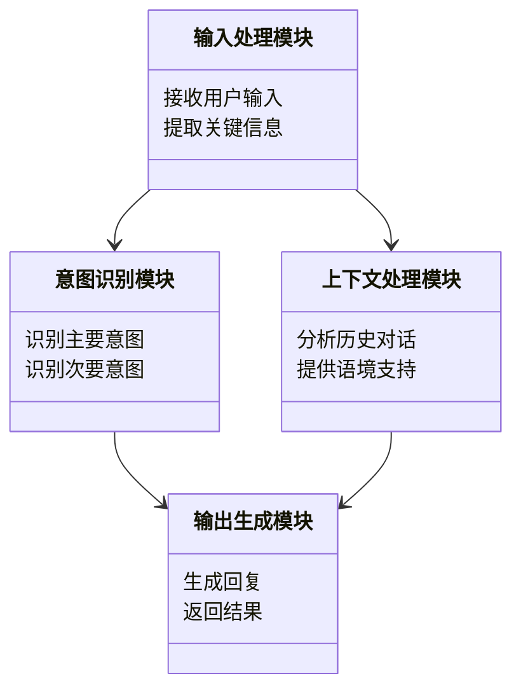
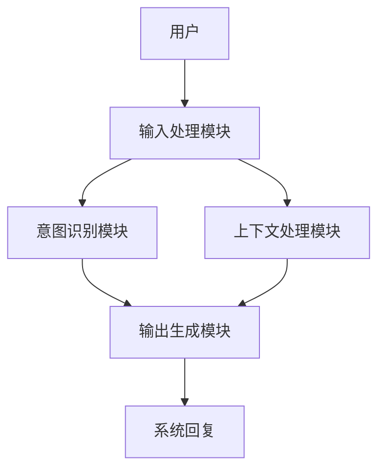
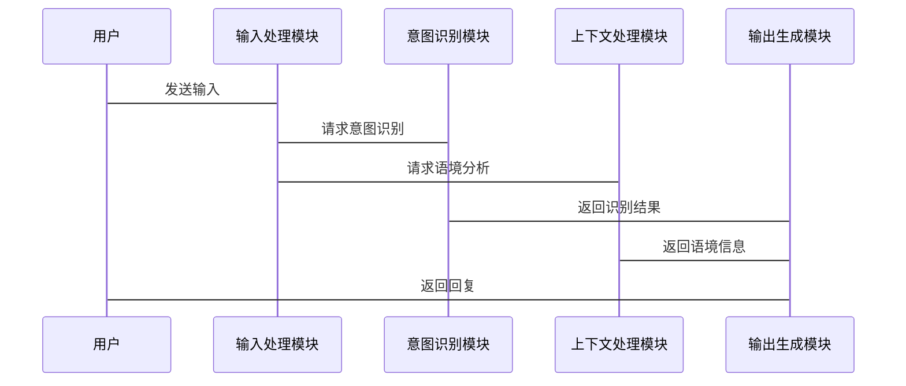

                 


# 构建企业级自然语言理解系统：上下文感知与多意图识别

## 关键词
- 企业级自然语言理解
- 上下文感知
- 多意图识别
- 深度学习
- NLP系统架构

## 摘要
企业级自然语言理解系统在现代商业应用中扮演着越来越重要的角色。本文从上下文感知和多意图识别两个核心问题入手，详细探讨了自然语言理解系统的构建过程。首先，我们介绍了自然语言理解的背景和挑战，分析了企业级NLP系统的核心需求。接着，我们深入讲解了上下文感知和多意图识别的实现原理，结合了预训练语言模型如BERT和GPT的应用。然后，我们详细设计了企业级NLP系统的架构，包括功能模块划分和系统接口设计。最后，通过实战项目，我们展示了如何从零开始构建一个简单的自然语言理解系统，并总结了最佳实践和未来研究方向。

---

# 引言

## 1. 企业级自然语言理解系统的背景

### 1.1 自然语言理解的定义与应用

自然语言理解（Natural Language Understanding, NLU）是自然语言处理（NLP）的重要组成部分，旨在使计算机能够理解和解析人类的自然语言输入。随着深度学习技术的快速发展，NLU已经广泛应用于智能客服、语音助手、机器翻译等领域。

在企业级应用中，NLU系统需要处理复杂的场景，例如客服对话、内部员工沟通、文档处理等。这些场景通常涉及多意图识别和上下文感知，使得NLU系统的构建更加复杂。

### 1.2 企业级NLU系统的挑战

企业级NLU系统面临以下挑战：
1. **复杂场景处理**：企业环境中，用户输入可能涉及多个意图，且上下文信息丰富。
2. **数据多样性**：企业内部数据可能包含专业术语和特定格式，需要系统具备较强的适应性。
3. **实时性要求**：企业系统通常需要实时响应，对NLU系统的性能提出了更高的要求。

### 1.3 上下文感知与多意图识别的核心问题

- **上下文感知**：理解用户输入的背景信息，包括历史对话、当前情境等。
- **多意图识别**：识别用户输入中可能存在的多个意图，并优先处理主要意图。

---

## 2. 上下文感知与多意图识别的核心概念

### 2.1 上下文感知的实现原理

上下文感知通过分析用户输入的历史信息，结合当前输入，理解其背后的语境。常见的实现方法包括：
1. **基于记忆网络**：使用记忆网络来存储和检索上下文信息。
2. **预训练语言模型**：利用BERT、GPT等模型的上下文理解能力。

### 2.2 多意图识别的实现方法

多意图识别需要从用户输入中识别出多个可能的意图，并确定其优先级。常用方法包括：
1. **序列标注模型**：如CRF（条件随机场）模型，用于序列标注。
2. **深度学习模型**：如LSTM和Transformer，用于捕捉长距离依赖关系。

### 2.3 实际案例分析

以智能客服为例，用户输入“我的订单还没到，但我想取消另一个订单”，系统需要识别出“查询订单状态”和“取消订单”两个意图，并优先处理“取消订单”。

---

## 3. 企业级NLU系统的算法原理

### 3.1 预训练语言模型的应用

#### 3.1.1 BERT模型的上下文理解机制

BERT模型通过双向Transformer结构，能够理解输入文本的上下文信息。其核心思想是将输入文本进行分词，并添加特殊标记（如CLS、SEP），然后通过多层Transformer进行编码。

#### 3.1.2 GPT模型的上下文生成机制

GPT模型基于生成式模型，能够根据上下文生成合理的回复。其核心是通过自注意力机制捕捉输入文本的上下文信息。

#### 3.1.3 模型对比分析

| 模型 | 输入 | 输出 | 优点 | 缺点 |
|------|------|------|------|------|
| BERT | 上下文 | 理解上下文 | 高准确率 | 计算资源需求高 |
| GPT | 上下文 | 生成文本 | 流畅性好 | 理解深度有限 |

### 3.2 多意图识别的算法实现

#### 3.2.1 基于条件随机场的意图识别

条件随机场（CRF）是一种用于序列标注的模型，常用于意图识别任务。其核心是通过状态转移和观测特征来预测每个词的标签（如“查询订单”、“取消订单”）。

#### 3.2.2 基于深度学习的意图识别模型

深度学习模型（如LSTM和Transformer）通过捕捉长距离依赖关系，能够更好地处理多意图识别任务。

#### 3.2.3 损失函数设计

多意图识别任务通常采用交叉熵损失函数：

$$
\text{Loss} = -\sum_{i=1}^{n} \sum_{k=1}^{m} y_{ik} \log p(y_{ik})
$$

其中，$y_{ik}$是真实标签的概率，$p(y_{ik})$是模型预测的概率。

---

## 4. 企业级NLU系统的架构设计

### 4.1 系统功能设计

#### 4.1.1 功能模块划分

- **输入处理模块**：接收用户输入并进行预处理。
- **意图识别模块**：识别用户的多个意图。
- **上下文处理模块**：分析上下文信息，提供语境支持。
- **输出生成模块**：根据识别的意图和上下文，生成系统回复。

#### 4.1.2 模块交互关系

用户输入首先经过输入处理模块，提取关键信息。然后，意图识别模块和上下文处理模块分别进行意图识别和语境分析。最后，输出生成模块根据结果生成回复。

#### 4.1.3 系统功能的领域模型设计



### 4.2 系统架构设计

#### 4.2.1 系统架构图



#### 4.2.2 系统接口设计

- **输入接口**：接收用户输入的文本或语音信号。
- **输出接口**：返回系统的回复或执行操作的结果。

#### 4.2.3 系统交互流程



---

## 5. 项目实战

### 5.1 环境配置

安装必要的库：

```bash
pip install transformers
pip install torch
pip install mermaid
```

### 5.2 核心实现代码

#### 5.2.1 意图识别模型实现

```python
import torch
import torch.nn as nn
import torch.optim as optim

class IntentClassifier(nn.Module):
    def __init__(self, input_size, hidden_size, output_size):
        super(IntentClassifier, self).__init__()
        self.rnn = nn.LSTM(input_size, hidden_size, batch_first=True)
        self.fc = nn.Linear(hidden_size, output_size)
    
    def forward(self, x):
        out, _ = self.rnn(x)
        out = self.fc(out[:, -1, :])
        return out
```

#### 5.2.2 上下文处理模块实现

```python
from transformers import BertTokenizer, BertModel

class ContextProcessor:
    def __init__(self):
        self.tokenizer = BertTokenizer.from_pretrained('bert-base-uncased')
        self.model = BertModel.from_pretrained('bert-base-uncased')
    
    def process_context(self, text):
        inputs = self.tokenizer(text, return_tensors='pt')
        outputs = self.model(**inputs)
        return outputs.last_hidden_state.mean(dim=1).squeeze()
```

### 5.3 测试与优化

编写测试用例，验证系统在不同场景下的表现，逐步优化模型参数和算法性能。

---

## 6. 最佳实践与注意事项

### 6.1 实战经验总结

- 数据预处理是关键，尤其是企业内部数据的清洗和标注。
- 模型调优需要结合实际场景，选择合适的超参数。
- 系统优化要考虑实时性和资源消耗。

### 6.2 未来研究方向

- 更高效的语言模型，如T5和PaLM。
- 多模态NLU系统的探索，结合视觉信息进行意图识别。

---

# 结语

构建企业级自然语言理解系统是一项复杂而有趣的任务。通过上下文感知和多意图识别的实现，我们可以显著提升系统的智能性和用户体验。未来，随着技术的进步，企业级NLU系统将在更多领域发挥重要作用。

---

作者：AI天才研究院/AI Genius Institute & 禅与计算机程序设计艺术 /Zen And The Art of Computer Programming

