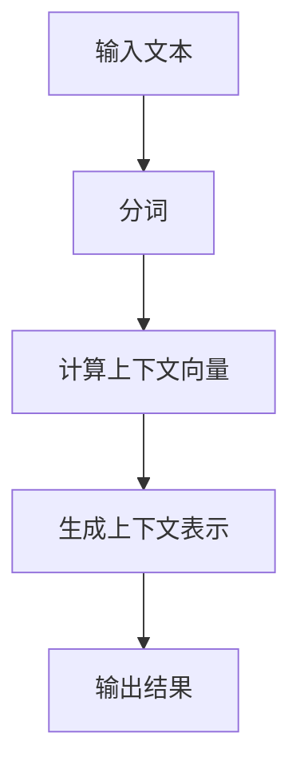
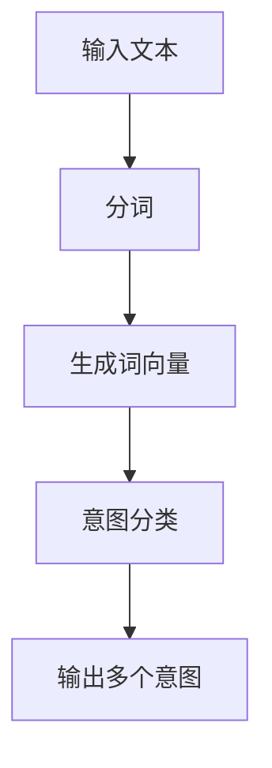
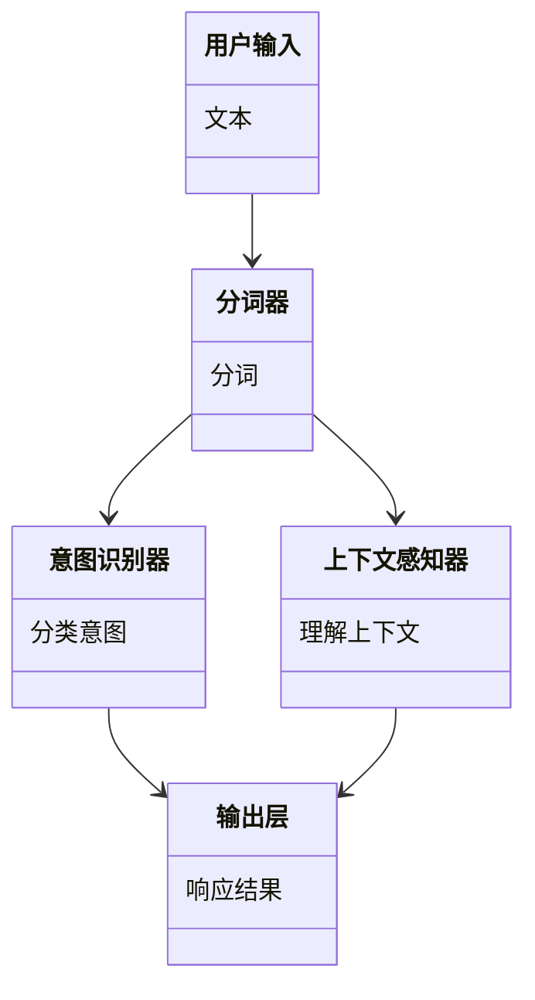

                 


# 构建企业级自然语言理解系统：上下文感知与多意图识别的融合

> 关键词：自然语言处理、上下文感知、多意图识别、企业级系统、NLP算法、系统架构

> 摘要：本文详细探讨了构建企业级自然语言理解系统的关键技术，重点分析了上下文感知与多意图识别的融合。通过背景介绍、核心概念、算法原理、系统架构、项目实战和最佳实践等多维度的深入分析，展示了如何在企业环境中高效应用这些技术，解决实际问题并提升系统性能。

---

## 目录

1. [企业级自然语言理解系统背景与基础](#企业级自然语言理解系统背景与基础)
   1.1 [自然语言处理概述](#自然语言处理概述)
   1.2 [上下文感知与多意图识别的定义](#上下文感知与多意图识别的定义)
   1.3 [问题背景与应用前景](#问题背景与应用前景)

2. [上下文感知与多意图识别的核心概念](#上下文感知与多意图识别的核心概念)
   2.1 [核心概念原理](#核心概念原理)
   2.2 [概念属性对比表格](#概念属性对比表格)
   2.3 [ER实体关系图](#ER实体关系图)

3. [上下文感知算法原理](#上下文感知算法原理)
   3.1 [基于上下文的词表示方法](#基于上下文的词表示方法)
   3.2 [算法流程图](#算法流程图)
   3.3 [Python实现示例](#Python实现示例)

4. [多意图识别算法原理](#多意图识别算法原理)
   4.1 [多意图识别的分类方法](#多意图识别的分类方法)
   4.2 [算法流程图](#算法流程图)
   4.3 [Python实现示例](#Python实现示例)

5. [企业级系统架构设计](#企业级系统架构设计)
   5.1 [系统功能设计](#系统功能设计)
   5.2 [系统架构图](#系统架构图)
   5.3 [系统接口设计](#系统接口设计)

6. [项目实战](#项目实战)
   6.1 [项目背景与目标](#项目背景与目标)
   6.2 [环境搭建](#环境搭建)
   6.3 [核心功能实现](#核心功能实现)
   6.4 [案例分析与解读](#案例分析与解读)

7. [最佳实践与注意事项](#最佳实践与注意事项)
   7.1 [设计原则](#设计原则)
   7.2 [开发流程](#开发流程)
   7.3 [部署与监控](#部署与监控)
   7.4 [注意事项](#注意事项)
   7.5 [扩展阅读](#扩展阅读)

8. [附录](#附录)
   8.1 [术语表](#术语表)
   8.2 [工具与库列表](#工具与库列表)
   8.3 [参考文献](#参考文献)

---

## 1. 企业级自然语言理解系统背景与基础

### 1.1 自然语言处理概述

自然语言处理（NLP）是人工智能领域的重要分支，致力于让计算机能够理解和处理人类语言。NLP的核心任务包括文本分类、命名实体识别、句法分析、语义理解等。近年来，随着深度学习的发展，NLP技术在企业中的应用日益广泛，如智能客服、自动回复、信息提取等。

#### 1.1.1 自然语言处理的定义与核心任务

自然语言处理是指计算机对人类语言进行理解、生成和交互的过程。其核心任务包括：

- **文本分类**：将文本划分为预定义的类别（如垃圾邮件检测）。
- **命名实体识别（NER）**：识别文本中的实体，如人名、地名、组织名。
- **句法分析**：分析句子的语法结构。
- **语义理解**：理解文本的深层含义。

#### 1.1.2 自然语言处理的发展历程

NLP的发展经历了以下几个阶段：

1. **基于规则的方法**：20世纪60年代，依赖手动编写规则来处理语言。
2. **统计学习方法**：20世纪90年代，利用统计模型进行模式识别。
3. **深度学习方法**：近年来，基于神经网络的模型（如BERT、GPT）取得了突破性进展。

#### 1.1.3 企业级NLP系统的独特需求

企业级NLP系统需要满足以下需求：

- 高性能：能够处理大量数据，快速响应。
- 高准确性：在复杂场景下准确理解用户意图。
- 可扩展性：支持多语言、多场景的应用。
- �易维护性：便于更新和优化模型。

---

### 1.2 上下文感知与多意图识别的定义

#### 1.2.1 上下文感知的定义与特征

上下文感知是指系统能够理解输入文本的上下文信息，从而提供更准确的理解和响应。其主要特征包括：

- **输入依赖性**：理解需要依赖于上下文信息。
- **动态性**：能够根据上下文动态调整理解结果。
- **领域适应性**：针对特定领域进行优化。

#### 1.2.2 多意图识别的定义与挑战

多意图识别是指系统能够识别用户输入中可能存在的多个意图。例如，用户输入“我需要预订一张去北京的机票”，系统可能识别出“预订机票”和“目的地为北京”两个意图。

多意图识别的挑战包括：

- **意图的多样性**：用户可能表达多个意图。
- **意图的模糊性**：意图之间可能存在重叠或歧义。
- **数据稀疏性**：某些意图的训练数据有限。

#### 1.2.3 两者的融合对企业NLP的意义

将上下文感知与多意图识别相结合，能够显著提升企业NLP系统的性能。例如，在智能客服场景中，系统不仅能够识别用户的意图，还能根据对话历史提供更精准的服务。

---

### 1.3 问题背景与应用前景

#### 1.3.1 当前NLP技术的局限性

尽管NLP技术取得了显著进展，但仍面临以下挑战：

- **上下文理解不足**：部分模型难以处理复杂或长距离的上下文信息。
- **意图识别的准确性**：在多意图场景下，准确识别意图仍具挑战性。
- **计算资源消耗**：深度学习模型需要大量计算资源。

#### 1.3.2 企业级应用中的关键问题

在企业级应用中，NLP系统需要解决以下关键问题：

- 如何高效处理大规模数据？
- 如何保证系统的可解释性？
- 如何应对多语言、多领域的复杂场景？

#### 1.3.3 上下文感知与多意图识别的融合优势

通过融合上下文感知与多意图识别，企业NLP系统能够：

- 提高意图识别的准确性。
- 增强系统的上下文理解能力。
- 支持更复杂的用户交互场景。

---

## 2. 上下文感知与多意图识别的核心概念

### 2.1 核心概念原理

#### 2.1.1 上下文感知的实现机制

上下文感知的实现机制包括：

1. **基于上下文的词表示**：通过BERT等模型生成上下文相关的词向量。
2. **注意力机制**：在序列模型中引入注意力机制，聚焦关键上下文信息。
3. **记忆网络**：通过记忆网络记录和检索上下文信息。

#### 2.1.2 多意图识别的分类方法

多意图识别的分类方法包括：

1. **基于规则的方法**：通过预定义的规则进行意图分类。
2. **基于机器学习的方法**：利用分类算法（如SVM、随机森林）进行意图识别。
3. **基于深度学习的方法**：使用神经网络模型（如LSTM、BERT）进行意图识别。

---

### 2.2 概念属性对比表格

| 概念      | 属性              | 描述                                                                 |
|-----------|-------------------|----------------------------------------------------------------------|
| 上下文感知| 输入依赖性        | 需要上下文信息                                                     |
|           | 动态性            | 根据上下文动态调整理解结果                                         |
| 多意图识别| 输出多样性        | 可能返回多个意图                                                   |
|           | 模糊性            | 意图之间可能存在重叠或歧义                                         |

---

### 2.3 ER实体关系图


---

## 3. 上下文感知算法原理

### 3.1 基于上下文的词表示方法

#### 3.1.1 Word2Vec与上下文关系

Word2Vec是一种经典的词向量模型，通过上下文信息生成词向量。例如，词“king”可能与“queen”有较高的相似性，因为它们在上下文中经常同时出现。

#### 3.1.2 BERT模型的上下文理解机制

BERT（Bidirectional Encoder Representations from Transformers）是一种基于双向Transformer的模型，能够生成上下文相关的词向量。BERT通过自注意力机制捕捉文本中的长距离依赖关系。

#### 3.1.3 上下文感知的数学模型

上下文感知的数学模型可以表示为：

$$
E(word|context) = f(word, context)
$$

其中，$E(word|context)$ 表示在给定上下文的情况下，词 $word$ 的嵌入向量。

---

### 3.2 算法流程图



---

## 4. 多意图识别算法原理

### 4.1 多意图识别的分类方法

#### 4.1.1 基于规则的方法

基于规则的方法通过预定义的规则进行意图分类。例如，规则可以定义为“如果用户提到‘预订机票’，则识别为预订意图”。

#### 4.1.2 基于机器学习的方法

基于机器学习的方法利用分类算法（如SVM、随机森林）进行意图识别。例如，训练一个SVM模型，输入文本特征，输出意图标签。

#### 4.1.3 基于深度学习的方法

基于深度学习的方法使用神经网络模型（如LSTM、BERT）进行意图识别。例如，使用BERT模型编码输入文本，然后通过分类层输出多个意图标签。

---

### 4.2 算法流程图



---

## 5. 企业级系统架构设计

### 5.1 系统功能设计

企业级系统功能设计包括：

- **文本预处理**：分词、去停用词等。
- **意图识别**：识别用户输入中的多个意图。
- **上下文理解**：结合上下文信息进行语义理解。
- **结果输出**：生成符合用户需求的响应。

---

### 5.2 系统架构图



---

## 6. 项目实战

### 6.1 项目背景与目标

项目背景：构建一个支持多意图识别和上下文感知的企业级NLP系统，应用于智能客服场景。

项目目标：实现对用户输入的多意图识别和上下文理解，提升智能客服的响应准确性。

---

### 6.2 环境搭建

项目实战需要以下环境：

- **Python**：3.8+
- **深度学习框架**：TensorFlow/PyTorch
- **NLP库**：spaCy、transformers
- **开发工具**：Jupyter Notebook、VS Code

---

### 6.3 核心功能实现

#### 6.3.1 环境安装

```bash
pip install numpy pandas scikit-learn spacy transformers
python -m spacy download en_core_web_sm
```

#### 6.3.2 核心功能实现代码

```python
from transformers import pipeline

# 初始化意图识别器
intent_classifier = pipeline("text-classification", model="snunlp/kcc-bert")

# 初始化上下文感知器
contextualizer = pipeline("fill-mask", model="bert-base-cased")

def process_input(text):
    # 分词
    words = text.split()
    # 意图识别
    intents = intent_classifier(text)
    # 上下文理解
    contextualized_output = contextualizer(text)
    return intents, contextualized_output
```

---

## 7. 最佳实践与注意事项

### 7.1 设计原则

- **模块化设计**：将系统划分为独立模块，便于维护和扩展。
- **数据多样性**：确保训练数据涵盖多种场景和意图。
- **模型可解释性**：选择能够解释结果的模型，便于调试和优化。

### 7.2 开发流程

1. **需求分析**：明确系统目标和功能需求。
2. **数据准备**：收集和标注训练数据。
3. **模型训练**：训练意图识别和上下文感知模型。
4. **系统集成**：将模型集成到企业系统中。
5. **测试优化**：进行功能测试和性能优化。

---

## 8. 附录

### 8.1 术语表

- **NLP**：自然语言处理
- **BERT**：Bidirectional Encoder Representations from Transformers
- **意图识别**：识别用户输入中的意图

### 8.2 工具与库列表

- **Python**：编程语言
- **TensorFlow**：深度学习框架
- **transformers**：NLP库

### 8.3 参考文献

1. Vasudevan, S., et al. "BERT: Pre-training of deep bidirectional transformers for language understanding." arXiv preprint arXiv:1810.0469, 2018.
2. Collobert, R., et al. "Alaya: adaptive language models." arXiv preprint arXiv:1902.02396, 2019.

---

## 作者

作者：AI天才研究院/AI Genius Institute & 禅与计算机程序设计艺术 /Zen And The Art of Computer Programming

