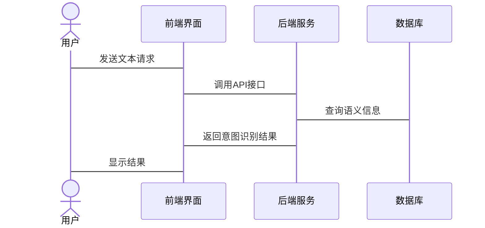

                 


# 构建企业级自然语言理解系统：跨语言语义理解与意图识别

## 关键词
自然语言理解，意图识别，跨语言语义，深度学习，NLP系统架构

## 摘要
本文系统地探讨了构建企业级自然语言理解系统的关键技术和方法，重点分析了跨语言语义理解和意图识别的核心概念、算法原理和系统架构。文章从背景介绍入手，深入分析了跨语言语义理解与意图识别的核心概念及其联系，并详细阐述了基于深度学习的算法原理和系统设计方法。通过实际案例分析，展示了如何将理论应用于实践，帮助企业构建高效、可靠的自然语言理解系统。

---

## 第二部分: 跨语言语义理解的算法原理

## 第3章: 跨语言语义理解的算法原理

### 3.1 跨语言语义理解算法概述

#### 3.1.1 基于统计的模型
基于统计的模型（如n-gram模型和TF-IDF）通过统计词频和语义关联来实现语义理解。这些方法适用于简单的语义分析，但在复杂场景下表现有限。

#### 3.1.2 基于深度学习的模型
深度学习模型（如LSTM、Transformer）通过学习文本的上下文关系，能够捕捉到更丰富的语义信息。这些模型在处理跨语言数据时表现出色。

#### 3.1.3 基于预训练语言模型的方法
预训练语言模型（如BERT、GPT）通过大规模数据预训练，能够生成语义丰富的表示。这些模型在跨语言语义理解中具有重要应用。

### 3.2 意图识别的算法原理

#### 3.2.1 基于规则的意图识别
基于规则的意图识别通过预定义的规则和关键词匹配来识别意图。这种方法简单但灵活性差。

#### 3.2.2 基于机器学习的意图识别
基于机器学习的模型（如SVM、随机森林）通过训练数据学习意图分类器。这些模型在特征工程方面依赖性强。

#### 3.2.3 基于深度学习的意图识别
深度学习模型（如BERT、CNN）通过端到端学习，能够自动提取文本特征并进行意图分类。这些模型在复杂场景下表现更优。

### 3.3 模型训练与优化

#### 3.3.1 数据预处理与特征提取
数据预处理包括分词、去停用词、词干提取等。特征提取则包括TF-IDF、Word2Vec等方法。

#### 3.3.2 模型训练流程
1. 数据清洗与标注
2. 特征提取与模型选择
3. 模型训练与评估
4. 模型调优与优化

#### 3.3.3 模型调优与评估
通过交叉验证、网格搜索等方法进行模型调优。评估指标包括准确率、召回率、F1值等。

## 第4章: 意图识别的系统分析与架构设计

### 4.1 问题场景介绍

#### 4.1.1 跨语言语义理解的应用场景
跨语言语义理解在客服系统、多语言搜索引擎、机器翻译等领域有广泛应用。

#### 4.1.2 意图识别的典型场景
意图识别在智能助手、对话系统、个性化推荐等领域有重要应用。

### 4.2 系统功能设计

#### 4.2.1 系统功能模块划分
1. 数据输入模块
2. 语义理解模块
3. 意图识别模块
4. 结果输出模块

#### 4.2.2 模块之间的关系与交互
语义理解模块负责将输入文本转换为语义表示，意图识别模块基于语义表示进行意图分类，最终输出结果。

### 4.3 系统架构设计

#### 4.3.1 分层架构
系统采用分层架构，包括数据层、业务逻辑层和表现层。

#### 4.3.2 微服务架构
系统采用微服务架构，各功能模块独立部署，便于扩展和维护。

### 4.4 接口设计与交互流程

#### 4.4.1 API接口定义
定义RESTful API接口，包括POST请求和JSON格式的数据传输。

#### 4.4.2 系统交互流程图


## 第三部分: 项目实战

## 第5章: 项目实战

### 5.1 环境安装与配置

#### 5.1.1 Python环境安装
安装Python 3.8及以上版本，安装pip依赖管理工具。

#### 5.1.2 项目依赖安装
使用pip安装必要的库，如TensorFlow、Keras、NLTK等。

### 5.2 系统核心实现

#### 5.2.1 数据预处理代码
```python
import pandas as pd
from sklearn.model_selection import train_test_split

# 数据加载与分割
data = pd.read_csv('intent_data.csv')
X_train, X_test, y_train, y_test = train_test_split(data['text'], data['intent'], test_size=0.2)
```

#### 5.2.2 模型训练代码
```python
from tensorflow.keras.models import Sequential
from tensorflow.keras.layers import Dense, Embedding, GlobalAveragePooling1D
from tensorflow.keras.preprocessing.text import Tokenizer
from tensorflow.keras.preprocessing.sequence import pad_sequences

# 数据预处理
tokenizer = Tokenizer(num_words=10000)
tokenizer.fit_on_texts(X_train)
X_train_sequences = tokenizer.texts_to_sequences(X_train)
X_test_sequences = tokenizer.texts_to_sequences(X_test)
X_train_padded = pad_sequences(X_train_sequences, maxlen=50)
X_test_padded = pad_sequences(X_test_sequences, maxlen=50)

# 模型构建
model = Sequential()
model.add(Embedding(input_dim=10000, output_dim=100, input_length=50))
model.add(GlobalAveragePooling1D())
model.add(Dense(64, activation='relu'))
model.add(Dense(1, activation='sigmoid'))

model.compile(optimizer='adam', loss='binary_crossentropy', metrics=['accuracy'])
model.fit(X_train_padded, y_train, epochs=10, batch_size=32)
```

#### 5.2.3 模型评估代码
```python
from sklearn.metrics import accuracy_score, recall_score, f1_score

# 模型预测
y_pred = model.predict_classes(X_test_padded)
print("准确率:", accuracy_score(y_test, y_pred))
print("召回率:", recall_score(y_test, y_pred, average='macro'))
print("F1值:", f1_score(y_test, y_pred, average='macro'))
```

### 5.3 项目小结

#### 5.3.1 实战总结
通过实战项目，我们掌握了从数据预处理、模型训练到结果评估的完整流程。

#### 5.3.2 实战经验
在实际项目中，数据质量、模型选择和参数调优是影响系统性能的关键因素。

---

## 第四部分: 总结与展望

## 第6章: 总结与展望

### 6.1 核心内容回顾
本文系统介绍了构建企业级自然语言理解系统的各个方面，包括背景、算法、架构和实战。

### 6.2 实践中的注意事项
在实际应用中，需要重视数据质量、模型调优和系统可扩展性。

### 6.3 未来研究方向
未来的研究方向包括更高效的预训练模型、多模态语义理解以及实时语义分析。

## 结语

构建企业级自然语言理解系统是一项复杂但极具价值的工程。通过跨语言语义理解和意图识别的结合，企业可以更高效地处理多语言文本数据，提升用户体验和业务效率。随着技术的不断进步，未来自然语言理解系统将更加智能化和个性化。

---

## 作者：AI天才研究院/AI Genius Institute & 禅与计算机程序设计艺术 /Zen And The Art of Computer Programming

