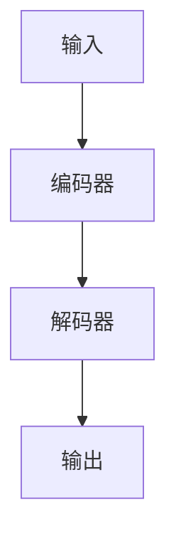
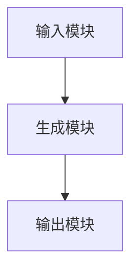
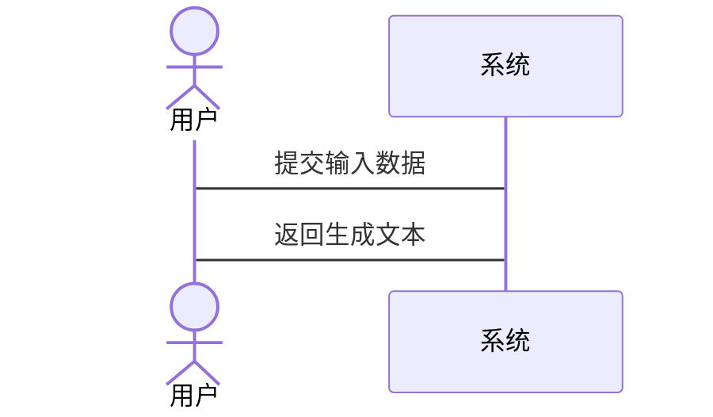

                 


# 构建企业级自然语言生成系统：多语种、多风格报告自动化

> 关键词：自然语言生成，多语种生成，多风格生成，企业级系统，报告自动化

> 摘要：本文详细探讨了构建企业级自然语言生成系统的方法，重点介绍了多语种和多风格报告自动化的实现。通过分析系统的背景、核心概念、算法原理、架构设计和项目实战，本文为读者提供了从理论到实践的全面指导。

---

# 第一部分: 企业级自然语言生成系统概述

## 第1章: 自然语言生成系统背景与问题背景

### 1.1 自然语言生成系统概述

#### 1.1.1 自然语言生成的定义

自然语言生成（Natural Language Generation, NLG）是人工智能领域的重要分支，旨在将结构化数据转化为自然语言文本。企业级自然语言生成系统需要具备高可用性、可扩展性和稳定性，能够满足大规模数据处理和多样化场景的需求。

#### 1.1.2 自然语言生成的核心概念

- **输入数据**：结构化数据、半结构化数据或非结构化数据。
- **生成目标**：生成符合特定格式、风格和语义的文本。
- **生成策略**：基于规则、统计模型或深度学习模型。

#### 1.1.3 企业级自然语言生成系统的特征

- **高可靠性**：在企业环境中稳定运行，保证生成文本的准确性。
- **可扩展性**：支持大规模数据处理和多并发请求。
- **灵活性**：适应不同场景和需求的变化，支持多种语言和风格。

### 1.2 多语种与多风格生成的必要性

#### 1.2.1 多语种生成的背景

随着全球化的发展，企业需要与多语言用户交互，生成多种语言的文本以满足不同地区的用户需求。多语种生成需要解决跨语言的语义转换和语言风格一致性问题。

#### 1.2.2 多风格生成的背景

在企业报告中，不同的场景和用户可能需要不同风格的文本，例如正式报告、口语化说明或简洁摘要。多风格生成能够满足这些多样化的需求，提升用户体验。

#### 1.2.3 企业级应用中的多语种与多风格需求

- **全球化业务**：支持多语言报告生成。
- **多样化用户需求**：提供不同风格的文本输出。
- **高效沟通**：通过多语言和多风格生成，提升企业内部和外部的沟通效率。

### 1.3 报告自动化的应用场景

#### 1.3.1 企业报告的类型与特点

- **财务报告**：需要准确、正式的语言风格。
- **市场分析报告**：需要简洁明了、数据驱动的表达。
- **项目进展报告**：需要清晰的结构和时间轴描述。

#### 1.3.2 自动化生成报告的优势

- **节省时间**：自动化生成报告，减少人工编写的时间。
- **提高效率**：通过系统快速生成大量报告，满足企业需求。
- **降低错误率**：减少人为错误，保证报告的准确性和一致性。

#### 1.3.3 企业级自然语言生成系统的边界与外延

- **边界**：生成文本的格式、风格和语义符合企业要求，不涉及外部数据的处理。
- **外延**：系统可以扩展到更多语言和风格，支持更多类型的报告生成。

---

## 第2章: 自然语言生成系统的核心概念与联系

### 2.1 自然语言生成的核心原理

#### 2.1.1 基于规则的生成模型

- **定义**：通过预定义的规则和模板生成文本。
- **优缺点**：规则简单易懂，但难以处理复杂语义和多样化风格。

#### 2.1.2 基于统计的生成模型

- **定义**：利用统计方法，基于数据分布生成文本。
- **优缺点**：生成效果较好，但需要大量数据支持。

#### 2.1.3 基于深度学习的生成模型

- **定义**：利用神经网络模型（如RNN、LSTM、Transformer）生成文本。
- **优缺点**：生成效果接近人类水平，但训练和计算成本较高。

### 2.2 多语种与多风格生成的实现方式

#### 2.2.1 多语种生成的实现方法

- **多语言模型**：在一个模型中同时支持多种语言，通过共享参数降低计算成本。
- **跨语言迁移学习**：利用一种语言的模型进行迁移学习，生成其他语言的文本。

#### 2.2.2 多风格生成的实现方法

- **风格切换机制**：通过调整模型参数或使用风格向量实现不同风格的生成。
- **多任务学习**：在生成文本的同时，学习风格信息，提升生成效果。

#### 2.2.3 统一生成框架的设计思路

- **模块化设计**：将生成过程分解为多个模块，每个模块负责不同的任务（如语言选择、风格切换、文本生成）。
- **统一接口**：提供统一的接口，方便不同模块的集成和调用。

### 2.3 系统架构的ER实体关系图

```mermaid
er
actor: 用户
|------|
| 系统 |<--- 关联
|------|
| 报告 |<--- 关联
```

### 2.4 生成模型的原理图



---

## 第3章: 自然语言生成系统的算法原理

### 3.1 基于Seq2Seq的生成模型

#### 3.1.1 Seq2Seq模型的结构

- **编码器**：将输入数据编码为固定长度的向量。
- **解码器**：将编码后的向量解码为目标语言或风格的文本。

#### 3.1.2 注意力机制的引入

- **注意力机制**：在解码过程中，关注输入数据的关键部分，提升生成文本的准确性和连贯性。

#### 3.1.3 解码器中的生成策略

- **贪心解码**：每一步选择概率最大的词进行生成。
- **束搜索**：生成多个候选序列，选择最优解。

### 3.2 多语种生成的算法实现

#### 3.2.1 多语言模型的训练方法

- **联合训练**：在一个模型中同时训练多种语言的数据。
- **共享参数**：在多语言模型中，共享部分参数以降低计算成本。

#### 3.2.2 跨语言迁移学习

- **迁移学习**：利用一种语言的模型进行微调，生成其他语言的文本。
- **语言适配器**：在模型中加入语言适配器，适应不同语言的生成需求。

#### 3.2.3 多语种生成的解码策略

- **语言选择**：根据输入数据选择合适的语言。
- **语言切换**：在生成过程中动态切换语言，满足复杂需求。

### 3.3 多风格生成的算法实现

#### 3.3.1 风格切换的实现原理

- **风格向量**：在生成过程中引入风格向量，控制生成文本的风格。
- **风格分类器**：通过分类器确定输入数据的风格，并调整生成策略。

#### 3.3.2 风格适应

- **风格迁移**：将一种风格的文本转换为另一种风格。
- **风格融合**：结合多种风格的特点，生成新的风格文本。

---

## 第4章: 系统分析与架构设计方案

### 4.1 系统架构设计

#### 4.1.1 项目介绍

- **项目名称**：企业级自然语言生成系统。
- **项目目标**：实现多语种、多风格的报告自动化生成。

#### 4.1.2 系统功能设计

- **输入模块**：接收结构化数据或文本输入。
- **生成模块**：根据输入数据生成目标语言和风格的文本。
- **输出模块**：将生成的文本输出到指定位置。

#### 4.1.3 系统架构图



### 4.2 系统架构设计图


### 4.3 系统接口设计

- **输入接口**：接收结构化数据或文本。
- **输出接口**：输出生成的文本或报告。

### 4.4 系统交互序列图



---

## 第5章: 项目实战

### 5.1 环境安装

- **编程语言**：Python 3.8+
- **深度学习框架**：TensorFlow或PyTorch
- **依赖库**：transformers, numpy, matplotlib

### 5.2 系统核心实现源代码

```python
import torch
from transformers import BartTokenizer, BartForConditionalGeneration

class MultiStyleGenerator:
    def __init__(self, model_name):
        self.tokenizer = BartTokenizer.from_pretrained(model_name)
        self.model = BartForConditionalGeneration.from_pretrained(model_name)
        
    def generate(self, input_text, language='en', style='formal'):
        # 处理语言和风格
        inputs = self.tokenizer.encode(input_text, return_tensors='pt')
        outputs = self.model.generate(inputs, max_length=100)
        return self.tokenizer.decode(outputs[0], skip_special_tokens=True)
```

### 5.3 代码应用解读与分析

- **类定义**：`MultiStyleGenerator`类封装了多风格生成的功能。
- **初始化**：加载预训练模型和分词器。
- **生成方法**：根据输入文本、语言和风格生成目标文本。

### 5.4 实际案例分析

- **案例1**：生成英文正式报告。
- **案例2**：生成中文口语化说明。

### 5.5 项目小结

- **总结**：通过代码实现，展示了多语种、多风格生成的具体应用。
- **优化方向**：进一步优化模型性能，提升生成文本的质量。

---

## 第6章: 最佳实践

### 6.1 小结

- **总结**：本文详细介绍了企业级自然语言生成系统的构建过程，从理论到实践，全面阐述了多语种和多风格生成的实现方法。

### 6.2 注意事项

- **数据质量**：确保输入数据的准确性和完整性。
- **模型调优**：根据实际需求，对模型进行微调和优化。
- **性能监控**：实时监控系统性能，及时发现和解决问题。

### 6.3 拓展阅读

- **推荐书籍**：《Deep Learning》、《自然语言处理入门》。
- **推荐论文**：关注最新自然语言生成领域的研究论文。

---

# 结语

通过本文的介绍，读者可以深入了解企业级自然语言生成系统的构建过程，掌握多语种和多风格生成的核心技术。希望本文能够为企业的自动化报告生成提供有价值的参考和指导。

---

作者：AI天才研究院/AI Genius Institute & 禅与计算机程序设计艺术 /Zen And The Art of Computer Programming

