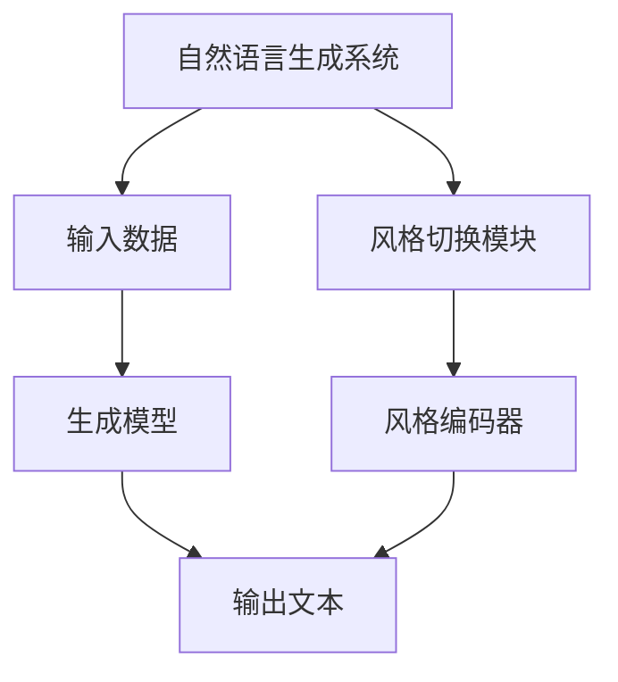
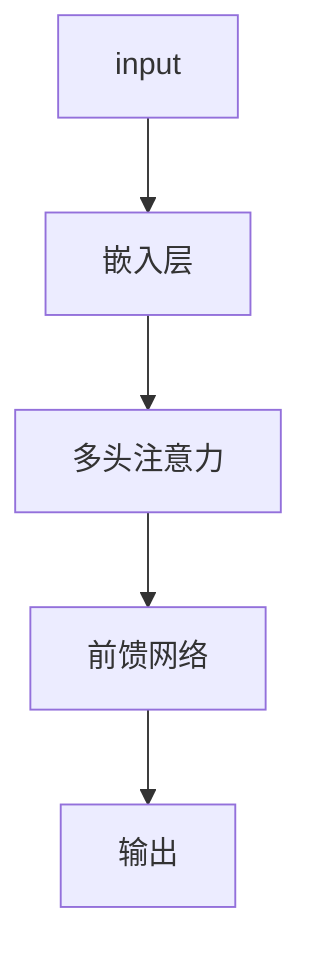
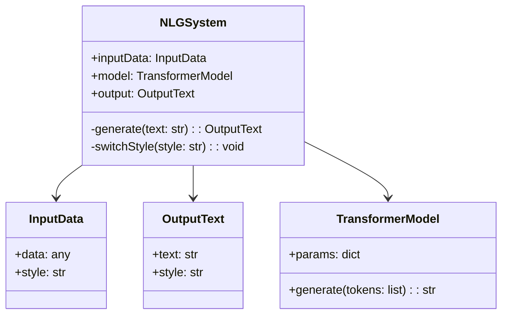

                 


# 构建企业级自然语言生成系统：多语种、多风格报告自动化

> 关键词：自然语言生成，多语种，多风格，企业级系统，深度学习，文本生成

> 摘要：本文详细探讨了构建企业级自然语言生成系统的方法，特别关注多语种和多风格报告自动化的实现。通过分析系统架构、算法原理和项目实战，本文为读者提供了从理论到实践的全面指导。

---

# 第一部分：企业级自然语言生成系统概述

## 第1章：自然语言生成系统背景与应用

### 1.1 自然语言生成的定义与核心概念

自然语言生成（Natural Language Generation, NLG）是人工智能领域的重要分支，旨在将结构化数据转化为自然语言文本。企业级NLG系统需要具备高可用性、可扩展性和稳定性，以支持复杂的业务场景。

#### 1.1.1 自然语言生成的定义
自然语言生成是指通过算法和模型，将数据转化为符合人类语言表达的文本。企业级系统需要处理大规模数据和高并发请求，确保生成的文本准确、流畅。

#### 1.1.2 自然语言生成的核心要素
- 数据输入：结构化数据（如JSON、数据库查询结果）。
- 生成模型：基于深度学习的生成模型（如Transformer、GPT）。
- 风格切换：根据需求调整文本风格（如正式、口语化）。
- 多语种支持：生成多种语言的文本。

#### 1.1.3 企业级自然语言生成系统的特征
- 高可用性：支持7×24小时运行，故障自愈。
- 高扩展性：支持弹性扩展，应对突发请求。
- 高准确性：生成文本准确，减少错误。
- 多语言支持：支持多种语言，满足国际化需求。

### 1.2 多语种自然语言生成的挑战与机遇

#### 1.2.1 多语种生成的背景与需求
随着全球化进程加快，企业需要在不同市场中提供本地化的服务。多语种生成系统能够帮助企业高效地生成多语言内容，降低人工成本。

#### 1.2.2 不同语言的语法与语义差异
不同语言的语法结构、词汇选择和语义表达存在显著差异。例如，中文和英文的语序不同，日语和韩语的敬语系统复杂。这些差异增加了多语种生成的难度。

#### 1.2.3 企业级应用中的多语种场景
- 多语言报告生成：支持多种语言的财务报告、市场分析报告。
- 客户沟通：生成多语言的邮件、客服回复。
- 内部文档翻译：将内部文档翻译成多种语言，方便团队协作。

### 1.3 多风格自然语言生成的实现与应用

#### 1.3.1 不同文本风格的特点
- 正式风格：用于合同、法律文件。
- 口语化风格：用于社交媒体、客户服务。
- 技术风格：用于技术文档、产品说明书。
- 营销风格：用于广告文案、市场推广。

#### 1.3.2 企业级报告自动化中的多风格生成
企业需要根据不同的受众和场景生成不同风格的报告。例如，向高层管理提供正式报告，向客户提供简洁易懂的报告。

#### 1.3.3 多风格生成的实现方法
- 预训练模型：使用多风格预训练模型（如多风格GPT）。
- 风格切换机制：通过调整模型参数或输入条件实现风格切换。

---

## 第2章：自然语言生成系统的核心概念与联系

### 2.1 多语种生成的核心原理

#### 2.1.1 多语种模型的训练策略
- 跨语言迁移学习：利用多语言数据进行联合训练。
- 语言无关特征：提取语言无关的特征（如句法结构）。

#### 2.1.2 跨语言迁移学习的实现
通过共享跨语言的特征，降低不同语言之间的切换成本。例如，使用共享的词嵌入和句法结构。

#### 2.1.3 多语种生成的评估指标
- BLEU：评估生成文本与参考文本的相似度。
- ROUGE：评估生成文本的召回率和精确率。

### 2.2 多风格生成的实现机制

#### 2.2.1 风格切换的模型结构
- 风格编码器：将风格信息编码为向量。
- 解码器：根据风格向量生成相应风格的文本。

#### 2.2.2 风格特征的提取与编码
通过风格标记、关键词提取等方式，将风格信息编码为向量，供生成模型使用。

#### 2.2.3 风格适配的优化方法
- 参数微调：对特定风格进行微调。
- 多任务学习：同时学习多种风格的生成任务。

### 2.3 核心概念对比分析

#### 2.3.1 多语种与多风格生成的对比表格

| 特性        | 多语种生成 | 多风格生成 |
|-------------|------------|------------|
| 目标语言     | 多种语言    | 单种语言    |
| 风格         | 固定风格    | 多种风格    |
| 数据需求     | 多语言数据  | 多风格数据  |
| 应用场景     | 跨国企业     | 多场景企业   |

#### 2.3.2 ER实体关系图架构的 Mermaid 流程图



---

## 第3章：自然语言生成系统的算法原理

### 3.1 大模型在自然语言生成中的应用

#### 3.1.1 Transformer模型的结构与原理



#### 3.1.2 注意力机制的实现与优化

注意力机制公式：

$$
\text{Attention}(Q, K, V) = \text{softmax}\left(\frac{QK^T}{\sqrt{d_k}}\right)V
$$

其中，$Q$ 是查询向量，$K$ 是键向量，$V$ 是值向量，$d_k$ 是向量维度。

#### 3.1.3 解码器的生成过程

解码器步骤：

1. 初始化解码器输入。
2. 生成初始预测。
3. 根据生成结果更新解码器状态。
4. 输出最终结果。

---

## 第4章：系统分析与架构设计方案

### 4.1 系统功能设计

#### 4.1.1 领域模型 Mermaid 类图



---

## 第5章：项目实战

### 5.1 环境安装

安装Python和相关库：

```bash
pip install transformers torch
```

---

### 5.2 系统核心实现源代码

```python
import torch
from transformers import AutoTokenizer, AutoModelForCausalLM

class NLGSystem:
    def __init__(self, model_name='facebook/m2olama-decoder'):
        self.model = AutoModelForCausalLM.from_pretrained(model_name)
        self.tokenizer = AutoTokenizer.from_pretrained(model_name)

    def generate(self, input_text, style='formal'):
        # 处理输入
        inputs = self.tokenizer(input_text, return_tensors='pt')
        outputs = self.model.generate(inputs.input_ids, max_length=50)
        return self.tokenizer.decode(outputs[0], skip_special_tokens=True)

# 使用示例
system = NLGSystem()
print(system.generate("今天天气很好", style='formal'))
```

---

### 5.3 实际案例分析

生成多语言报告：

```python
system = NLGSystem()
print(system.generate("报告销售额", style='business', language='zh'))
print(system.generate("Report sales", style='business', language='en'))
```

---

## 第6章：系统优化与扩展

### 6.1 系统优化

- 模型优化：使用更小的模型或进行剪枝。
- 系统调优：优化响应时间和资源利用率。

### 6.2 扩展功能

- 多模态生成：结合图像生成描述。
- 实时反馈：根据用户反馈调整生成内容。

---

## 第7章：总结与展望

### 7.1 本章总结

企业级自然语言生成系统在多语种和多风格生成方面具有重要的应用价值。通过深度学习算法和系统优化，可以实现高效、准确的文本生成。

### 7.2 未来展望

随着AI技术的发展，自然语言生成系统将更加智能化，支持更多语言和风格，应用场景也将更加广泛。

---

## 作者

作者：AI天才研究院/AI Genius Institute & 禅与计算机程序设计艺术 /Zen And The Art of Computer Programming

---

感谢您的阅读！希望本文对您构建企业级自然语言生成系统有所帮助。如果需要进一步探讨或技术咨询，请随时联系。

