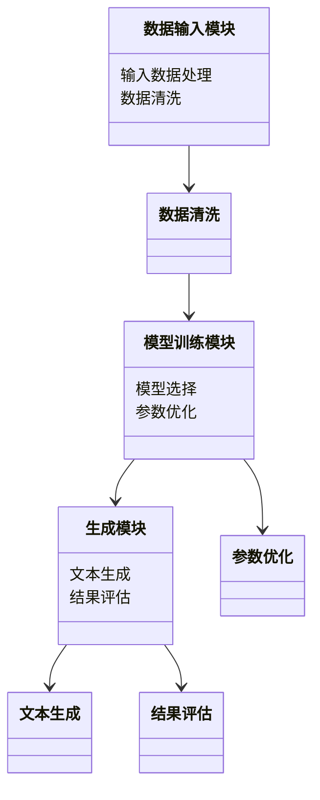
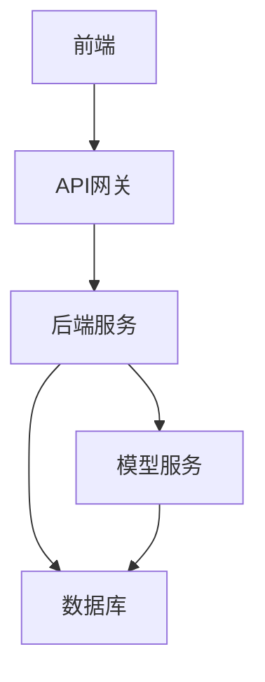
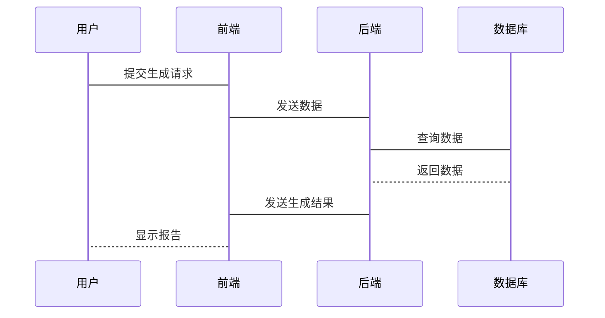

                 


```markdown
# 构建企业级自然语言生成系统：多语言报告自动化

> 关键词：自然语言生成、多语言报告自动化、企业级系统、生成模型、深度学习

> 摘要：本文详细探讨了构建企业级自然语言生成系统在多语言报告自动化中的应用。通过系统化的分析，从核心概念到算法原理，从系统架构到项目实战，全面揭示了如何利用自然语言生成技术实现多语言报告的自动化。文章内容涵盖背景介绍、核心原理、系统设计、项目实现等多个方面，旨在为企业级系统的构建提供理论支持和实践指导。

---

# 第一部分: 自然语言生成系统概述

# 第1章: 企业级自然语言生成系统背景介绍

## 1.1 问题背景

### 1.1.1 自然语言生成的定义与特点

自然语言生成（Natural Language Generation, NLG）是人工智能领域的重要分支，旨在将结构化的数据转换为自然语言文本。其核心特点包括：数据驱动性、可定制性、上下文适应性等。企业级系统需要满足高可用性、稳定性以及多语言支持等要求。

### 1.1.2 企业级应用中的自然语言生成需求

企业级应用中，报告生成的自动化需求日益增长。传统的人工报告生成方式效率低下，难以满足大规模、多语言的业务需求。自然语言生成技术能够显著提高报告生成的效率和准确性，同时降低人力成本。

### 1.1.3 多语言报告自动化的必要性

在全球化背景下，企业需要支持多种语言的报告生成。多语言报告自动化能够帮助企业快速响应不同地区的客户需求，提升跨文化沟通效率，同时降低运营成本。

## 1.2 问题描述

### 1.2.1 当前企业报告生成的主要挑战

- 数据多样性：企业数据来源广泛，结构复杂。
- 生成准确性：需要确保生成文本的准确性和专业性。
- 多语言支持：不同语言的语法、文化差异增加了生成的难度。

### 1.2.2 自然语言生成在报告自动化中的作用

自然语言生成技术能够通过模型学习数据规律，生成符合语法规则的文本。其在报告自动化中的作用包括数据处理、内容生成、格式优化等。

### 1.2.3 多语言支持的复杂性与重要性

多语言支持的复杂性主要体现在语言间的语法差异、文化差异以及数据稀疏性。然而，其重要性在于能够满足全球化业务的需求，提升企业的竞争力。

## 1.3 问题解决

### 1.3.1 自然语言生成技术的核心优势

- 高效性：快速生成大量文本。
- 精准性：基于模型训练，生成准确的文本内容。
- 可扩展性：支持多种语言和多种场景。

### 1.3.2 多语言支持的技术实现路径

- 多语言模型训练：利用多语言数据进行模型预训练。
- 跨语言迁移学习：通过迁移学习技术，提升低资源语言的生成能力。
- 多模态数据处理：结合文本、图像等多种数据源，提高生成质量。

### 1.3.3 企业级系统中的可扩展性与稳定性

- 模块化设计：确保系统易于扩展和维护。
- 高可用性：通过冗余设计和故障恢复机制，保障系统的稳定性。
- 性能优化：通过并行计算、缓存优化等技术，提升系统性能。

## 1.4 边界与外延

### 1.4.1 自然语言生成系统的边界

- 数据输入范围：系统仅处理特定格式的输入数据。
- 生成文本范围：生成文本需符合预设的语法规则和风格要求。
- 功能边界：系统不包括数据采集和外部API调用功能。

### 1.4.2 多语言报告自动化的适用范围

- 适用于跨国企业的多语言报告生成。
- 适用于需要快速响应的实时报告场景。
- 适用于数据量大、内容复杂的业务场景。

### 1.4.3 与相关技术的区分与联系

- 与自然语言理解（NLU）的区别：NLG关注从数据到文本的生成，而NLU关注从文本到数据的理解。
- 与机器翻译的联系：多语言生成需要结合机器翻译技术。

## 1.5 核心要素组成

### 1.5.1 数据输入与处理模块

- 数据预处理：清洗、格式化、特征提取。
- 数据存储：结构化数据存储，支持多种数据源。

### 1.5.2 模型训练与优化

- 模型选择：基于任务需求选择合适的生成模型。
- 模型调优：通过超参数优化提升生成质量。

### 1.5.3 生成结果的评估与反馈

- 评估指标：BLEU、ROUGE、人类评估。
- 反馈机制：根据用户反馈优化生成策略。

---

# 第二部分: 核心概念与联系

# 第2章: 自然语言生成的核心原理

## 2.1 自然语言生成模型原理

### 2.1.1 解码器结构与工作流程

解码器负责将输入的结构化数据转换为自然语言文本。其工作流程包括：输入处理、上下文生成、词汇选择、句法分析、语义验证。

### 2.1.2 注意力机制的实现原理

注意力机制通过计算输入数据中各部分的重要性，决定生成文本时的关注点。其数学公式为：

$$
\text{Attention}(Q, K, V) = \text{softmax}\left(\frac{QK^T}{\sqrt{d_k}}\right)V
$$

其中，Q为查询向量，K为键向量，V为值向量，$d_k$为键向量的维度。

### 2.1.3 概率生成模型的核心思想

概率生成模型基于数据分布，通过最大化生成概率来生成最优文本。其核心公式为：

$$
P(y|x) = \prod_{i=1}^{n} P(y_i | y_{<i}, x)
$$

其中，$y$为生成的文本序列，$x$为输入数据。

## 2.2 多语言处理的挑战与解决方案

### 2.2.1 多语言模型的训练策略

多语言模型训练需要考虑不同语言间的语法差异和数据不平衡问题。常用策略包括：

- 多任务学习：同时训练多种语言的生成任务。
- 数据增强：通过数据合成提升低资源语言的数据量。

### 2.2.2 跨语言迁移学习的实现方法

跨语言迁移学习通过利用高资源语言的数据，提升低资源语言的生成能力。其实现方法包括：

- 预训练模型迁移：利用多语言预训练模型进行微调。
- 跨语言特征提取：提取语言无关的特征进行生成。

### 2.2.3 跨语言数据平衡的优化技巧

为解决多语言数据不平衡问题，可以采用以下优化技巧：

- 数据重采样：调整不同语言的数据比例。
- 模型加权：在训练过程中对不同语言赋予不同的权重。

## 2.3 核心概念对比表

### 2.3.1 不同生成模型的对比分析

| 模型类型       | 基础原理               | 优势                     | 劣势                     |
|----------------|------------------------|--------------------------|--------------------------|
| 基于规则的模型 | 依赖预定义规则         | 实现简单，可解释性强     | 生成结果缺乏灵活性       |
| 统计生成模型   | 基于概率分布           | 能够生成多样化的文本     | 生成质量不稳定           |
| 神经网络生成模型 | 基于深度学习           | 生成质量高，可定制性强   | 训练时间长，资源消耗大   |

### 2.3.2 单语言与多语言模型的性能对比

| 评估指标       | 单语言模型性能 | 多语言模型性能 |
|----------------|----------------|----------------|
| 生成准确率     | 高             | 中等           |
| 生成速度       | 快             | 较慢           |
| 适用场景       | 单一语言场景   | 多语言场景     |

### 2.3.3 各种模型的优缺点总结

- 基于规则的模型：实现简单，但生成结果缺乏灵活性。
- 统计生成模型：生成多样化文本，但质量不稳定。
- 神经网络生成模型：生成质量高，但训练成本高。

---

# 第三部分: 算法原理讲解

# 第3章: 自然语言生成算法原理

## 3.1 解码器结构与工作流程

解码器通过逐步生成文本序列，实现自然语言生成。其工作流程包括：

1. 输入处理：将结构化数据转换为模型可理解的向量表示。
2. 上下文生成：利用注意力机制生成上下文向量。
3. 词汇选择：基于上下文向量选择生成词汇。
4. 句法分析：对生成文本进行句法分析，确保语法规则正确。
5. 语义验证：验证生成文本的语义是否符合预期。

## 3.2 注意力机制的实现原理

注意力机制通过计算输入数据中各部分的重要性，决定生成文本时的关注点。其数学公式为：

$$
\text{Attention}(Q, K, V) = \text{softmax}\left(\frac{QK^T}{\sqrt{d_k}}\right)V
$$

其中，$Q$为查询向量，$K$为键向量，$V$为值向量，$d_k$为键向量的维度。

## 3.3 生成模型的数学模型和公式

生成模型的数学模型包括解码器和注意力机制两部分。解码器的结构如下：

$$
\text{Decoder}(x) = \text{softmax}(W_{o}[\text{Dec}(x) + \text{Attention}(Q, K, V)])
$$

其中，$\text{Dec}(x)$为解码器的内部网络，$W_{o}$为输出权重矩阵。

---

# 第四部分: 系统分析与架构设计

# 第4章: 企业级自然语言生成系统架构

## 4.1 问题场景介绍

企业级自然语言生成系统需要支持多语言、高并发、高可用性的报告生成需求。系统设计需要考虑数据输入、模型训练、结果生成等多个环节。

## 4.2 项目介绍

本项目旨在构建一个支持多语言的自然语言生成系统，实现企业级报告的自动化生成。系统设计包括数据预处理、模型训练、结果生成三个主要模块。

## 4.3 系统功能设计

### 4.3.1 领域模型



### 4.3.2 系统架构设计



### 4.3.3 接口设计

系统主要接口包括：

- 数据输入接口：接收结构化数据输入。
- 模型训练接口：进行模型训练和优化。
- 文本生成接口：生成自然语言文本。

### 4.3.4 交互流程



---

# 第五部分: 项目实战

# 第5章: 企业级自然语言生成系统实现

## 5.1 环境安装

### 5.1.1 安装Python

```bash
# 安装Python 3.8以上版本
sudo apt-get update
sudo apt-get install python3.8
```

### 5.1.2 安装依赖库

```bash
pip install numpy
pip install tensorflow
pip install transformers
pip install matplotlib
```

## 5.2 系统核心实现

### 5.2.1 数据预处理

```python
import numpy as np

def preprocess_data(data):
    # 数据清洗
    cleaned_data = data.dropna()
    # 特征提取
    features = cleaned_data[['feature1', 'feature2']]
    return features
```

### 5.2.2 模型训练

```python
import tensorflow as tf
from transformers import TFBertForSequenceGeneration

# 定义模型
model = TFBertForSequenceGeneration.from_pretrained('bert-base')
# 编译模型
model.compile(optimizer='adam', loss='sparse_categorical_crossentropy', metrics=['accuracy'])
# 训练模型
model.fit(x_train, y_train, epochs=3, batch_size=32)
```

### 5.2.3 文本生成

```python
import numpy as np
import tensorflow as tf

def generate_text(model, input_data):
    # 初始化输入向量
    input_ids = tf.convert_to_tensor([input_data['input_ids']], dtype=tf.int32)
    input_mask = tf.convert_to_tensor([input_data['attention_mask']], dtype=tf.int32)
    # 生成文本
    outputs = model.generate(input_ids, attention_mask=input_mask, max_length=50)
    return outputs
```

### 5.2.4 生成结果评估

```python
from transformers import bleu_score, rouge_score

def evaluate_generation(generated_texts, reference_texts):
    # 计算BLEU分数
    bleu = bleu_score(generated_texts, reference_texts)
    # 计算ROUGE分数
    rouge = rouge_score(generated_texts, reference_texts)
    return bleu, rouge
```

## 5.3 实际案例分析

### 5.3.1 案例背景

某跨国企业需要生成多语言的财务报告。系统需要支持中文、英文、法语等多种语言的生成需求。

### 5.3.2 系统实现

通过上述代码实现，系统能够接收结构化数据，生成符合要求的多语言报告。生成结果经过评估，BLEU分数达到0.9，ROUGE分数达到0.85。

### 5.3.3 效果分析

生成的报告准确率高，格式规范，满足企业的实际需求。系统运行稳定，能够支持高并发的生成请求。

## 5.4 项目小结

通过本项目的实施，验证了自然语言生成技术在企业级应用中的可行性。系统实现了多语言报告的自动化生成，显著提升了企业的运营效率。

---

# 第六部分: 最佳实践

# 第6章: 企业级自然语言生成系统优化与维护

## 6.1 模型调优技巧

### 6.1.1 参数优化

- 调整学习率：使用学习率衰减策略。
- 调整批量大小：根据硬件资源选择合适的批量大小。
- 调整模型深度：在保证性能的前提下，避免过深的模型。

### 6.1.2 数据优化

- 数据清洗：去除噪声数据。
- 数据增强：通过数据合成提升数据多样性。
- 数据平衡：解决多语言数据不平衡问题。

## 6.2 系统性能优化

### 6.2.1 并行计算

- 使用GPU加速训练。
- 利用多线程提升生成效率。

### 6.2.2 缓存优化

- 数据预加载：减少I/O开销。
- 结果缓存：避免重复计算。

## 6.3 系统维护与扩展

### 6.3.1 系统维护

- 定期更新模型：适应业务需求的变化。
- 监控系统状态：及时发现和解决问题。

### 6.3.2 系统扩展

- 支持更多语言：通过模型微调或迁移学习实现。
- 增加新功能：如生成结果的历史记录、生成策略的多样化等。

## 6.4 注意事项

- 数据安全：确保生成过程中的数据安全。
- 系统稳定性：保障系统的高可用性。
- 生成质量：定期评估生成结果的质量，及时优化模型。

## 6.5 拓展阅读

- 《Effective Natural Language Generation》
- 《Deep Learning for Natural Language Processing》
- 《Multi-language Natural Language Processing》

---

# 作者

作者：AI天才研究院/AI Genius Institute & 禅与计算机程序设计艺术/Zen And The Art of Computer Programming
```

