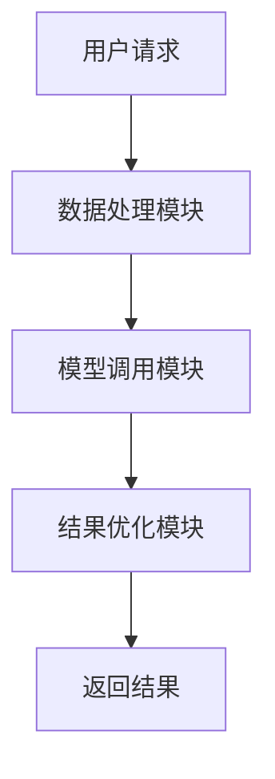

                 

# 构建企业级自然语言生成系统：自动报告与内容创作

---

## 关键词  
自然语言生成, 企业级系统, 自动报告生成, 内容创作, 深度学习, NLP, 生成模型

---

## 摘要  
本文深入探讨了企业级自然语言生成系统的设计与实现，涵盖从算法原理到系统架构的各个方面。文章首先介绍了自然语言生成的背景与核心概念，随后分析了主流的生成模型及其在企业级应用中的表现。接着，详细讲解了企业级系统的架构设计与实现，包括模块划分、数据流设计和系统优化。最后，通过实际项目案例，展示了如何构建高效的自然语言生成系统，并提出了未来的发展方向和最佳实践建议。

---

# 第一部分: 自然语言生成系统概述

## 第1章: 自然语言生成系统背景与概述

### 1.1 自然语言生成的定义与背景

#### 1.1.1 自然语言生成的定义
自然语言生成（Natural Language Generation, NLG）是人工智能领域的重要分支，旨在让计算机能够自动生成人类可读的文本。NLG系统的核心任务是将结构化数据（如数据库中的信息或JSON格式的数据）转换为自然流畅的自然语言文本。

#### 1.1.2 自然语言生成的技术发展史
自然语言生成技术经历了多个阶段：
1. **基于规则的生成（早期阶段）**：通过预定义的语法规则生成文本，这种方式生成的文本往往缺乏灵活性。
2. **统计机器学习方法（2000年代）**：利用统计模型（如n-gram模型）分析大量文本数据，生成概率最高的句子。
3. **深度学习与神经网络（2010年代至今）**：基于循环神经网络（RNN）和变换器（Transformer）的模型（如GPT、BERT）成为主流，生成质量显著提升。

#### 1.1.3 企业级应用中的自然语言生成
在企业级应用中，NLG技术主要用于：
- **自动报告生成**：生成财务报告、市场分析报告等。
- **内容创作辅助**：帮助营销人员生成推广文案。
- **客服自动化**：自动生成回复客户的问题。

### 1.2 企业级自然语言生成的现状

#### 1.2.1 当前企业级自然语言生成的应用场景
1. **企业报告生成**：例如财务部门生成月度报告。
2. **客户服务**：自动回复客户邮件或聊天记录。
3. **内容营销**：生成社交媒体帖子或新闻稿。

#### 1.2.2 企业级自然语言生成的挑战
1. **生成质量不稳定**：模型可能生成不准确或不通顺的文本。
2. **数据隐私问题**：处理企业内部数据时需要考虑隐私保护。
3. **模型训练成本高**：深度学习模型需要大量计算资源。

#### 1.2.3 自然语言生成的未来发展趋势
1. **多模态生成**：结合图像、语音等多种模态信息，生成更丰富的文本。
2. **个性化生成**：根据用户偏好生成定制化内容。
3. **实时生成与优化**：提升生成速度并支持动态调整。

### 1.3 本章小结
本章介绍了自然语言生成的基本概念、技术发展史以及在企业级应用中的现状与挑战，为后续章节奠定了基础。

---

# 第二部分: 自然语言生成的核心算法与模型

## 第2章: 自然语言生成的核心算法

### 2.1 传统自然语言生成算法

#### 2.1.1 基于规则的生成方法
基于规则的生成方法依赖于预定义的语法规则和句法结构。例如，通过定义主语、谓语、宾语的位置关系，生成简单的句子。这种方法适用于结构化的数据，但生成的文本缺乏灵活性和多样性。

#### 2.1.2 统计机器学习方法
统计机器学习方法通过分析大量文本数据，计算每个词语出现的概率，从而生成最可能的句子。这种方法在一定程度上可以解决基于规则方法的局限性，但仍然存在生成文本不够自然的问题。

#### 2.1.3 基于模板的生成方法
基于模板的生成方法通过预定义的模板，将结构化数据填充到模板中，生成特定格式的文本。例如，在财务报告中，可以将销售额和利润等数据填充到固定的模板中。这种方法适用于特定场景，但灵活性有限。

### 2.2 基于深度学习的自然语言生成

#### 2.2.1 RNN与LSTM在自然语言生成中的应用
循环神经网络（RNN）和长短期记忆网络（LSTM）是早期的深度学习模型，广泛应用于自然语言生成任务。RNN通过循环结构处理序列数据，LSTM通过引入记忆单元，能够更好地捕捉长距离依赖关系。

#### 2.2.2 Transformer模型的自然语言生成
Transformer模型通过自注意力机制（self-attention）和位置编码（positional encoding）实现了高效的序列建模。与RNN不同，Transformer并行处理序列数据，生成速度更快。

#### 2.2.3 GPT系列模型的自然语言生成
GPT（Generative Pre-trained Transformer）系列模型是基于Transformer的开源模型，通过预训练和微调的方式，可以生成高质量的自然语言文本。GPT模型的优势在于其强大的上下文理解和生成能力。

### 2.3 预训练模型在自然语言生成中的应用

#### 2.3.1 BERT与T5模型的自然语言生成
BERT（Bidirectional Encoder Representations from Transformers）主要应用于文本理解和生成任务。T5（Text-to-Text Transformer）是一种基于Transformer的预训练模型，通过将所有任务转换为文本到文本的格式，实现了统一的生成框架。

#### 2.3.2 GPT-3与后续模型的自然语言生成
GPT-3由OpenAI发布，是一个具有1750亿参数的大型语言模型，能够生成高质量的自然语言文本。后续的模型如GPT-4进一步优化了生成能力，支持多模态输入和更复杂的生成任务。

#### 2.3.3 预训练模型的微调与应用
预训练模型的微调（Fine-tuning）是通过在特定任务上对模型进行进一步训练，以适应具体的应用场景。例如，在生成财务报告时，可以对GPT模型进行微调，使其生成更符合财务领域的文本。

### 2.4 自然语言生成模型的优缺点对比

#### 2.4.1 传统算法与深度学习算法的对比
| 特性               | 基于规则的方法 | 统计机器学习方法 | 深度学习方法 |
|--------------------|----------------|------------------|--------------|
| 生成质量           | 低             | 中               | 高           |
| 灵活性             | 低             | 中               | 高           |
| 训练数据需求       | 少             | 多               | 极多         |
| 计算资源需求       | 低             | 中               | 高           |

#### 2.4.2 不同模型的性能与适用场景
- **RNN/LSTM**：适用于生成较短的文本，如实时聊天回复。
- **Transformer**：适用于生成较长的文本，如报告和文章。
- **GPT系列**：适用于需要高生成质量的场景，如内容创作和报告生成。

#### 2.4.3 模型的可解释性与生成质量
- **可解释性**：基于规则的模型具有较高的可解释性，而深度学习模型（如GPT）的可解释性较差。
- **生成质量**：深度学习模型在生成质量上显著优于传统方法，但可能生成不相关的文本。

### 2.5 本章小结
本章详细介绍了传统自然语言生成算法和基于深度学习的模型，分析了它们的优缺点及适用场景。

---

# 第三部分: 企业级自然语言生成系统架构设计

## 第3章: 企业级自然语言生成系统架构

### 3.1 系统设计目标与需求分析

#### 3.1.1 系统设计目标
- **高效性**：快速生成高质量文本。
- **准确性**：生成的内容符合业务需求。
- **可扩展性**：支持多种数据源和生成场景。
- **安全性**：保护企业数据隐私。

#### 3.1.2 系统功能需求
- **文本生成**：支持多种文本生成任务，如报告生成和内容创作。
- **数据处理**：处理结构化数据和非结构化数据。
- **用户交互**：提供友好的用户界面或API接口。

#### 3.1.3 系统性能需求
- **生成速度**：支持高并发请求。
- **资源利用率**：优化计算资源使用。

### 3.2 系统模块划分与功能设计

#### 3.2.1 模块划分与功能描述
1. **数据处理模块**：负责数据的输入、解析和预处理。
2. **模型调用模块**：调用预训练的生成模型，生成候选文本。
3. **结果优化模块**：对生成的文本进行质量评估和优化。
4. **用户交互模块**：提供API接口或用户界面，与用户交互。

#### 3.2.2 模块之间的交互关系
- 数据处理模块接收输入数据，传递给模型调用模块。
- 模型调用模块生成文本后，传递给结果优化模块进行优化。
- 最终结果通过用户交互模块返回给用户。

#### 3.2.3 系统功能流程图

### 3.3 系统架构设计

#### 3.3.1 分层架构设计
企业级自然语言生成系统的分层架构包括：
1. **数据层**：存储和管理原始数据。
2. **业务逻辑层**：处理业务逻辑，调用生成模型。
3. **表现层**：与用户交互，展示生成结果。

#### 3.3.2 微服务架构设计
微服务架构将系统划分为多个独立的服务，每个服务负责特定的功能模块：
- **数据服务**：负责数据的存储和检索。
- **生成服务**：负责调用生成模型，生成文本。
- **优化服务**：负责对生成的文本进行质量优化。
- **API网关**：负责接收外部请求，分发到相应的服务。

#### 3.3.3

---

## 附录

### 附录A: 工具推荐
- **深度学习框架**：TensorFlow、PyTorch
- **预训练模型**：Hugging Face的Transformers库
- **自然语言处理库**：spaCy

### 附录B: 数据集资源
- **公开数据集**：COCO、MNIST、IMDB
- **企业内部数据集**：结构化的企业数据

### 附录C: API接口
- **生成API**：支持JSON格式的输入，返回生成的文本。
- **优化API**：支持对生成的文本进行二次优化。

### 附录D: 参考文献
1. Vaswani, A., et al. "Attention Is All You Need." arXiv preprint arXiv:1706.03798, 2017.
2. Radford, A., et al. "OpenAI GPT." arXiv preprint arXiv:1810.09484, 2018.

---

## 作者：AI天才研究院/AI Genius Institute & 禅与计算机程序设计艺术 /Zen And The Art of Computer Programming

---

### 总结
通过本文的详细讲解，读者可以深入了解企业级自然语言生成系统的构建过程，从算法选择到系统架构设计，再到实际项目实现，全面掌握自然语言生成的核心技术。

