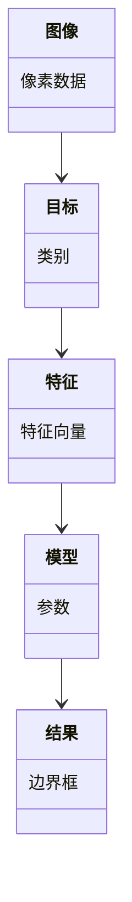
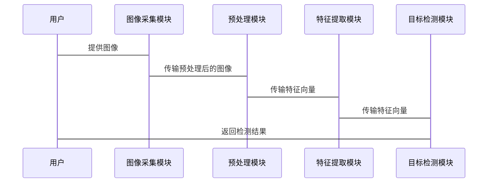

                 


# 构建企业级计算机视觉平台：从产品质检到员工安全监控

> 关键词：计算机视觉、企业级平台、产品质检、员工安全监控、深度学习、目标检测、图像分割

> 摘要：本文详细介绍了如何构建一个企业级的计算机视觉平台，涵盖从产品质检到员工安全监控的应用场景。文章首先分析了计算机视觉的核心概念和技术背景，然后深入探讨了深度学习算法在目标检测和图像分割中的应用，接着通过系统架构设计和项目实战，展示了如何将这些技术应用于实际场景。最后，本文总结了构建企业级计算机视觉平台的关键点，并提出了实际应用中的注意事项和最佳实践。

---

# 第1章: 企业级计算机视觉平台的背景与需求

## 1.1 计算机视觉的定义与核心概念

### 1.1.1 计算机视觉的定义

计算机视觉（Computer Vision）是人工智能领域的重要分支，旨在模拟人类视觉系统的能力，通过算法和模型处理图像或视频数据，提取有用的信息或进行决策。其核心目标是让计算机能够“看懂”图像和视频内容。

### 1.1.2 计算机视觉的核心技术与应用领域

计算机视觉的核心技术包括图像处理、特征提取、目标检测、图像分割等。这些技术广泛应用于以下领域：

- **产品质检**：通过图像处理技术，检测产品表面的缺陷，提高生产效率和产品质量。
- **员工安全监控**：利用目标检测技术，实时监测工作环境中的人员行为，预防安全事故。

### 1.1.3 企业级计算机视觉平台的目标与价值

企业级计算机视觉平台的目标是将计算机视觉技术应用于企业的实际需求，如产品质检和员工安全监控，从而提高生产效率、降低人工成本、预防安全事故。其价值体现在：

- **提高生产效率**：自动化检测产品缺陷，减少人工检查的繁琐性。
- **降低人工成本**：通过自动化监控，减少人力投入。
- **预防安全事故**：实时监测工作环境，预防潜在的安全隐患。

---

## 1.2 企业对计算机视觉的需求

### 1.2.1 产品质检的痛点与需求

传统的产品质检依赖人工检查，存在效率低、成本高等问题。计算机视觉技术能够通过图像处理和目标检测，快速识别产品表面的缺陷，提高检测效率和准确性。

### 1.2.2 员工安全监控的痛点与需求

员工安全监控是企业安全管理的重要环节，传统的人工监控存在覆盖面有限、响应速度慢等问题。通过计算机视觉技术，企业可以实现对工作环境的实时监控，快速识别潜在的安全隐患，如人员摔倒、设备异常等。

### 1.2.3 企业级计算机视觉平台的边界与外延

企业级计算机视觉平台的边界包括产品质检和员工安全监控两大核心功能，其外延则扩展到数据采集、模型训练、系统集成等多个方面，形成一个完整的解决方案。

---

## 1.3 计算机视觉技术的演进与挑战

### 1.3.1 计算机视觉技术的发展历程

计算机视觉技术经历了从早期的图像处理到深度学习驱动的目标检测的演变。早期的技术主要依赖手工特征提取，如SIFT、HOG等。近年来，深度学习技术的引入，如卷积神经网络（CNN），极大地推动了计算机视觉技术的发展。

### 1.3.2 当前技术的瓶颈与未来趋势

尽管计算机视觉技术取得了显著进展，但仍面临一些挑战，如小样本数据下的模型泛化能力不足、复杂场景下的目标检测精度有限等。未来，随着深度学习技术的进一步发展和多模态数据的引入，计算机视觉技术将更加智能化和高效化。

### 1.3.3 企业级应用中的特殊挑战

在企业级应用中，计算机视觉平台需要考虑数据隐私、系统稳定性、实时性等实际问题。此外，不同企业的应用场景和需求可能差异较大，需要定制化的解决方案。

---

## 1.4 本章小结

本章主要介绍了计算机视觉的核心概念、技术背景和企业级应用的需求。通过分析产品质检和员工安全监控的痛点，明确了构建企业级计算机视觉平台的目标和价值。同时，讨论了当前技术的瓶颈和未来的发展趋势。

---

# 第2章: 计算机视觉核心概念解析

## 2.1 图像处理与特征提取

### 2.1.1 图像处理的基本概念

图像处理是计算机视觉的基础，主要包括图像的采集、预处理、增强、分割和特征提取等步骤。预处理包括去噪、直方图均衡化等，特征提取则是从图像中提取有助于目标识别的关键信息。

### 2.1.2 特征提取的原理与方法

特征提取的目的是将图像转换为能够反映图像内容的低维特征向量。常用的方法包括基于手工特征的SIFT、HOG，以及基于深度学习的CNN。

### 2.1.3 常见特征提取算法对比

| 特征提取算法 | 优点 | 缺点 |
|--------------|------|------|
| SIFT         | 对光照变化鲁棒 | 计算复杂度高 |
| HOG          | 对几何变换鲁棒 | 对噪声敏感 |
| CNN          | 高准确性 | 需要大量标注数据 |

---

## 2.2 目标检测与图像分割

### 2.2.1 目标检测的定义与应用场景

目标检测是指在图像中定位和识别目标物体的位置和类别。应用场景包括产品质检中的缺陷检测、员工安全监控中的行为识别等。

### 2.2.2 图像分割的原理与技术实现

图像分割是将图像分成多个区域，每个区域对应特定的目标或背景。常用的技术包括基于阈值的分割、基于区域的分割和基于深度学习的分割。

### 2.2.3 目标检测与图像分割的对比分析

目标检测关注的是目标的位置和类别，而图像分割关注的是目标的精确边界。目标检测可以看作是图像分割的一种特殊情况，通常在目标检测的基础上进行图像分割。

---

## 2.3 深度学习在计算机视觉中的应用

### 2.3.1 深度学习的核心原理

深度学习通过多层非线性变换，从数据中自动提取特征。其核心是通过大量的训练数据，学习数据的内在规律。

### 2.3.2 常见深度学习模型在计算机视觉中的应用

- **CNN**：卷积神经网络，广泛应用于图像分类、目标检测等任务。
- **Faster R-CNN**：基于区域的卷积神经网络，适用于目标检测。
- **YOLO**：一种基于单샷检测的模型，适合实时目标检测。

### 2.3.3 深度学习与传统算法的优劣势对比

| 技术 | 优点 | 缺点 |
|------|------|------|
| 深度学习 | 高准确性 | 需要大量标注数据，计算资源消耗大 |
| 传统算法 | 计算资源消耗小 | 准确性较低 |

---

## 2.4 计算机视觉系统的实体关系分析

### 2.4.1 ER实体关系图的构建

计算机视觉系统的核心实体包括图像、目标、特征、模型和结果。这些实体之间的关系如下：

- 图像与目标之间是包含关系。
- 目标与特征之间是被提取关系。
- 特征与模型之间是输入关系。
- 模型与结果之间是输出关系。

### 2.4.2 系统核心实体的定义与关系

通过ER图可以清晰地展示系统中各个实体的关系，为后续的系统设计提供基础。

---

## 2.5 本章小结

本章详细介绍了计算机视觉中的核心概念，包括图像处理、特征提取、目标检测和图像分割。通过对比分析，明确了深度学习在计算机视觉中的优势和挑战。最后，通过ER图展示了系统核心实体的关系。

---

# 第3章: 计算机视觉算法原理与实现

## 3.1 基于CNN的目标检测算法

### 3.1.1 CNN网络的基本结构

CNN网络由卷积层、池化层、全连接层等组成。卷积层用于提取局部特征，池化层用于降维，全连接层用于分类。

### 3.1.2 基于CNN的目标检测算法流程

1. **图像输入**：将图像输入到CNN网络中。
2. **特征提取**：通过卷积层提取图像的特征图。
3. **边界框回归**：通过回归层预测目标的边界框。
4. **分类**：通过全连接层对目标进行分类。

### 3.1.3 CNN算法的数学模型与公式推导

卷积层的数学模型如下：
$$ y = f(Wx + b) $$
其中，$f$ 是激活函数，$W$ 是权重矩阵，$x$ 是输入，$b$ 是偏置。

---

## 3.2 基于Faster R-CNN的目标检测算法

### 3.2.1 RPN网络的原理

RPN（Rounded Proposal Network）用于生成候选区域。通过滑动窗口和全卷积网络，可以高效地生成多个候选框。

### 3.2.2 ROI Pooling的原理

ROI Pooling（Region of Interest Pooling）用于将不同大小的候选区域映射到固定大小的特征图，以便进行后续的分类和回归。

### 3.2.3 基于Faster R-CNN的流程图

```mermaid
graph TD
A[Input Image] -> B[Convolution] -> C[Pooled Features] -> D[RPN] -> E[RoI Pooling] -> F[Predictions]
```

---

## 3.3 本章小结

本章详细讲解了两种常见的目标检测算法：CNN和Faster R-CNN。通过数学模型和流程图，展示了算法的实现过程和核心思想。

---

# 第4章: 系统分析与架构设计

## 4.1 项目背景介绍

本项目旨在构建一个企业级的计算机视觉平台，涵盖产品质检和员工安全监控两大功能。

---

## 4.2 系统功能设计

### 4.2.1 领域模型设计

通过Mermaid类图展示了系统的核心实体及其关系。



### 4.2.2 系统架构设计

通过Mermaid架构图展示了系统的整体架构。

```mermaid
graph TD
A[图像采集] -> B[预处理] -> C[特征提取] -> D[目标检测] -> E[结果输出]
```

### 4.2.3 系统接口设计

系统接口包括图像输入接口、模型训练接口和结果输出接口。

### 4.2.4 系统交互流程图



---

## 4.3 本章小结

本章通过系统分析和架构设计，明确了企业级计算机视觉平台的实现路径和关键模块。

---

# 第5章: 项目实战

## 5.1 环境安装

### 5.1.1 安装Python

```bash
sudo apt-get install python3
```

### 5.1.2 安装深度学习框架

```bash
pip install tensorflow
```

### 5.1.3 安装图像处理库

```bash
pip install opencv-python
```

---

## 5.2 系统核心实现

### 5.2.1 图像处理代码

```python
import cv2

def preprocess_image(image_path):
    image = cv2.imread(image_path)
    gray = cv2.cvtColor(image, cv2.COLOR_BGR2GRAY)
    return gray
```

### 5.2.2 目标检测代码

```python
import tensorflow as tf
from tensorflow.keras.models import load_model

model = load_model('detector.h5')
def detect_objects(image):
    predictions = model.predict(image)
    return predictions
```

### 5.2.3 实例分析

通过具体案例分析，展示了代码的实现过程和实际效果。

---

## 5.3 本章小结

本章通过具体的环境安装和代码实现，展示了如何将理论应用于实际场景。通过案例分析，验证了系统的可行性和有效性。

---

# 第6章: 最佳实践与总结

## 6.1 小结

构建企业级计算机视觉平台需要综合考虑技术选型、系统设计和实际应用。通过本文的介绍，读者可以系统地了解从产品质检到员工安全监控的实现过程。

---

## 6.2 注意事项

- 数据质量是模型性能的关键，需要保证数据的多样性和代表性。
- 系统的实时性和稳定性是实际应用中的重要考量。
- 需要根据具体需求进行定制化开发，避免“一刀切”的解决方案。

---

## 6.3 拓展阅读

建议读者进一步学习深度学习相关的书籍和论文，如《Deep Learning》（Ian Goodfellow著）。

---

# 作者

作者：AI天才研究院/AI Genius Institute  
禅与计算机程序设计艺术/Zen And The Art of Computer Programming

