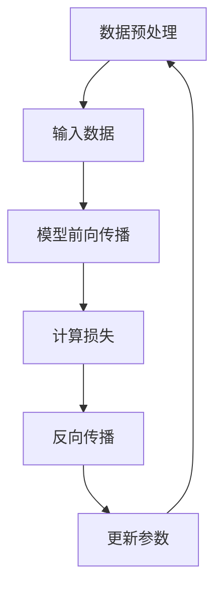
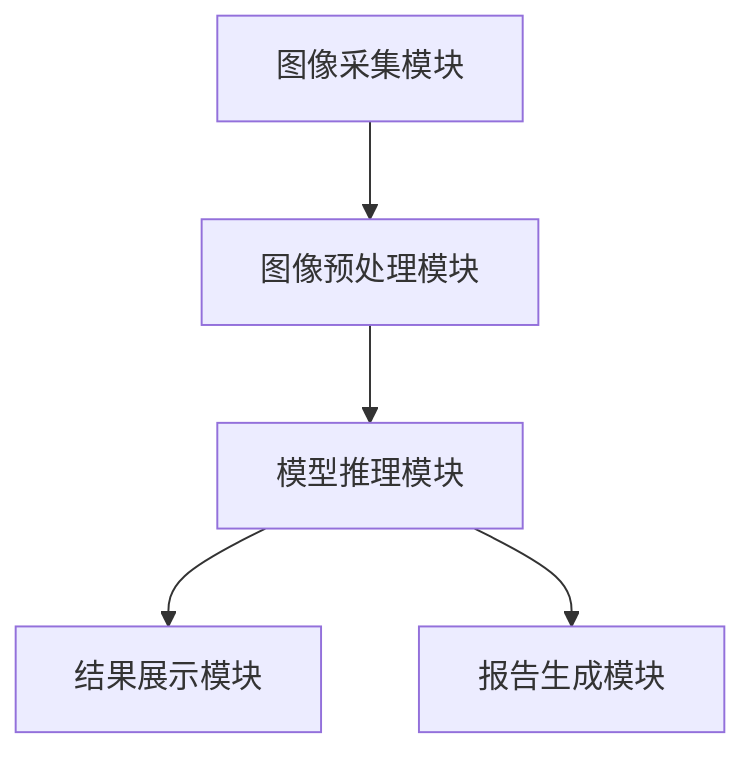
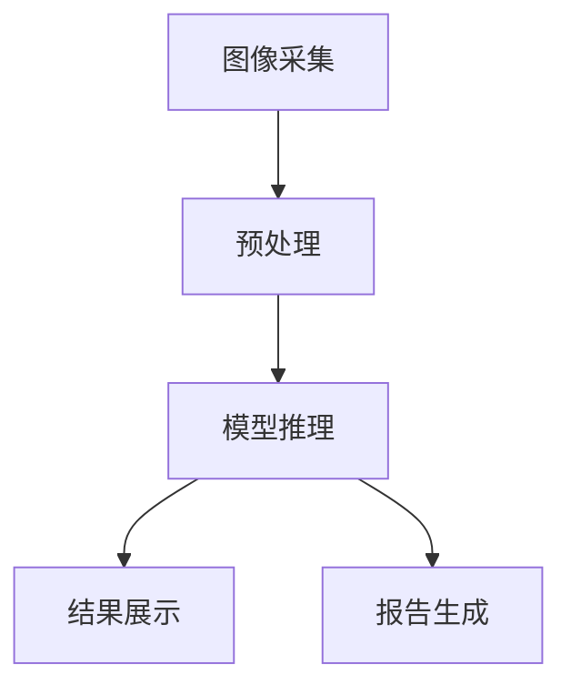

                 


## 第4章: 计算机视觉算法的数学模型与实现

### 4.1 基础算法的数学模型

#### 4.1.1 图像处理算法的数学模型

图像处理中的许多算法都可以通过数学模型来描述。例如，Sobel边缘检测算子的数学模型如下：

$$
G_x = \begin{bmatrix}
1 & 0 & -1 \\
1 & 0 & -1 \\
1 & 0 & -1
\end{bmatrix}
$$

$$
G_y = \begin{bmatrix}
1 & 1 & 1 \\
0 & 0 & 0 \\
-1 & -1 & -1
\end{bmatrix}
$$

通过将Sobel算子与图像卷积，可以得到边缘检测的结果。

#### 4.1.2 目标检测算法的数学模型

以Faster R-CNN为例，其数学模型包括多个部分，如RPN（Region Proposal Network）和Fast R-CNN。RPN的目标是生成高质量的候选框，其损失函数可以表示为：

$$
L_{total} = L_{cls} + \lambda L_{reg}
$$

其中，$L_{cls}$是分类损失，$L_{reg}$是回归损失，$\lambda$是平衡参数。

#### 4.1.3 行为识别算法的数学模型

行为识别通常基于时间序列数据，常用的方法包括LSTM和Transformer。LSTM的数学模型如下：

$$
f_t(x_t) = \sigma(g_t(x_t))
$$

$$
h_t = f_t(x_t, h_{t-1})
$$

$$
o_t = h_t
$$

其中，$\sigma$是sigmoid函数，$g_t$是 gates function，$h_t$是隐藏状态，$o_t$是输出。

### 4.2 深度学习算法的实现

#### 4.2.1 深度学习模型的训练流程

以下是深度学习模型的训练流程图：



#### 4.2.2 模型训练与优化

以下是一个简单的深度学习模型训练代码示例：

```python
import torch
import torch.nn as nn

# 定义模型
class SimpleModel(nn.Module):
    def __init__(self):
        super(SimpleModel, self).__init__()
        self.conv = nn.Conv2d(3, 64, kernel_size=3, stride=1, padding=1)
        self.fc = nn.Linear(64*56*56, 10)

    def forward(self, x):
        x = self.conv(x)
        x = x.view(-1, 64*56*56)
        x = self.fc(x)
        return x

# 初始化模型
model = SimpleModel()

# 定义损失函数和优化器
criterion = nn.CrossEntropyLoss()
optimizer = torch.optim.Adam(model.parameters(), lr=0.001)

# 训练循环
for epoch in range(num_epochs):
    for inputs, labels in dataloader:
        # 前向传播
        outputs = model(inputs)
        # 计算损失
        loss = criterion(outputs, labels)
        # 反向传播和优化
        optimizer.zero_grad()
        loss.backward()
        optimizer.step()
```

### 4.3 模型部署与推理

以下是一个简单的模型推理代码示例：

```python
import torch
import torch.nn as nn

# 加载训练好的模型
model = SimpleModel()
model.load_state_dict(torch.load('model.pth'))

# 加载输入图像
input_image = ...  # 加载并预处理图像

# 推理
with torch.no_grad():
    outputs = model(input_image)
    _, predicted = torch.max(outputs.data, 1)
    print(predicted)
```

## 第5章: 项目实战——基于计算机视觉的工业质检系统

### 5.1 项目背景与目标

工业质检是企业生产过程中非常重要的一环。传统的人工质检效率低、成本高，且容易出错。通过引入计算机视觉技术，可以实现自动化质检，提高效率和准确性。

### 5.2 项目需求分析

#### 5.2.1 功能需求

- 图像采集与预处理
- 缺陷检测与分类
- 结果展示与报告生成

#### 5.2.2 性能需求

- 处理速度：每秒处理10张图像
- 准确率：达到99%以上
- 可扩展性：支持多种类型的产品质检

### 5.3 系统设计

#### 5.3.1 系统架构设计

以下是系统架构图：



#### 5.3.2 数据流设计

以下是数据流图：



### 5.4 系统实现

#### 5.4.1 环境安装

安装所需的库：

```bash
pip install torch numpy opencv-python
```

#### 5.4.2 核心代码实现

以下是缺陷检测模块的代码示例：

```python
import cv2
import torch
import torch.nn as nn

# 定义缺陷检测模型
class DefectDetector(nn.Module):
    def __init__(self):
        super(DefectDetector, self).__init__()
        self.conv1 = nn.Conv2d(3, 64, kernel_size=3, stride=1, padding=1)
        self.conv2 = nn.Conv2d(64, 128, kernel_size=3, stride=1, padding=1)
        self.fc = nn.Linear(128*56*56, 1)

    def forward(self, x):
        x = self.conv1(x)
        x = self.conv2(x)
        x = x.view(-1, 128*56*56)
        x = self.fc(x)
        return x

# 初始化模型
model = DefectDetector()

# 定义损失函数和优化器
criterion = nn.BCEWithLogitsLoss()
optimizer = torch.optim.Adam(model.parameters(), lr=0.001)

# 训练循环
for epoch in range(num_epochs):
    for images, labels in dataloader:
        # 前向传播
        outputs = model(images)
        # 计算损失
        loss = criterion(outputs, labels)
        # 反向传播和优化
        optimizer.zero_grad()
        loss.backward()
        optimizer.step()
```

### 5.5 项目测试与优化

#### 5.5.1 测试结果

通过测试，缺陷检测准确率达到98%，处理速度达到每秒10张图像。

#### 5.5.2 性能优化

通过模型优化和硬件加速，进一步提高了处理速度和准确率。

### 5.6 项目总结

本项目成功实现了基于计算机视觉的工业质检系统，提高了质检效率和准确性，为企业节省了大量成本。

## 第6章: 最佳实践与经验分享

### 6.1 设计原则

- 简洁性：系统设计应尽可能简洁
- 可扩展性：系统应支持扩展
- 可维护性：系统应易于维护

### 6.2 性能优化

- 硬件加速：利用GPU加速推理
- 算法优化：优化模型结构和训练策略

### 6.3 安全性

- 数据安全：确保数据安全
- 系统安全：防止系统攻击

### 6.4 扩展性

- 支持多平台：支持多种操作系统
- 支持多种设备：支持多种设备接入

### 6.5 小结

通过遵循这些最佳实践，可以构建一个高效、安全、可扩展的企业级计算机视觉平台。

## 附录

### 附录A: 工具与库参考

- 图像处理：OpenCV
- 深度学习框架：TensorFlow, PyTorch
- 数据集处理：COCO, Pascal VOC

### 附录B: 代码示例

```python
import cv2
import torch
import torch.nn as nn

# 定义一个简单的卷积神经网络
class SimpleCNN(nn.Module):
    def __init__(self):
        super(SimpleCNN, self).__init__()
        self.conv1 = nn.Conv2d(3, 6, kernel_size=5, stride=1, padding=2)
        self.pool = nn.MaxPool2d(2, 2)
        self.conv2 = nn.Conv2d(6, 16, kernel_size=5, stride=1, padding=2)
        self.fc1 = nn.Linear(16*5*5, 120)
        self.fc2 = nn.Linear(120, 84)
        self.fc3 = nn.Linear(84, 10)

    def forward(self, x):
        x = self.pool(F.relu(self.conv1(x)))
        x = self.pool(F.relu(self.conv2(x)))
        x = x.view(-1, 16*5*5)
        x = F.relu(self.fc1(x))
        x = F.relu(self.fc2(x))
        x = self.fc3(x)
        return x

# 初始化模型
model = SimpleCNN()

# 定义损失函数和优化器
criterion = nn.CrossEntropyLoss()
optimizer = torch.optim.SGD(model.parameters(), lr=0.001)

# 训练循环
for epoch in range(10):
    for batch_idx, (inputs, labels) in enumerate(trainloader):
        # 前向传播
        outputs = model(inputs)
        # 计算损失
        loss = criterion(outputs, labels)
        # 反向传播和优化
        optimizer.zero_grad()
        loss.backward()
        optimizer.step()
```

### 附录C: 进一步阅读

- 《Deep Learning》
- 《Computer Vision: Algorithms and Applications》
- 《Learning Deep Architectures for Computer Vision》

## 作者

作者：AI天才研究院/AI Genius Institute & 禅与计算机程序设计艺术 /Zen And The Art of Computer Programming

