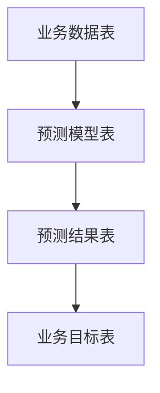
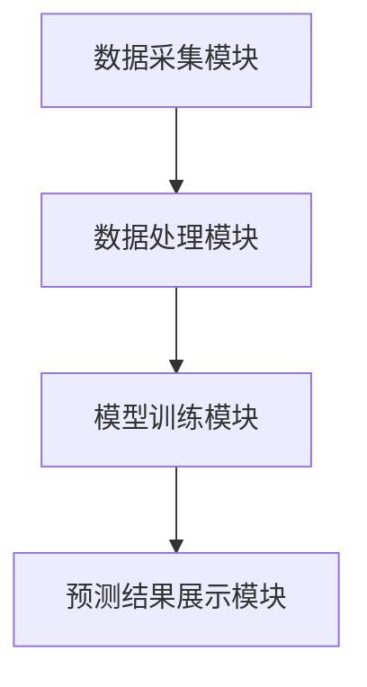

                 


# 构建企业级预测性分析平台：多维度业务预测

> 关键词：企业级预测性分析、机器学习、业务预测、数据分析、预测模型

> 摘要：本文将详细探讨如何构建一个企业级预测性分析平台，涵盖从数据准备到模型部署的完整流程。通过多维度业务预测，企业可以更高效地进行决策和优化业务流程。本文将从背景介绍、核心概念、算法原理、系统架构设计到项目实战进行全面解析。

---

# 第一部分：企业级预测性分析平台的背景与核心概念

## 第1章：预测性分析平台的背景与问题背景

### 1.1 预测性分析平台的背景
#### 1.1.1 数据驱动决策的时代背景
在当今数据驱动的商业环境中，企业通过分析海量数据来优化决策流程已成为趋势。预测性分析（Predictive Analytics）作为数据科学的重要分支，帮助企业提前预判市场趋势、客户行为和业务风险。

#### 1.1.2 企业级预测性分析的定义与目标
企业级预测性分析是指利用机器学习算法和大数据技术，对企业内部和外部数据进行建模和分析，以预测未来业务表现和潜在风险。其目标是通过数据驱动的洞察，支持企业更高效地进行决策。

#### 1.1.3 预测性分析平台的业务价值
- 提高决策效率
- 降低业务风险
- 优化资源配置
- 提升客户满意度

### 1.2 问题背景与问题描述
#### 1.2.1 传统业务决策的局限性
传统业务决策依赖于经验和直觉，存在主观性强、效率低、准确性差等问题。

#### 1.2.2 数据驱动决策的必要性
随着数据量的爆炸式增长，企业需要通过数据驱动的方法来提高决策的科学性和准确性。

#### 1.2.3 预测性分析平台的核心问题
- 如何高效处理多维度数据？
- 如何选择合适的预测模型？
- 如何保证预测结果的准确性？

### 1.3 问题解决与边界定义
#### 1.3.1 预测性分析平台的解决方案
通过构建一个集成化的预测性分析平台，整合企业内外部数据，利用机器学习算法进行建模和预测。

#### 1.3.2 平台的边界与外延
- 数据范围：包括结构化和非结构化数据
- 预测范围：涵盖多个业务领域
- 应用场景：支持实时预测和历史分析

#### 1.3.3 核心要素与组成结构
- 数据采集模块
- 数据处理模块
- 模型训练模块
- 预测结果展示模块

### 1.4 本章小结
本章介绍了企业级预测性分析平台的背景、核心概念和问题背景，为后续章节奠定了基础。

---

## 第2章：预测性分析的核心概念与联系

### 2.1 核心概念原理
#### 2.1.1 数据特征与业务目标的关系
数据特征是预测模型的输入，业务目标是模型的输出。通过分析数据特征与业务目标的关系，可以找到影响业务结果的关键因素。

#### 2.1.2 预测模型的输入输出机制
输入：特征数据；输出：预测结果。模型通过学习输入与输出之间的关系，实现对未来的预测。

#### 2.1.3 预测性分析的数学模型基础
预测性分析基于统计学和机器学习算法，通过数学模型描述数据之间的关系。

### 2.2 核心概念属性对比
#### 2.2.1 不同预测模型的特征对比
- 线性回归：简单但假设关系线性
- 随机森林：非线性，适合高维数据
- 神经网络：深度学习，适合复杂场景

#### 2.2.2 数据特征与模型性能的关联性
特征的维度、相关性、稀疏性等都会影响模型的性能。

#### 2.2.3 业务目标与预测结果的映射关系
业务目标决定了预测的范围和粒度，预测结果需要与业务目标保持一致。

### 2.3 ER实体关系图架构


### 2.4 本章小结
本章通过核心概念的对比和实体关系图，展示了预测性分析平台的架构和数据流。

---

## 第3章：数据处理与特征工程

### 3.1 数据处理基础
#### 3.1.1 数据清洗与预处理
- 删除重复数据
- 填补缺失值
- 标准化和归一化

#### 3.1.2 数据分割与样本平衡
- 训练集、验证集、测试集的划分
- 解决类别不平衡问题

### 3.2 特征工程的核心原理
#### 3.2.1 特征选择与特征提取
- 基于统计的特征选择（如卡方检验）
- 基于模型的特征选择（如Lasso回归）

#### 3.2.2 特征组合与特征变换
- 特征交叉
- 稀疏化处理

#### 3.2.3 高维数据的降维方法
- 主成分分析（PCA）
- 线性判别分析（LDA）

### 3.3 数据特征的业务关联性分析
#### 3.3.1 业务特征的识别与筛选
- 根据业务需求选择相关特征
- 通过相关性分析筛选重要特征

#### 3.3.2 特征与业务目标的相关性分析
- 计算特征与目标变量的相关系数
- 可视化特征重要性

### 3.4 本章小结
本章详细介绍了数据处理和特征工程的关键步骤，为后续模型训练奠定了基础。

---

## 第4章：预测模型训练与评估

### 4.1 线性回归模型
#### 4.1.1 线性回归的数学模型
$$ y = \beta_0 + \beta_1x_1 + \beta_2x_2 + \ldots + \beta_nx_n + \epsilon $$

#### 4.1.2 最小二乘法的原理与实现
通过最小化预测值与实际值的平方差之和，求解回归系数。

#### 4.1.3 线性回归的优缺点与适用场景
优点：简单易懂，计算高效；缺点：假设变量间线性关系。

### 4.2 随机森林模型
#### 4.2.1 随机森林的原理与工作机制
- 基于决策树的集成学习方法
- 通过投票或加权的方式得出最终结果

#### 4.2.2 随机森林的超参数调优
- 树的数量（n_estimators）
- 树的深度（max_depth）

#### 4.2.3 随机森林的业务场景应用
适合处理高维数据和非线性关系。

### 4.3 神经网络模型
#### 4.3.1 神经网络的基本结构与原理
- 输入层、隐藏层、输出层
- 激活函数（如ReLU、sigmoid）

#### 4.3.2 深度学习模型的训练与优化
- 反向传播算法
- 梯度下降优化

#### 4.3.3 神经网络模型的业务应用案例
- 时间序列预测
- 图像识别

### 4.4 模型评估与选择
#### 4.4.1 模型评估指标的计算与对比
- 均方误差（MSE）
- 准确率（Accuracy）
- F1分数（F1 Score）

#### 4.4.2 模型选择的策略与方法
- 交叉验证
-ROC曲线分析

#### 4.4.3 模型性能优化的实践技巧
- 调整超参数
- 模型融合

### 4.5 本章小结
本章详细介绍了几种主流预测模型的原理和应用，并探讨了模型评估与优化的方法。

---

## 第5章：系统架构与部署方案

### 5.1 系统架构设计
#### 5.1.1 系统功能模块划分
- 数据采集模块
- 数据处理模块
- 模型训练模块
- 预测结果展示模块

#### 5.1.2 系统架构图


#### 5.1.3 关键技术点
- 高可用性设计
- 可扩展性设计

### 5.2 部署方案
#### 5.2.1 环境搭建与配置
- 选择云平台（如AWS、Azure）
- 安装必要的软件（如Python、TensorFlow）

#### 5.2.2 模型部署与监控
- 使用容器化技术（Docker）
- 实时监控模型性能

#### 5.2.3 接口设计与调用
- RESTful API设计
- API文档编写

### 5.3 本章小结
本章介绍了系统架构设计和部署方案，强调了高可用性和可扩展性的重要性。

---

## 第6章：项目实战与最佳实践

### 6.1 环境安装与配置
#### 6.1.1 安装Python和必要的库
- Python 3.8+
- NumPy、Pandas、Scikit-learn、TensorFlow

#### 6.1.2 安装Jupyter Notebook
- 用于数据探索和模型训练

### 6.2 系统核心实现源代码
#### 6.2.1 数据处理代码
```python
import pandas as pd
from sklearn.model_selection import train_test_split
from sklearn.preprocessing import StandardScaler

# 加载数据
data = pd.read_csv('data.csv')
# 分割特征与目标
X = data.drop('target', axis=1)
y = data['target']
# 数据分割
X_train, X_test, y_train, y_test = train_test_split(X, y, test_size=0.2)
# 标准化处理
scaler = StandardScaler()
X_train = scaler.fit_transform(X_train)
X_test = scaler.transform(X_test)
```

#### 6.2.2 模型训练代码
```python
from sklearn.ensemble import RandomForestRegressor
from sklearn.metrics import mean_squared_error

# 初始化模型
model = RandomForestRegressor(n_estimators=100, max_depth=10)
# 训练模型
model.fit(X_train, y_train)
# 预测结果
y_pred = model.predict(X_test)
# 评估指标
mse = mean_squared_error(y_test, y_pred)
print(f'Mean Squared Error: {mse}')
```

### 6.3 实际案例分析与解读
#### 6.3.1 案例背景
假设目标是预测客户 churn 率。

#### 6.3.2 数据探索与特征工程
- 可视化特征分布
- 识别重要特征

#### 6.3.3 模型选择与优化
- 对比不同模型的性能
- 调整超参数提升准确率

### 6.4 本章小结
通过实际案例分析，展示了如何在企业级预测性分析平台中应用所学知识。

---

## 第7章：总结与展望

### 7.1 本章总结
- 构建企业级预测性分析平台的关键步骤
- 各个模块的核心技术和实现方法

### 7.2 未来展望
- 更加智能化的模型（如强化学习）
- 多模态数据的融合
- 自动化机器学习（AutoML）

### 7.3 最佳实践 Tips
- 数据质量是模型性能的基础
- 模型部署要考虑实时性和可扩展性
- 定期监控和更新模型

### 7.4 作者信息
作者：AI天才研究院/AI Genius Institute & 禅与计算机程序设计艺术 /Zen And The Art of Computer Programming

---

以上是《构建企业级预测性分析平台：多维度业务预测》的完整目录大纲，每个章节均详细展开，涵盖了从理论到实践的各个方面，确保读者能够系统地掌握企业级预测性分析平台的构建方法。

