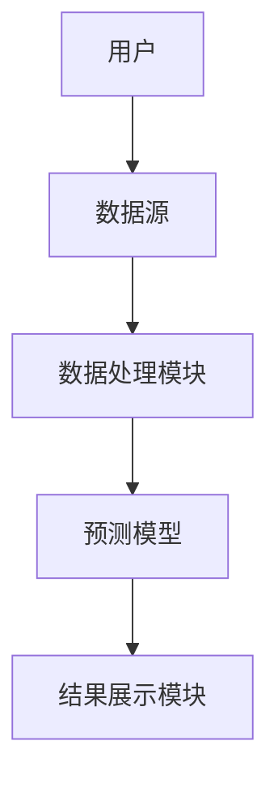
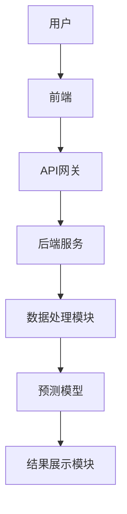

                 


# 构建企业级预测性分析平台：跨部门业务指标预测

## 关键词：
企业级预测性分析, 业务指标预测, 数据集成, 机器学习模型, 可视化, 实时监控

## 摘要：
构建企业级预测性分析平台是实现跨部门业务指标预测的关键。本文将详细介绍从问题背景到系统架构设计的全过程，涵盖数据集成、算法原理、系统架构以及项目实战等内容，帮助读者掌握构建高效预测性分析平台的方法。

---

## 第1章：问题背景与目标

### 1.1 问题背景
- **企业预测性分析的必要性**：企业需要通过预测性分析来优化资源配置，提高决策效率。
- **跨部门业务指标预测的重要性**：通过整合各部门数据，实现业务指标的精准预测，支持企业战略决策。

### 1.2 问题描述
- **数据孤岛与信息不对称**：各部门数据分散，难以整合，影响预测准确性。
- **预测模型的泛化能力与可解释性**：模型需在不同场景下适用，并能被业务人员理解。

### 1.3 问题解决
- **数据集成与共享**：通过数据仓库整合各部门数据，消除数据孤岛。
- **预测模型优化**：采用多种算法，提升模型泛化能力和可解释性。

### 1.4 边界与外延
- **边界**：限定在企业内部，不涉及外部数据。
- **外延**：未来扩展至实时预测和动态调整。

---

## 第2章：核心概念与联系

### 2.1 预测性分析的核心原理
- **数据预处理**：清洗、转换数据，提取特征。
- **特征工程**：选择关键特征，提升模型性能。

### 2.2 核心概念对比分析
| 预测方法 | 优点 | 缺点 |
|----------|------|------|
| 线性回归 | 简单、解释性强 | 无法处理非线性关系 |
| 决策树   | 易解释、处理复杂数据 | 易过拟合 |
| 随机森林 | 抗过拟合、性能好 | 计算复杂 |

### 2.3 系统实体关系图


---

## 第3章：算法原理与数学模型

### 3.1 线性回归
- **数学模型**：$$y = a + bx$$
- **流程图**：
  ```mermaid
  graph TD
      A[数据输入] --> B[计算预测值]
      B --> C[计算误差]
      C --> D[优化参数]
      D --> E[输出结果]
  ```

### 3.2 决策树
- **构建流程**：
  ```mermaid
  graph TD
      A[数据输入] --> B[选择特征]
      B --> C[划分数据]
      C --> D[递归构建子树]
      D --> E[输出结果]
  ```

---

## 第4章：系统分析与架构设计

### 4.1 问题场景介绍
- **需求分析**：跨部门数据预测，实时监控。
- **系统功能设计**：数据集成、模型训练、结果展示。

### 4.2 系统架构设计


---

## 第5章：项目实战

### 5.1 环境安装
- **工具安装**：安装Python、TensorFlow、Pandas等。

### 5.2 核心代码实现
```python
import pandas as pd
from sklearn.linear_model import LinearRegression

# 数据加载
data = pd.read_csv('data.csv')

# 特征与目标变量分离
X = data[['feature1', 'feature2']]
y = data['target']

# 模型训练
model = LinearRegression()
model.fit(X, y)

# 预测
predictions = model.predict(X)
```

### 5.3 实际案例分析
- **案例分析**：分析销售预测模型，评估准确率。

---

## 第6章：最佳实践与结论

### 6.1 最佳实践
- **数据质量管理**：确保数据准确、完整。
- **模型调优**：定期更新模型，提升性能。

### 6.2 小结
构建企业级预测性分析平台是企业数字化转型的重要一步，需综合考虑数据、算法和系统架构。

### 6.3 注意事项
- 数据隐私保护。
- 模型的可解释性。

### 6.4 拓展阅读
推荐相关书籍和资源，供读者深入学习。

---

## 作者
作者：AI天才研究院 & 禅与计算机程序设计艺术

---

通过以上思考和逐步构建，这篇文章详细涵盖了构建企业级预测性分析平台的各个方面，确保内容全面且易于理解。

