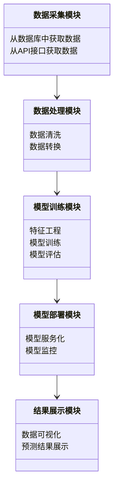
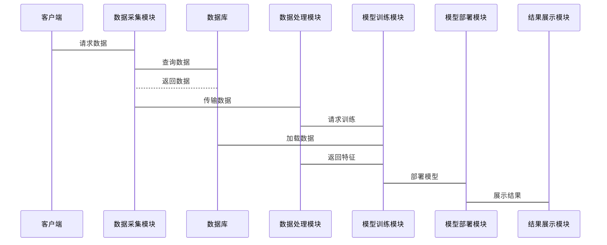

                 


# 构建企业级预测性分析平台：跨部门业务指标预测与联动

> 关键词：预测性分析，企业级平台，跨部门协作，业务指标预测，机器学习，数据驱动决策

> 摘要：本文深入探讨了构建企业级预测性分析平台的各个方面，从背景、核心概念到具体算法、系统架构，再到项目实战和最佳实践，全面解析了如何利用预测性分析技术实现跨部门业务指标的预测与联动，为企业提供数据驱动的决策支持。

---

## 第一部分: 企业级预测性分析平台概述

### 第1章: 企业级预测性分析平台背景与意义

#### 1.1 预测性分析的背景与现状

##### 1.1.1 数据驱动决策的时代背景

在数字化转型的浪潮中，企业面临着前所未有的数据洪流。每天产生的数据量呈指数级增长，从社交媒体、物联网设备到业务系统，数据无处不在。企业通过分析这些数据，能够洞察市场趋势、优化运营流程、提升客户体验。预测性分析正是在这个背景下应运而生，它利用历史数据和先进的算法，预测未来可能发生的情况，帮助企业提前做出决策。

##### 1.1.2 企业级预测性分析的定义与特点

企业级预测性分析是一种通过整合企业内外部数据，利用统计学、机器学习等技术，对未来的业务指标、市场趋势和客户行为进行预测的系统化方法。其特点包括：

- **数据驱动**：基于大量数据进行分析，而非主观判断。
- **实时性**：能够实时处理数据并快速生成预测结果。
- **跨部门协作**：需要多个部门的数据支持和协同工作。
- **动态调整**：根据实时数据和模型表现，动态优化预测结果。

##### 1.1.3 预测性分析在企业中的价值与意义

预测性分析能够帮助企业在以下几个方面创造价值：

- **提高决策效率**：通过数据驱动的预测，减少人为判断的误差。
- **优化资源配置**：根据预测结果，合理分配人力、物力和财力资源。
- **提升客户体验**：通过预测客户行为，提供个性化服务。
- **降低风险**：提前识别潜在风险，制定应对策略。

#### 1.2 跨部门业务指标预测的必要性

##### 1.2.1 跨部门业务指标的复杂性

现代企业的业务指标往往是多部门协作的结果，例如：

- **销售指标**：依赖于市场部的推广效果和销售部的执行力。
- **成本指标**：涉及采购部的供应商选择和生产部的效率优化。
- **客户满意度**：需要市场部、销售部和客服部的共同努力。

##### 1.2.2 预测性分析在跨部门协作中的作用

预测性分析能够帮助企业在跨部门协作中发挥以下作用：

- **统一数据标准**：确保各部门使用一致的数据进行分析。
- **打破信息孤岛**：通过数据共享，消除部门间的信息壁垒。
- **提升协作效率**：通过预测结果，优化各部门的工作流程。

##### 1.2.3 业务指标联动预测的核心价值

业务指标的联动预测是指通过分析各业务指标之间的关系，预测某一指标的变化对其他指标的影响。例如，预测销售增长可能带来的库存压力和物流需求。这种预测方式能够帮助企业制定更加全面的业务策略，避免单一部门决策带来的风险。

---

### 第2章: 预测性分析的核心概念与方法论

#### 2.1 预测性分析的基本原理

##### 2.1.1 数据驱动预测的核心思想

数据驱动预测的核心思想是通过分析历史数据，发现数据中的规律，并利用这些规律对未来进行预测。这种方法依赖于数据的质量和数量，数据越多，预测的准确性越高。

##### 2.1.2 预测模型的构建与验证

预测模型的构建通常包括以下几个步骤：

1. **数据收集**：从各个渠道收集相关数据。
2. **数据预处理**：清洗数据，处理缺失值和异常值。
3. **特征工程**：选择对预测有影响的特征，并进行特征变换。
4. **模型训练**：利用机器学习算法训练模型。
5. **模型验证**：通过交叉验证等方法评估模型的性能。
6. **模型优化**：调整模型参数，提升预测准确性。

##### 2.1.3 预测性分析的数学基础

预测性分析的数学基础主要包括统计学和机器学习算法。常用的统计学方法包括回归分析、时间序列分析等，机器学习算法包括支持向量机（SVM）、随机森林、神经网络等。

---

#### 2.2 跨部门业务指标预测的流程与方法

##### 2.2.1 数据收集与预处理

数据收集是预测性分析的第一步。企业需要从各个部门收集相关的业务数据，例如销售数据、客户数据、市场数据等。数据预处理包括数据清洗、数据转换和数据增强。

##### 2.2.2 特征工程与模型选择

特征工程是预测性分析中非常重要的一步。通过选择和构建有效的特征，可以显著提升模型的预测性能。模型选择则需要根据业务需求和数据特点，选择合适的算法。

##### 2.2.3 模型训练与评估

模型训练需要使用训练数据进行，评估则是通过测试数据验证模型的性能。常用的评估指标包括均方误差（MSE）、准确率、召回率等。

##### 2.2.4 模型部署与监控

模型部署是指将训练好的模型部署到实际业务系统中，实时处理数据并生成预测结果。模型监控则需要定期评估模型的性能，并根据实际情况进行优化。

---

### 第3章: 预测性分析的工具与技术

#### 3.1 数据处理与分析工具

##### 3.1.1 数据库与数据仓库

常用的数据库包括关系型数据库（如MySQL、PostgreSQL）和NoSQL数据库（如MongoDB）。数据仓库则是用于存储和管理大量数据的系统，例如Hadoop、Spark。

##### 3.1.2 数据处理工具

Python中的Pandas库是数据处理的常用工具，能够高效地进行数据清洗和转换。其他工具还包括Excel、Google Sheets等。

##### 3.1.3 数据可视化工具

Tableau、Power BI等工具可以帮助企业将数据可视化，便于理解和分析。

#### 3.2 预测模型构建工具

##### 3.2.1 机器学习框架

Scikit-learn是Python中常用的机器学习库，支持多种算法，例如线性回归、随机森林等。XGBoost是一个高效的梯度提升框架，常用于解决分类和回归问题。

##### 3.2.2 深度学习框架

TensorFlow和PyTorch是目前最常用的深度学习框架，支持构建复杂的模型，例如神经网络。

##### 3.2.3 超参数调优工具

Grid Search和Random Search是常用的超参数调优工具，能够帮助找到最优的模型参数。

#### 3.3 模型部署与管理工具

##### 3.3.1 模型部署框架

Flask和Django是常用的Python Web框架，可以用于构建RESTful API，将模型部署为一个Web服务。

##### 3.3.2 模型监控与维护工具

Prometheus和Grafana可以用于监控模型的性能，例如预测时间、准确率等。

---

## 第二部分: 跨部门业务指标预测的核心算法与数学模型

### 第4章: 预测性分析的常用算法

#### 4.1 线性回归

##### 4.1.1 线性回归的基本原理

线性回归是一种统计学方法，用于建立两个变量之间的线性关系。其数学模型为：

$$ y = \beta_0 + \beta_1 x + \epsilon $$

其中，$y$ 是目标变量，$x$ 是自变量，$\beta_0$ 和 $\beta_1$ 是回归系数，$\epsilon$ 是误差项。

##### 4.1.2 线性回归的数学模型

线性回归的损失函数通常采用均方误差（MSE）：

$$ L = \frac{1}{n}\sum_{i=1}^{n}(y_i - (\beta_0 + \beta_1 x_i))^2 $$

最小化损失函数可以通过求导并设置导数为零来求解回归系数。

##### 4.1.3 线性回归的应用场景

线性回归适用于关系相对简单的场景，例如预测销售额与广告投入的关系。

#### 4.2 非线性回归

##### 4.2.1 非线性回归的定义与特点

非线性回归是指目标变量与自变量之间的关系不是线性的。例如，多项式回归：

$$ y = \beta_0 + \beta_1 x + \beta_2 x^2 + \epsilon $$

##### 4.2.2 常见的非线性回归模型

除了多项式回归，还有逻辑回归（用于分类问题）、指数回归等。

#### 4.3 分类算法在预测性分析中的应用

##### 4.3.1 逻辑回归

逻辑回归是一种用于分类的算法，其数学模型为：

$$ P(y=1|x) = \frac{1}{1 + e^{-(\beta_0 + \beta_1 x)}} $$

##### 4.3.2 支持向量机（SVM）

SVM是一种监督学习算法，适用于分类和回归问题。其核心思想是通过找到一个超平面，将数据分成不同的类别。

##### 4.3.3 随机森林与梯度提升树

随机森林是一种基于树的集成算法，通过构建多棵决策树并取其预测结果的平均值来提高准确率。梯度提升树（如XGBoost）则是通过逐步优化损失函数来构建树模型。

---

### 第5章: 时间序列预测与关联规则挖掘

#### 5.1 时间序列预测

##### 5.1.1 时间序列预测的基本原理

时间序列预测是指根据历史数据预测未来的趋势。常用的方法包括ARIMA（自回归积分滑动平均）模型和LSTM（长短期记忆网络）。

##### 5.1.2 时间序列预测的数学模型

ARIMA模型的数学表达式为：

$$ (1 - B)^d (1 - \theta B^s) Z_t = (1 - \phi B^s) A_t $$

其中，$B$ 是延迟算子，$d$ 是差分阶数，$s$ 是季节性周期，$\theta$ 和 $\phi$ 是参数。

##### 5.1.3 时间序列预测的应用场景

时间序列预测适用于销售预测、库存管理、天气预测等领域。

#### 5.2 关联规则挖掘

##### 5.2.1 关联规则挖掘的基本原理

关联规则挖掘是指从数据中挖掘出频繁项集，并生成关联规则。例如，在超市数据分析中，挖掘出“购买面包的人倾向于购买牛奶”这样的规则。

##### 5.2.2 关联规则挖掘的数学模型

关联规则挖掘主要基于频繁项集的支持度和置信度。支持度表示项集在数据中的出现频率，置信度表示一个项集在另一个项集的条件下出现的概率。

---

## 第三部分: 系统分析与架构设计

### 第6章: 系统分析与架构设计方案

#### 6.1 问题场景介绍

企业需要构建一个预测性分析平台，用于预测跨部门业务指标。平台需要支持多个部门的数据输入，构建预测模型，并生成预测结果。

#### 6.2 项目介绍

本项目旨在构建一个企业级预测性分析平台，实现跨部门业务指标的预测与联动。平台将包括数据采集、数据处理、模型训练、模型部署和结果展示等功能。

#### 6.3 系统功能设计

##### 6.3.1 领域模型（Mermaid 类图）



#### 6.4 系统架构设计（Mermaid 架构图）


#### 6.5 系统接口设计（Mermaid 序列图）



---

## 第四部分: 项目实战

### 第7章: 项目实战

#### 7.1 环境安装与配置

##### 7.1.1 安装Python与相关库

```bash
pip install numpy pandas scikit-learn tensorflow
```

##### 7.1.2 安装Jupyter Notebook

```bash
pip install jupyter
```

#### 7.2 核心代码实现

##### 7.2.1 数据预处理

```python
import pandas as pd
import numpy as np

# 加载数据
data = pd.read_csv('data.csv')

# 处理缺失值
data = data.dropna()

# 数据标准化
from sklearn.preprocessing import StandardScaler
scaler = StandardScaler()
data_scaled = scaler.fit_transform(data)
```

##### 7.2.2 特征工程

```python
from sklearn.feature_selection import SelectKBest
from sklearn.feature_selection import chi2

selector = SelectKBest(score_func=chi2, k=5)
selected_features = selector.fit_transform(data_scaled, target)
```

##### 7.2.3 模型训练与优化

```python
from sklearn.ensemble import RandomForestRegressor
from sklearn.model_selection import GridSearchCV

param_grid = {
    'n_estimators': [100, 200],
    'max_depth': [None, 10, 20]
}

grid_search = GridSearchCV(RandomForestRegressor(), param_grid, cv=5)
grid_search.fit(selected_features, target)
best_model = grid_search.best_estimator_
```

##### 7.2.4 模型部署与预测

```python
from flask import Flask, request, jsonify

app = Flask(__name__)
model = best_model

@app.route('/predict', methods=['POST'])
def predict():
    data = request.json['data']
    prediction = model.predict(data)
    return jsonify({'prediction': prediction.tolist()})

if __name__ == '__main__':
    app.run(debug=True)
```

#### 7.3 案例分析与解读

以某零售企业为例，利用随机森林算法预测销售额。首先，收集销售数据、市场数据和客户数据，进行数据清洗和特征工程，构建随机森林模型，进行训练和优化，最后将模型部署为一个Web服务，提供实时预测。

---

## 第五部分: 最佳实践与总结

### 第8章: 最佳实践与总结

#### 8.1 最佳实践

- **数据质量管理**：确保数据的准确性和完整性。
- **特征工程优化**：选择合适的特征，提升模型性能。
- **模型部署与监控**：实时监控模型性能，及时优化。

#### 8.2 小结

构建企业级预测性分析平台是一个复杂而重要的任务，需要从数据采集、模型训练到部署监控的全生命周期管理。通过本文的分析和实战，读者可以掌握构建预测性分析平台的核心方法和技术。

#### 8.3 注意事项

- **数据隐私**：注意数据的隐私保护，遵守相关法律法规。
- **模型解释性**：确保模型的可解释性，便于业务人员理解。
- **模型鲁棒性**：提升模型的鲁棒性，减少对异常数据的敏感性。

#### 8.4 拓展阅读

- 《机器学习实战》
- 《深度学习》
- 《时间序列分析》

---

## 作者：AI天才研究院 / AI Genius Institute & 禅与计算机程序设计艺术 / Zen And The Art of Computer Programming

---

以上是构建企业级预测性分析平台的完整内容，涵盖了从背景到实战的各个方面，希望对读者有所帮助。

