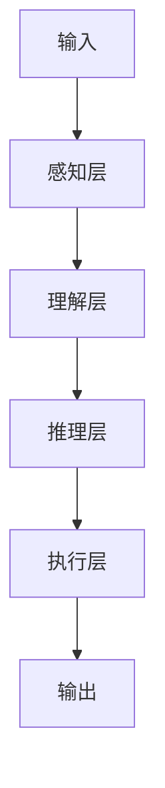

                 


# 《构建具有上下文感知能力的AI Agent》

---

## 关键词：上下文感知、AI Agent、自然语言处理、知识图谱、对话系统、机器学习

---

## 摘要：  
本文将深入探讨如何构建具有上下文感知能力的AI Agent。通过分析上下文感知的核心概念、技术原理和系统架构，结合实际案例，详细讲解如何利用自然语言处理、知识图谱和对话系统等技术实现上下文感知AI Agent。文章还将探讨上下文感知能力在不同场景中的应用，以及如何通过算法优化和系统设计提升AI Agent的智能性与实用性。

---

## 第一部分: 上下文感知AI Agent的背景与概念

### 第1章: AI Agent的基本概念与上下文感知的重要性

#### 1.1 AI Agent的定义与核心特征  
- **1.1.1 AI Agent的基本定义**  
  AI Agent（人工智能代理）是指能够感知环境、理解任务目标、并采取相应行动以实现目标的智能系统。AI Agent可以是软件程序、机器人或其他智能设备，其核心能力包括感知、推理、决策和执行。  

- **1.1.2 上下文感知能力的引入**  
  上下文感知能力是指AI Agent能够理解当前对话或操作的上下文信息，并基于此做出更精准的决策和响应。这种能力使得AI Agent能够更好地适应动态变化的环境，并提供更智能化的服务。  

- **1.1.3 上下文感知AI Agent的优势与应用场景**  
  - **优势**：上下文感知AI Agent能够通过结合历史信息、当前对话内容以及外部知识库，提供更精准的响应，减少错误理解，提升用户体验。  
  - **应用场景**：智能客服、智能助手、智能家居、自动驾驶等领域都可以通过上下文感知能力显著提升系统性能。  

#### 1.2 上下文感知的背景与问题背景  
- **1.2.1 当前AI Agent面临的挑战**  
  - AI Agent在处理复杂任务时，常常因为缺乏上下文信息而导致理解错误或决策失误。  
  - 例如，在智能客服系统中，用户的问题可能需要结合之前的对话历史和用户背景信息才能准确理解。  

- **1.2.2 上下文感知能力的必要性**  
  - 上下文感知能力是实现更智能、更自然人机交互的关键技术。  
  - 通过上下文感知，AI Agent可以更好地理解和记忆用户的需求，从而提供更个性化的服务。  

- **1.2.3 上下文感知能力的边界与外延**  
  - 上下文感知的边界在于如何有效地整合多源信息，并在不同场景下灵活应用。  
  - 外延则包括对上下文信息的深度理解和基于上下文的智能推理。  

#### 1.3 上下文感知AI Agent的核心要素  
- **1.3.1 上下文信息的来源与类型**  
  - **来源**：上下文信息可以来自对话历史、用户行为数据、外部知识库等。  
  - **类型**：包括语义信息、情境信息、知识图谱等。  

- **1.3.2 上下文理解与推理的机制**  
  - **理解机制**：通过自然语言处理技术，将上下文信息转化为结构化的知识表示。  
  - **推理机制**：基于知识图谱和推理算法，推导出上下文中的隐含信息。  

- **1.3.3 上下文感知的系统架构**  
  - 包括感知层、理解层、推理层和执行层，各层之间协同工作以实现上下文感知能力。  

#### 1.4 本章小结  
本章从AI Agent的基本概念出发，重点介绍了上下文感知能力的重要性及其在AI Agent中的应用。通过分析上下文感知的核心要素，为后续的技术实现奠定了基础。

---

## 第二部分: 上下文感知AI Agent的核心概念与技术原理

### 第2章: 上下文感知的核心概念与原理  

#### 2.1 上下文理解的理论基础  
- **2.1.1 语义理解与上下文关联**  
  - 语义理解是上下文感知的基础，通过自然语言处理技术（如BERT、GPT）实现对文本的深度理解。  
  - 上下文关联是指在语义理解的基础上，建立文本片段之间的关联关系。  

- **2.1.2 知识图谱在上下文理解中的作用**  
  - 知识图谱是一种结构化的知识表示形式，能够帮助AI Agent理解上下文中的实体关系。  
  - 例如，通过知识图谱可以推断出“医生”和“医院”之间的关联关系。  

- **2.1.3 上下文记忆机制的实现原理**  
  - 上下文记忆机制是一种用于存储和检索上下文信息的机制，通常基于记忆网络（Memory Network）实现。  
  - 记忆网络通过存储上下文信息片段，并在需要时检索相关片段来辅助推理。  

#### 2.2 上下文推理的逻辑框架  
- **2.2.1 上下文推理的基本步骤**  
  1. **输入处理**：接收当前的输入信息（如对话文本）。  
  2. **上下文理解**：结合历史信息和知识图谱，理解输入的语义含义。  
  3. **推理与关联**：基于理解的语义信息，推理出上下文中的隐含信息。  
  4. **输出生成**：根据推理结果生成响应。  

- **2.2.2 基于知识图谱的推理方法**  
  - **路径推理**：通过遍历知识图谱中的实体关系，找到与当前问题相关的实体路径。  
  - **规则推理**：基于预定义的推理规则，推导出上下文中的隐含信息。  

- **2.2.3 上下文推理的数学模型**  
  - 基于Transformer的上下文推理模型：  
  $$ P(y|x) = \text{softmax}(W_yx + b_y) $$  
  其中，$x$ 是输入序列，$y$ 是输出序列，$W_y$ 和 $b_y$ 是模型参数。  

#### 2.3 上下文感知的算法原理  
- **2.3.1 基于Transformer的上下文建模算法**  
  - Transformer模型通过自注意力机制（Self-Attention）实现对上下文信息的建模。  
  - 自注意力机制的计算公式如下：  
  $$ \text{Attention}(Q, K, V) = \text{softmax}\left(\frac{QK^T}{\sqrt{d_k}}\right)V $$  
  其中，$Q$ 是查询向量，$K$ 是键向量，$V$ 是值向量，$d_k$ 是维度数。  

- **2.3.2 上下文记忆网络的结构与实现**  
  - 记忆网络通过存储上下文片段来辅助推理，其结构包括编码器和记忆器两个部分。  
  - 编码器将输入信息转换为向量表示，记忆器存储这些向量并提供检索功能。  

- **2.3.3 基于强化学习的上下文感知**  
  - 强化学习通过奖励机制优化AI Agent的决策过程。  
  - 例如，在对话系统中，奖励函数可以根据用户反馈调整生成的响应。  

#### 2.4 核心概念对比与ER实体关系图  
- **2.4.1 上下文感知与传统AI Agent的对比**  
  | 特性                | 上下文感知AI Agent          | 传统AI Agent               |  
  |---------------------|----------------------------|-----------------------------|  
  | 知识表示             | 基于知识图谱和上下文记忆     | 基于简单的规则或关键词匹配 |  
  | 推理能力             | 具备复杂推理能力             | 推理能力有限                 |  
  | 适应性               | 能够适应动态变化的上下文     | 适应性较差                 |  

- **2.4.2 实体关系图（ER图）展示上下文感知系统架构**  
  ```mermaid
  graph TD
      A[输入] --> B[编码器]
      B --> C[上下文记忆网络]
      C --> D[推理器]
      D --> E[输出]
  ```

---

## 第三部分: 上下文感知AI Agent的算法实现

### 第3章: 基于Transformer的上下文建模算法  

#### 3.1 Transformer模型的基本原理  
- Transformer模型由编码器和解码器组成，通过自注意力机制实现对上下文信息的建模。  
- 编码器将输入序列转换为向量表示，解码器根据编码器的输出生成响应。  

#### 3.2 自注意力机制的实现步骤  
1. **查询（Q）、键（K）、值（V）的计算**：  
   $$ Q = xW_Q^T, K = xW_K^T, V = xW_V^T $$  
2. **注意力权重计算**：  
   $$ \text{Attention} = \text{softmax}\left(\frac{QK^T}{\sqrt{d_k}}\right) $$  
3. **加权求和**：  
   $$ \text{Output} = \text{Attention} \cdot V $$  

#### 3.3 基于Transformer的上下文建模代码实现  
```python
import tensorflow as tf
from tensorflow.keras.layers import Dense, Dropout

def transformer_encoder(inputs, num_heads, d_model):
    # 计算查询、键、值
    Q = Dense(d_model, activation='linear')(inputs)
    K = Dense(d_model, activation='linear')(inputs)
    V = Dense(d_model, activation='linear')(inputs)
    
    # 计算自注意力权重
    attention = tf.nn.softmax(tf.matmul(Q, K, transpose_b=True) / tf.sqrt(d_model))
    
    # 加权求和
    output = tf.matmul(attention, V)
    
    return output
```

#### 3.4 上下文推理的数学模型与代码实现  
- **数学模型**：  
  $$ P(y|x) = \text{softmax}(W_yx + b_y) $$  
- **代码实现**：  
```python
def context_inference(x, W_y, b_y):
    logits = tf.matmul(x, W_y) + b_y
    output = tf.nn.softmax(logits)
    return output
```

---

## 第四部分: 上下文感知AI Agent的系统架构设计

### 第4章: 上下文感知AI Agent的系统架构  

#### 4.1 系统整体架构设计  
- **感知层**：负责接收输入信息（如用户对话）并进行初步处理。  
- **理解层**：通过自然语言处理技术理解输入的语义含义。  
- **推理层**：基于知识图谱和推理算法推导出上下文中的隐含信息。  
- **执行层**：根据推理结果生成响应并输出。  

#### 4.2 系统功能设计  
- **意图识别**：通过自然语言处理技术识别用户的意图。  
- **知识检索**：基于知识图谱检索相关知识。  
- **对话生成**：根据推理结果生成自然的对话响应。  

#### 4.3 系统架构图  


---

## 第五部分: 项目实战

### 第5章: 上下文感知AI Agent的项目实战  

#### 5.1 项目背景与需求分析  
- 项目目标：构建一个具有上下文感知能力的智能助手。  
- 需求分析：支持上下文理解、知识检索和对话生成功能。  

#### 5.2 项目实现步骤  
1. **环境安装**：安装Python、TensorFlow、Keras等依赖库。  
2. **数据准备**：收集和整理上下文相关的对话数据。  
3. **模型训练**：基于Transformer模型训练上下文理解模型。  
4. **系统集成**：将模型集成到智能助手系统中。  

#### 5.3 核心代码实现  
```python
import tensorflow as tf
from tensorflow.keras.layers import Input, Dense, Dropout
from tensorflow.keras.models import Model

def build_model(input_shape, num_classes):
    inputs = Input(shape=input_shape)
    x = Dense(64, activation='relu')(inputs)
    x = Dropout(0.5)(x)
    outputs = Dense(num_classes, activation='softmax')(x)
    model = Model(inputs=inputs, outputs=outputs)
    return model

# 训练模型
model = build_model((input_dim,), num_classes)
model.compile(optimizer='adam', loss='sparse_categorical_crossentropy', metrics=['accuracy'])
model.fit(X_train, y_train, epochs=10, batch_size=32)
```

---

## 第六部分: 总结与展望

### 第6章: 上下文感知AI Agent的总结与展望  

#### 6.1 总结  
本文详细介绍了如何构建具有上下文感知能力的AI Agent，从核心概念到技术实现，再到系统设计和项目实战，为读者提供了全面的指导。  

#### 6.2 未来展望  
未来，随着自然语言处理和知识图谱技术的不断发展，上下文感知AI Agent将具备更强的智能性和适应性，应用场景也将更加广泛。  

---

## 作者：AI天才研究院/AI Genius Institute & 禅与计算机程序设计艺术 /Zen And The Art of Computer Programming  

---

本文通过系统化的分析和实践，全面阐述了构建具有上下文感知能力的AI Agent的关键技术与实现方法。希望本文能够为相关领域的研究者和开发者提供有价值的参考与启发。

