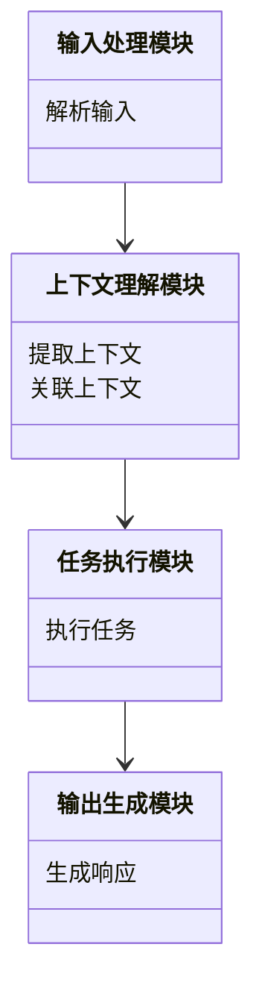
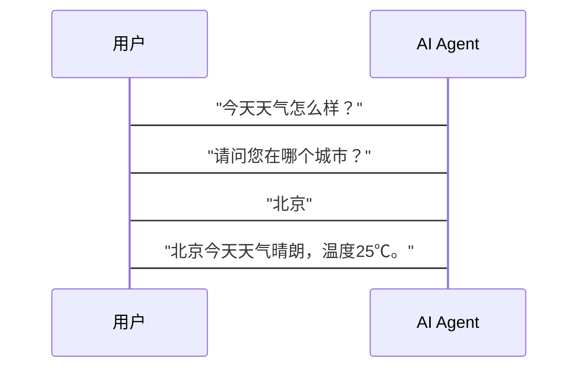
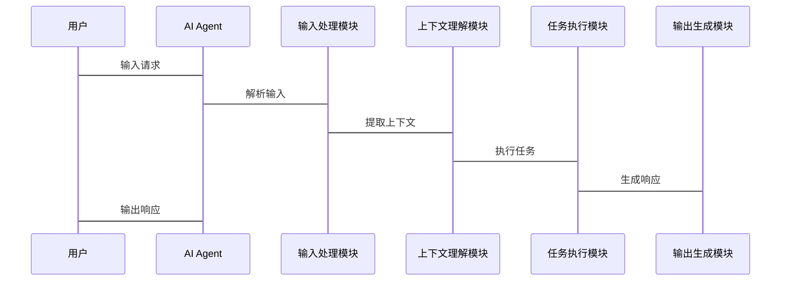
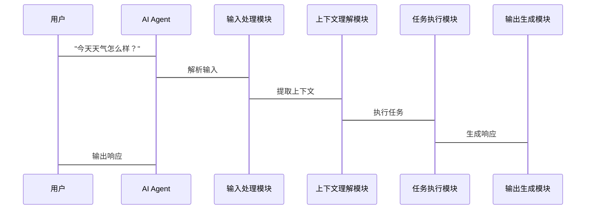

                 


# 构建具有上下文理解能力的AI Agent

> 关键词：AI Agent, 上下文理解, 人工智能, 智能系统, 自然语言处理

> 摘要：本文详细探讨了如何构建一个具有上下文理解能力的AI Agent，从核心概念、算法原理到系统架构设计，再到项目实战，全面解析了上下文理解在AI Agent中的重要性及其实现方法。

---

## 第1章: AI Agent与上下文理解概述

### 1.1 AI Agent的基本概念

#### 1.1.1 AI Agent的定义
AI Agent（人工智能代理）是指能够感知环境、做出决策并执行任务的智能实体。AI Agent可以是软件程序、机器人或其他智能系统，其核心目标是通过自动化方式帮助用户完成特定任务。

#### 1.1.2 上下文理解在AI Agent中的重要性
上下文理解是AI Agent实现智能交互的关键能力。它使得AI Agent能够理解当前对话或任务的背景信息，从而做出更准确的决策和响应。

#### 1.1.3 构建具有上下文理解能力的AI Agent的意义
- 提高用户体验：通过理解上下文，AI Agent能够提供更精准的服务。
- 增强智能性：上下文理解使AI Agent能够更好地理解用户意图，提升整体智能水平。
- 扩展应用范围：上下文理解能力使得AI Agent可以应用于更复杂的场景，如智能助手、对话机器人等。

### 1.2 上下文理解的核心问题

#### 1.2.1 上下文的理解与记忆机制
上下文理解涉及对当前对话或任务的背景信息的捕捉和记忆。例如，在对话中，AI Agent需要记住之前提到的内容，以便后续对话能够连贯。

#### 1.2.2 上下文与任务的关系
上下文是任务的背景信息，任务是根据上下文进行的活动。例如，在一个对话任务中，上下文信息可能包括用户的历史查询、当前对话的主题等。

#### 1.2.3 上下文理解的挑战与解决方案
- 挑战：上下文信息可能不完整、歧义或动态变化。
- 解决方案：使用自然语言处理技术、知识图谱和记忆机制来增强上下文理解能力。

### 1.3 本章小结
本章介绍了AI Agent的基本概念和上下文理解的重要性，分析了上下文理解的核心问题及其挑战和解决方案。

---

## 第2章: 上下文理解的机制与原理

### 2.1 上下文理解的定义与分类

#### 2.1.1 上下文的定义
上下文是指在特定场景下，与当前任务或事件相关的所有背景信息。例如，在一个对话中，上下文可能包括用户的历史查询、当前对话的主题等。

#### 2.1.2 上下文的类型与特点
- **显式上下文**：明确给出的信息，如用户输入的文本。
- **隐式上下文**：需要通过推理得出的信息，如用户的情感倾向。
- **动态上下文**：随时间变化的背景信息，如天气状况。

#### 2.1.3 上下文理解的核心要素
- **信息提取**：从输入中提取关键信息。
- **关联分析**：分析信息之间的关系。
- **记忆机制**：存储和更新上下文信息。

### 2.2 上下文表示与关联

#### 2.2.1 上下文表示方法
- **文本表示**：将上下文信息转化为文本形式。
- **向量表示**：使用向量空间模型表示上下文信息。
- **知识图谱**：通过知识图谱表示上下文中的实体及其关系。

#### 2.2.2 上下文关联的实体关系图
通过ER图（实体关系图）可以清晰地展示上下文中的实体及其关系。例如：


### 2.3 上下文理解与任务的关系

#### 2.3.1 上下文与任务的关联
上下文信息是任务执行的基础。例如，在一个在线购物任务中，上下文信息包括用户的浏览记录、购物车状态等。

#### 2.3.2 上下文对任务的影响
上下文信息可以帮助AI Agent更好地理解任务需求，从而做出更准确的决策。例如，在对话任务中，上下文信息可以帮助AI Agent理解用户的真实需求。

#### 2.3.3 任务驱动的上下文理解
不同的任务可能需要不同的上下文信息。例如，在问答任务中，上下文信息可能包括用户的历史问题和相关知识。

### 2.4 本章小结
本章详细介绍了上下文理解的机制与原理，分析了上下文的类型、表示方法及其与任务的关系。

---

## 第3章: 上下文理解的模型与算法

### 3.1 上下文理解的模型结构

#### 3.1.1 基于Transformer的上下文理解模型
Transformer模型通过自注意力机制可以有效地捕捉上下文信息。其结构包括编码器和解码器，分别用于处理输入和生成输出。

#### 3.1.2 模型的输入与输出
- **输入**：上下文信息和当前任务。
- **输出**：基于上下文的决策或响应。

#### 3.1.3 模型的训练与优化
通过监督学习，模型可以学习如何根据上下文信息生成正确的输出。常用的优化方法包括Adam优化器和学习率衰减。

### 3.2 上下文理解的算法流程

#### 3.2.1 上下文表示的算法流程
1. 输入上下文信息。
2. 使用编码器提取上下文特征。
3. 生成上下文表示向量。

#### 3.2.2 上下文关联的算法流程
1. 提取上下文中的实体。
2. 分析实体之间的关系。
3. 构建实体关系图。

#### 3.2.3 上下文推理的算法流程
1. 基于上下文表示进行推理。
2. 结合任务需求生成响应。

### 3.3 上下文记忆机制的数学模型

#### 3.3.1 注意力机制的数学公式
自注意力机制的计算公式如下：

$$
\text{Attention}(Q, K, V) = \text{softmax}\left(\frac{QK^T}{\sqrt{d_k}}\right)V
$$

其中，$Q$是查询向量，$K$是键向量，$V$是值向量，$d_k$是向量的维度。

#### 3.3.2 上下文记忆的数学模型
上下文记忆机制可以通过记忆网络来实现，其数学模型如下：

$$
p(z | x) = \prod_{i=1}^n p(z_i | x, z_{<i})
$$

其中，$z_i$表示记忆中的第$i$个元素，$x$是输入。

#### 3.3.3 模型的损失函数与优化目标
常用的损失函数包括交叉熵损失和均方误差损失。优化目标是通过梯度下降最小化损失函数。

### 3.4 本章小结
本章详细介绍了上下文理解的模型与算法，分析了基于Transformer的模型结构及其数学原理。

---

## 第4章: 上下文理解AI Agent的系统架构

### 4.1 系统功能设计

#### 4.1.1 系统功能模块划分
- **输入处理模块**：接收输入并解析上下文信息。
- **上下文理解模块**：提取和关联上下文信息。
- **任务执行模块**：根据上下文信息执行任务。
- **输出生成模块**：生成基于上下文的响应。

#### 4.1.2 系统功能的领域模型类图
通过领域模型类图可以清晰地展示系统功能模块之间的关系。例如：



### 4.2 系统架构设计

#### 4.2.1 系统架构的分层设计
- **数据层**：存储上下文信息。
- **逻辑层**：处理上下文理解和任务执行。
- **接口层**：提供API供外部调用。

#### 4.2.2 系统架构的组件关系
通过组件关系图可以展示系统架构的各个部分及其相互关系。例如：


#### 4.2.3 系统架构的交互流程
- 输入处理模块接收输入并解析上下文信息。
- 上下文理解模块提取和关联上下文信息。
- 任务执行模块根据上下文信息执行任务。
- 输出生成模块生成基于上下文的响应。

### 4.3 系统接口设计

#### 4.3.1 系统内部接口
- `extract_context(input)`：提取上下文信息。
- `associate_context(context)`：关联上下文信息。

#### 4.3.2 系统外部接口
- `process_request(request)`：处理外部请求。
- `generate_response(response)`：生成响应。

### 4.4 系统交互设计

#### 4.4.1 系统交互的场景分析
以一个对话场景为例：



#### 4.4.2 系统交互的序列图
通过序列图可以展示系统交互的流程。例如：



### 4.5 本章小结
本章详细介绍了上下文理解AI Agent的系统架构设计，包括功能模块划分、架构组件关系和交互流程。

---

## 第5章: 项目实战

### 5.1 环境安装

#### 5.1.1 安装Python
建议使用Python 3.6或更高版本。

#### 5.1.2 安装依赖库
安装以下依赖库：
```bash
pip install numpy
pip install pandas
pip install transformers
pip install matplotlib
```

### 5.2 系统核心实现源代码

#### 5.2.1 输入处理模块
```python
import numpy as np

def process_input(input_text):
    # 这里可以实现具体的输入处理逻辑
    return input_text.lower()
```

#### 5.2.2 上下文理解模块
```python
import transformers

class ContextUnderstanding:
    def __init__(self, model_name):
        self.model = transformers.AutoModel.from_pretrained(model_name)
    
    def extract_context(self, input_text):
        # 这里可以实现具体的上下文提取逻辑
        return self.model.encode(input_text)
```

#### 5.2.3 任务执行模块
```python
def execute_task(context, task):
    # 这里可以实现具体的任务执行逻辑
    return "Task executed successfully."
```

#### 5.2.4 输出生成模块
```python
def generate_response(context, task):
    # 这里可以实现具体的响应生成逻辑
    return "Here is the result."
```

### 5.3 代码应用解读与分析

#### 5.3.1 代码解读
上述代码展示了如何实现一个简单的上下文理解AI Agent，包括输入处理、上下文理解、任务执行和输出生成四个模块。

#### 5.3.2 代码分析
- 输入处理模块负责接收输入并进行预处理。
- 上下文理解模块使用预训练模型提取上下文信息。
- 任务执行模块根据上下文信息执行任务。
- 输出生成模块生成基于上下文的响应。

### 5.4 实际案例分析和详细讲解剖析
以一个对话场景为例，展示如何使用上述代码实现上下文理解AI Agent：



### 5.5 本章小结
本章通过实际案例展示了如何实现一个具有上下文理解能力的AI Agent，并详细解读了核心代码。

---

## 第6章: 总结与展望

### 6.1 本章小结
本文详细探讨了如何构建一个具有上下文理解能力的AI Agent，从核心概念到算法原理，再到系统架构设计和项目实战，全面解析了上下文理解在AI Agent中的重要性及其实现方法。

### 6.2 最佳实践 tips
- **数据质量**：确保上下文信息的准确性和完整性。
- **模型调优**：根据具体任务需求调整模型参数。
- **安全性**：确保上下文信息的安全存储和传输。

### 6.3 未来展望
随着自然语言处理技术的不断发展，上下文理解能力将更加智能化和个性化。未来的研究方向包括更复杂的上下文关联、多模态上下文理解以及自适应上下文记忆机制。

### 6.4 注意事项
- 上下文信息可能不完整或动态变化，需要设计灵活的记忆机制。
- 注意保护用户隐私，确保上下文信息的安全性。

### 6.5 拓展阅读
- 《The Transformer Architecture》
- 《Attention Mechanisms in NLP》
- 《Knowledge Graphs for Context Understanding》

---

## 作者：AI天才研究院/AI Genius Institute & 禅与计算机程序设计艺术 /Zen And The Art of Computer Programming

---

以上是《构建具有上下文理解能力的AI Agent》的技术博客文章的完整目录和内容概览。希望这篇文章能够帮助读者全面理解如何构建一个具有上下文理解能力的AI Agent，并为相关领域的研究和实践提供有价值的参考。

