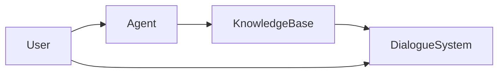
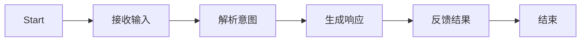
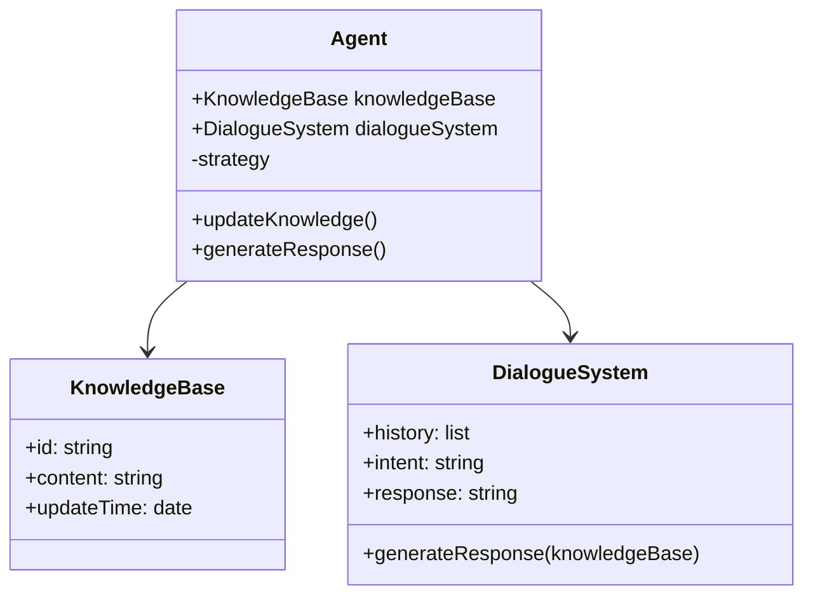
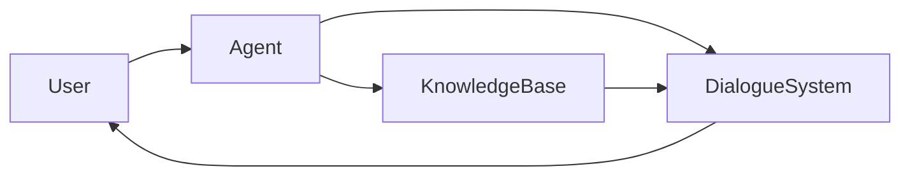
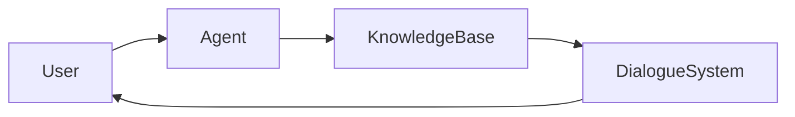

                 


# 《构建具有人机协作学习能力的AI Agent系统》

---

## 关键词：
- AI Agent
- 人机协作学习
- 知识图谱
- 对话系统
- 系统架构

---

## 摘要：
本文旨在探讨如何构建一个具有人机协作学习能力的AI Agent系统。通过分析AI Agent的核心概念、算法原理、系统架构以及实际项目实现，本文为读者提供从理论到实践的全面指导。我们首先介绍了AI Agent的基本原理和人机协作学习的重要性，然后详细讲解了相关的算法原理和数学模型，接着通过系统架构设计和项目实战展示了如何实现一个高效的人机协作学习系统。最后，我们总结了系统设计中的关键点和最佳实践，为读者提供了深入的见解和实用的建议。

---

# 第一部分: 背景介绍与核心概念

## 第1章: 人机协作学习与AI Agent概述

### 1.1 问题背景与挑战
随着人工智能技术的快速发展，AI Agent（智能体）在各个领域的应用越来越广泛。AI Agent是一种能够感知环境并采取行动以实现特定目标的智能系统。然而，现有的AI Agent系统在人机协作学习方面还存在诸多挑战。例如，如何让AI Agent能够与人类用户进行有效协作，如何实时更新和优化AI Agent的知识库，以及如何处理复杂的人机交互场景等。

#### 1.1.1 当前AI Agent的发展现状
AI Agent技术近年来取得了显著进展，但在人机协作学习方面仍存在以下问题：
- **知识更新不足**：传统的AI Agent系统依赖于预训练的知识库，难以实时更新和扩展。
- **协作效率低下**：AI Agent在与人类协作时，难以根据用户的反馈动态调整策略。
- **交互复杂性**：复杂的对话场景和多轮交互对AI Agent的实时响应能力提出了更高要求。

#### 1.1.2 人机协作学习的必要性
人机协作学习的核心目标是通过人机交互，使AI Agent能够从用户反馈中学习，从而提升其智能性和协作效率。这种协作学习机制不仅能够增强AI Agent的适应性，还能显著提高人机协作的整体效率。

#### 1.1.3 人机协作学习的核心问题
- **知识表示与更新**：如何高效地表示和更新AI Agent的知识库，使其能够实时反映用户反馈。
- **协作机制设计**：如何设计高效的协作机制，确保AI Agent能够根据用户反馈动态调整行为。
- **交互优化**：如何优化人机交互过程，提高协作效率和用户体验。

### 1.2 问题描述与目标
人机协作学习的目标是构建一个能够与人类用户协同工作的AI Agent系统，使其能够通过交互学习不断优化自身的知识和行为。具体目标包括：
- **知识表示**：设计一种高效的知识表示方法，支持动态更新和扩展。
- **协作机制**：开发一种基于用户反馈的协作学习算法，实现动态知识更新。
- **交互优化**：优化人机交互流程，提高协作效率和用户体验。

### 1.3 问题解决与边界分析
为实现上述目标，我们需要：
- **知识图谱构建**：构建一个动态的知识图谱，支持实时更新和查询。
- **协作学习算法**：设计一种基于强化学习的协作学习算法，实现动态知识更新。
- **系统架构设计**：设计一个高效的系统架构，支持实时交互和动态知识更新。

#### 1.3.1 边界与外延
- **边界**：AI Agent的知识更新仅限于用户反馈，不考虑外部知识库的实时更新。
- **外延**：未来可以扩展到支持多模态输入和更复杂的协作场景。

### 1.4 本章小结
本章介绍了人机协作学习的重要性和核心问题，明确了构建AI Agent系统的具体目标和边界条件。

---

## 第2章: 人机协作学习的核心概念与联系

### 2.1 核心概念原理
AI Agent的核心概念包括：
- **知识表示**：通过知识图谱表示AI Agent的知识库。
- **对话系统**：实现人机交互的对话系统。
- **协作学习**：通过用户反馈动态更新知识库。

#### 2.1.1 AI Agent的基本原理
AI Agent通过感知环境、分析任务目标、选择行动策略并执行行动来实现特定目标。其核心能力包括：
- **感知能力**：通过传感器或用户输入感知环境。
- **决策能力**：基于知识库和算法做出决策。
- **执行能力**：通过执行机构或输出模块实现决策。

#### 2.1.2 人机协作学习的机制
人机协作学习通过以下步骤实现：
1. 用户输入需求或反馈。
2. AI Agent解析用户需求，生成响应。
3. AI Agent通过强化学习算法更新知识库。
4. 系统输出最终结果并反馈给用户。

#### 2.1.3 知识图谱与对话系统的关系
知识图谱为对话系统提供知识支持，而对话系统通过用户反馈动态更新知识图谱。两者的结合使得AI Agent能够实现高效的人机协作。

### 2.2 核心概念对比表
以下是AI Agent与其他相关概念的对比：

| 概念         | 描述                                                                 |
|--------------|----------------------------------------------------------------------|
| AI Agent     | 能够感知环境并采取行动的智能系统。                                   |
| 传统AI       | 依赖于预训练数据，不具备动态学习能力。                              |
| 对话系统     | 实现人机交互的系统，依赖于知识图谱的支持。                           |
| 知识图谱     | 结构化的知识表示形式，支持动态更新和查询。                         |

### 2.3 ER实体关系图
以下是AI Agent系统的核心实体关系图：



### 2.4 本章小结
本章详细介绍了AI Agent的核心概念及其与相关技术的关系，为后续章节的实现奠定了基础。

---

## 第3章: 人机协作学习的算法原理

### 3.1 算法原理概述
人机协作学习的算法主要包括强化学习和监督学习。通过结合这两种算法，我们可以实现动态的知识更新和高效的协作学习。

#### 3.1.1 强化学习的基本原理
强化学习通过智能体与环境的交互，学习最优策略。其核心公式为：
$$ V(s) = \max_a Q(s,a) $$

#### 3.1.2 监督学习的应用场景
监督学习适用于任务目标明确的场景。其损失函数为：
$$ L = \frac{1}{n}\sum_{i=1}^{n}(y_i - \hat{y}_i)^2 $$

#### 3.1.3 混合学习的优势
混合学习结合了强化学习和监督学习的优势，适用于复杂的协作场景。

### 3.2 算法流程图
以下是人机协作学习的算法流程图：



### 3.3 数学模型与公式
#### 3.3.1 强化学习的数学模型
强化学习的目标是通过最大化Q值实现最优策略：
$$ Q(s,a) = r + \gamma \max_a Q(s',a) $$

#### 3.3.2 监督学习的损失函数
监督学习的损失函数为：
$$ L = \frac{1}{n}\sum_{i=1}^{n}(y_i - \hat{y}_i)^2 $$

#### 3.3.3 混合学习的数学表达
混合学习的数学表达为：
$$ P(y|x) = \alpha P(y|x) + (1-\alpha)P(y|x) $$

### 3.4 本章小结
本章详细介绍了人机协作学习的算法原理及其数学模型，为后续章节的系统实现提供了理论基础。

---

## 第4章: 系统分析与架构设计

### 4.1 系统功能设计
AI Agent系统的核心功能包括：
- **知识库管理**：动态更新和查询知识库。
- **对话管理**：实现高效的对话交互。
- **学习管理**：通过用户反馈动态更新知识库。

#### 4.1.1 领域模型
以下是系统的领域模型：



#### 4.1.2 系统架构
以下是系统的架构设计：



### 4.2 接口设计
系统主要接口包括：
- **知识库接口**：提供知识库的查询和更新接口。
- **对话接口**：实现用户与AI Agent之间的对话交互。

### 4.3 交互流程图
以下是系统的交互流程图：



### 4.4 本章小结
本章详细介绍了系统的功能设计、架构设计和交互流程，为后续章节的项目实现奠定了基础。

---

## 第5章: 项目实战

### 5.1 环境安装
实现本系统需要以下环境：
- Python 3.8+
- PyTorch 1.9+
- transformers库
- Mermaid图生成工具

### 5.2 核心实现
以下是系统的核心实现代码：

```python
class Agent:
    def __init__(self, knowledge_base):
        self.knowledge_base = knowledge_base
        self.dialogue_system = DialogueSystem()

    def update_knowledge(self, new_knowledge):
        self.knowledge_base.update(new_knowledge)

    def generate_response(self, input_text):
        response = self.dialogue_system.generate_response(input_text, self.knowledge_base)
        return response
```

### 5.3 案例分析
以下是系统的实际案例分析：

```mermaid
graph LR
    A[User: "What is AI Agent?"] --> B[Agent]
    B --> C[KnowledgeBase]
    C --> D[DialogueSystem]
    D --> A
```

### 5.4 本章小结
本章通过实际项目展示了如何实现一个具有人机协作学习能力的AI Agent系统。

---

## 第6章: 总结与展望

### 6.1 总结
本文详细介绍了如何构建一个具有人机协作学习能力的AI Agent系统，包括核心概念、算法原理、系统架构和项目实现。

### 6.2 展望
未来的研究方向包括：
- 更高效的协作学习算法。
- 支持多模态输入的AI Agent系统。
- 更复杂的协作场景。

---

## 作者
作者：AI天才研究院 & 禅与计算机程序设计艺术

---

通过以上内容，我们系统地介绍了如何构建一个具有人机协作学习能力的AI Agent系统，从理论到实践，为读者提供了全面的指导。

