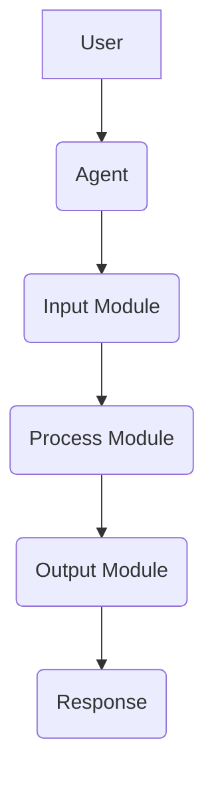

                 


# 《构建具有人机协作能力的AI Agent系统》

## 关键词：
AI Agent, 人机协作, 自然语言处理, 系统架构, 机器学习

## 摘要：
本文详细探讨了构建具有人机协作能力的AI Agent系统的各个方面，从基本概念到系统架构，从技术实现到项目实战，为读者提供了全面的指导。文章首先介绍了AI Agent的基本概念和人机协作的重要性，然后深入讲解了自然语言处理、机器学习等关键技术，分析了系统的架构设计和模块划分。通过实际案例，展示了如何实现一个具备人机协作能力的AI Agent，并讨论了系统的优化与扩展。最后，文章总结了构建此类系统的最佳实践和未来发展方向。

---

# 《构建具有人机协作能力的AI Agent系统》

## 引言

### 1.1 问题背景

在当今快速发展的科技时代，人工智能（AI）技术的应用越来越广泛。AI Agent（智能体）作为一种能够感知环境、自主决策、并与人类进行协作的智能系统，正在成为人机交互的重要桥梁。然而，现有的AI Agent系统在人机协作能力方面仍存在诸多不足，例如难以理解人类的真实意图、协作效率低下、用户体验不佳等问题。因此，构建一个具备高效人机协作能力的AI Agent系统成为当前研究和应用的重要课题。

### 1.2 问题描述

AI Agent系统的核心目标是实现人与机器之间的高效协作。然而，现有的系统在以下几个方面存在明显不足：
- **意图识别不准确**：AI Agent难以准确理解人类的意图，导致协作过程中的误解和效率低下。
- **协作模型不完善**：缺乏一个能够有效描述人机协作过程的模型，导致系统在协作过程中缺乏灵活性和适应性。
- **系统架构不合理**：现有的系统架构设计未能充分考虑人机协作的复杂性，导致系统的扩展性和维护性较差。

### 1.3 问题解决与系统构建

为了克服上述问题，我们需要从以下几个方面入手：
1. **设计高效的意图识别机制**：通过自然语言处理（NLP）技术，提升AI Agent对人类意图的理解能力。
2. **构建灵活的协作模型**：设计一个能够描述人机协作过程的模型，确保系统在协作过程中具有灵活性和适应性。
3. **优化系统架构设计**：通过模块化设计和分层架构，提升系统的扩展性和维护性。

---

## 第二部分：AI Agent系统的核心概念

### 2.1 AI Agent的基本概念

#### 2.1.1 AI Agent的定义

AI Agent是一种能够感知环境、自主决策并执行任务的智能系统。它通过与环境的交互，获取信息、分析问题、制定计划，并执行任务以实现目标。

#### 2.1.2 AI Agent的特点

- **自主性**：AI Agent能够在没有外部干预的情况下自主运行。
- **反应性**：AI Agent能够实时感知环境并做出相应的反应。
- **协作性**：AI Agent能够与其他Agent或人类进行协作，共同完成任务。

#### 2.1.3 AI Agent与传统AI的区别

| 属性         | 传统AI                  | AI Agent                  |
|--------------|-------------------------|---------------------------|
| 行为方式     | 被动响应输入             | 主动感知环境并执行任务    |
| 环境交互     | 不与环境交互             | 能够与环境交互            |
| 应用场景     | 数据分析、模式识别       | 自动化控制、智能交互      |

### 2.2 人机协作能力的定义

#### 2.2.1 人机协作的定义

人机协作是指人类与机器之间通过相互配合，共同完成某项任务的过程。在AI Agent系统中，人机协作能力是指AI Agent能够理解人类的意图、提供有效的支持，并与人类协同完成任务的能力。

#### 2.2.2 人机协作的核心要素

- **意图识别**：准确理解人类的意图是人机协作的基础。
- **任务分配**：根据任务的特点和人类的能力，合理分配任务。
- **实时交互**：通过高效的交互方式，确保协作过程的流畅性。

---

## 第三部分：AI Agent系统的技术基础

### 3.1 自然语言处理技术

#### 3.1.1 意图识别

意图识别是人机协作的核心技术之一。通过分析用户的输入，AI Agent能够理解用户的意图并做出相应的反应。

- **基于规则的意图识别**：通过预定义的规则，识别用户的意图。
- **基于机器学习的意图识别**：利用机器学习模型，自动学习用户的意图。

#### 3.1.2 实体抽取

实体抽取是从文本中提取出具有特定意义的实体信息，例如人名、地名、组织名等。

- **基于模式匹配的实体抽取**：通过预定义的模式，匹配文本中的实体。
- **基于上下文的实体抽取**：结合上下文信息，提高实体抽取的准确性。

### 3.2 人机对话的实现

#### 3.2.1 对话系统的分类

- **基于规则的对话系统**：通过预定义的规则，生成对话内容。
- **基于机器学习的对话系统**：利用机器学习模型，生成对话内容。

#### 3.2.2 对话系统的实现流程

1. 用户输入：用户通过文本或语音输入与AI Agent对话。
2. 意图识别：AI Agent分析用户的意图。
3. 实体抽取：提取对话中的实体信息。
4. 响应生成：根据意图和实体信息，生成相应的响应。
5. 反馈与优化：根据用户反馈，优化对话系统。

### 3.3 意图识别与实体抽取的结合

通过将意图识别与实体抽取相结合，AI Agent能够更准确地理解用户的需求，并生成更合适的响应。

---

## 第四部分：AI Agent系统的架构与设计

### 4.1 系统架构设计

#### 4.1.1 分层架构

分层架构是一种常见的系统架构设计方法，将系统划分为多个层次，每一层负责特定的功能。

- **输入层**：接收用户的输入，例如文本或语音。
- **处理层**：对输入进行处理，例如意图识别和实体抽取。
- **输出层**：生成响应并返回给用户。

#### 4.1.2 模块化设计

模块化设计将系统划分为多个独立的模块，每个模块负责特定的功能。

- **输入模块**：接收用户的输入。
- **处理模块**：对输入进行处理，例如意图识别和实体抽取。
- **输出模块**：生成响应并返回给用户。

### 4.2 系统功能设计

#### 4.2.1 领域模型设计

领域模型是对系统功能的抽象描述，通常使用类图来表示。

```mermaid
classDiagram
    class User {
        +name: String
        +age: Integer
        +role: String
        -private String password
        <<User>> {
            +login(): void
            +logout(): void
        }
    }
    class Agent {
        +id: String
        +name: String
        -private String token
        <<Agent>> {
            +receiveInput(input: String): void
            +processInput(): void
            +generateResponse(): String
        }
    }
    User --> Agent: interacts with
```

#### 4.2.2 系统架构设计

系统架构设计描述了系统各个模块之间的交互关系，通常使用架构图来表示。



### 4.3 系统接口设计

#### 4.3.1 接口设计

系统接口设计描述了系统各个模块之间的接口。

- **输入接口**：接收用户的输入。
- **处理接口**：对输入进行处理。
- **输出接口**：生成响应并返回给用户。

#### 4.3.2 接口实现

通过定义接口，可以实现系统的模块化设计。

---

## 第五部分：AI Agent系统的优化与扩展

### 5.1 系统性能优化

#### 5.1.1 意图识别的优化

通过改进意图识别算法，可以提高系统的准确率。

- **基于深度学习的意图识别**：利用深度学习模型，提高意图识别的准确率。
- **模型优化**：通过模型压缩和优化，提高系统的运行效率。

#### 5.1.2 实体抽取的优化

通过改进实体抽取算法，可以提高系统的准确性。

- **基于上下文的实体抽取**：结合上下文信息，提高实体抽取的准确性。
- **模型优化**：通过模型压缩和优化，提高系统的运行效率。

### 5.2 系统扩展

#### 5.2.1 功能扩展

通过增加新的功能模块，可以扩展系统的能力。

- **多语言支持**：支持多种语言的对话。
- **多模态交互**：支持文本、语音、图像等多种交互方式。

#### 5.2.2 系统架构扩展

通过优化系统架构，可以提高系统的扩展性和维护性。

- **微服务架构**：将系统划分为多个微服务，提高系统的扩展性和维护性。
- **容器化部署**：通过容器化技术，提高系统的部署效率。

---

## 第六部分：总结与展望

### 6.1 总结

通过本文的介绍，我们可以看到，构建一个具备人机协作能力的AI Agent系统是一个复杂而有趣的过程。从基本概念到技术实现，从系统架构到项目实战，每一个环节都需要仔细设计和优化。只有通过不断的学习和实践，才能构建出一个高效、可靠的AI Agent系统。

### 6.2 未来展望

随着人工智能技术的不断发展，AI Agent系统的能力将不断提升。未来，我们可以期待看到更多具备人机协作能力的AI Agent系统在各个领域的应用，为人类带来更多的便利和效率提升。

---

# 作者：AI天才研究院 & 禅与计算机程序设计艺术

---

以上是《构建具有人机协作能力的AI Agent系统》的完整目录和文章内容。

