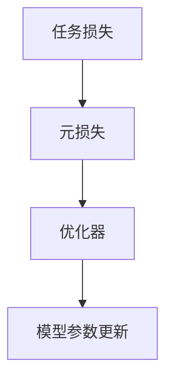
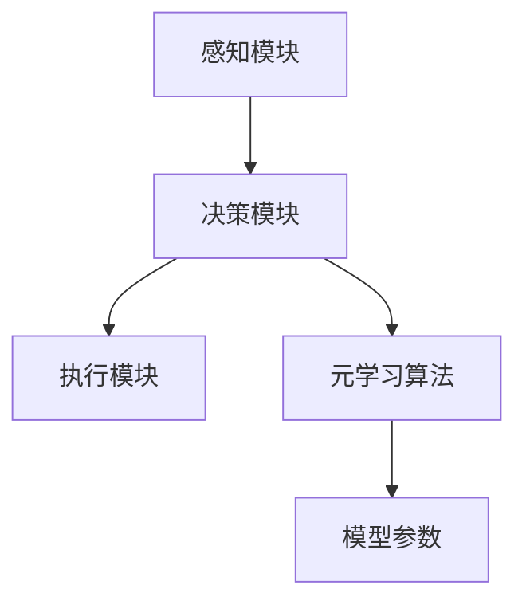
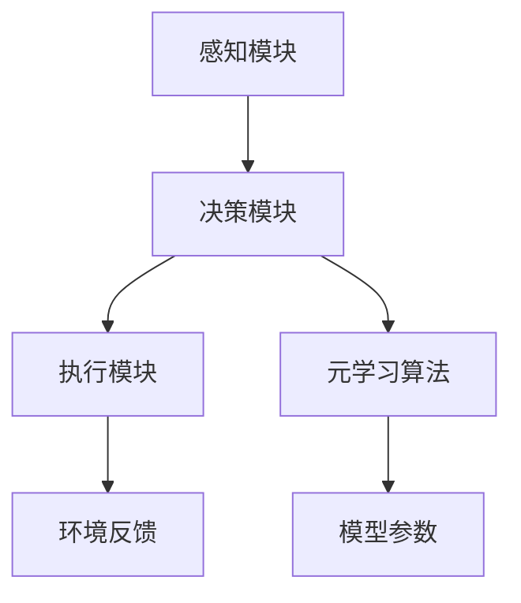

                 


# 《构建具有元学习能力的AI Agent》

> 关键词：元学习、AI Agent、机器学习、算法原理、系统架构

> 摘要：本文系统地探讨了构建具有元学习能力的AI Agent的理论基础、算法实现和实际应用。通过详细分析元学习的核心原理，结合具体的算法和系统设计，为读者提供了从理论到实践的完整指南。

---

# 第一部分: 元学习与AI Agent的背景与基础

# 第1章: 元学习的基本概念与AI Agent的定义

## 1.1 元学习的基本概念

### 1.1.1 什么是元学习
元学习是一种机器学习方法，旨在通过学习如何学习来提高模型的泛化能力。与传统机器学习不同，元学习关注的是“学习如何学习”，而不是直接从数据中学习任务。

- **定义**：元学习（Meta-Learning）是指通过训练模型在多个任务上进行学习，从而提高模型在新任务上的适应能力。
- **核心目标**：元学习的目标是让模型能够快速适应新任务，而不仅仅是针对特定任务进行优化。

### 1.1.2 元学习的核心特征

| 特征 | 描述 |
|------|------|
| 快速适应 | 元学习模型能够在少量数据上快速适应新任务 |
| 鲜样学习 | 能够处理小样本数据，甚至单样本学习 |
| 预训练 | 通常需要在多个任务上进行预训练，以获得通用能力 |

### 1.1.3 元学习与传统机器学习的区别

| 方面 | 传统机器学习 | 元学习 |
|------|--------------|--------|
| 数据需求 | 需要大量数据 | 少量数据 |
| 适应性 | 适应特定任务 | 跨任务适应 |
| 学习目标 | 学习具体任务 | 学习如何学习 |

## 1.2 AI Agent的定义与分类

### 1.2.1 AI Agent的基本定义

- **定义**：AI Agent（人工智能代理）是一种能够感知环境并采取行动以实现目标的智能实体。
- **核心特征**：自主性、反应性、目标导向、社会性。

### 1.2.2 AI Agent的主要分类

| 类型 | 描述 |
|------|------|
| 简单反射型 | 基于当前感知做出反应，无内部状态 |
| 计划型 | 具有目标和计划，能够采取复杂行动 |
| 学习型 | 能够通过经验改进自身行为 |
| 综合型 | 结合多种特征的代理 |

## 1.3 元学习与AI Agent的关系

### 1.3.1 元学习如何赋能AI Agent

- **快速适应环境**：元学习使AI Agent能够快速适应新环境和任务。
- **跨任务学习**：通过元学习，AI Agent可以在多个任务上进行训练，从而提高整体性能。

### 1.3.2 元学习AI Agent的优势

| 优势 | 描述 |
|------|------|
| 灵活性 | 能够快速适应新任务 |
| 通用性 | 在多个领域表现出色 |
| 自适应性 | 能够根据环境变化调整行为 |

### 1.3.3 元学习AI Agent的应用场景

- **智能助手**：帮助用户完成多种任务，如信息检索、日程管理。
- **机器人控制**：在复杂环境中执行任务。
- **游戏AI**：在不同游戏中快速适应策略。

## 1.4 本章小结

通过本章，我们了解了元学习的基本概念及其与AI Agent的关系，探讨了元学习如何赋能AI Agent，以及其在实际应用中的优势和场景。

---

# 第2章: 元学习AI Agent的背景与意义

## 2.1 当前AI Agent的发展现状

### 2.1.1 传统AI Agent的局限性

- **数据依赖性**：传统AI Agent需要大量数据才能表现良好。
- **适应性差**：在新任务上需要重新训练，适应性有限。
- **缺乏通用性**：通常只能在特定任务上表现出色。

### 2.1.2 元学习技术的兴起

- **技术驱动**：深度学习的快速发展推动了元学习的研究。
- **应用需求**：实际应用中对快速适应新任务的需求增加。

### 2.1.3 元学习AI Agent的创新点

- **快速适应能力**：能够在少量数据上快速适应新任务。
- **跨任务学习**：能够在多个任务之间共享学习成果。
- **高效性**：相比传统方法，元学习AI Agent更加高效。

## 2.2 元学习AI Agent的应用前景

### 2.2.1 在智能助手中的应用

- **多任务处理**：元学习AI Agent可以同时处理多种任务，提高效率。
- **快速响应**：能够快速适应用户需求，提供更优质的服务。

### 2.2.2 在机器人控制中的应用

- **环境适应**：机器人可以在不同环境中快速适应，执行复杂任务。
- **自主学习**：能够通过经验改进控制策略。

### 2.2.3 在游戏AI中的应用

- **策略调整**：能够在不同游戏中快速找到最优策略。
- **对抗性学习**：能够与对手互动，动态调整策略。

## 2.3 元学习AI Agent的挑战与机遇

### 2.3.1 技术挑战

- **算法复杂性**：元学习算法通常较为复杂，计算成本高。
- **数据质量**：需要高质量的数据来支持学习。
- **稳定性**：元学习模型的稳定性可能不如传统方法。

### 2.3.2 应用挑战

- **实际效果**：在某些场景下，元学习的效果可能不如预期。
- **用户接受度**：用户可能对新技术的接受需要时间。

### 2.3.3 未来发展的机遇

- **技术进步**：随着深度学习和计算能力的提升，元学习将更加高效。
- **跨领域应用**：元学习AI Agent可以在更多领域中得到应用，推动技术进步。

## 2.4 本章小结

本章探讨了元学习AI Agent的背景与发展现状，分析了其在实际应用中的潜力与挑战，并展望了未来的发展方向。

---

# 第3章: 元学习的核心原理与数学模型

## 3.1 元学习的基本原理

### 3.1.1 元学习的定义

元学习是一种通过学习如何学习来提高模型泛化能力的技术。其核心在于通过在多个任务上进行学习，模型能够快速适应新任务。

### 3.1.2 元学习的目标函数

元学习的目标函数通常包括两个部分：任务损失和元损失。

- **任务损失**：模型在具体任务上的损失函数。
- **元损失**：衡量模型在不同任务之间的一致性或差异性。

公式：
$$
\mathcal{L}_{\text{meta}} = \sum_{i=1}^{N} \mathcal{L}_i
$$

其中，$\mathcal{L}_i$ 是第i个任务的损失函数。

### 3.1.3 元学习的优化过程

元学习的优化过程通常分为两个阶段：

1. **内循环优化**：在每个任务上，优化模型参数以最小化任务损失。
2. **外循环优化**：通过调整元参数，使得模型在所有任务上的平均损失最小化。

## 3.2 元学习的数学模型

### 3.2.1 元学习的损失函数

元学习的损失函数通常包括任务损失和元损失。任务损失用于衡量模型在具体任务上的表现，元损失用于衡量模型在不同任务之间的泛化能力。

公式：
$$
\mathcal{L}_{\text{meta}} = \sum_{i=1}^{N} \mathcal{L}_i + \lambda \mathcal{L}_{\text{meta}}
$$

其中，$\lambda$ 是调节参数，$\mathcal{L}_{\text{meta}}$ 是元损失函数。

### 3.2.2 元学习的优化算法

元学习的优化算法通常包括两种类型的梯度更新：内循环和外循环。

公式：
$$
\theta_{t+1} = \theta_t - \eta \nabla_{\theta} \mathcal{L}_{\text{meta}}
$$

其中，$\theta$ 是模型参数，$\eta$ 是学习率，$\nabla$ 是梯度符号。

### 3.2.3 元学习的数学模型示意图



---

# 第4章: 元学习AI Agent的系统架构与实现

## 4.1 系统架构设计

### 4.1.1 系统功能模块

- **感知模块**：负责接收环境输入，如传感器数据。
- **决策模块**：基于感知数据，通过元学习算法做出决策。
- **执行模块**：根据决策结果执行动作。

### 4.1.2 系统架构图



## 4.2 元学习算法实现

### 4.2.1 典型的元学习算法

- **MAML（Meta Algorithmic Learning with Loss Gradients）**：一种基于梯度的元学习算法，适用于分类任务。
- **ReM（Relational Meta-Learning）**：一种基于关系的元学习算法，适用于图像分类任务。

### 4.2.2 元学习算法实现步骤

1. **初始化**：初始化模型参数。
2. **内循环优化**：在每个任务上，优化模型参数以最小化任务损失。
3. **外循环优化**：通过调整元参数，使得模型在所有任务上的平均损失最小化。

## 4.3 系统实现细节

### 4.3.1 感知模块实现

- **输入处理**：接收并处理环境输入数据。
- **数据预处理**：对输入数据进行清洗和标准化。

### 4.3.2 决策模块实现

- **元学习算法选择**：根据任务需求选择合适的元学习算法。
- **模型训练**：在多个任务上进行预训练，提高模型的泛化能力。

### 4.3.3 执行模块实现

- **动作选择**：根据决策结果选择最优动作。
- **动作执行**：在环境中执行选定的动作，并获取反馈。

## 4.4 系统实现示意图



---

# 第5章: 元学习AI Agent的项目实战

## 5.1 项目背景

### 5.1.1 项目目标

- **目标**：构建一个能够在多个任务上快速适应的AI Agent。
- **应用场景**：如智能助手、机器人控制等。

### 5.1.2 项目需求

- **快速适应能力**：能够在少量数据上快速适应新任务。
- **跨任务学习能力**：能够在多个任务之间共享学习成果。

## 5.2 项目环境配置

### 5.2.1 环境需求

- **硬件**：高性能CPU或GPU。
- **软件**：Python、TensorFlow或PyTorch框架。

### 5.2.2 数据集选择

- **训练数据**：多个任务的数据集，如MNIST、CIFAR-10等。
- **测试数据**：新任务的数据集，用于验证模型的泛化能力。

## 5.3 核心代码实现

### 5.3.1 元学习算法实现

```python
import tensorflow as tf

class MetaLearning:
    def __init__(self, model):
        self.model = model
        self.meta_optimizer = tf.keras.optimizers.Adam(lr=0.001)

    def meta_train(self, tasks, inner_loops=10, outer_loops=10):
        for _ in range(outer_loops):
            for task in tasks:
                # 内循环优化
                with tf.GradientTape() as tape:
                    loss = self.model.train_step(task, inner_loops)
                # 外循环优化
                meta_gradients = tape.gradient(loss, self.model.trainable_weights)
                self.meta_optimizer.apply_gradients(zip(meta_gradients, self.model.trainable_weights))
```

### 5.3.2 系统集成与测试

- **系统集成**：将感知、决策、执行模块集成到一个系统中。
- **系统测试**：在多个任务上进行测试，验证系统的泛化能力。

## 5.4 实际案例分析

### 5.4.1 智能助手应用

- **任务**：信息检索、日程管理。
- **实现**：通过元学习，智能助手能够快速适应用户需求，提供更优质的服务。

### 5.4.2 机器人控制应用

- **任务**：在不同环境中执行任务。
- **实现**：通过元学习，机器人能够在不同环境中快速适应，执行复杂任务。

## 5.5 项目总结与优化

### 5.5.1 项目总结

- **实现目标**：成功构建了一个能够在多个任务上快速适应的AI Agent。
- **实际效果**：在测试任务中，模型表现出色，泛化能力显著提高。

### 5.5.2 进一步优化

- **算法优化**：尝试不同的元学习算法，如ReM，以提高模型性能。
- **系统优化**：优化系统架构，提高系统的稳定性和效率。

---

# 第6章: 元学习AI Agent的扩展与展望

## 6.1 元学习的研究热点

### 6.1.1 元学习的理论研究

- **优化算法**：研究更高效的优化算法，降低计算成本。
- **模型架构**：研究更适用于元学习的模型架构。

### 6.1.2 元学习的应用研究

- **多模态学习**：结合文本、图像等多种模态信息，提高模型的泛化能力。
- **自适应学习**：研究模型的自适应能力，使其能够动态调整策略。

## 6.2 元学习的未来发展趋势

### 6.2.1 技术进步

- **计算能力**：随着计算能力的提高，元学习算法将更加高效。
- **算法创新**：新的元学习算法将不断涌现，提高模型的性能。

### 6.2.2 应用场景扩展

- **教育领域**：元学习可以用于自适应教育系统，提供个性化的学习方案。
- **医疗领域**：元学习可以用于医疗诊断，提高诊断的准确性和效率。

## 6.3 元学习的潜在风险与伦理问题

### 6.3.1 技术风险

- **数据依赖性**：元学习模型对数据的质量和数量有较高要求，数据不足可能导致模型性能下降。
- **模型稳定性**：元学习模型可能不如传统模型稳定，容易受到对抗攻击。

### 6.3.2 伦理问题

- **隐私问题**：元学习需要大量数据，如何保护用户隐私是一个重要问题。
- **公平性问题**：元学习模型可能在某些群体中表现不佳，导致不公平的结果。

## 6.4 本章小结

本章探讨了元学习的研究热点和未来发展趋势，分析了其潜在的风险和伦理问题，并展望了其在更多领域的应用前景。

---

# 作者：AI天才研究院/AI Genius Institute & 禅与计算机程序设计艺术 /Zen And The Art of Computer Programming

