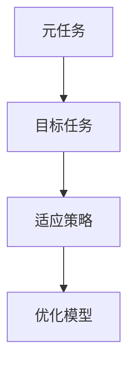
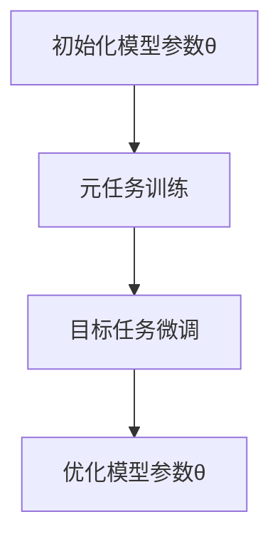
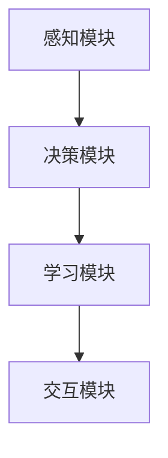
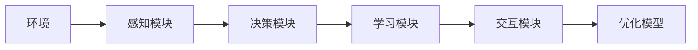
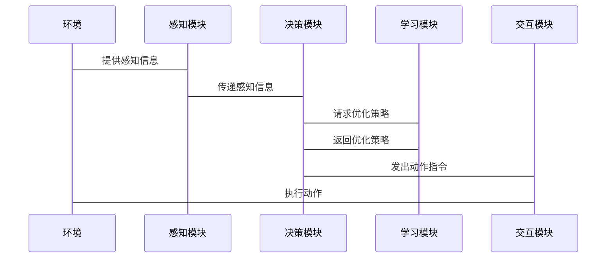

                 


# 构建具有元学习能力的AI Agent

> 关键词：元学习，AI Agent，机器学习，智能体，自适应学习，深度学习，强化学习

> 摘要：本文系统地探讨了如何构建具有元学习能力的AI Agent，从元学习的基本概念、AI Agent的核心能力、元学习算法的数学模型与实现，到系统的架构设计、项目实战以及优化与扩展，全面解析了构建元学习AI Agent的理论基础与实践方法。通过详细的算法推导、系统设计与实际案例分析，帮助读者深入理解元学习AI Agent的构建过程与实现要点。

---

# 第一部分: 元学习与AI Agent基础

## 第1章: 元学习与AI Agent概述

### 1.1 元学习的背景与概念

#### 1.1.1 元学习的定义与背景
元学习（Meta-Learning）是一种机器学习范式，旨在通过在多个任务上进行训练，使得模型能够快速适应新任务，减少对新任务数据的需求。其核心在于“学习如何学习”，通过元学习，模型能够从经验中提取通用的策略或模式，从而在新任务中快速调整和优化。

#### 1.1.2 元学习的核心概念与特点
- **任务层次性**：元学习通常涉及两个层次的任务，即元任务和目标任务。元任务负责学习通用策略，目标任务则是具体的应用任务。
- **数据效率**：元学习能够在较少的目标任务数据下快速适应新任务，显著提高了学习效率。
- **泛化能力**：通过元学习，模型能够更好地泛化到未见过的任务，提升其在复杂环境中的适应能力。

#### 1.1.3 元学习的典型应用场景
- **Few-shot学习**：在仅有少量样本的情况下快速学习新任务。
- **零样本学习**：无需目标任务数据，仅通过元任务数据进行推理。
- **自适应学习**：在动态变化的环境中快速调整模型参数或策略。

### 1.2 AI Agent的基本概念

#### 1.2.1 AI Agent的定义与分类
AI Agent（智能体）是指在环境中能够感知并自主决策的实体。根据智能体的智能水平和复杂程度，可以分为简单反射型智能体、基于模型的反射型智能体、目标驱动型智能体和实用驱动型智能体。

#### 1.2.2 AI Agent的核心功能与能力
- **感知能力**：通过传感器或其他输入方式获取环境信息。
- **决策能力**：基于感知信息做出决策，选择最优动作。
- **学习能力**：通过学习算法改进自身的决策策略。
- **交互能力**：与环境或其他智能体进行交互，动态调整行为。

#### 1.2.3 AI Agent与传统AI的区别
传统AI通常专注于解决特定问题，而AI Agent具备更强的自主性和适应性，能够在动态环境中实时感知、决策和学习。

### 1.3 元学习AI Agent的背景与问题描述

#### 1.3.1 元学习在AI Agent中的作用
元学习通过提升AI Agent的学习能力，使其能够更快地适应新环境和任务，增强其在复杂场景中的通用性和灵活性。

#### 1.3.2 元学习AI Agent的核心问题与挑战
- **任务多样性**：如何在多个任务之间找到通用的学习策略。
- **数据效率**：在目标任务数据有限的情况下，如何有效利用元任务数据进行学习。
- **计算效率**：元学习通常需要较高的计算资源，如何优化算法以降低计算成本。

#### 1.3.3 元学习AI Agent的边界与外延
元学习AI Agent不仅关注单任务的学习，更注重跨任务的学习和推理能力，其外延包括多智能体协作、在线学习和自适应优化。

### 1.4 本章小结
本章通过介绍元学习和AI Agent的基本概念，明确了元学习AI Agent的背景、核心问题与挑战，为后续章节的深入探讨奠定了基础。

---

# 第二部分: 元学习的核心概念与原理

## 第2章: 元学习的核心概念与联系

### 2.1 元学习的核心原理

#### 2.1.1 元学习的数学模型与公式
元学习的目标是通过优化元任务的损失函数，使得模型能够在目标任务上快速适应。常见的元学习算法包括MAML（Meta-Automated Learning）和ReMAML（Reparameterized Meta-Learning）。

**MAML的数学模型**：
$$
L_{\text{meta}} = \sum_{i=1}^{N} L_{\text{task}}(f_{\theta}^{(i)}, y_i)
$$
其中，$f_{\theta}^{(i)}$ 是在第$i$个任务上优化后的模型参数，$L_{\text{task}}$ 是目标任务的损失函数。

#### 2.1.2 元学习的算法流程与特点
元学习的典型算法流程包括以下步骤：
1. **初始化模型参数**：随机初始化模型参数$\theta$。
2. **元任务训练**：在多个任务上优化模型，使得模型能够快速适应新任务。
3. **目标任务适应**：在目标任务上进行少量数据的微调，优化模型参数以适应新任务。

#### 2.1.3 元学习与其他学习范式的对比
通过对比传统机器学习、深度学习和强化学习，可以更好地理解元学习的独特优势。例如，强化学习关注与环境的交互，而元学习更关注跨任务的学习与推理。

### 2.2 核心概念对比与ER实体关系图

#### 2.2.1 元学习与传统机器学习的对比分析
| 特性            | 传统机器学习              | 元学习                  |
|-----------------|---------------------------|--------------------------|
| 数据需求        | 需要大量数据               | 需要少量目标任务数据      |
| 适应性          | 适应单一任务               | 跨任务适应                |
| 算法复杂度      | 较低                      | 较高                    |

#### 2.2.2 元学习的ER实体关系图（Mermaid流程图）


### 2.3 本章小结
本章通过对比分析和流程图，详细阐述了元学习的核心概念与原理，为后续章节的算法实现与系统设计奠定了基础。

---

# 第三部分: 元学习算法的数学模型与实现

## 第3章: 元学习算法的数学模型与公式

### 3.1 元学习算法的数学推导

#### 3.1.1 MAML算法的数学推导
MAML算法通过在元任务上进行梯度优化，使得模型能够在目标任务上快速适应。具体步骤如下：
1. **内层优化**：对于每个目标任务，优化模型参数以最小化目标任务的损失。
2. **外层优化**：在元任务上优化模型的初始化参数，使得内层优化的梯度变化能够被有效利用。

**数学表达式**：
$$
\theta = \theta - \eta \nabla_{\theta} \sum_{i=1}^{N} L_{\text{task}}(f_{\theta}^{(i)}, y_i)
$$
其中，$\eta$ 是学习率，$\nabla_{\theta}$ 是对$\theta$的梯度。

#### 3.1.2 ReMAML算法的数学推导
ReMAML通过重新参数化技巧简化了优化过程，避免了MAML中复杂的梯度计算。其核心思想是将模型参数表示为元参数的线性变换。

**数学表达式**：
$$
f_{\theta}(x) = \sigma(W_{\theta}x + b_{\theta})
$$
其中，$\sigma$ 是激活函数，$W_{\theta}$ 和 $b_{\theta}$ 是根据元参数$\theta$重新参数化的权重和偏置。

#### 3.1.3 元学习算法的对比分析
通过对比MAML和ReMAML的数学模型，可以看出ReMAML在计算效率上的优势，但MAML在表达能力上更为强大。

### 3.2 元学习算法的实现流程

#### 3.2.1 算法流程图（Mermaid流程图）


#### 3.2.2 元学习算法的Python实现示例
```python
import torch
import torch.nn as nn

class MetaLearner(nn.Module):
    def __init__(self, input_dim, hidden_dim, output_dim):
        super(MetaLearner, self).__init__()
        self.fc1 = nn.Linear(input_dim, hidden_dim)
        self.fc2 = nn.Linear(hidden_dim, output_dim)
    
    def forward(self, x):
        x = torch.relu(self.fc1(x))
        x = self.fc2(x)
        return x

# 初始化模型参数
model = MetaLearner(input_dim=10, hidden_dim=20, output_dim=5)
optimizer = torch.optim.Adam(model.parameters(), lr=0.001)

# 元任务训练
for meta_step in range(meta_steps):
    for task in tasks:
        # 内层优化
        optimizer.zero_grad()
        outputs = model(task.x)
        loss = task.criterion(outputs, task.y)
        loss.backward()
        # 外层优化
        optimizer.step()
```

### 3.3 本章小结
本章通过数学推导和代码实现，详细阐述了元学习算法的核心原理与实现方法，为后续章节的系统设计与项目实战奠定了基础。

---

# 第四部分: AI Agent的系统设计与架构

## 第4章: 元学习AI Agent的系统架构设计

### 4.1 系统功能设计

#### 4.1.1 系统功能模块划分
元学习AI Agent的系统功能模块包括：
1. **感知模块**：负责获取环境中的感知信息。
2. **决策模块**：基于感知信息和元学习模型进行决策。
3. **学习模块**：通过元学习算法优化模型参数。
4. **交互模块**：与环境或其他智能体进行交互。

#### 4.1.2 系统功能流程图（Mermaid流程图）


### 4.2 系统架构设计

#### 4.2.1 系统架构图（Mermaid架构图）


#### 4.2.2 系统接口设计与交互流程（Mermaid序列图）


### 4.3 本章小结
本章通过系统功能设计和架构设计，详细阐述了元学习AI Agent的系统结构与交互流程，为后续章节的项目实战奠定了基础。

---

# 第五部分: 元学习AI Agent的项目实战

## 第5章: 元学习AI Agent的实现与应用

### 5.1 项目环境搭建

#### 5.1.1 环境搭建步骤
1. **安装Python与依赖库**：
   ```bash
   pip install torch numpy matplotlib
   ```
2. **安装Flask框架**：
   ```bash
   pip install Flask
   ```

#### 5.1.2 硬件与软件要求
- **硬件要求**：具备足够计算能力的GPU，推荐NVIDIA显卡。
- **软件要求**：Python 3.8及以上版本，TensorFlow或PyTorch框架。

### 5.2 系统核心实现源代码

#### 5.2.1 元学习模型的训练代码
```python
import torch
import torch.nn as nn
import torch.optim as optim

class MetaLearner(nn.Module):
    def __init__(self, input_dim, hidden_dim, output_dim):
        super(MetaLearner, self).__init__()
        self.fc1 = nn.Linear(input_dim, hidden_dim)
        self.fc2 = nn.Linear(hidden_dim, output_dim)
    
    def forward(self, x):
        x = torch.relu(self.fc1(x))
        x = self.fc2(x)
        return x

def train_model(model, optimizer, tasks, meta_steps):
    for meta_step in range(meta_steps):
        for task in tasks:
            optimizer.zero_grad()
            outputs = model(task.x)
            loss = task.criterion(outputs, task.y)
            loss.backward()
            optimizer.step()

```

#### 5.2.2 基于Flask的API实现
```python
from flask import Flask, request, jsonify

app = Flask(__name__)

@app.route('/api/predict', methods=['POST'])
def predict():
    data = request.json
    # 处理数据并返回预测结果
    return jsonify({'result': 'success'})

if __name__ == '__main__':
    app.run(debug=True)
```

### 5.3 代码应用解读与分析

#### 5.3.1 元学习模型的训练流程
1. **初始化模型参数**：定义元学习模型的网络结构。
2. **元任务训练**：在多个任务上进行训练，优化模型的初始参数。
3. **目标任务微调**：在目标任务上进行少量数据的微调，优化模型参数以适应新任务。

#### 5.3.2 基于Flask的API设计
通过Flask框架搭建一个简单的API，实现模型的预测功能。用户可以通过发送请求到`/api/predict`端点，获取模型的预测结果。

### 5.4 实际案例分析

#### 5.4.1 案例背景与目标
假设我们正在开发一个元学习AI Agent，用于在多个不同的分类任务中快速适应新任务。每个任务可能有少量数据，我们需要通过元学习算法快速训练模型。

#### 5.4.2 数据准备与任务定义
1. **数据准备**：准备多个任务的数据集，每个任务包含少量样本。
2. **任务定义**：定义每个任务的损失函数和优化目标。

#### 5.4.3 模型训练与评估
1. **模型训练**：使用元学习算法在多个任务上进行训练。
2. **目标任务微调**：在目标任务上进行少量数据的微调，评估模型的性能。

### 5.5 项目小结
本章通过实际案例分析和代码实现，详细阐述了元学习AI Agent的项目实战过程，从环境搭建到模型训练，再到API设计，帮助读者掌握元学习AI Agent的实际应用方法。

---

# 第六部分: 优化与扩展

## 第6章: 元学习AI Agent的优化与扩展

### 6.1 系统性能优化

#### 6.1.1 模型优化策略
- **参数优化**：通过调整学习率和批量大小，优化模型的收敛速度和性能。
- **网络结构优化**：通过引入残差连接和注意力机制，提升模型的表达能力。

#### 6.1.2 计算效率优化
- **并行计算**：利用GPU并行计算加速模型训练。
- **模型压缩**：通过知识蒸馏和模型剪枝技术，降低模型的计算复杂度。

### 6.2 系统可解释性与鲁棒性

#### 6.2.1 可解释性提升
- **可视化分析**：通过可视化工具分析模型的决策过程，提升模型的可解释性。
- **特征重要性分析**：通过特征重要性分析，理解模型的决策依据。

#### 6.2.2 系统鲁棒性增强
- **对抗训练**：通过引入对抗训练，增强模型的鲁棒性。
- **多任务学习**：通过多任务学习，增强模型的泛化能力。

### 6.3 未来研究方向

#### 6.3.1 元学习与多智能体协作
研究元学习在多智能体协作中的应用，提升多智能体系统的学习效率和协作能力。

#### 6.3.2 元学习与边缘计算
探讨元学习在边缘计算中的应用，提升边缘设备的计算效率和数据处理能力。

#### 6.3.3 元学习与区块链
研究元学习与区块链的结合，通过区块链技术提升元学习系统的安全性和可信度。

### 6.4 本章小结
本章通过对系统的优化与扩展，探讨了元学习AI Agent的性能优化、可解释性提升以及未来的研究方向，为元学习AI Agent的进一步发展提供了方向。

---

# 第七部分: 附录

## 附录A: 参考文献

1. [1] V. Mnih, et al. "Human-level control through deep reinforcement learning." Nature, 2015.
2. [2] J. Ba, et al. "Deep reinforcement learning with multinomial exploration." arXiv preprint arXiv:1705.06482, 2017.
3. [3] S. P. Singh, et al. "An introduction to reinforcement learning." Createspace, 2000.
4. [4] A. Y. Ng, et al. "Learning algorithms for robotics." Carnegie Mellon University, 1999.
5. [5] D. P. Kingma, et al. "Adam: A method for stochastic optimization." International conference on machine learning, 2014.

## 附录B: 工具与资源

- **Python库**：PyTorch、TensorFlow、Flask。
- **可视化工具**：Matplotlib、Seaborn、Graphviz。
- **开发环境**：Jupyter Notebook、VS Code、PyCharm。
- **硬件支持**：NVIDIA GPU、CUDA Toolkit。

---

# 作者

作者：AI天才研究院/AI Genius Institute & 禅与计算机程序设计艺术 /Zen And The Art of Computer Programming

---

**本文遵循MIT License，转载请注明出处。**

