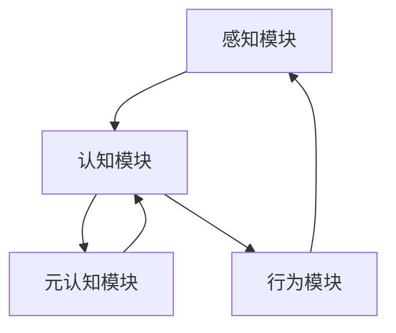
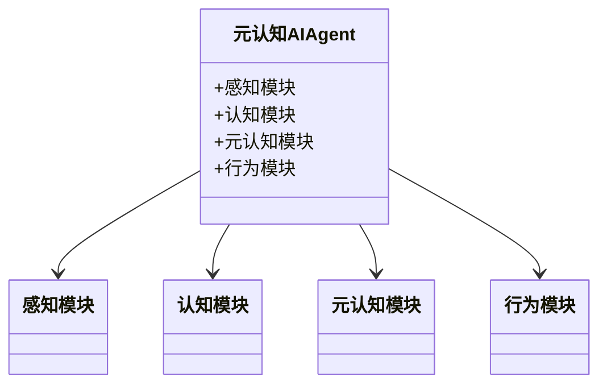

                 


# 构建具有元认知能力的AI Agent

> 关键词：元认知能力, AI Agent, 强化学习, 元学习, 自我反思, 自适应决策

> 摘要：本文深入探讨了构建具有元认知能力的AI Agent的关键技术与方法。通过分析元认知能力的核心概念、算法原理、系统架构，以及实际项目案例，详细阐述了如何在AI Agent中实现自我反思、评估和优化能力，从而使其具备更高级的决策能力和适应性。文章从背景介绍、核心概念、算法实现、系统设计、项目实战等多个维度展开，结合理论与实践，为读者提供了一套完整的构建元认知AI Agent的方法论。

---

## 第1章: 元认知能力与AI Agent的背景与概念

### 1.1 元认知能力的基本概念

#### 1.1.1 什么是元认知能力
元认知能力是指个体对自身认知过程的认知和调控能力，简单来说，就是“思考如何思考”的能力。对于AI Agent而言，元认知能力意味着AI能够反思自身的决策过程、评估当前策略的有效性，并在必要时调整行为模式。

- 元认知能力的核心特征包括：
  - 自我监控：AI Agent能够实时监控自身的认知过程。
  - 自我评估：AI Agent能够评估当前认知行为的正确性和有效性。
  - 自我调节：AI Agent能够根据评估结果调整认知策略。

#### 1.1.2 元认知能力的核心特征
元认知能力不仅仅是一种简单的反馈机制，而是涉及到多个层次的能力：
1. **自我监控**：AI Agent需要实时跟踪自身的认知状态，例如当前使用的算法、数据来源的可靠性等。
2. **自我评估**：AI Agent需要对自身的认知行为进行评估，判断当前策略的有效性。
3. **自我调节**：AI Agent能够根据评估结果调整自身的认知策略，例如更换算法、重新收集数据等。

#### 1.1.3 元认知能力在AI Agent中的应用
元认知能力在AI Agent中的应用主要体现在以下几个方面：
- **动态决策**：AI Agent能够根据环境变化动态调整决策策略。
- **自适应学习**：AI Agent能够根据自身表现优化学习过程。
- **错误修正**：AI Agent能够识别错误并主动采取纠正措施。

### 1.2 AI Agent的基本概念与分类

#### 1.2.1 AI Agent的定义
AI Agent是一种智能体，能够感知环境并采取行动以实现特定目标。AI Agent可以是软件程序、机器人或其他智能系统。

#### 1.2.2 AI Agent的分类
AI Agent可以根据智能水平、环境类型、任务类型等进行分类：
1. **按智能水平**：
   - **反应式AI Agent**：基于当前感知做出反应，不依赖历史信息。
   - **认知式AI Agent**：具备复杂推理和规划能力。
2. **按环境类型**：
   - **静态环境**：环境在AI Agent做出决策后不变。
   - **动态环境**：环境在AI Agent决策过程中可能发生变化。
3. **按任务类型**：
   - **简单任务**：如棋类游戏。
   - **复杂任务**：如自动驾驶、医疗诊断。

#### 1.2.3 元认知AI Agent的独特性
元认知AI Agent的独特性在于其具备自我反思和优化能力：
- **自我反思**：AI Agent能够分析自身的决策过程。
- **自我优化**：AI Agent能够根据分析结果改进自身行为。

---

## 第2章: 元认知AI Agent的背景与问题背景

### 2.1 当前AI Agent的发展现状

#### 2.1.1 传统AI Agent的局限性
传统AI Agent主要依赖预设的规则和数据进行决策，存在以下问题：
- **缺乏灵活性**：无法根据环境变化动态调整策略。
- **难以处理不确定性**：在复杂或动态环境中表现不稳定。
- **缺乏自我改进能力**：无法主动优化自身行为。

#### 2.1.2 元认知能力的引入动机
为了解决上述问题，引入元认知能力成为必然趋势：
- **提高适应性**：元认知能力使AI Agent能够更好地适应复杂环境。
- **增强决策能力**：通过自我反思，AI Agent能够做出更明智的决策。
- **实现自主优化**：元认知能力使AI Agent能够自主改进自身行为。

#### 2.1.3 元认知AI Agent的潜在价值
元认知AI Agent的潜在价值体现在以下几个方面：
- **提升效率**：通过自我优化减少试错成本。
- **增强 robustness**：在动态环境中保持稳定性能。
- **实现自主学习**：无需外部干预即可改进自身能力。

### 2.2 元认知AI Agent的核心问题

#### 2.2.1 问题背景
当前AI Agent的核心问题在于缺乏自我反思和优化能力，难以应对复杂多变的环境。

#### 2.2.2 问题描述
元认知AI Agent需要解决的核心问题包括：
- **如何实现自我监控**：实时跟踪自身认知过程。
- **如何进行自我评估**：准确判断自身行为的有效性。
- **如何实现自我调节**：根据评估结果调整认知策略。

#### 2.2.3 问题解决的路径
为了解决上述问题，可以采取以下路径：
1. **引入元学习算法**：通过元学习算法实现自我优化。
2. **构建元认知模块**：设计专门的元认知模块来监控和评估认知过程。
3. **强化学习结合元认知**：将元认知能力与强化学习结合，提升决策能力。

---

## 第3章: 元认知能力与AI Agent的核心概念与联系

### 3.1 元认知能力的原理

#### 3.1.1 元认知的层次结构
元认知能力可以分为以下几个层次：
1. **元认知知识**：关于认知过程的知识。
2. **元认知调控**：对认知过程的监控和调节。
3. **元认知评价**：对认知过程和结果的评价。

#### 3.1.2 元认知的实现机制
元认知的实现机制包括以下几个方面：
- **自我监控**：通过传感器或日志记录感知自身行为。
- **自我评估**：基于收集的数据进行分析和判断。
- **自我调节**：根据评估结果调整自身行为。

#### 3.1.3 元认知与认知的关系
元认知与认知是相互依存的关系：
- **认知**：处理具体任务，如识别、分类、推理。
- **元认知**：监控和调节认知过程，提升认知效率。

---

## 第4章: 元认知AI Agent的系统架构与设计

### 4.1 系统架构概述

#### 4.1.1 元认知AI Agent的总体架构
元认知AI Agent的总体架构包括以下几个模块：
1. **感知模块**：负责感知环境信息。
2. **认知模块**：负责处理任务，做出决策。
3. **元认知模块**：负责监控和评估认知过程。
4. **行为模块**：负责执行决策。

#### 4.1.2 各模块的功能描述
- **感知模块**：收集环境数据，如视觉、听觉等。
- **认知模块**：处理数据，做出决策。
- **元认知模块**：监控认知过程，评估决策效果。
- **行为模块**：执行决策，与环境交互。

#### 4.1.3 模块之间的交互关系
模块之间的交互关系可以用以下流程图表示：



---

## 第5章: 元认知AI Agent的算法原理

### 5.1 元学习算法

#### 5.1.1 元学习的基本原理
元学习是一种通过学习如何学习的方法。其基本原理是通过在多个任务上进行训练，使得模型能够快速适应新任务。

#### 5.1.2 元学习的数学模型
元学习的数学模型可以用以下公式表示：

$$ \theta_{\text{meta}} = \theta_{\text{base}} + \alpha \cdot \nabla_{\theta_{\text{base}}} \text{Loss} $$

其中：
- $\theta_{\text{meta}}$：元学习参数。
- $\theta_{\text{base}}$：基础任务参数。
- $\alpha$：学习率。
- $\nabla_{\theta_{\text{base}}} \text{Loss}$：基础任务的损失梯度。

#### 5.1.3 元学习的应用场景
元学习适用于以下场景：
- **多任务学习**：在多个任务上进行训练。
- **快速适应新任务**：通过元学习，模型可以快速适应新任务。

### 5.2 强化学习与元认知的结合

#### 5.2.1 强化学习的基本原理
强化学习是一种通过试错机制来学习策略的方法。其基本原理是通过与环境交互，不断优化策略以最大化奖励。

#### 5.2.2 元认知在强化学习中的应用
元认知在强化学习中的应用主要体现在以下几个方面：
- **策略评估**：元认知模块可以评估当前策略的有效性。
- **策略调整**：元认知模块可以根据评估结果调整策略。

---

## 第6章: 元认知AI Agent的系统分析与架构设计

### 6.1 系统功能设计

#### 6.1.1 领域模型设计
领域模型可以用以下类图表示：



---

## 第7章: 元认知AI Agent的项目实战

### 7.1 环境安装

#### 7.1.1 安装Python
安装Python 3.x版本。

#### 7.1.2 安装依赖库
安装以下依赖库：

```bash
pip install numpy matplotlib
```

---

## 第8章: 总结与展望

### 8.1 总结
本文详细探讨了构建具有元认知能力的AI Agent的关键技术与方法，从背景介绍、核心概念、算法原理、系统设计到项目实战，为读者提供了一套完整的构建方法论。

### 8.2 未来展望
元认知AI Agent的研究与应用前景广阔，未来可以在以下几个方面进行深入研究：
1. **提升元认知能力的深度**：开发更复杂的元认知算法。
2. **扩展应用场景**：将元认知AI Agent应用于更多领域。
3. **优化系统架构**：设计更高效的系统架构。

---

## 作者：AI天才研究院 & 禅与计算机程序设计艺术

---

以上是文章的完整目录大纲，您可以根据需要选择性地展开具体内容。

