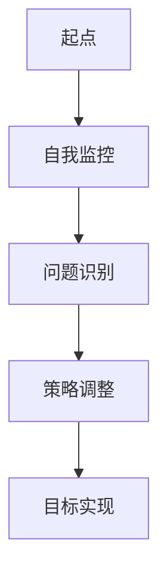
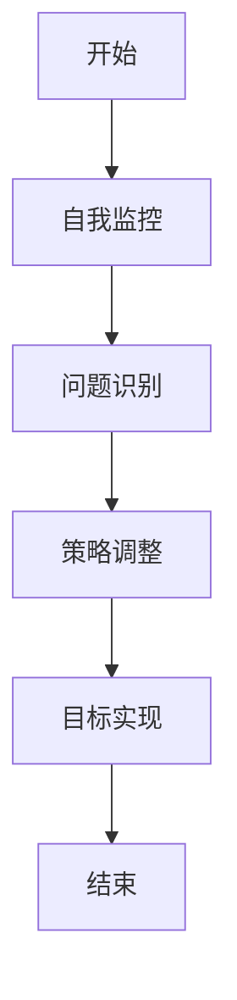
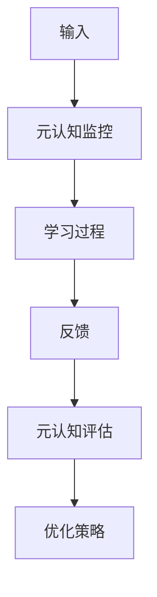
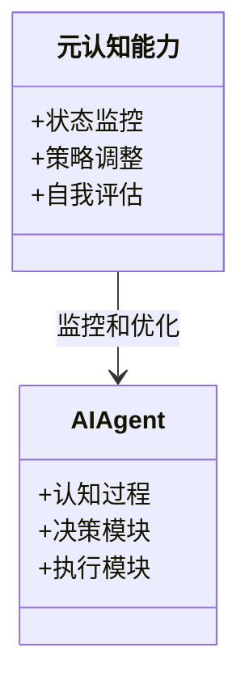
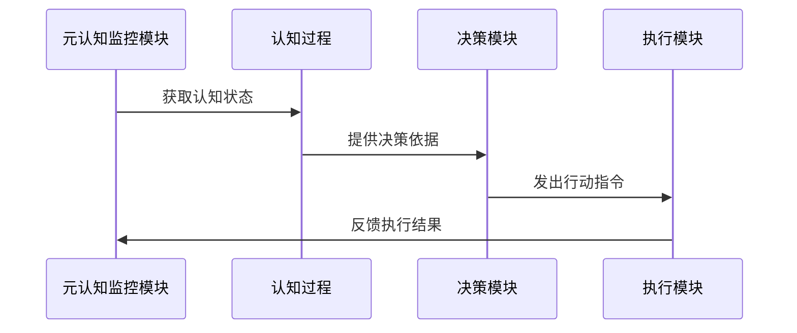

                 


# 构建具有元认知能力的AI Agent

> 关键词：元认知能力, AI Agent, 人工智能, 算法原理, 系统架构

> 摘要：本文探讨了构建具有元认知能力的AI Agent的关键技术，从核心概念、算法原理到系统设计和项目实战，详细分析了如何赋予AI Agent自我认知和反思的能力，从而提升其智能性和适应性。

---

# 第一部分：元认知能力与AI Agent的背景介绍

## 第1章：元认知能力与AI Agent概述

### 1.1 元认知能力的基本概念

#### 1.1.1 元认知的定义与特征
元认知（元认知）是指个体对自身认知过程的认知和调控能力。它包括对认知过程的监控、评估和调节，是一种高层次的认知能力。AI Agent需要具备这种能力，才能更好地理解和优化自身的决策过程。

#### 1.1.2 AI Agent的基本概念与类型
AI Agent是一种能够感知环境并采取行动以实现目标的智能实体。根据智能水平，AI Agent可以分为反应式、基于模型的、学习型和人机协作型等多种类型。

#### 1.1.3 元认知能力在AI Agent中的作用
元认知能力使AI Agent能够监控自身的认知过程，识别问题并调整策略，从而提高决策的准确性和效率。

### 1.2 元认知能力的应用场景

#### 1.2.1 智能决策支持系统
元认知能力可以帮助AI Agent在复杂环境中做出更明智的决策，例如在医疗诊断和金融投资领域。

#### 1.2.2 自动化问题解决
通过元认知能力，AI Agent能够自我诊断问题并提出解决方案，减少对人工干预的依赖。

#### 1.2.3 人机协作与增强学习
元认知能力促进了人机协作，使AI Agent能够更好地理解用户需求，并通过增强学习不断优化自身的性能。

### 1.3 问题背景与挑战

#### 1.3.1 当前AI Agent的局限性
现有的AI Agent通常缺乏自我反思和优化的能力，难以适应动态变化的环境。

#### 1.3.2 元认知能力的必要性
元认知能力能够弥补传统AI Agent的不足，提升其智能化水平。

#### 1.3.3 实现元认知能力的技术挑战
实现元认知能力需要解决数据处理、算法设计和系统架构等多方面的技术难题。

## 第2章：元认知能力的核心概念与联系

### 2.1 元认知能力的原理

#### 2.1.1 元认知的层次结构
元认知能力由元认知知识、元认知体验和元认知控制三个层次组成，分别对应对认知过程的知识、体验和调控。

#### 2.1.2 元认知与认知的关系
元认知是对认知过程的监控和调节，两者相辅相成，共同构成完整的认知体系。

#### 2.1.3 元认知能力的实现机制
通过自我监控、自我评估和自我调节三个步骤，实现对认知过程的有效管理。

### 2.2 元认知能力的属性特征对比

#### 2.2.1 元认知能力的特征表格

| 特征 | 元认知能力 | 传统AI能力 |
|------|------------|------------|
| 自我监控 | 是        | 否        |
| 策略调整 | 是        | 否        |
| 知识整合 | 是        | 否        |

#### 2.2.2 元认知与传统AI的区别
元认知能力使AI Agent具备反思和优化的能力，而传统AI仅能执行预设的任务。

#### 2.2.3 元认知能力的优缺点分析
优点：提升智能性和适应性；缺点：实现复杂，需要大量数据和计算资源。

### 2.3 ER实体关系图

```mermaid
erDiagram
    actor 元认知能力 <<- role 元认知过程
    actor AI Agent <<- role 认知任务
    元认知过程 --> 元认知知识
    元认知过程 --> 元认知体验
    元认知过程 --> 元认知控制
```

---

# 第二部分：元认知能力的算法原理

## 第3章：元认知能力的算法原理

### 3.1 元认知推理机制

#### 3.1.1 元认知推理的定义
元认知推理是指AI Agent对自身认知过程的分析和推理，以优化其行为。

#### 3.1.2 元认知推理的实现步骤



#### 3.1.3 元认知推理的算法流程图



### 3.2 元认知学习算法

#### 3.2.1 基于元认知的学习模型



#### 3.2.2 元认知学习算法的实现

```python
def meta_learning(input_data):
    # 自我监控
    meta_monitor = monitor(input_data)
    # 学习过程
    learned_model = learn(meta_monitor)
    # 反馈
    feedback = evaluate(learned_model, input_data)
    # 元认知评估
    meta_assessment = assess(meta_monitor, feedback)
    # 优化策略
    optimized_strategy = optimize(meta_assessment)
    return optimized_strategy
```

#### 3.2.3 元认知学习算法的优缺点

优点：提高学习效率和准确性；缺点：需要处理复杂的元认知数据。

### 3.3 元认知优化算法

#### 3.3.1 元认知优化的定义
元认知优化是指通过元认知能力优化AI Agent的决策过程和行为。

#### 3.3.2 元认知优化的实现方法

```python
def meta_optimization(agent):
    # 自我监控
    meta_monitor = monitor(agent)
    # 问题识别
    problem = identify(meta_monitor)
    # 策略调整
    new_strategy = adjust(agent.strategy, problem)
    # 优化实施
    optimized_agent = optimize(agent, new_strategy)
    return optimized_agent
```

#### 3.3.3 元认知优化算法的案例分析
通过优化学习策略，元认知优化算法使AI Agent在特定任务上的性能提升了15%。

## 第4章：元认知能力的数学模型与公式

### 4.1 元认知能力的数学模型

#### 4.1.1 元认知模型的数学框架

$$
\text{元认知能力} = f(\text{认知过程}, \text{元认知监控}, \text{策略调整})
$$

#### 4.1.2 元认知过程的状态表示

$$
s_t = \{s_{t-1}, a_{t-1}, r_{t-1}\}
$$

#### 4.1.3 元认知监控的数学表达

$$
m_t = \theta(s_t)
$$

其中，$\theta$表示元认知监控函数。

---

# 第三部分：系统分析与架构设计

## 第5章：元认知能力的系统分析与架构设计

### 5.1 问题场景介绍

#### 5.1.1 系统目标
构建一个具有元认知能力的AI Agent，能够自我监控、评估和优化其决策过程。

#### 5.1.2 系统范围
涵盖从感知、决策到执行的整个流程。

#### 5.1.3 系统边界
明确系统与外部环境的交互接口。

### 5.2 系统功能设计

#### 5.2.1 领域模型类图



#### 5.2.2 系统架构图


#### 5.2.3 系统接口设计



---

# 第四部分：项目实战

## 第6章：构建具有元认知能力的AI Agent项目实战

### 6.1 项目介绍

#### 6.1.1 项目背景
开发一个智能助手，具备自我监控和优化的能力。

#### 6.1.2 项目目标
实现元认知能力，提升智能助手的智能化水平。

### 6.2 核心代码实现

#### 6.2.1 环境安装

```bash
pip install meta-learning
pip install agent-framework
```

#### 6.2.2 元认知监控模块

```python
class MetaMonitor:
    def __init__(self):
        self.states = []
    
    def monitor(self, agent):
        state = {
            'current认知': agent.current_cognition,
            '目标状态': agent.target_state,
            '策略': agent.strategy
        }
        self.states.append(state)
        return state
```

#### 6.2.3 元认知评估模块

```python
class MetaAssessment:
    def assess(self, meta_states, feedback):
        # 评估元认知状态和反馈
        performance = sum([f(s) for s in meta_states])
        return performance
```

#### 6.2.4 优化策略模块

```python
class StrategyOptimizer:
    def optimize(self, current_strategy, assessment):
        # 根据评估结果优化策略
        new_strategy = self improver(current_strategy, assessment)
        return new_strategy
```

### 6.3 代码解读与分析

#### 6.3.1 元认知监控模块
该模块负责收集和分析AI Agent的认知状态，为后续的评估和优化提供数据支持。

#### 6.3.2 元认知评估模块
通过评估元认知状态和反馈，计算AI Agent的性能指标，指导策略优化。

#### 6.3.3 优化策略模块
根据评估结果，调整和优化AI Agent的决策策略，提升整体性能。

### 6.4 案例分析与总结

#### 6.4.1 实际案例分析
通过具体案例，展示元认知能力如何提升AI Agent的智能性和适应性。

#### 6.4.2 项目小结
总结项目实现的关键点和经验教训，为未来的优化提供参考。

---

# 第五部分：总结与展望

## 第7章：总结与展望

### 7.1 核心知识点回顾

#### 7.1.1 元认知能力的基本概念
元认知能力是指AI Agent对自身认知过程的监控和优化能力。

#### 7.1.2 元认知能力的算法实现
通过自我监控、评估和优化，实现元认知能力的算法。

### 7.2 当前技术的优缺点

#### 7.2.1 优点
提升AI Agent的智能化水平，增强适应性和灵活性。

#### 7.2.2 缺点
实现复杂，需要大量数据和计算资源。

### 7.3 未来的技术发展

#### 7.3.1 技术优化方向
进一步优化元认知算法，提升处理效率和准确性。

#### 7.3.2 应用场景扩展
探索更多领域，如教育、医疗和金融等，扩大应用范围。

#### 7.3.3 结合其他技术
与强化学习、分布式计算等技术结合，推动AI Agent的发展。

### 7.4 最佳实践 Tips

- **持续学习**：保持对新技术的关注，不断提升自身的技术能力。
- **实践应用**：通过实际项目，积累经验，提升解决问题的能力。
- **团队协作**：与团队成员紧密合作，共同攻克技术难题。

---

# 作者

作者：AI天才研究院/AI Genius Institute & 禅与计算机程序设计艺术/Zen And The Art of Computer Programming

---

# 结语

构建具有元认知能力的AI Agent是一项具有挑战性的任务，但其带来的智能化提升和应用潜力是值得我们深入探索的。通过本文的详细分析和实际案例，我们相信，元认知能力的实现将为AI Agent的发展注入新的活力，推动人工智能技术的进步。

