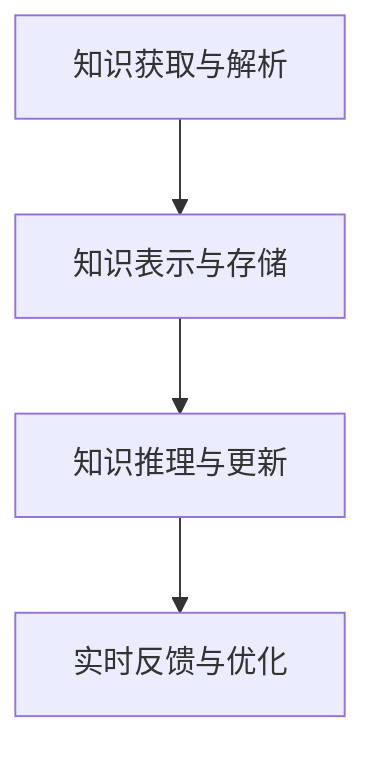
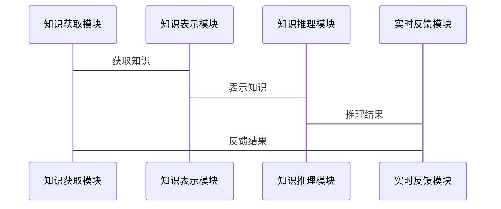

                 


# 《构建具有动态知识更新能力的AI Agent》

---

## 关键词
- AI Agent
- 动态知识更新
- 自适应学习
- 知识图谱
- 实时反馈
- 系统架构

---

## 摘要
在人工智能快速发展的今天，AI Agent（智能体）已经广泛应用于各个领域。然而，传统的AI Agent在知识更新方面存在静态化、滞后性等问题，难以应对动态变化的环境。本书旨在探讨如何构建具有动态知识更新能力的AI Agent，通过结合知识图谱、概率推理、实时反馈等技术，提出一种全新的动态知识更新框架。我们从问题背景、核心概念、算法原理、系统架构到项目实战，逐步展开，最终实现一个能够实时更新知识、自适应学习的AI Agent。

---

# 第一部分：引言

## 第1章：问题背景与目标

### 1.1 问题背景

#### 1.1.1 当前AI Agent的发展现状
AI Agent作为一种能够感知环境、自主决策的智能体，已在多个领域展现出强大的应用潜力。然而，现有的AI Agent在知识更新方面存在静态化的问题，知识库通常需要人工维护或定期更新，难以应对动态变化的环境。

#### 1.1.2 动态知识更新的必要性
在现实场景中，环境是动态变化的，例如用户需求、市场信息、知识库的更新等。AI Agent需要能够实时感知这些变化，并快速调整自身的知识库和决策策略。

#### 1.1.3 传统AI Agent的局限性
传统的AI Agent通常基于静态知识库进行推理和决策，无法实时更新知识，导致在动态环境中表现不佳。此外，知识表示和更新的技术也相对落后，难以支持大规模、实时的知识更新。

### 1.2 问题描述

#### 1.2.1 动态知识更新的核心问题
动态知识更新的核心问题是如何高效地获取、表示、推理和更新知识。具体包括：
- 知识获取与解析：如何从多源异构数据中获取知识？
- 知识表示与存储：如何高效地表示和存储动态知识？
- 知识推理与更新：如何根据新知识动态调整推理结果？

#### 1.2.2 知识表示与更新的挑战
知识表示的挑战包括：
- 知识的动态性：知识不断变化，如何保持知识表示的准确性？
- 知识的复杂性：知识之间存在复杂的关联，如何高效表示？
- 知识的不完整性和不确定性：如何处理不完整或不确定的知识？

#### 1.2.3 AI Agent与知识图谱的结合
知识图谱是一种强大的知识表示形式，能够将实体及其关系以图结构的形式表示。AI Agent可以利用知识图谱进行推理和决策，但如何实现动态更新是关键。

### 1.3 问题解决思路

#### 1.3.1 动态知识更新的总体框架
动态知识更新的总体框架包括：
1. 知识获取与解析：从多种数据源获取知识，并进行解析和结构化。
2. 知识表示与存储：将知识表示为图结构，并存储在知识库中。
3. 知识推理与更新：根据新知识动态调整推理结果，并更新知识库。

#### 1.3.2 知识表示与推理的解决方案
解决方案包括：
- 使用知识图谱表示知识。
- 基于概率推理模型进行动态推理。
- 引入实时反馈机制，根据环境变化动态调整知识。

#### 1.3.3 实时更新与反馈机制的设计
实时更新与反馈机制的设计包括：
- 基于事件驱动的更新策略。
- 基于概率的动态更新模型。
- 实时反馈的优化策略。

### 1.4 边界与外延

#### 1.4.1 知识更新的边界条件
知识更新的边界条件包括：
- 更新的范围：局部更新还是全局更新？
- 更新的频率：实时更新还是周期性更新？
- 更新的粒度：细粒度更新还是粗粒度更新？

#### 1.4.2 相关领域的区别与联系
相关领域包括：
- 动态知识图谱：专注于知识图谱的动态更新。
- 实时计算：专注于实时数据处理。
- 自适应系统：专注于系统的自适应调整。

#### 1.4.3 核心概念的结构与组成
核心概念的结构与组成包括：
- 知识获取：数据源、解析器。
- 知识表示：图结构、符号表示。
- 知识推理：推理算法、推理引擎。
- 知识更新：更新规则、更新引擎。

---

## 第2章：核心概念与联系

### 2.1 动态知识更新的核心概念

#### 2.1.1 知识获取与解析
知识获取与解析是动态知识更新的第一步，包括从多种数据源（如数据库、API、文本等）获取数据，并将其结构化为可表示的知识。

#### 2.1.2 知识表示与存储
知识表示与存储是动态知识更新的关键，通常使用知识图谱的形式，将知识表示为图结构，并存储在知识库中。

#### 2.1.3 知识推理与更新
知识推理与更新是动态知识更新的核心，根据新知识动态调整推理结果，并更新知识库。

---

## 第3章：动态知识更新的算法原理

### 3.1 算法原理

#### 3.1.1 基于概率的动态更新模型
基于概率的动态更新模型是一种高效的动态知识更新方法，通过概率推理模型动态调整知识的权重。

#### 3.1.2 知识图谱的动态扩展算法
知识图谱的动态扩展算法是一种基于图结构的动态更新方法，通过增量式更新扩展知识图谱。

#### 3.1.3 实时反馈的优化方法
实时反馈的优化方法是一种基于反馈机制的优化策略，通过实时反馈调整知识更新的优先级。

### 3.2 算法实现

#### 3.2.1 知识获取与解析的代码实现
```python
# 知识获取与解析的代码实现
def get_data():
    # 获取数据
    pass

def parse_data(data):
    # 解析数据
    pass
```

#### 3.2.2 知识表示与存储的代码实现
```python
# 知识表示与存储的代码实现
def represent_knowledge(data):
    # 知识表示
    pass

def store_knowledge(knowledge):
    # 知识存储
    pass
```

#### 3.2.3 动态更新的代码实现
```python
# 动态更新的代码实现
def update_knowledge(knowledge, new_data):
    # 动态更新
    pass
```

### 3.3 数学模型与公式

#### 3.3.1 知识图谱的表示方法
$$
\text{知识图谱} = \{ (s, p, o) \}
$$

#### 3.3.2 基于图的推理算法
$$
\text{推理结果} = \text{推理算法}(\text{知识图谱})
$$

#### 3.3.3 动态更新的数学公式
$$
\text{更新后知识图谱} = \text{更新算法}(\text{旧知识图谱}, \text{新知识})
$$

---

## 第4章：系统分析与架构设计

### 4.1 系统架构设计

#### 4.1.1 系统功能设计
系统功能设计包括：
- 知识获取与解析模块。
- 知识表示与存储模块。
- 知识推理与更新模块。
- 实时反馈与优化模块。

#### 4.1.2 系统架构图


#### 4.1.3 系统接口设计
系统接口设计包括：
- 知识获取接口。
- 知识表示接口。
- 知识推理接口。
- 实时反馈接口。

#### 4.1.4 系统交互流程


---

## 第5章：项目实战

### 5.1 环境安装

#### 5.1.1 安装依赖
```bash
pip install knowledge-graph
pip install probabilistic-reasoning
```

### 5.2 核心代码实现

#### 5.2.1 知识获取与解析
```python
def get_data():
    # 获取数据
    pass

def parse_data(data):
    # 解析数据
    pass
```

#### 5.2.2 知识表示与存储
```python
def represent_knowledge(data):
    # 知识表示
    pass

def store_knowledge(knowledge):
    # 知识存储
    pass
```

#### 5.2.3 知识推理与更新
```python
def update_knowledge(knowledge, new_data):
    # 动态更新
    pass
```

### 5.3 实际案例分析

#### 5.3.1 案例分析
```python
# 示例代码
knowledge = {
    '实体': ['A', 'B', 'C'],
    '关系': [('A', 'relatedTo', 'B'), ('B', 'relatedTo', 'C')]
}

new_data = {
    '实体': ['D'],
    '关系': [('C', 'relatedTo', 'D')]
}

updated_knowledge = update_knowledge(knowledge, new_data)
```

---

## 第6章：高级主题与未来展望

### 6.1 高级主题

#### 6.1.1 知识图谱的实时更新
知识图谱的实时更新是一种高效的动态知识更新方法，通过增量式更新扩展知识图谱。

#### 6.1.2 自适应学习的优化策略
自适应学习的优化策略是一种基于反馈机制的优化策略，通过实时反馈调整知识更新的优先级。

#### 6.1.3 AI Agent与边缘计算的结合
AI Agent与边缘计算的结合是一种新兴的技术趋势，通过将AI Agent部署在边缘设备上，实现实时推理和决策。

### 6.2 未来展望

#### 6.2.1 动态知识更新的前沿技术
动态知识更新的前沿技术包括：
- 基于强化学习的动态更新。
- 基于图神经网络的动态推理。
- 基于边缘计算的实时更新。

#### 6.2.2 AI Agent在各领域的应用潜力
AI Agent在各领域的应用潜力包括：
- 教育领域：个性化学习助手。
- 医疗领域：动态病案管理。
- 金融领域：实时风险评估。

---

## 第7章：总结与参考文献

### 7.1 总结
本书系统地介绍了构建具有动态知识更新能力的AI Agent的理论与实践。通过结合知识图谱、概率推理、实时反馈等技术，提出了一种全新的动态知识更新框架。我们从问题背景、核心概念、算法原理、系统架构到项目实战，逐步展开，最终实现了一个能够实时更新知识、自适应学习的AI Agent。

### 7.2 参考文献
1. 知识图谱相关论文
2. 动态知识更新相关论文
3. AI Agent相关论文
4. 实时反馈机制相关论文

---

## 作者：AI天才研究院 & 禅与计算机程序设计艺术

---

感谢您的耐心阅读！希望这本书能为构建具有动态知识更新能力的AI Agent提供有价值的参考和指导。

