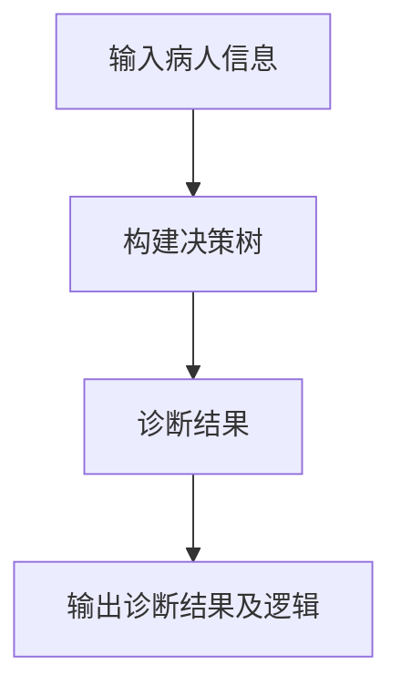
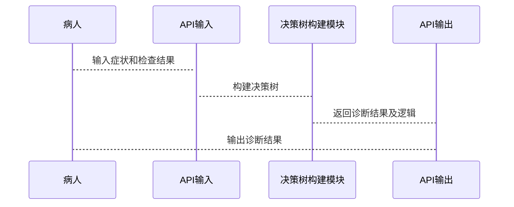

                 


# 构建具有可解释性决策树的AI Agent

> **关键词**：可解释性AI，决策树，AI Agent，机器学习，算法原理

> **摘要**：本文详细探讨了构建具有可解释性决策树的AI Agent的方法，从背景介绍、核心概念、算法原理、系统设计到项目实战，层层深入，为读者提供全面的技术解析。通过本文，读者将了解如何在AI Agent中实现可解释性决策树，并掌握其在实际应用中的优势与挑战。

---

## 第一部分：背景介绍

### 第1章：问题背景

#### 1.1 可解释性AI的重要性
在AI技术快速发展的今天，AI Agent的应用场景日益广泛，从医疗诊断到金融投资，再到自动驾驶，AI Agent的决策直接影响着人们的生活和安全。然而，AI Agent的决策过程往往被视为“黑箱”，缺乏透明性和可解释性。这不仅让用户难以信任AI的决策，还可能导致法律和伦理问题。因此，构建具有可解释性决策树的AI Agent变得尤为重要。

#### 1.2 AI Agent的定义与特点
AI Agent是一种能够感知环境、自主决策并采取行动的智能体。它具备以下特点：
- **自主性**：能够在没有外部干预的情况下独立运作。
- **反应性**：能够实时感知环境变化并做出反应。
- **目标导向性**：基于目标和策略进行决策。
- **可解释性**：决策过程透明，用户能够理解AI的决策逻辑。

#### 1.3 决策树在AI Agent中的作用
决策树是一种直观的树状结构，能够清晰地展示决策过程。在AI Agent中，决策树用于将复杂的问题分解为简单且易于理解的决策节点，帮助AI Agent做出合理的决策。通过决策树，用户可以直观地看到AI的决策逻辑，从而增强对AI Agent的信任。

---

### 第2章：问题描述

#### 2.1 AI Agent决策过程的复杂性
AI Agent的决策过程涉及大量的数据处理和复杂的计算，这使得决策过程难以被普通用户理解。例如，在医疗诊断中，AI Agent需要分析病人的症状、病史、检查结果等多方面的信息，最终得出诊断结果。如果用户无法理解AI的决策逻辑，就很难信任AI的诊断结果。

#### 2.2 可解释性在AI Agent中的需求
随着AI技术的广泛应用，用户对AI Agent的决策过程提出了更高的要求。用户不仅希望AI能够做出正确的决策，还希望了解决策的依据和逻辑。这种需求在医疗、金融等高风险领域尤为突出。

#### 2.3 决策树在可解释性AI中的优势
相比其他机器学习模型（如神经网络），决策树具有以下优势：
- **直观性**：决策树以树状结构展示决策过程，用户可以轻松理解。
- **可解释性**：每个决策节点的含义清晰，用户能够追溯AI的决策逻辑。
- **透明性**：决策树的构建过程透明，用户可以验证AI的决策是否合理。

---

## 第二部分：核心概念与联系

### 第3章：决策树的核心原理

#### 3.1 决策树的结构
决策树由以下几个部分组成：
- **根节点**：决策的起点，通常表示问题的初始状态。
- **决策节点**：表示在某个条件下需要做出的决策。
- **叶子节点**：表示决策的结果，通常是一个具体的答案或动作。
- **分支**：表示从一个节点到另一个节点的决策路径。

#### 3.2 决策树的分类与回归
- **分类树**：用于分类问题，例如判断一个人是否患有某种疾病。
- **回归树**：用于回归问题，例如预测房价。

#### 3.3 决策树的优缺点
- **优点**：
  - 直观易懂，用户能够理解决策过程。
  - 适用于分类和回归问题。
- **缺点**：
  - 对噪声数据敏感，容易过拟合。
  - 决策树的深度可能过大，导致计算复杂。

---

### 第4章：可解释性AI的核心概念

#### 4.1 可解释性AI的定义
可解释性AI是指AI系统能够清晰地解释其决策过程，让用户能够理解AI的决策逻辑。这不仅提高了用户对AI的信任，还能够帮助开发者发现和修正模型中的问题。

#### 4.2 可解释性AI的实现方法
- **决策树**：通过树状结构展示决策过程。
- **规则集**：将决策过程转化为一系列可理解的规则。
- **模型解释工具**：如SHAP（Shapley Additive exPlanations）和LIME（Local Interpretable Model-agnostic Explanations）。

#### 4.3 可解释性AI的应用领域
- **医疗**：帮助医生理解AI诊断的依据。
- **金融**：用于信用评估和欺诈检测。
- **法律**：辅助法律判决的分析和解释。

---

## 第三部分：算法原理讲解

### 第5章：决策树算法的数学模型

#### 5.1 ID3算法
ID3算法基于信息论，通过计算信息增益来选择最优的决策节点。其公式为：
$$
\text{信息增益} = \text{熵}(D) - \text{期望熵}(D, A)
$$
其中，$D$是数据集，$A$是候选的特征。

#### 5.2 C4.5算法
C4.5算法是对ID3算法的改进，引入了信息增益率的概念，以避免ID3算法对偏态数据的敏感性。其公式为：
$$
\text{信息增益率} = \frac{\text{信息增益}(D, A)}{\text{熵}(A)}
$$

#### 5.3 C5.0算法
C5.0算法是C4.5的优化版本，提高了计算效率，并支持更多的特征选择策略。

---

### 第6章：决策树算法的实现

#### 6.1 决策树的构建过程
1. 选择最优特征，构建根节点。
2. 根据特征值划分数据集。
3. 递归地构建子树，直到叶子节点。

#### 6.2 决策树的剪枝方法
- **预剪枝**：在构建过程中提前剪枝，避免过拟合。
- **后剪枝**：在构建完成后剪枝，通过交叉验证选择最优剪枝点。

#### 6.3 决策树的优化策略
- **特征选择**：选择对决策影响最大的特征。
- **参数调节**：如决策树的深度和叶子节点的最小样本数。

---

## 第四部分：系统分析与架构设计方案

### 第7章：问题场景介绍

#### 7.1 AI Agent的决策需求
在医疗诊断场景中，AI Agent需要根据病人的症状、检查结果等信息，诊断是否患有某种疾病。

#### 7.2 可解释性决策树的应用场景
通过决策树，医生可以清晰地看到AI诊断的逻辑，了解每个决策节点的依据。

#### 7.3 系统设计的目标
构建一个基于可解释性决策树的AI Agent，能够在医疗诊断中提供透明的决策过程。

---

### 第8章：系统功能设计

#### 8.1 领域模型设计
- **病人信息**：包括症状、病史、检查结果等。
- **诊断规则**：基于决策树的诊断逻辑。

#### 8.2 系统功能模块划分
- **数据输入模块**：接收病人的信息。
- **决策树构建模块**：根据输入数据构建决策树。
- **诊断结果输出模块**：输出诊断结果及决策逻辑。

#### 8.3 系统功能流程图


---

### 第9章：系统架构设计

#### 9.1 系统架构图


#### 9.2 系统接口设计
- **输入接口**：接收病人信息的API。
- **输出接口**：返回诊断结果及决策逻辑的API。

#### 9.3 系统交互流程图


---

## 第五部分：项目实战

### 第10章：环境安装与配置

#### 10.1 Python环境安装
- 安装Python 3.8及以上版本。
- 安装必要的库：`scikit-learn`, `graphviz`, `ipython`.

---

### 第11章：系统核心实现源代码

#### 11.1 决策树构建代码
```python
from sklearn.tree import DecisionTreeClassifier
from sklearn import tree
import graphviz

# 示例数据集
features = ['症状1', '症状2', '症状3']
classes = ['健康', '患病']

# 构建决策树
clf = DecisionTreeClassifier()
clf.fit(features_data, classes_data)

# 可视化决策树
dot_data = tree.export_graphviz(clf, out_file=None, feature_names=features, class_names=classes)
graphviz.Source(dot_data)
```

---

### 第12章：案例分析与解读

#### 12.1 医疗诊断案例
假设有一个病人，症状1为“发烧”，症状2为“咳嗽”，症状3为“乏力”。AI Agent通过决策树判断病人是否患有某种疾病。

---

## 第六部分：总结与展望

### 第13章：最佳实践

#### 13.1 小结
本文详细介绍了构建具有可解释性决策树的AI Agent的方法，从理论到实践，为读者提供了全面的技术解析。通过本文，读者可以掌握决策树的基本原理、可解释性AI的核心概念，以及如何在实际应用中构建和优化决策树。

#### 13.2 注意事项
- 在实际应用中，需要注意决策树的深度和特征选择，以避免过拟合和计算复杂度过高的问题。
- 可解释性AI的实现需要结合具体的业务场景，选择合适的解释方法。

#### 13.3 拓展阅读
- 推荐阅读《可解释性AI：从理论到实践》和《决策树算法的优化与应用》。

---

**作者**：AI天才研究院/AI Genius Institute & 禅与计算机程序设计艺术 /Zen And The Art of Computer Programming

---

通过本文的系统讲解，读者可以深入理解可解释性决策树的构建方法，并将其应用于实际的AI Agent开发中。希望本文能够为可解释性AI的研究和应用提供有价值的参考。

