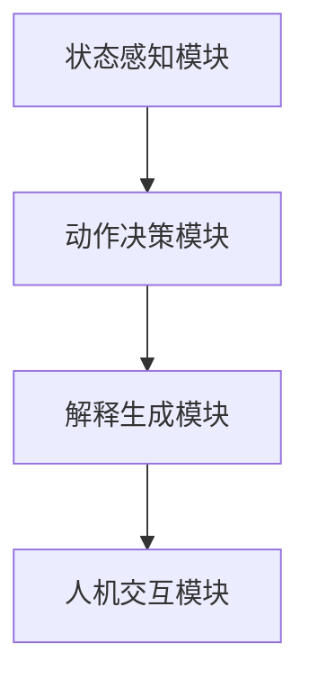
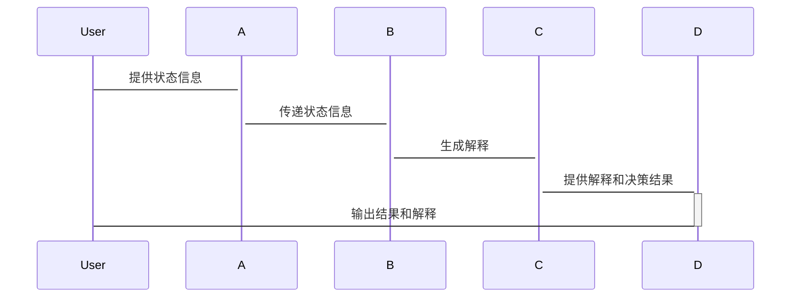

                 


# 构建具有可解释性强化学习能力的AI Agent

> 关键词：强化学习，可解释性AI，AI Agent，系统架构设计，算法实现，项目实战

> 摘要：本文将详细介绍如何构建一个具有可解释性强化学习能力的AI Agent。从强化学习的基本原理到可解释性AI的核心概念，从算法实现到系统架构设计，再到项目实战，全面解析如何在AI Agent中实现可解释性强化学习。通过本文的学习，读者将能够理解并掌握构建这样一个AI Agent的方法和技巧。

---

# 第1章: 强化学习与可解释性AI概述

## 1.1 强化学习的基本概念

### 1.1.1 强化学习的定义与核心概念

强化学习（Reinforcement Learning，RL）是一种机器学习范式，其中智能体通过与环境交互来学习策略，以最大化累积奖励。其核心概念包括：

- **智能体（Agent）**：在环境中采取行动的主体。
- **环境（Environment）**：智能体所处的外部世界，可以是物理环境或抽象空间。
- **状态（State）**：环境在某一时刻的描述。
- **动作（Action）**：智能体在某一状态下采取的行为。
- **奖励（Reward）**：智能体采取行动后获得的反馈，用于指导学习。
- **策略（Policy）**：智能体选择动作的规则，可以是确定性的或概率性的。

### 1.1.2 强化学习的数学模型与公式

强化学习的数学模型可以用以下公式表示：

$$ Q(s, a) = \max_{a'} Q(s', a') $$

其中，$Q(s, a)$ 表示在状态 $s$ 下采取动作 $a$ 的价值，$s'$ 是下一个状态，$a'$ 是下一个动作。

### 1.1.3 强化学习的应用场景

强化学习广泛应用于游戏AI、机器人控制、资源分配、自动驾驶等领域。例如，在自动驾驶中，智能体通过不断尝试不同的驾驶动作（如加速、减速、转向）来学习如何在复杂的交通环境中做出最优决策。

### 1.1.4 强化学习的挑战

- **探索与利用的平衡**：智能体需要在探索新动作和利用已知最优动作之间找到平衡。
- **高维状态空间**：在复杂环境中，状态空间的维度可能非常高，导致计算困难。
- **稀疏反馈**：奖励信号可能非常稀疏，使得学习过程缓慢。

### 1.1.5 强化学习的核心要素

| 核心要素 | 描述 |
|----------|------|
| 状态空间 | 智能体所处环境的所有可能状态 |
| 动作空间 | 智能体在每个状态下可采取的所有动作 |
| 奖励函数 | 定义智能体在采取某个动作后获得的奖励 |
| 策略空间 | 智能体选择动作的规则或方法 |

## 1.2 可解释性AI的核心概念

### 1.2.1 可解释性AI的定义

可解释性AI（Explainable AI，XAI）是指AI系统在做出决策时，能够以人类可理解的方式解释其决策过程和结果。可解释性是信任AI系统的重要前提。

### 1.2.2 可解释性在强化学习中的重要性

在强化学习中，智能体的行为可能看似随机，缺乏明确的逻辑。因此，可解释性强化学习的目标是让智能体的决策过程透明化，帮助人类理解其行为背后的逻辑。

### 1.2.3 可解释性AI的挑战与解决方案

- **挑战**：
  - 强化学习的决策过程通常是基于复杂的非线性模型，缺乏直观的解释。
  - 高维状态和动作空间使得解释变得复杂。
- **解决方案**：
  - 使用规则-based方法：将决策过程转化为可解释的规则。
  - 使用模型-based方法：通过构建解释性模型来描述决策过程。
  - 使用事后解释方法：在决策后生成可理解的解释。

### 1.2.4 可解释性AI的核心要素

| 核心要素 | 描述 |
|----------|------|
| 解释性规则 | 用于描述AI决策的规则或逻辑 |
| 解释性模型 | 可以被人类理解的模型，用于解释AI的决策过程 |
| 解释生成模块 | 专门用于生成可理解的解释的模块 |

## 1.3 强化学习与可解释性AI的结合

### 1.3.1 强化学习中可解释性的需求

随着强化学习应用的普及，特别是在高风险领域（如医疗、金融），对AI决策过程的解释性需求日益增加。可解释性强化学习能够帮助人类理解AI的决策逻辑，从而提高系统的信任度和可靠性。

### 1.3.2 可解释性强化学习的实现方法

- **基于规则的方法**：通过预定义的规则来约束AI的决策过程，使其行为更加透明。
- **基于模型的方法**：构建解释性的模型，如状态转移模型和价值函数模型，用于解释AI的决策过程。
- **事后解释方法**：在AI做出决策后，生成可理解的解释，帮助用户理解决策背后的逻辑。

### 1.3.3 可解释性强化学习的应用前景

- **医疗领域**：可解释性强化学习可以帮助医生理解AI的诊断建议背后的逻辑。
- **金融领域**：可以帮助分析师理解AI的投资决策过程。
- **自动驾驶**：可以提高自动驾驶系统的透明度，增强用户信任。

### 1.3.4 本章小结

本章介绍了强化学习和可解释性AI的基本概念，并探讨了两者结合的重要性。通过可解释性强化学习，AI系统能够以人类可理解的方式解释其决策过程，从而提高系统的可信度和应用范围。

---

# 第2章: 强化学习的基本原理

## 2.1 强化学习的核心算法

### 2.1.1 Q-learning算法

Q-learning是一种经典的强化学习算法，适用于离线学习场景。其核心思想是通过不断更新Q值函数，学习每个状态-动作对的价值。

#### 算法步骤

1. 初始化Q表为零。
2. 在当前状态下，选择一个动作。
3. 执行该动作，观察新的状态和获得的奖励。
4. 更新Q表中的对应值：$$ Q(s, a) = Q(s, a) + \alpha (r + \max Q(s', a')) $$
5. 重复上述步骤，直到收敛。

#### 代码示例

```python
import numpy as np

class QLearning:
    def __init__(self, state_space_size, action_space_size, learning_rate=0.1):
        self.state_space_size = state_space_size
        self.action_space_size = action_space_size
        self.Q = np.zeros((state_space_size, action_space_size))
        self.alpha = learning_rate

    def choose_action(self, state):
        return np.argmax(self.Q[state])

    def update(self, state, action, reward, next_state):
        target = reward + np.max(self.Q[next_state])
        self.Q[state, action] = self.Q[state, action] + self.alpha * (target - self.Q[state, action])
```

### 2.1.2 策略梯度方法

策略梯度方法是一种基于概率的强化学习方法，直接优化策略而非Q值函数。

#### 算法步骤

1. 初始化策略参数 $\theta$。
2. 根据当前策略 $\pi_\theta$ 采样动作 $a$。
3. 执行动作，观察新的状态和获得的奖励。
4. 计算梯度：$$ \nabla J(\theta) = \sum \nabla \log \pi_\theta(a|s) Q(s, a) $$
5. 更新策略参数：$$ \theta = \theta + \alpha \nabla J(\theta) $$

#### 代码示例

```python
import torch
import torch.nn as nn

class PolicyGradient:
    def __init__(self, state_dim, action_dim, hidden_dim=32, learning_rate=0.01):
        self.actor = nn.Sequential(
            nn.Linear(state_dim, hidden_dim),
            nn.ReLU(),
            nn.Linear(hidden_dim, action_dim)
        )
        self.optimizer = torch.optim.Adam(self.actor.parameters(), lr=learning_rate)

    def choose_action(self, state):
        state = torch.FloatTensor(state)
        action_probs = torch.softmax(self.actor(state), dim=0)
        action = torch.multinomial(action_probs, num_samples=1).item()
        return action

    def update(self, rewards):
        total_reward = sum(rewards)
        loss = - torch.mean(torch.log(torch.softmax(self.actor(torch.zeros_like(state)), dim=0)) * (rewards))
        self.optimizer.zero_grad()
        loss.backward()
        self.optimizer.step()
```

### 2.1.3 深度强化学习（Deep RL）

深度强化学习将深度学习与强化学习结合，适用于高维状态空间和动作空间。

#### 算法步骤

1. 初始化深度神经网络模型。
2. 通过环境与智能体交互，收集状态、动作和奖励数据。
3. 使用经验回放（Experience Replay）技术，随机抽取样本训练网络。
4. 更新模型参数，优化Q值函数或策略函数。

#### 代码示例

```python
import torch
import torch.nn as nn

class DeepQNetwork(nn.Module):
    def __init__(self, state_dim, action_dim):
        super(DeepQNetwork, self).__init__()
        self.fc1 = nn.Linear(state_dim, 64)
        self.fc2 = nn.Linear(64, 64)
        self.fc3 = nn.Linear(64, action_dim)

    def forward(self, x):
        x = torch.relu(self.fc1(x))
        x = torch.relu(self.fc2(x))
        x = self.fc3(x)
        return x

class DeepRL:
    def __init__(self, state_dim, action_dim):
        self.q_network = DeepQNetwork(state_dim, action_dim)
        self.optimizer = torch.optim.Adam(self.q_network.parameters(), lr=0.001)

    def choose_action(self, state):
        state = torch.FloatTensor(state)
        with torch.no_grad():
            q_values = self.q_network(state)
        return torch.argmax(q_values).item()

    def update(self, states, actions, rewards):
        states = torch.FloatTensor(np.array(states))
        actions = torch.LongTensor(np.array(actions))
        rewards = torch.FloatTensor(np.array(rewards))
        q_values = self.q_network(states)
        q = q_values.gather(1, actions.unsqueeze(1)).squeeze()
        target = rewards + torch.max(q_values, dim=1)[0].detach()
        loss = torch.mean((q - target) ** 2)
        self.optimizer.zero_grad()
        loss.backward()
        self.optimizer.step()
```

## 2.2 强化学习的数学模型

### 2.2.1 状态-动作-奖励函数

状态-动作-奖励函数定义了智能体在某个状态下采取某个动作后所获得的奖励。

$$ R(s, a) $$

### 2.2.2 Q值函数与策略函数

Q值函数表示智能体在状态 $s$ 下采取动作 $a$ 的价值：

$$ Q(s, a) $$

策略函数表示智能体在状态 $s$ 下采取动作 $a$ 的概率：

$$ \pi(a|s) $$

### 2.2.3 动态模型与价值函数

动态模型描述了状态转移的概率：

$$ P(s', r | s, a) $$

价值函数表示智能体在状态 $s$ 下的期望累积奖励：

$$ V(s) $$

## 2.3 强化学习的训练过程

### 2.3.1 离线训练与在线训练

- **离线训练**：在训练完成后，智能体在实际环境中应用所学策略。
- **在线训练**：智能体在与环境交互的过程中不断更新策略。

### 2.3.2 探索与利用策略

- **探索**：尝试未访问过或较少访问的动作，以发现更好的策略。
- **利用**：根据当前知识采取最优动作，以最大化累积奖励。

### 2.3.3 奖励机制设计

奖励机制的设计直接影响智能体的学习效率和最终表现。例如，在自动驾驶中，奖励可以是“成功避让障碍物”或“顺利到达目的地”。

---

# 第3章: 可解释性强化学习的核心概念

## 3.1 可解释性强化学习的定义与目标

### 3.1.1 可解释性强化学习的定义

可解释性强化学习（Explainable Reinforcement Learning，XRL）是一种强化学习方法，其决策过程可以被人类理解和解释。

### 3.1.2 可解释性强化学习的目标

- 提供决策过程的透明性。
- 增强人类对AI决策过程的信任。
- 提供决策过程的可追溯性。

### 3.1.3 可解释性强化学习的核心要素

| 核心要素 | 描述 |
|----------|------|
| 解释性规则 | 用于描述AI决策的规则或逻辑 |
| 解释性模型 | 可以被人类理解的模型，用于解释AI的决策过程 |
| 解释生成模块 | 专门用于生成可理解的解释的模块 |

## 3.2 可解释性强化学习的实现方法

### 3.2.1 基于规则的可解释性方法

通过预定义的规则来约束AI的决策过程，使其行为更加透明。

#### 示例：自动驾驶中的规则约束

- 如果前方有障碍物，则优先选择减速。
- 如果道路畅通，优先选择加速。

### 3.2.2 基于模型的可解释性方法

通过构建解释性的模型来描述决策过程。

#### 示例：医疗诊断中的模型解释

- 患病概率计算：$P(disease|symptoms) = \frac{P(symptoms|disease)P(disease)}{P(symptoms)}$

### 3.2.3 基于解释生成的可解释性方法

在决策后生成可理解的解释，帮助用户理解AI的行为。

#### 示例：智能客服中的解释生成

- “推荐这个产品是因为它的价格和功能与您的需求最匹配。”

## 3.3 可解释性强化学习的评价指标

### 3.3.1 解释性强度

解释性强度衡量解释的详细程度和深度。

### 3.3.2 解释性准确性

解释性准确性衡量解释与实际决策过程的吻合程度。

### 3.3.3 解释性可理解性

解释性可理解性衡量解释是否易于人类理解。

---

# 第4章: 强化学习与可解释性AI的结合

## 4.1 强化学习中可解释性的实现

### 4.1.1 状态空间的可解释性

状态空间的可解释性是指智能体能够理解其所在环境的状态描述。

#### 示例：自动驾驶中的状态描述

- 车速、车距、车道信息等。

### 4.1.2 动作空间的可解释性

动作空间的可解释性是指智能体能够理解其可采取的动作及其含义。

#### 示例：智能客服中的动作描述

- 推荐产品、提供信息、解决问题等。

### 4.1.3 奖励函数的可解释性

奖励函数的可解释性是指奖励信号的设计能够被人类理解。

#### 示例：游戏AI中的奖励函数

- 得分、胜负结果等。

## 4.2 可解释性强化学习的算法改进

### 4.2.1 增量式可解释性算法

通过逐步解释AI的决策过程，逐步提高可解释性。

### 4.2.2 解释性强化学习网络

构建专门用于解释AI决策过程的神经网络。

### 4.2.3 可解释性强化学习框架

设计框架化的可解释性强化学习方法。

## 4.3 可解释性强化学习的实际应用

### 4.3.1 智能对话系统

通过可解释性强化学习，智能对话系统能够解释其推荐的回答背后的逻辑。

### 4.3.2 自动驾驶系统

通过可解释性强化学习，自动驾驶系统能够解释其决策过程，提高透明度和信任度。

### 4.3.3 智能推荐系统

通过可解释性强化学习，智能推荐系统能够解释推荐结果背后的逻辑。

---

# 第5章: 可解释性强化学习的系统架构设计

## 5.1 系统功能模块设计

### 5.1.1 状态感知模块

负责感知环境的状态，例如传感器数据、用户输入等。

### 5.1.2 动作决策模块

负责根据当前状态和可解释性强化学习算法，选择最优动作。

### 5.1.3 解释生成模块

负责生成可理解的解释，帮助用户理解AI的决策过程。

### 5.1.4 人机交互模块

负责与用户交互，接收输入并输出结果及解释。

## 5.2 系统架构设计

### 5.2.1 系统架构设计概述

系统架构设计包括状态感知、动作决策、解释生成和人机交互模块。

### 5.2.2 系统架构设计图



### 5.2.3 系统接口设计

- **输入接口**：接收状态信息和用户输入。
- **输出接口**：输出决策结果和解释信息。

### 5.2.4 系统交互设计



## 5.3 系统实现

### 5.3.1 环境与智能体交互

智能体通过与环境交互，不断更新其策略，并生成可解释的解释。

### 5.3.2 解释生成

解释生成模块根据智能体的决策过程，生成可理解的解释。

### 5.3.3 人机交互

人机交互模块负责与用户交互，提供实时的解释和反馈。

## 5.4 系统优化

### 5.4.1 系统性能优化

通过优化算法和架构设计，提高系统的效率和可解释性。

### 5.4.2 系统可扩展性优化

通过模块化设计，提高系统的可扩展性和可维护性。

---

# 第6章: 项目实战

## 6.1 项目背景

### 6.1.1 项目介绍

本项目旨在构建一个具有可解释性强化学习能力的AI Agent，用于智能对话系统。

### 6.1.2 项目目标

- 实现可解释性强化学习算法。
- 构建AI Agent的系统架构。
- 验证系统的可解释性和实用性。

## 6.2 项目实现

### 6.2.1 环境安装

安装必要的库和工具：

```bash
pip install numpy torch gym
```

### 6.2.2 系统核心实现

#### 6.2.2.1 状态感知模块

```python
class State感知器:
    def感知状态(self):
        # 实现状态感知逻辑
        pass
```

#### 6.2.2.2 动作决策模块

```python
class 动作决策器:
    def选择动作(self, 状态):
        # 实现动作选择逻辑
        pass
```

#### 6.2.2.3 解释生成模块

```python
class 解释生成器:
    def生成解释(self, 状态, 动作):
        # 实现解释生成逻辑
        pass
```

#### 6.2.2.4 人机交互模块

```python
class 人机交互器:
    def接收输入(self):
        # 实现输入接收逻辑
        pass

    def输出结果(self, 结果, 解释):
        # 实现结果输出逻辑
        pass
```

### 6.2.3 代码实现

#### 6.2.3.1 Q-learning算法实现

```python
import numpy as np

class QLearning:
    def __init__(self, 状态空间大小, 动作空间大小, 学习率=0.1):
        self.Q = np.zeros((状态空间大小, 动作空间大小))
        self.学习率 = 学习率

    def选择动作(self, 状态):
        return np.argmax(self.Q[状态])

    def 更新(self, 状态, 动作, 奖励, 下一状态):
        目标 = 奖励 + np.max(self.Q[下一状态])
        self.Q[状态, 动作] += self.学习率 * (目标 - self.Q[状态, 动作])
```

#### 6.2.3.2 解释生成模块实现

```python
class 解释生成器:
    def 生成解释(self, 状态, 动作):
        # 根据状态和动作生成解释
        return f"采取动作{动作}是因为{self.解释规则[状态][动作]}"
```

### 6.2.4 系统测试

#### 6.2.4.1 功能测试

测试系统各模块的功能是否正常。

#### 6.2.4.2 解释性测试

验证解释的准确性和可理解性。

#### 6.2.4.3 性能测试

测试系统的运行效率和稳定性。

### 6.2.5 测试结果分析

分析测试结果，找出系统中的问题并进行优化。

## 6.3 项目总结

### 6.3.1 项目成果

成功构建了一个具有可解释性强化学习能力的AI Agent。

### 6.3.2 项目经验

总结项目实施过程中的经验教训，为后续项目提供参考。

### 6.3.3 项目展望

展望可解释性强化学习的发展前景，提出未来的研究方向。

---

# 第7章: 最佳实践与总结

## 7.1 最佳实践

### 7.1.1 系统设计

- 采用模块化设计，提高系统的可维护性和可扩展性。
- 采用解释性强化学习算法，提高系统的可解释性。

### 7.1.2 系统实现

- 使用深度强化学习框架（如TensorFlow、PyTorch）提高系统的效率和性能。
- 通过经验回放技术，提高系统的泛化能力和学习效率。

### 7.1.3 系统优化

- 通过优化算法参数，提高系统的学习效率。
- 通过模块化设计，提高系统的可维护性和可扩展性。

## 7.2 总结

### 7.2.1 本文总结

本文详细介绍了如何构建一个具有可解释性强化学习能力的AI Agent，从理论到实践，全面解析了可解释性强化学习的核心概念、算法实现和系统架构设计。

### 7.2.2 未来展望

随着人工智能技术的不断发展，可解释性强化学习将在更多领域得到应用，为人类社会的发展带来更多的便利和福祉。

---

# 作者信息

作者：AI天才研究院/AI Genius Institute & 禅与计算机程序设计艺术 /Zen And The Art of Computer Programming

---

**接下来的章节将详细展开每个部分的内容，确保文章的逻辑清晰、结构紧凑、简单易懂。**

