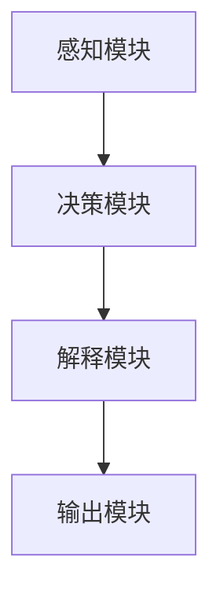
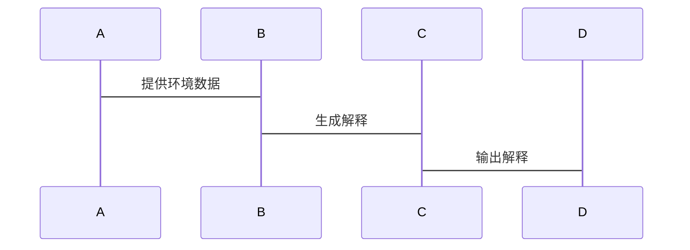

                 


# 构建具有可解释性的AI Agent决策系统

## 关键词：
可解释性AI，AI Agent，决策系统，系统架构，算法原理

## 摘要：
本文详细探讨了构建具有可解释性的AI Agent决策系统的各个方面，从背景介绍到项目实战，涵盖核心概念、算法原理、系统架构设计和最佳实践。文章旨在帮助读者理解可解释性AI Agent的重要性，掌握其设计和实现的关键步骤，并通过实际案例展示其应用价值。

---

# 构建具有可解释性的AI Agent决策系统

## 第1章: 可解释性AI Agent决策系统概述

### 1.1 问题背景与描述
#### 1.1.1 当前AI决策系统的挑战
AI决策系统在医疗、金融、自动驾驶等领域发挥着重要作用，但其决策过程往往缺乏透明性，导致用户信任不足和责任追究困难。

#### 1.1.2 可解释性的重要性
可解释性是AI决策系统获得用户信任和法律合规的关键。只有能够解释决策过程，才能在实际应用中得到广泛采用。

#### 1.1.3 AI Agent决策系统的定义
AI Agent是一种能够感知环境、自主决策并采取行动的智能体，其决策过程需具备可解释性。

### 1.2 问题解决与边界
#### 1.2.1 可解释性AI Agent的目标
实现决策过程的透明化和可追溯性，确保用户能够理解AI Agent的决策依据。

#### 1.2.2 系统的边界与外延
可解释性AI Agent仅关注决策过程的可解释性，不涉及后端数据处理和具体业务逻辑。

#### 1.2.3 核心要素与组成
- **感知模块**：收集环境信息。
- **决策模块**：基于规则或模型做出决策。
- **解释模块**：生成可理解的决策解释。

---

## 第2章: 可解释性AI Agent的核心概念

### 2.1 可解释性AI的基本原理
#### 2.1.1 可解释性的定义
可解释性是指AI系统能够以人类可理解的方式解释其决策过程。

#### 2.1.2 可解释性与不可解释性的对比
| 属性 | 可解释性 | 不可解释性 |
|------|----------|------------|
| 理解难度 | 低       | 高         |
| 信任度 | 高       | 低         |

#### 2.1.3 可解释性的重要性
通过可解释性，用户可以验证AI决策的正确性，确保系统在关键时刻能够被信任。

### 2.2 AI Agent的基本原理
#### 2.2.1 AI Agent的定义
AI Agent是一种智能体，能够感知环境、自主决策并采取行动。

#### 2.2.2 AI Agent的类型
- **基于规则的Agent**：通过预定义规则进行决策。
- **基于模型的Agent**：利用机器学习模型进行决策。

#### 2.2.3 AI Agent的核心功能
- **感知**：收集环境信息。
- **推理**：分析信息并做出决策。
- **行动**：执行决策。

### 2.3 可解释性AI Agent的系统架构
#### 2.3.1 系统架构的定义
系统架构描述了AI Agent的组成部分及其交互方式。

#### 2.3.2 系统架构的组成部分
- **感知模块**：负责数据采集。
- **决策模块**：负责决策逻辑。
- **解释模块**：负责生成解释。

#### 2.3.3 系统架构的优缺点
| 优缺点 | 优点 | 缺点 |
|--------|------|------|
| 可扩展性 | 高   | 低   |
| 可解释性 | 高   | 低   |

---

## 第3章: 可解释性AI Agent的算法原理

### 3.1 算法原理概述
#### 3.1.1 算法的基本概念
可解释性AI Agent算法通过规则或模型生成决策，并提供解释。

#### 3.1.2 算法的核心思想
基于规则或模型的决策过程必须能够被人类理解。

#### 3.1.3 算法的实现步骤
1. 收集环境信息。
2. 分析信息并做出决策。
3. 生成决策解释。

### 3.2 可解释性AI Agent的算法实现
#### 3.2.1 算法的实现流程
1. 数据采集：通过传感器或API获取环境信息。
2. 数据分析：利用规则或模型进行分析。
3. 决策生成：基于分析结果生成决策。
4. 解释生成：将决策过程转化为人类可理解的解释。

#### 3.2.2 算法的实现细节
使用基于规则的系统时，规则需清晰且易于解释。

#### 3.2.3 算法的实现案例
```python
# 示例代码：基于规则的决策系统
def decision_rule(data):
    if data['temperature'] > 30:
        return '高温'
    elif data['temperature'] < 10:
        return '低温'
    else:
        return '正常'
```

### 3.3 算法的数学模型与公式
#### 3.3.1 数学模型的定义
数学模型描述了决策过程中的逻辑关系。

#### 3.3.2 数学公式的推导
$$ \text{决策} = \begin{cases} 
\text{高温} & \text{if 温度} > 30 \\
\text{低温} & \text{if 温度} < 10 \\
\text{正常} & \text{otherwise}
\end{cases} $$

#### 3.3.3 数学模型的应用
通过数学模型可以清晰地解释决策过程，例如在温度检测系统中，温度值直接决定了决策结果。

---

## 第4章: 可解释性AI Agent的系统分析与架构设计

### 4.1 系统分析
#### 4.1.1 系统的组成
- **感知模块**：负责数据采集。
- **决策模块**：负责决策逻辑。
- **解释模块**：负责生成解释。

#### 4.1.2 系统的功能
- **数据采集**：通过传感器或API获取环境信息。
- **数据分析**：利用规则或模型进行分析。
- **决策生成**：基于分析结果生成决策。
- **解释生成**：将决策过程转化为人类可理解的解释。

### 4.2 系统架构设计
#### 4.2.1 系统架构的定义
系统架构描述了AI Agent的组成部分及其交互方式。

#### 4.2.2 系统架构的设计原则
- **模块化**：各模块相对独立。
- **可扩展性**：方便后续功能扩展。

#### 4.2.3 系统架构的实现


### 4.3 系统接口设计
#### 4.3.1 系统接口的定义
系统接口定义了各模块之间的交互方式。

#### 4.3.2 系统接口的设计原则
- **清晰性**：接口定义明确。
- **一致性**：接口设计统一。

#### 4.3.3 系统接口的实现


---

## 第5章: 可解释性AI Agent的项目实战

### 5.1 项目环境安装
#### 5.1.1 环境的配置
安装Python和必要的库（如numpy、pandas）。

#### 5.1.2 环境的安装
使用pip安装所需依赖。

#### 5.1.3 环境的测试
运行示例代码，确保环境配置正确。

### 5.2 系统核心实现源代码
#### 5.2.1 核心代码实现
```python
# 示例代码：可解释性AI Agent实现
class AI-Agent:
    def __init__(self):
        self.rules = []

    def add_rule(self, rule):
        self.rules.append(rule)

    def decide(self, data):
        for rule in self.rules:
            if rule(data):
                return rule.description
        return '未知状态'

    def explain(self, decision):
        for rule in self.rules:
            if rule.description == decision:
                return rule.explanation
        return '无法解释'
```

#### 5.2.2 代码应用解读与分析
通过规则库进行决策，并根据规则生成解释。

### 5.3 项目小结
通过实际案例展示了可解释性AI Agent的实现过程，强调了可解释性在实际应用中的重要性。

---

## 第6章: 可解释性AI Agent的最佳实践

### 6.1 小结
可解释性是AI Agent决策系统的核心要素，本文详细探讨了其实现方法和应用价值。

### 6.2 注意事项
在实际应用中，需确保可解释性与系统性能之间的平衡。

### 6.3 拓展阅读
推荐相关书籍和资源，鼓励读者深入研究可解释性AI。

---

作者：AI天才研究院/AI Genius Institute & 禅与计算机程序设计艺术 /Zen And The Art of Computer Programming

