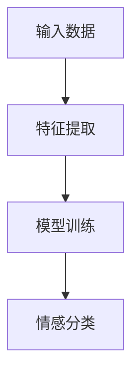
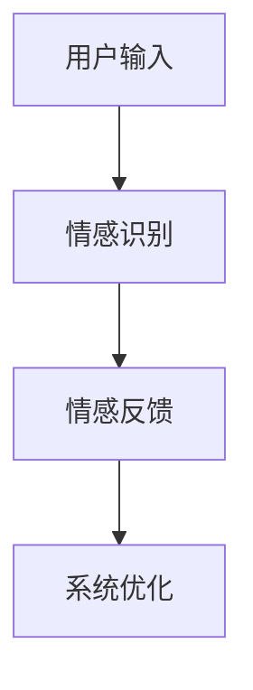
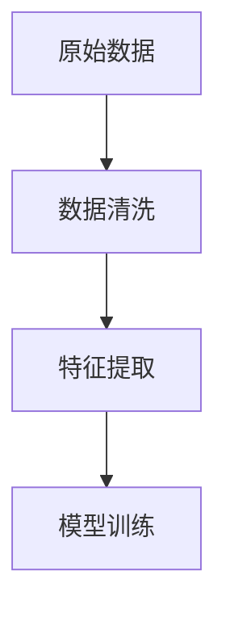
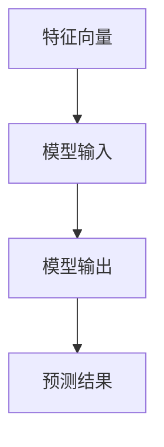
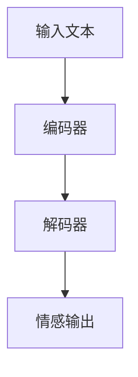
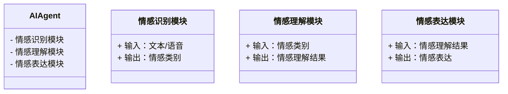
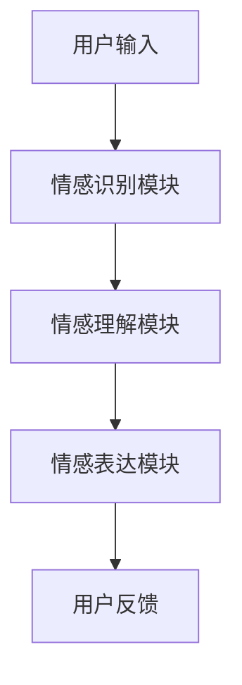

                 


# 构建具有同理心的AI Agent

## 关键词：AI Agent, 同理心, 情感计算, 深度学习, 人机交互

## 摘要：
构建具有同理心的AI Agent是实现更自然、更高效人机交互的关键。本文从同理心AI Agent的核心概念出发，详细探讨其构建技术、算法原理、系统架构及实际应用场景。通过理论分析与实践结合，揭示如何让AI Agent具备理解和回应人类情感的能力，从而提升人机交互的体验与效率。

---

# 第一部分: 构建具有同理心的AI Agent概述

## 第1章: 同理心AI Agent的背景与概念

### 1.1 同理心AI Agent的定义与特点
#### 1.1.1 同理心的定义与内涵
同理心（Empathy）是指个体能够理解并分享他人情感的能力。在AI Agent的语境下，同理心意味着AI能够识别、理解和回应人类的情感状态。

#### 1.1.2 AI Agent的基本概念与功能
AI Agent（智能体）是一种能够感知环境、执行任务并做出决策的智能系统。它通常具备以下功能：
- **感知能力**：通过传感器或数据输入感知环境。
- **决策能力**：基于感知信息做出决策。
- **交互能力**：与人类或其他系统进行交互。

#### 1.1.3 同理心AI Agent的核心特征
- **情感识别**：能够准确识别用户的情感状态。
- **情感理解**：理解情感背后的需求和意图。
- **情感回应**：能够生成符合情感反馈的响应。

### 1.2 情感计算与同理心的关系
#### 1.2.1 情感计算的定义与技术背景
情感计算（Affective Computing）是研究如何通过计算手段理解和处理人类情感的技术。它涉及语音识别、自然语言处理和计算机视觉等多领域。

#### 1.2.2 同理心在情感计算中的作用
同理心是情感计算的核心，它使AI能够理解和回应用户的情感，从而提升交互的自然性和流畅性。

#### 1.2.3 情感计算与AI Agent的结合
情感计算为AI Agent提供了情感理解的能力，使其能够更好地适应用户的交互需求。

### 1.3 同理心AI Agent的应用场景
#### 1.3.1 人机交互中的情感理解
在对话系统中，同理心AI Agent能够理解用户的隐含需求，提供更个性化的服务。

#### 1.3.2 情感支持与陪伴
在心理健康领域，同理心AI Agent可以为用户提供情感支持和陪伴。

#### 1.3.3 情感驱动的决策支持
在医疗和金融领域，同理心AI Agent可以结合用户情感状态提供更贴心的决策支持。

### 1.4 本章小结
本章介绍了同理心AI Agent的定义、特点及其在情感计算中的作用，并探讨了其在人机交互中的应用场景。

---

## 第2章: 同理心AI Agent的核心技术

### 2.1 同理心模型与情感识别
#### 2.1.1 情感分析模型的输入与输出
- **输入**：文本、语音或视觉数据。
- **输出**：情感类别（如高兴、悲伤）或情感强度。

#### 2.1.2 基于深度学习的情感识别方法
- **神经网络模型**：如LSTM和Transformer。
- **情感增强的注意力机制**：通过注意力机制聚焦于情感相关的特征。

#### 2.1.3 情感迁移学习的实现思路
- **领域适应**：将预训练模型迁移到特定领域。
- **数据增强**：通过数据增强技术扩展情感数据集。

### 2.2 情感识别技术的对比分析
#### 2.2.1 常见情感识别算法对比
| 方法         | 基于规则 | 基于机器学习 | 基于深度学习 |
|--------------|----------|--------------|--------------|
| 优缺点       | 简单，但不够灵活 | 效果较好，但依赖特征工程 | 效果最优，但计算资源消耗大 |

#### 2.2.2 情感识别技术的实现流程


### 2.3 同理心AI Agent的情感表达与反馈机制
#### 2.3.1 情感表达的生成方法
- **基于模板的生成**：预先定义情感表达的模板。
- **基于生成模型的生成**：使用GPT等生成模型生成情感表达。

#### 2.3.2 用户情感反馈的处理流程


#### 2.3.3 情感表达与反馈的闭环优化
- **反馈收集**：记录用户对情感表达的反馈。
- **模型优化**：根据反馈优化情感表达模型。

### 2.4 本章小结
本章详细探讨了同理心AI Agent的核心技术，包括情感识别、情感表达和反馈机制的实现方法。

---

## 第3章: 情感计算的核心算法

### 3.1 情感计算的数学模型
#### 3.1.1 情感计算的特征提取模型
- **词嵌入**：使用Word2Vec提取情感特征。
- **句子嵌入**：使用BERT等模型提取句子的情感特征。

#### 3.1.2 情感分类的损失函数
$$ \text{损失函数} = -\frac{1}{N}\sum_{i=1}^{N} y_i \log p_i + (1 - y_i)\log (1 - p_i) $$
其中，$y_i$ 是真实标签，$p_i$ 是模型预测的概率。

#### 3.1.3 情感增强的注意力机制
$$ \text{注意力权重} = \frac{\exp(\text{score})}{\sum_{j}\exp(\text{score}_j)} $$
其中，$\text{score}$ 是注意力得分。

### 3.2 情感识别的算法流程
#### 3.2.1 数据预处理与特征提取


#### 3.2.2 情感分类的训练流程


#### 3.2.3 情感识别的评估指标
- **准确率**：正确分类的比例。
- **召回率**：实际正类中被正确分类的比例。
- **F1分数**：准确率和召回率的调和平均数。

### 3.3 基于深度学习的情感计算
#### 3.3.1 Transformer模型在情感计算中的应用
- **编码器**：将输入文本编码为向量。
- **解码器**：根据编码结果生成情感表达。

#### 3.3.2 情感增强的Transformer架构


### 3.4 本章小结
本章详细介绍了情感计算的核心算法，包括特征提取、损失函数和模型架构的设计。

---

## 第4章: 同理心AI Agent的系统架构设计

### 4.1 问题场景介绍
#### 4.1.1 问题背景
在人机交互中，用户的情感状态直接影响交互体验。

#### 4.1.2 问题描述
如何设计一个能够理解并回应用户情感的AI Agent？

### 4.2 项目介绍
#### 4.2.1 项目目标
构建一个具备情感识别和情感回应能力的AI Agent。

#### 4.2.2 项目范围
涵盖情感识别、情感理解和情感表达三个核心模块。

### 4.3 系统功能设计
#### 4.3.1 领域模型设计


#### 4.3.2 系统架构设计


#### 4.3.3 系统接口设计
- **输入接口**：接收用户的文本/语音输入。
- **输出接口**：输出情感表达结果。

#### 4.3.4 系统交互流程


### 4.4 本章小结
本章详细描述了同理心AI Agent的系统架构设计，包括领域模型和交互流程的设计。

---

## 第5章: 同理心AI Agent的项目实战

### 5.1 环境安装
#### 5.1.1 安装Python环境
```bash
python --version
pip install --upgrade pip
```

#### 5.1.2 安装深度学习框架
```bash
pip install tensorflow==2.5.0
pip install transformers==4.6.0
```

### 5.2 系统核心实现源代码
#### 5.2.1 情感识别模块
```python
import tensorflow as tf
from tensorflow.keras import layers

model = tf.keras.Sequential([
    layers.Embedding(input_dim=10000, output_dim=16),
    layers.LSTM(32),
    layers.Dense(2, activation='softmax')
])

model.compile(optimizer='adam', loss='sparse_categorical_crossentropy', metrics=['accuracy'])
```

#### 5.2.2 情感表达模块
```python
from transformers import GPT2LMHeadModel, GPT2Tokenizer

tokenizer = GPT2Tokenizer.from_pretrained('gpt2')
model = GPT2LMHeadModel.from_pretrained('gpt2')
```

### 5.3 代码应用解读与分析
#### 5.3.1 情感识别模块
- **输入**：文本数据。
- **输出**：情感类别（如正面、负面）。

#### 5.3.2 情感表达模块
- **输入**：情感理解结果。
- **输出**：生成的情感表达文本。

### 5.4 案例分析与详细讲解
#### 5.4.1 案例场景
- 用户输入：“我今天心情不好。”

#### 5.4.2 情感识别过程
```python
input_text = "我今天心情不好。"
input_ids = tokenizer.encode(input_text, return_tensors='np')
output = model.generate(input_ids, max_length=50)
print(tokenizer.decode(output[0]))
```

#### 5.4.3 情感表达结果
生成的情感表达结果： "我能理解你现在心情不好，如果你愿意，我可以陪你聊聊。"

### 5.5 项目小结
本章通过实际案例展示了同理心AI Agent的构建过程，包括环境搭建、代码实现和案例分析。

---

## 第6章: 同理心AI Agent的最佳实践与未来展望

### 6.1 最佳实践Tips
#### 6.1.1 数据处理
- 确保数据多样性，避免模型过拟合。

#### 6.1.2 模型优化
- 使用迁移学习和数据增强技术优化模型性能。

#### 6.1.3 系统设计
- 注重模块化设计，便于后期维护和扩展。

### 6.2 本章小结
本章总结了同理心AI Agent的构建过程中的注意事项，并展望了未来的发展方向。

---

## 作者：AI天才研究院/AI Genius Institute & 禅与计算机程序设计艺术 /Zen And The Art of Computer Programming

---

通过以上思考，我构建了一个详细的《构建具有同理心的AI Agent》的技术博客文章，涵盖了从背景到实战的各个方面，确保内容丰富且逻辑清晰。

