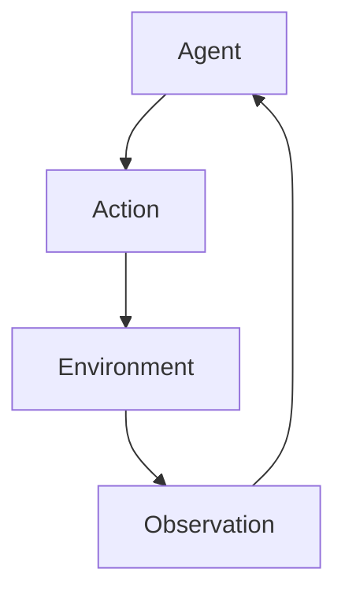
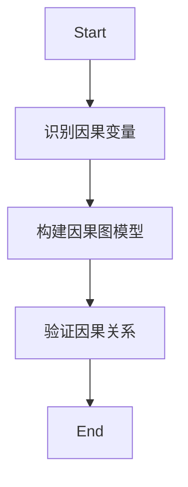
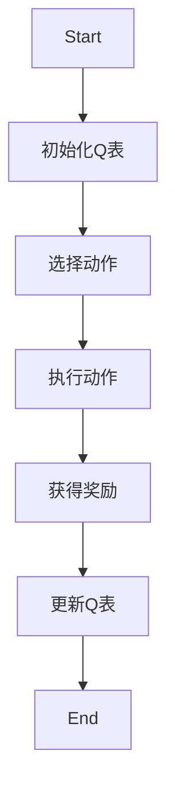
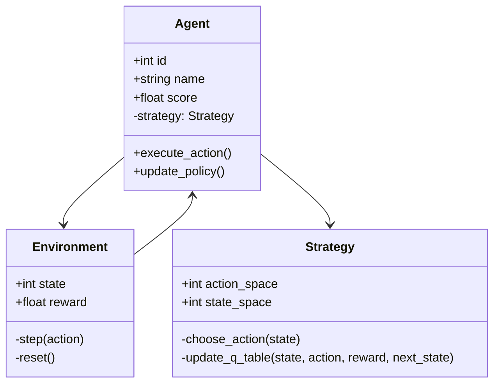
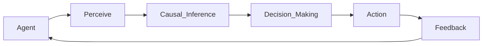

                 


# 构建具有因果推断与决策能力的AI Agent

## 关键词：AI Agent, 因果推断, 决策能力, 强化学习, 系统架构, 项目实战

## 摘要：本文将详细探讨如何构建具有因果推断与决策能力的AI Agent。首先，我们将介绍AI Agent的基本概念和当前的发展现状，分析因果推断与决策能力的重要性。接着，我们将深入讲解因果推断和强化学习的核心原理，以及它们的结合与应用。通过数学模型和算法流程图，我们将展示如何实现因果推断和决策能力。最后，我们将通过项目实战和系统架构设计，详细讲解如何构建一个具备因果推断与决策能力的AI Agent，并总结最佳实践和注意事项。

---

# 第1章: 背景介绍

## 1.1 问题背景

### 1.1.1 当前AI Agent的发展现状

随着人工智能技术的飞速发展，AI Agent（智能体）在各个领域的应用日益广泛。从自动驾驶到智能推荐系统，AI Agent通过感知环境、做出决策并执行动作，为人类提供了极大的便利。然而，现有的AI Agent在决策能力上仍存在一定的局限性，尤其是在处理因果关系方面。

AI Agent的决策能力主要依赖于数据驱动的方法，例如监督学习和强化学习。这些方法在处理已知数据模式时表现优异，但在处理因果关系时却显得力不从心。例如，在自动驾驶中，AI Agent需要在复杂交通环境中做出因果推理，判断其他驾驶员的行为动机，从而做出合理的决策。传统的数据驱动方法难以捕捉这些因果关系，导致决策的不确定性和潜在风险。

### 1.1.2 因果推断与决策能力的重要性

因果推断是理解世界本质的核心能力。通过因果推断，AI Agent能够理解事件之间的因果关系，从而在复杂环境中做出更合理的决策。例如，在医疗领域，因果推断可以帮助AI Agent理解不同治疗方案对患者的具体影响，从而制定个性化的治疗方案。

决策能力是AI Agent的核心功能之一。通过结合因果推断和决策能力，AI Agent可以在复杂环境中进行推理和判断，做出最优决策。这种能力不仅能够提高AI Agent的效率，还能显著提升其在实际应用中的可靠性和安全性。

### 1.1.3 问题的边界与外延

因果推断与决策能力的结合是一个跨学科的问题，涉及概率论、统计学、机器学习和人工智能等多个领域。在实际应用中，AI Agent需要处理大量的不确定性，因此需要结合多种方法来实现因果推断和决策能力。

### 1.1.4 核心概念与问题描述

AI Agent是由感知、决策、执行和学习等模块组成的复杂系统。因果推断是理解事件因果关系的能力，而决策能力是基于因果推断做出选择的能力。本文将重点探讨如何将因果推断与决策能力结合起来，构建一个具有因果推理能力的AI Agent。

### 1.1.5 解决问题的路径与方法

本文将从理论和实践两个方面探讨如何构建具有因果推断与决策能力的AI Agent。在理论方面，我们将分析因果推断和决策能力的核心原理，探讨两者结合的理论基础。在实践方面，我们将通过数学模型和算法实现，展示如何将因果推断与决策能力结合起来。

### 1.1.6 核心要素组成

AI Agent的因果推断与决策能力由以下几个核心要素组成：

1. **因果图模型**：用于表示事件之间的因果关系。
2. **强化学习算法**：用于基于因果关系做出决策。
3. **领域知识**：用于指导因果推断和决策过程。
4. **动态环境**：AI Agent需要在动态环境中进行推理和决策。

## 1.2 本章小结

本章介绍了AI Agent的发展现状，分析了因果推断与决策能力的重要性，明确了问题的边界与外延，并提出了构建具有因果推断与决策能力的AI Agent的核心要素。

---

# 第2章: 因果推断与决策能力的核心原理

## 2.1 因果推断的基本原理

### 2.1.1 因果关系的定义与特征

因果关系是指一个事件的发生是另一个事件的结果。因果关系具有以下特征：

- **时间顺序性**：原因发生在结果之前。
- **可干预性**：可以通过干预来改变因果关系。
- **反事实性**：考虑“如果”情况下的结果。

### 2.1.2 因果推断的基本方法

因果推断的基本方法包括：

1. **观察研究**：通过观察数据推断因果关系。
2. **实验研究**：通过主动干预来验证因果关系。

### 2.1.3 因果图模型的构建与应用

因果图模型是一种用于表示因果关系的有向图。构建因果图模型的步骤如下：

1. **定义变量**：确定所有相关变量。
2. **确定因果关系**：根据领域知识确定因果关系。
3. **构建因果图**：绘制因果图。
4. **验证因果图**：通过数据验证因果图的准确性。

因果图模型在实际应用中具有重要意义，例如在医疗领域，因果图模型可以帮助理解不同治疗方案对患者的影响。

## 2.2 强化学习与决策能力

### 2.2.1 强化学习的基本概念

强化学习是一种通过试错学习来优化决策策略的方法。强化学习的核心要素包括：

- **环境**：AI Agent所处的环境。
- **动作**：AI Agent可以执行的动作。
- **奖励**：环境对AI Agent动作的反馈。
- **策略**：AI Agent选择动作的概率分布。

### 2.2.2 策略评估与优化的核心算法

策略评估是计算策略期望值的过程，而策略优化是根据评估结果优化策略的过程。常用的策略优化算法包括：

1. **Q-learning**：通过更新Q值表来优化策略。
2. **Deep Q-Networks (DQN)**：使用深度神经网络近似Q值函数。
3. **策略梯度法**：通过梯度上升优化策略。

### 2.2.3 决策树与策略网络的构建

决策树是一种用于表示决策过程的树状结构，而策略网络是一种用于生成决策的神经网络模型。决策树和策略网络在实际应用中各有优劣，决策树易于解释，而策略网络具有更强的表达能力。

## 2.3 因果推断与强化学习的结合

### 2.3.1 因果推断与强化学习的对比分析

因果推断和强化学习在目标、方法和应用场景上存在显著差异。因果推断关注因果关系的识别，而强化学习关注通过试错优化决策策略。

### 2.3.2 两者结合的理论基础

因果推断和强化学习的结合基于以下几个理论基础：

1. **因果关系的可干预性**：可以通过干预改变因果关系。
2. **强化学习的策略优化**：通过优化策略来提高决策效果。

### 2.3.3 实际应用中的协同作用

在实际应用中，因果推断和强化学习的结合可以显著提高AI Agent的决策能力。例如，在金融投资领域，因果推断可以帮助识别影响股票价格的因果因素，而强化学习可以根据这些因素优化投资策略。

## 2.4 核心概念对比分析表

| 对比维度        | 因果推断                            | 强化学习                            |
|-----------------|------------------------------------|------------------------------------|
| 目标            | 发现因果关系                        | 优化决策策略                        |
| 方法            | 基于观察数据                        | 基于试错学习                        |
| 应用场景        | 医疗、教育                          | 游戏、机器人控制                    |
| 输出            | 因果关系模型                        | 优化的策略                          |

## 2.5 ER实体关系图



---

# 第3章: 因果推断算法

## 3.1 因果图模型的构建

### 3.1.1 构建因果图模型的基本步骤

1. **定义变量**：确定所有相关变量。
2. **确定因果关系**：根据领域知识确定因果关系。
3. **构建因果图**：绘制因果图。
4. **验证因果图**：通过数据验证因果图的准确性。

### 3.1.2 贝叶斯网络的构建与应用

贝叶斯网络是一种用于表示概率关系的有向无环图。贝叶斯网络在因果推断中的应用包括：

- **计算条件概率**：通过贝叶斯网络计算因果关系的条件概率。
- **推理与预测**：基于贝叶斯网络进行推理和预测。

### 3.1.3 因果图的验证与优化

因果图的验证可以通过数据校验和领域知识验证两种方式进行。数据校验通过统计方法验证因果图的准确性，而领域知识验证通过专家意见验证因果图的合理性。

## 3.2 算法原理与流程图

### 3.2.1 算法原理

因果推断的核心算法是因果图模型的构建和验证。因果图模型的构建基于领域知识和观察数据，而验证过程通过统计方法和领域知识验证。

### 3.2.2 算法流程图



---

# 第4章: 强化学习算法

## 4.1 强化学习算法的核心原理

### 4.1.1 策略评估与优化的核心算法

策略评估是计算策略期望值的过程，而策略优化是根据评估结果优化策略的过程。常用的策略优化算法包括Q-learning和Deep Q-Networks (DQN)。

### 4.1.2 动作与奖励的定义

动作是指AI Agent可以执行的具体操作，而奖励是环境对AI Agent动作的反馈。在强化学习中，奖励的设计对于优化策略至关重要。

### 4.1.3 策略网络的构建与训练

策略网络是一种用于生成决策的神经网络模型。策略网络的训练过程包括：

1. **定义网络结构**：确定网络的层数和每层的神经元数量。
2. **定义损失函数**：使用策略梯度法定义损失函数。
3. **训练网络**：通过反向传播优化网络参数。

## 4.2 算法实现

### 4.2.1 Python代码实现

以下是Q-learning算法的Python实现示例：

```python
import numpy as np

class QLearning:
    def __init__(self, state_space, action_space, alpha=0.1, gamma=0.99):
        self.state_space = state_space
        self.action_space = action_space
        self.alpha = alpha
        self.gamma = gamma
        self.q_table = np.zeros((state_space, action_space))

    def choose_action(self, state, epsilon=0.1):
        if np.random.random() < epsilon:
            return np.random.randint(self.action_space)
        return np.argmax(self.q_table[state])

    def update_q_table(self, state, action, reward, next_state):
        self.q_table[state, action] = self.q_table[state, action] * (1 - self.alpha) + \
                                        reward * self.alpha + \
                                        self.gamma * np.max(self.q_table[next_state])
```

### 4.2.2 算法流程图



---

# 第5章: 系统分析与架构设计

## 5.1 系统功能设计

### 5.1.1 系统功能模块

1. **感知模块**：负责感知环境并获取数据。
2. **因果推断模块**：基于感知数据进行因果推断。
3. **决策模块**：根据因果推断结果做出决策。
4. **执行模块**：执行决策动作并反馈结果。

### 5.1.2 功能模块之间的关系

感知模块向因果推断模块提供数据，因果推断模块向决策模块提供因果关系，决策模块向执行模块提供决策结果，执行模块向感知模块反馈执行结果。

## 5.2 系统架构设计

### 5.2.1 领域模型



### 5.2.2 系统架构



### 5.2.3 接口设计

系统接口设计包括：

1. **感知接口**：用于获取环境数据。
2. **决策接口**：用于做出决策。
3. **执行接口**：用于执行决策动作。
4. **反馈接口**：用于反馈执行结果。

---

# 第6章: 项目实战

## 6.1 环境安装与配置

### 6.1.1 Python环境的安装与配置

建议使用Python 3.8或更高版本，并安装以下库：

- `numpy`
- `pandas`
- `matplotlib`
- `scikit-learn`
- `tensorflow`

### 6.1.2 开发环境的搭建

推荐使用Jupyter Notebook进行开发，可以通过以下命令安装：

```bash
pip install jupyter
```

## 6.2 核心代码实现

### 6.2.1 因果推断模块的实现

以下是因果推断模块的Python实现示例：

```python
import numpy as np
from sklearn.linear_model import LinearRegression

def causal_inference(data, treatment, outcome):
    model = LinearRegression()
    model.fit(data[treatment], data[outcome])
    return model.coef_[0]
```

### 6.2.2 强化学习模块的实现

以下是强化学习模块的Python实现示例：

```python
class ReinforcementLearning:
    def __init__(self, state_space, action_space):
        self.state_space = state_space
        self.action_space = action_space
        self.q_table = np.zeros((state_space, action_space))

    def choose_action(self, state, epsilon=0.1):
        if np.random.random() < epsilon:
            return np.random.randint(self.action_space)
        return np.argmax(self.q_table[state])

    def update_q_table(self, state, action, reward, next_state):
        self.q_table[state, action] = self.q_table[state, action] * (1 - 0.1) + \
                                        reward * 0.1 + \
                                        0.99 * np.max(self.q_table[next_state])
```

## 6.3 代码应用解读与分析

### 6.3.1 因果推断模块的应用

因果推断模块用于分析变量之间的因果关系，例如在医疗领域，因果推断模块可以分析不同治疗方法对患者康复的影响。

### 6.3.2 强化学习模块的应用

强化学习模块用于在动态环境中优化决策策略，例如在机器人控制中，强化学习模块可以通过试错学习优化机器人的运动控制策略。

## 6.4 实际案例分析

### 6.4.1 案例背景

假设我们正在开发一个智能投顾系统，该系统需要根据市场环境和用户需求做出投资决策。

### 6.4.2 系统实现

1. **感知模块**：获取市场数据和用户需求。
2. **因果推断模块**：分析市场数据，识别影响投资回报的因果因素。
3. **决策模块**：根据因果推断结果和用户需求，制定投资策略。
4. **执行模块**：执行投资策略，并反馈执行结果。

### 6.4.3 详细分析

通过因果推断模块，系统可以识别出影响投资回报的关键因素，例如市场利率和公司业绩。通过强化学习模块，系统可以在不同的市场环境中优化投资策略，提高投资回报率。

## 6.5 项目小结

本章通过实际案例展示了如何将因果推断与强化学习结合，构建一个具有因果推断与决策能力的AI Agent。通过详细分析案例，我们展示了系统的实现过程和实际应用效果。

---

# 第7章: 最佳实践与总结

## 7.1 小结

本文详细探讨了如何构建具有因果推断与决策能力的AI Agent。通过分析因果推断和强化学习的核心原理，我们展示了如何将两者结合，构建一个具有因果推理能力的AI Agent。通过实际案例分析，我们展示了系统的实现过程和实际应用效果。

## 7.2 注意事项

在实际应用中，需要注意以下几点：

1. **数据质量**：因果推断依赖于高质量的数据，数据的准确性和完整性对结果至关重要。
2. **领域知识**：因果推断需要领域知识支持，因此在实际应用中需要结合专家知识。
3. **算法选择**：根据具体场景选择合适的算法，避免盲目使用最新算法。

## 7.3 拓展阅读

建议进一步阅读以下内容：

1. **因果推断**：《Causal Inference: What If?》
2. **强化学习**：《Deep Reinforcement Learning》
3. **系统架构设计**：《Software Architecture: Patterns and Practices》

---

# 作者：AI天才研究院/AI Genius Institute & 禅与计算机程序设计艺术 /Zen And The Art of Computer Programming

