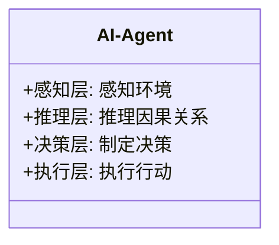
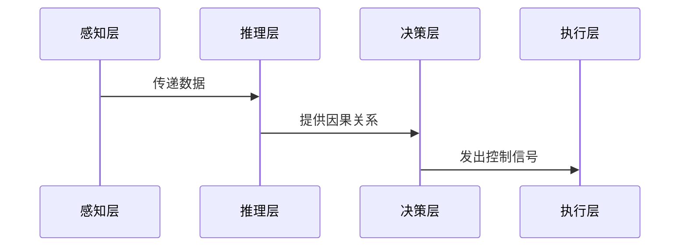

                 


# 构建具有因果推断能力的AI Agent

> 关键词：AI Agent，因果推断，因果图，系统架构，算法实现，项目实战

> 摘要：本文详细探讨了构建具有因果推断能力的AI Agent的全过程，从基础概念到算法实现，再到系统架构设计和项目实战。文章首先介绍了AI Agent和因果推断的基本概念，然后深入分析了因果推断的核心原理和算法，接着通过Mermaid图展示了系统的架构和交互流程，最后通过具体案例展示了如何在实际项目中应用这些理论。

---

# 第1章: AI Agent与因果推断的背景介绍

## 1.1 AI Agent的基本概念

### 1.1.1 AI Agent的定义与分类

AI Agent（人工智能代理）是指能够感知环境并采取行动以实现目标的智能实体。根据智能水平和复杂度，AI Agent可以分为以下几类：

- **简单反射型**：基于规则的反应式系统。
- **基于模型的反射型**：具有内部状态和目标的系统。
- **目标驱动型**：以目标为导向，主动规划行动。
- **学习增强型**：通过学习提升智能水平。

AI Agent广泛应用于自动驾驶、智能助手、机器人等领域。

### 1.1.2 因果推断的基本概念

因果推断是研究因果关系的科学，旨在理解事件之间的因果联系。因果关系与相关关系不同，因果关系强调原因导致结果的内在联系。

### 1.1.3 问题背景与问题描述

AI Agent需要在复杂环境中做出决策，这需要理解事件之间的因果关系。例如，在自动驾驶中，AI Agent需要理解刹车灯与车辆停止之间的因果关系。

## 1.2 问题解决与边界分析

### 1.2.1 AI Agent在问题解决中的作用

AI Agent通过感知环境、分析因果关系、制定策略并执行行动来解决问题。

### 1.2.2 因果推断的边界与外延

因果推断的边界包括时间、空间、数据和逻辑的限制。例如，在处理因果关系时，需要考虑数据的充分性和模型的准确性。

## 1.3 核心概念结构与组成要素

### 1.3.1 AI Agent的核心要素

- **感知能力**：通过传感器或数据源获取信息。
- **推理能力**：分析信息，理解因果关系。
- **决策能力**：基于推理结果制定行动方案。
- **执行能力**：通过执行机构实现行动。

### 1.3.2 因果推断的关键属性

- **因果图**：展示变量之间的因果关系。
- **干预**：对因果关系的主动改变。
- **反事实推理**：推断在不同情况下的结果。

### 1.3.3 概念结构与系统架构

AI Agent的系统架构包括感知层、推理层、决策层和执行层。因果推断贯穿于整个架构中，帮助AI Agent理解环境并做出决策。

---

# 第2章: 因果推断的核心概念与联系

## 2.1 因果关系的数学模型

### 2.1.1 因果图的基本原理

因果图（Directed Acyclic Graph, DAG）是因果推断的核心工具。DAG通过有向边表示变量之间的因果关系。例如，在自动驾驶中，DAG可以表示刹车灯、减速和碰撞之间的因果关系。

### 2.1.2 因果关系的属性特征对比表

| 属性 | 描述 |
|------|------|
| 直觉性 | 因果关系直观可解释 |
| 客观性 | 因果关系独立于观察者 |
| 可操作性 | 因果关系可以通过干预操作 |

### 2.2 ER实体关系图与因果推断

ER实体关系图（Entity-Relationship Diagram）用于数据库设计，而因果图用于因果推断。尽管两者不同，但因果图可以辅助ER图分析变量之间的因果关系。

### 2.3 因果推断的Mermaid流程图


---

# 第3章: 因果推断的算法原理

## 3.1 因果推断的数学模型

### 3.1.1 因果关系的公式推导

因果推断的核心公式是干预公式：

$$ P(Y|do(X)) = \sum_{x} P(Y|x) P(X=x) $$

其中，$Y$是结果变量，$X$是干预变量。

### 3.1.2 因果推断的数学表达

通过因果图和概率论，可以推导出因果关系。例如，在线性因果模型中，因果关系可以用回归系数表示。

## 3.2 因果推断算法的实现

### 3.2.1 因果推断的算法流程

1. 构建因果图。
2. 学习因果关系。
3. 计算干预效果。

### 3.2.2 算法的实现步骤

- **构建因果图**：使用DAG表示变量之间的因果关系。
- **学习因果关系**：通过观察数据学习因果图的结构。
- **计算干预效果**：通过干预公式计算结果。

### 3.3 因果推断的Mermaid流程图


### 3.4 算法的Python实现

```python
import networkx as nx

def build_causal_graph(variables, edges):
    causal_graph = nx.DiGraph()
    causal_graph.add_nodes_from(variables)
    causal_graph.add_edges_from(edges)
    return causal_graph

variables = ['刹车灯', '减速', '碰撞']
edges = [('刹车灯', '减速'), ('减速', '碰撞')]
causal_graph = build_causal_graph(variables, edges)
```

---

# 第4章: 系统分析与架构设计方案

## 4.1 问题场景介绍

AI Agent需要在复杂环境中理解因果关系并做出决策。例如，在自动驾驶中，AI Agent需要理解刹车灯与车辆停止之间的因果关系。

## 4.2 系统功能设计

### 4.2.1 领域模型的Mermaid类图



## 4.3 系统架构设计

### 4.3.1 系统架构的Mermaid图


## 4.4 系统接口设计

### 4.4.1 接口定义与交互流程

- **输入接口**：接收传感器数据。
- **输出接口**：输出控制信号。

### 4.4.2 接口设计的注意事项

- 数据格式统一。
- 响应时间优化。

## 4.5 系统交互的Mermaid序列图



---

# 第5章: 项目实战

## 5.1 环境安装与配置

### 5.1.1 开发环境的选择

推荐使用Python和相关库（如NetworkX、Pymc）进行开发。

### 5.1.2 依赖库的安装

```bash
pip install networkx pymc
```

## 5.2 系统核心实现

### 5.2.1 核心代码的编写

```python
import networkx as nx
from pymc import Model, Density

def build_model(causal_graph):
    with Model() as model:
        for node in causal_graph.nodes:
            if causal_graph.in_degree(node) == 0:
                Density('p_' + node)
            else:
                Density('p_' + node, observed=False)
    return model

causal_graph = build_causal_graph(variables, edges)
model = build_model(causal_graph)
```

### 5.2.2 代码的详细解读

- **构建因果图**：使用NetworkX构建DAG。
- **建立概率模型**：使用Pymc建立因果关系的概率模型。

## 5.3 实际案例分析

### 5.3.1 案例背景与需求分析

在自动驾驶中，AI Agent需要理解刹车灯与车辆停止之间的因果关系。

### 5.3.2 案例的详细实现

- **构建因果图**：刹车灯 -> 减速 -> 碰撞。
- **学习因果关系**：通过数据学习因果图的结构。
- **计算干预效果**：计算在刹车灯亮时，车辆减速的概率。

## 5.4 案例的详细讲解

通过案例分析，展示了如何将因果推断应用于实际项目中。AI Agent通过理解因果关系，能够做出更准确的决策。

---

# 小结

本文详细介绍了构建具有因果推断能力的AI Agent的过程，从基础概念到算法实现，再到系统架构设计和项目实战。通过因果图和Mermaid图，展示了因果推断的核心原理和系统架构。最后，通过具体案例，展示了如何在实际项目中应用这些理论。

作者：AI天才研究院  
参考文献：[《因果推断入门》]、[《AI Agent设计与实现》]、[《系统架构设计方法》]

