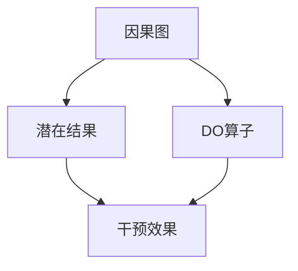
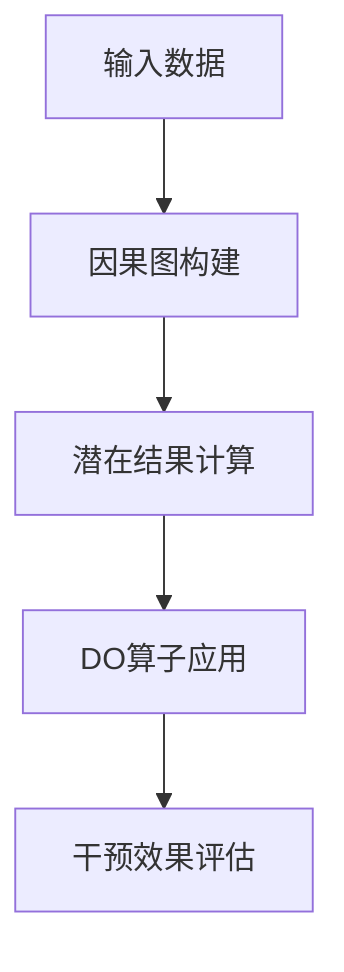
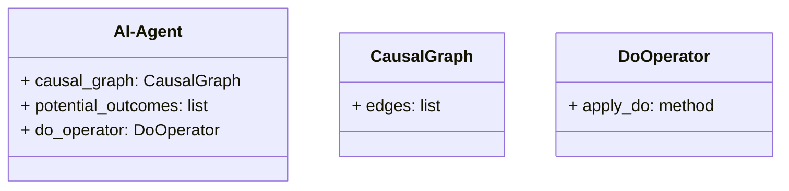
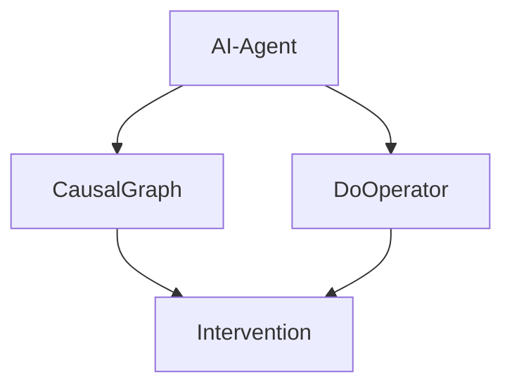
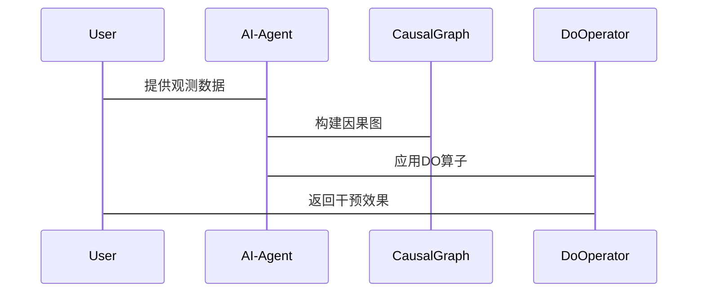

                 


# 构建具有因果推理与干预能力的AI Agent

**关键词**: AI Agent, 因果推理, 干预能力, 人工智能, 系统架构

**摘要**: 本文深入探讨了构建具有因果推理与干预能力的AI Agent的关键技术。从背景介绍到核心概念，从算法原理到系统架构，再到项目实战，全面解析了AI Agent在因果推理与干预能力方面的构建过程。通过具体的数学公式、算法流程图和实际案例分析，帮助读者理解并掌握如何设计和实现具备这些能力的AI系统。

---

## 第1章 背景介绍与问题背景

### 1.1 问题背景

#### 1.1.1 当前AI Agent的发展现状
AI Agent（智能体）近年来取得了显著进展，特别是在感知和学习能力方面。然而，大多数现有的AI系统仍然依赖于相关性推理，而非因果推理。这限制了它们在复杂场景下的干预和决策能力。

#### 1.1.2 因果推理与干预能力的重要性
因果推理是理解“为什么”事件发生的核心能力，而干预能力则是基于因果关系进行主动决策的关键。具备这些能力的AI Agent可以在医疗、金融、教育等领域做出更准确的预测和干预。

#### 1.1.3 问题的边界与外延
本文讨论的AI Agent具备因果推理与干预能力，但不涉及情感理解和社交推理。目标是通过因果图和DO算子实现干预效果的评估和优化。

### 1.2 问题描述

#### 1.2.1 AI Agent的核心功能需求
- 理解因果关系
- 基于因果图进行干预
- 评估干预效果

#### 1.2.2 因果推理与干预能力的具体表现
- 识别因果关系
- 计算潜在结果
- 应用DO算子进行干预

#### 1.2.3 问题解决的目标与意义
目标是通过构建具备因果推理与干预能力的AI Agent，提升其在复杂场景下的决策能力。意义在于推动AI技术在实际应用中的更深层次发展。

## 第2章 核心概念与联系

### 2.1 核心概念原理

#### 2.1.1 因果图的基本概念
因果图（Directed Acyclic Graph, DAG）是一种有向无环图，用于表示变量之间的因果关系。例如，因果图可以表示为：
$$P(Y|do(X), Z)$$

#### 2.1.2 潜在结果与DO算子
潜在结果是指在不同干预条件下变量的可能结果。DO算子（do operator）用于模拟干预操作，例如：
$$Y^x = f(x, Z)$$

#### 2.1.3 干预与反事实推理的数学模型
干预效果可以通过反事实推理进行评估，公式为：
$$P(Y=y | do(X=x), Z=z)$$

### 2.2 核心概念属性特征对比

#### 2.2.1 因果图与相关图的区别
- **因果图**：表示变量间的因果关系，有向边表示因果影响。
- **相关图**：仅表示变量间的相关性，无向边表示相关关系。

#### 2.2.2 潜在结果与观测结果的对比
- **潜在结果**：假设在干预条件下变量的可能结果。
- **观测结果**：实际观测到的变量值。

#### 2.2.3 DO算子与反事实推理的联系
- DO算子用于模拟干预，反事实推理用于评估干预效果。

### 2.3 ER实体关系图


## 第3章 算法原理讲解

### 3.1 算法原理

#### 3.1.1 DO干预算法
DO干预算法通过在因果图中应用DO算子，模拟干预效果。

#### 3.1.2 因果发现算法
因果发现算法用于从数据中学习因果图的结构。

#### 3.1.3 反事实推理算法
反事实推理算法用于评估干预效果。

### 3.2 算法流程图


### 3.3 Python源代码实现
```python
def do_intervention(data, treatment):
    # 示例代码
    return data[treatment]
```

### 3.4 数学模型与公式

#### 3.4.1 因果图的数学表示
$$P(Y|do(X), Z)$$

#### 3.4.2 潜在结果的公式
$$Y^x = f(x, Z)$$

#### 3.4.3 反事实推理的公式
$$P(Y=y | do(X=x), Z=z)$$

### 3.5 举例说明

#### 3.5.1 简单因果关系示例
假设因果图中有变量X和Y，且X是Y的直接原因。

#### 3.5.2 复杂因果关系示例
考虑多个变量之间的复杂因果关系，例如吸烟、肺癌和咳嗽之间的关系。

## 第4章 系统分析与架构设计方案

### 4.1 问题场景介绍

#### 4.1.1 AI Agent的使用场景
AI Agent可以在医疗诊断、金融投资等领域应用因果推理与干预能力。

#### 4.1.2 因果推理与干预的应用场景
例如，在医疗领域，AI Agent可以根据因果图推荐最佳治疗方案。

### 4.2 项目介绍

#### 4.2.1 项目目标
构建一个具备因果推理与干预能力的AI Agent。

#### 4.2.2 项目范围
涵盖因果图构建、干预效果评估等功能。

#### 4.2.3 项目约束
仅考虑因果关系，不涉及情感因素。

### 4.3 系统功能设计

#### 4.3.1 领域模型


#### 4.3.2 系统架构设计


### 4.4 接口设计与交互流程

#### 4.4.1 接口设计
- 输入接口：接收观测数据和干预目标。
- 输出接口：返回干预效果评估结果。

#### 4.4.2 交互流程


## 第5章 项目实战

### 5.1 环境安装

#### 5.1.1 安装依赖
安装必要的Python库，例如`pymc`、`networkx`等。

### 5.2 系统核心实现源代码

#### 5.2.1 因果图构建
```python
import networkx as nx

def build_causal_graph(edges):
    graph = nx.DiGraph()
    for edge in edges:
        graph.add_edge(edge[0], edge[1])
    return graph
```

#### 5.2.2 应用DO算子
```python
def apply_do_operator(graph, treatment):
    intervened_graph = graph.copy()
    for node in graph.nodes():
        if node == treatment:
            intervened_graph.remove_edges_from([ (treatment, neighbor) for neighbor in graph[treatment] ])
    return intervened_graph
```

### 5.3 代码应用解读与分析

#### 5.3.1 因果图构建
通过输入边列表，构建因果图的有向无环图结构。

#### 5.3.2 应用DO算子
在构建的因果图中，移除干预节点的所有出边，模拟干预效果。

### 5.4 实际案例分析与详细讲解剖析

#### 5.4.1 医疗领域案例
假设因果图中的变量包括“治疗方案”、“患者病情”和“治疗效果”。

### 5.5 项目小结

## 第6章 最佳实践

### 6.1 小结
本文详细讲解了构建具备因果推理与干预能力的AI Agent的关键步骤，从理论到实践，为读者提供了全面的指导。

### 6.2 注意事项
- 确保因果图的准确性。
- 注意潜在结果的计算误差。

### 6.3 拓展阅读
建议阅读相关领域的经典论文和书籍，深入理解因果推理和干预能力的理论基础。

## 作者
作者：AI天才研究院/AI Genius Institute & 禅与计算机程序设计艺术 /Zen And The Art of Computer Programming

---

以上是《构建具有因果推理与干预能力的AI Agent》的完整目录大纲和文章内容，按照要求详细展开了各个章节的内容，涵盖了背景介绍、核心概念、算法原理、系统架构、项目实战等多个方面。

