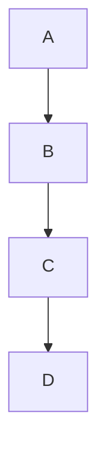
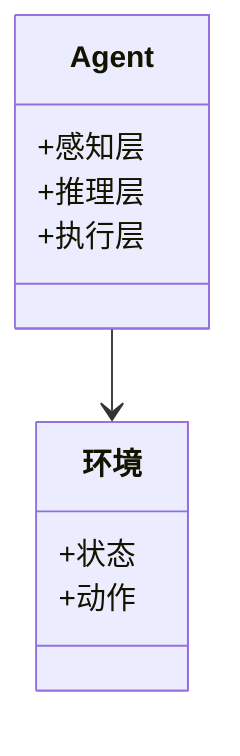
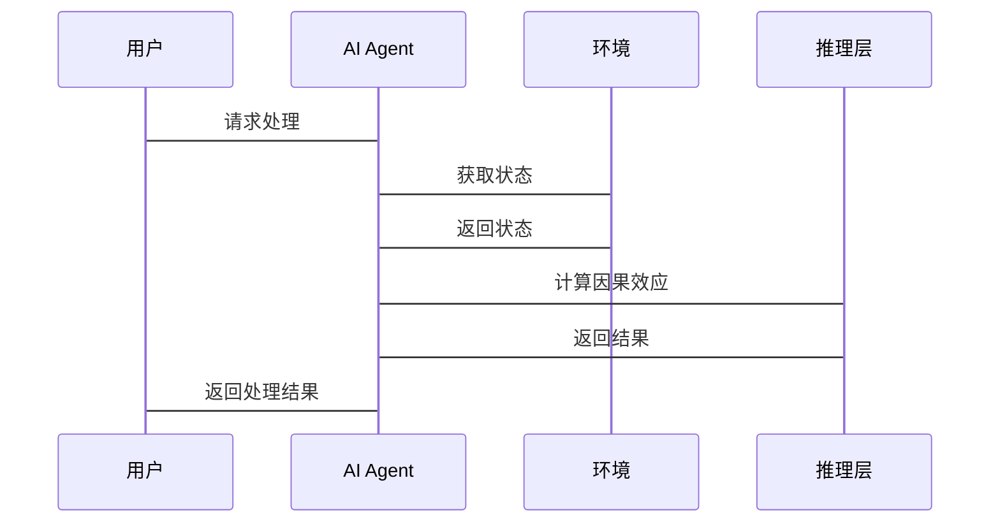

                 


# 《构建具有因果推理能力的AI Agent》

---

## 关键词：
- 因果推理
- AI Agent
- 人工智能
- 算法原理
- 系统架构

---

## 摘要：
本文将深入探讨如何构建一个具有因果推理能力的AI Agent。首先，我们将介绍因果推理的核心概念及其在AI Agent中的重要性，分析当前AI Agent的局限性以及引入因果推理的必要性。接下来，我们将详细讲解因果推理的原理、模型及算法，包括反事实推理和基于DAG的因果推断方法，并通过Python代码实现这些算法。最后，我们将从系统架构的角度，设计AI Agent的结构，结合实际案例分析，展示如何将因果推理应用于实际问题中，并总结构建此类AI Agent的最佳实践。

---

## 第一部分: 背景与概念

### 第1章: 因果推理与AI Agent概述

#### 1.1 问题背景
当前，AI Agent在许多应用场景中表现出色，如自然语言处理、图像识别和推荐系统。然而，这些AI Agent往往仅限于基于相关性的预测，无法理解因果关系。例如，在医疗领域，AI Agent可能无法准确预测某种治疗方案的效果，因为它们仅依赖于相关性而非因果关系。因此，引入因果推理能力对于提升AI Agent的决策能力至关重要。

#### 1.2 核心概念
- **因果推理**：研究因果关系的科学，旨在理解“为什么”某些事件发生，而不仅仅是“什么”发生了。
- **AI Agent**：能够感知环境、做出决策并执行动作的智能体，旨在实现特定目标。
- **因果推理与AI Agent的结合**：通过因果推理，AI Agent能够理解动作与结果之间的因果关系，从而做出更合理的决策。

#### 1.3 问题的边界与外延
- **边界**：本文主要关注基于统计的因果推理方法，不涉及物理世界中的真实因果机制。
- **外延**：因果推理的应用范围广泛，包括医疗、金融、教育等领域。

#### 1.4 概念结构与核心要素
- **因果图模型**：用于表示变量之间的因果关系，如DAG（有向无环图）。
- **AI Agent的组成**：感知层、推理层和执行层。

---

## 第二部分: 核心概念与联系

### 第2章: 因果推理的原理与模型

#### 2.1 因果推理的原理
因果推理的核心在于理解干预（action）对结果（outcome）的影响。结构方程模型（SEM）和反事实推理是两种主要方法。

- **结构方程模型**：通过一组方程描述变量之间的因果关系。
- **反事实推理**：通过假设相反事实来推断因果效应。

#### 2.2 因果图模型
DAG是因果推理的核心工具，用于表示变量之间的因果关系。例如，考虑变量A→B→C的DAG，表示A影响B，B影响C，而A直接不影响C。

#### 2.3 对比分析
| 对比项         | 因果推理             | 相关性分析           |
|----------------|----------------------|----------------------|
| 目标           | 理解因果关系         | 描述变量之间的关系   |
| 方法           | 结构方程模型、反事实推理 | 相关系数、回归分析   |
| 应用场景       | 医疗、政策评估         | 市场分析、预测模型    |

---

## 第三部分: 算法原理讲解

### 第3章: 因果推断算法

#### 3.1 反事实推理算法
反事实推理通过假设相反的事实来推断因果效应。例如，计算在给定干预下，结果的变化情况。

**算法步骤**：
1. 构建因果图模型。
2. 确定干预变量和目标变量。
3. 计算反事实推断的期望值。

**Python代码实现**：
```python
import doyen

def factual_inference(data, treatment, outcome):
    # 示例代码
    causal_model = doyen.CausalModel(data, treatment, outcome)
    causal_effect = causal_model.do_calculus()
    return causal_effect
```

#### 3.2 基于DAG的因果推断
DAG模型通过调整中间变量来计算因果效应。

**算法步骤**：
1. 构建DAG模型。
2. 确定因果路径。
3. 计算调整公式。

**Mermaid流程图**：


---

## 第四部分: 数学模型

### 第4章: 因果关系的数学表达

#### 4.1 结构方程模型
结构方程模型通过一组线性方程描述变量之间的因果关系：
$$
Y = \beta X + \epsilon
$$
其中，$X$ 是自变量，$Y$ 是因变量，$\beta$ 是系数，$\epsilon$ 是误差项。

#### 4.2 潜在结果框架
潜在结果框架通过定义每个单位在不同处理情况下的结果来推断因果效应：
$$
Y_i(z) = \text{处理 } z \text{ 对单位 } i \text{ 的结果}
$$

---

## 第五部分: 系统分析与架构设计

### 第5章: 系统架构设计

#### 5.1 系统功能设计
AI Agent的系统架构包括感知层、推理层和执行层。

**领域模型**：


#### 5.2 系统接口设计
系统接口包括API调用和事件驱动两种方式。

**序列图**：


---

## 第六部分: 项目实战

### 第6章: 项目实现与案例分析

#### 6.1 环境安装
安装必要的Python库，如`doenn`和`networkx`：
```bash
pip install doenn networkx
```

#### 6.2 核心代码实现
实现反事实推理算法：
```python
import networkx as nx

def do_calculus(data, treatment, outcome):
    # 示例代码
    G = nx.DiGraph()
    G.add_edges_from([('A', 'B'), ('B', 'C')])
    return doewn.do(G, data, treatment, outcome)
```

#### 6.3 实际案例分析
以医疗领域的药物疗效评估为例，分析因果推理在AI Agent中的应用。

---

## 第七部分: 总结与展望

### 第7章: 最佳实践与小结

#### 7.1 最佳实践
- 数据质量：因果推理依赖高质量的数据。
- 模型解释性：确保因果模型的可解释性。
- 持续学习：定期更新因果模型以适应变化。

#### 7.2 总结
本文详细讲解了如何构建具有因果推理能力的AI Agent，从理论到实践，从算法到系统架构，为读者提供了全面的指导。

---

## 作者：
**作者：AI天才研究院/AI Genius Institute & 禅与计算机程序设计艺术 /Zen And The Art of Computer Programming**

