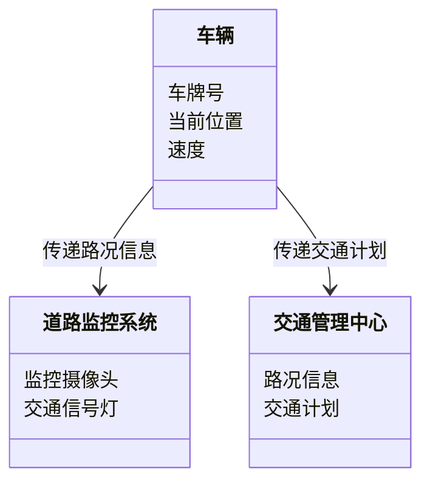
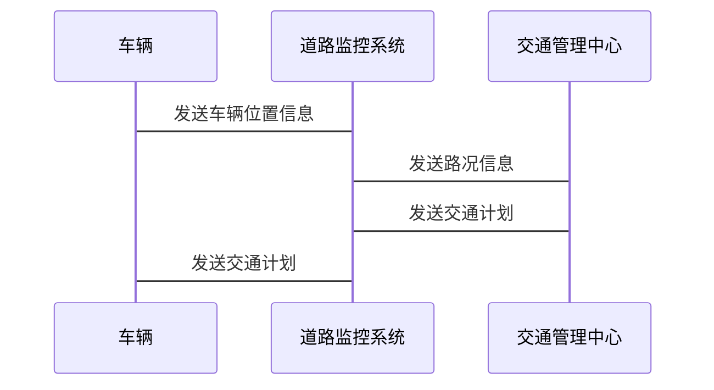

                 


# 构建具有多Agent协同决策能力的系统

> 关键词：多Agent系统、协同决策、分布式计算、智能系统、系统架构设计

> 摘要：  
> 本文详细探讨了构建具有多Agent协同决策能力的系统的各个方面，从核心概念到算法实现，再到系统架构设计和项目实战，为读者提供全面的指导。通过分析多Agent系统的背景、核心概念、协作机制、算法原理、系统架构设计、项目实战及扩展与优化，本文旨在帮助读者理解和掌握多Agent协同决策系统的构建方法。

---

# 第一部分: 多Agent协同决策系统背景与概念

## 第1章: 多Agent系统概述

### 1.1 多Agent系统的基本概念

#### 1.1.1 什么是Agent
Agent（智能体）是一个能够感知环境并采取行动以实现目标的实体。Agent可以是软件程序、机器人或其他智能设备。Agent的核心特征包括：
- **自主性**：能够在没有外部干预的情况下独立运行。
- **反应性**：能够感知环境并做出实时反应。
- **协作性**：能够与其他Agent或系统进行协作。

#### 1.1.2 多Agent系统的定义
多Agent系统（Multi-Agent System, MAS）是由多个相互作用的Agent组成的系统，这些Agent通过协作完成单个Agent无法完成的任务。多Agent系统广泛应用于分布式计算、智能决策、群智计算等领域。

#### 1.1.3 多Agent系统的应用场景
- **分布式计算**：在分布式系统中，多个Agent协同完成任务。
- **智能决策**：在复杂环境中，多个Agent通过协作做出最优决策。
- **群智计算**：通过多个Agent的协同完成群体智能任务。

### 1.2 多Agent系统的核心概念

#### 1.2.1 Agent的属性与特征
| 属性         | 特征描述                                                                 |
|--------------|--------------------------------------------------------------------------|
| 自主性       | Agent能够独立运行，无需外部干预                                             |
| 反应性       | Agent能够感知环境并实时做出反应                                             |
| 协作性       | Agent能够与其他Agent或系统进行协作                                         |
| 学习能力     | Agent能够通过经验或数据进行学习和优化                                       |

#### 1.2.2 多Agent系统中的协作与冲突
多Agent系统中的协作是指多个Agent通过合作完成共同目标，而冲突则是指多个Agent在资源分配、任务执行等方面的竞争或矛盾。解决冲突是多Agent系统设计中的重要问题。

#### 1.2.3 多Agent系统的分类
| 分类标准       | 类型                                   |
|----------------|----------------------------------------|
| 环境类型       | 静态环境、动态环境                     |
| Agent类型     | 单智体系统、多智体系统                 |
| 协作方式       | 分散式协作、集中式协作                 |

### 1.3 多Agent系统的应用场景

#### 1.3.1 分布式计算
在分布式计算中，多个Agent分别承担不同的任务，通过协作完成整体目标。

#### 1.3.2 智能决策
在智能决策系统中，多个Agent通过协作提供更全面的决策支持。

#### 1.3.3 群智计算
群智计算通过多个Agent的协同完成群体智能任务，例如分布式问题求解、群体决策等。

### 1.4 多Agent系统的发展与挑战

#### 1.4.1 多Agent系统的发展历程
多Agent系统的发展经历了从简单的分布式系统到复杂的智能协同系统的演变。

#### 1.4.2 当前多Agent系统的挑战
- **复杂性**：多Agent系统的复杂性使得设计和实现变得困难。
- **安全性**：多Agent系统中的安全问题，例如恶意Agent的攻击。
- **可扩展性**：多Agent系统需要能够扩展以适应更多的Agent。

#### 1.4.3 多Agent系统的未来趋势
多Agent系统将更加智能化、协同化和分布式，应用场景将更加广泛。

## 1.5 本章小结
本章介绍了多Agent系统的基本概念、核心概念、应用场景以及发展与挑战。通过这些内容，读者可以初步了解多Agent系统的基本框架和其在实际中的应用。

---

# 第二部分: 多Agent协同决策的核心概念与联系

## 第2章: 多Agent系统的核心概念

### 2.1 多Agent系统的模型与框架

#### 2.1.1 多Agent系统的模型
多Agent系统的模型通常包括：
- **通信模型**：描述Agent之间的通信方式。
- **协作模型**：描述Agent之间的协作方式。
- **决策模型**：描述Agent如何做出决策。

#### 2.1.2 多Agent系统的框架
多Agent系统的框架通常包括：
- **通信层**：处理Agent之间的通信。
- **协作层**：处理Agent之间的协作。
- **决策层**：处理Agent的决策过程。

### 2.2 多Agent系统中的协作机制

#### 2.2.1 协作协议
协作协议是多Agent系统中Agent之间协作的规则。常见的协作协议包括：
- **基于合同的协作协议**：通过合同规定Agent之间的协作方式。
- **基于承诺的协作协议**：通过承诺规定Agent之间的协作方式。

#### 2.2.2 协作策略
协作策略是多Agent系统中Agent之间协作的策略。常见的协作策略包括：
- **自私策略**：Agent优先考虑自己的利益。
- **合作策略**：Agent优先考虑团队的利益。

### 2.3 多Agent系统中的通信与协调

#### 2.3.1 通信模型
通信模型是多Agent系统中Agent之间通信的方式。常见的通信模型包括：
- **直接通信**：Agent直接与其他Agent通信。
- **间接通信**：Agent通过中间媒介进行通信。

#### 2.3.2 协调机制
协调机制是多Agent系统中Agent之间协作的方式。常见的协调机制包括：
- **同步协调**：所有Agent同时进行协作。
- **异步协调**：Agent在不同时间进行协作。

### 2.4 多Agent系统中的决策机制

#### 2.4.1 单Agent决策
单Agent决策是单个Agent做出决策的过程。通常包括感知环境、分析问题、做出决策等步骤。

#### 2.4.2 多Agent决策
多Agent决策是多个Agent通过协作做出决策的过程。通常包括信息共享、协商、共识达成等步骤。

### 2.5 本章小结
本章详细介绍了多Agent系统的核心概念，包括多Agent系统的模型与框架、协作机制、通信与协调、决策机制等。通过这些内容，读者可以深入了解多Agent系统的核心组成部分及其相互关系。

---

# 第三部分: 多Agent协同决策的算法与实现

## 第3章: 多Agent系统的算法原理

### 3.1 多Agent系统的算法原理

#### 3.1.1 分布式计算算法
分布式计算算法是多Agent系统中常用的算法之一。常见的分布式计算算法包括：
- **分布式一致性算法**：例如Paxos算法、Raft算法。
- **分布式任务分配算法**：例如负载均衡算法。

#### 3.1.2 协作决策算法
协作决策算法是多Agent系统中常用的算法之一。常见的协作决策算法包括：
- **博弈论模型**：例如纳什均衡模型。
- **分布式协商算法**：例如分布式协商算法。

### 3.2 多Agent系统的数学模型

#### 3.2.1 纳什均衡模型
纳什均衡模型是博弈论中的一个经典模型，用于描述多个Agent在博弈中的均衡状态。

数学模型如下：
$$
\text{纳什均衡} \quad \text{定义为} \quad \text{对于每个Agent} \ i, \text{在其他Agent策略不变的情况下，Agent} \ i \text{的策略是最优的}。
$$

#### 3.2.2 协作决策模型
协作决策模型是多Agent系统中常用的数学模型之一，用于描述多个Agent如何通过协作做出决策。

数学模型如下：
$$
\text{协作决策} \quad \text{定义为} \quad \text{多个Agent通过协商和协作，共同做出最优决策}。
$$

### 3.3 多Agent系统的实现

#### 3.3.1 通信与协调
通信与协调是多Agent系统实现中的关键部分。通常，Agent之间的通信可以通过消息传递机制实现，而协调可以通过分布式算法实现。

#### 3.3.2 分布式计算
分布式计算是多Agent系统实现中的另一个关键部分。通常，分布式计算可以通过分布式系统架构和分布式算法实现。

### 3.4 本章小结
本章详细介绍了多Agent系统的算法原理，包括分布式计算算法、协作决策算法、数学模型等。通过这些内容，读者可以深入了解多Agent系统实现的核心算法及其应用。

---

## 第4章: 系统分析与架构设计

### 4.1 问题场景介绍
在本章中，我们将以一个智能交通系统为例，介绍多Agent系统的分析与架构设计。

### 4.2 系统功能设计

#### 4.2.1 领域模型
领域模型是系统功能设计中的关键部分。以下是智能交通系统的领域模型类图：



### 4.3 系统架构设计

#### 4.3.1 系统架构
以下是智能交通系统的系统架构图：


### 4.4 系统接口设计

#### 4.4.1 系统接口
系统接口是系统架构设计中的关键部分。以下是智能交通系统的系统接口设计：



### 4.5 本章小结
本章详细介绍了智能交通系统的分析与架构设计，包括领域模型、系统架构、系统接口等。通过这些内容，读者可以深入了解多Agent系统在实际应用中的设计过程。

---

## 第5章: 项目实战

### 5.1 环境安装
在本章中，我们将介绍如何在本地环境中安装多Agent系统的开发环境。以下是安装步骤：
1. 安装Python编程语言。
2. 安装必要的Python库，例如`numpy`、`pandas`等。

### 5.2 系统核心实现

#### 5.2.1 核心代码实现
以下是多Agent系统的核心代码实现：

```python
import numpy as np

class Agent:
    def __init__(self, id):
        self.id = id
        self.state = "idle"

    def感知环境(self):
        # 感知环境的逻辑
        pass

    def 采取行动(self):
        # 采取行动的逻辑
        pass

# 创建多个Agent实例
agents = [Agent(i) for i in range(5)]

# 启动多Agent系统的运行
for agent in agents:
    agent.采取行动()
```

### 5.3 代码应用解读与分析
通过上述代码，我们可以看到多Agent系统的核心逻辑。每个Agent都有自己的状态，并能够感知环境并采取行动。

### 5.4 实际案例分析

#### 5.4.1 案例分析
以智能交通系统为例，我们可以通过上述代码实现车辆的位置感知和交通计划的制定。

### 5.5 项目小结
本章通过实际案例分析，展示了多Agent系统的实现过程。通过这些内容，读者可以掌握多Agent系统在实际应用中的开发方法。

---

## 第6章: 扩展与优化

### 6.1 多Agent系统的性能优化
性能优化是多Agent系统设计中的一个重要问题。常见的性能优化方法包括：
- **并行计算**：通过并行计算提高系统的计算效率。
- **负载均衡**：通过负载均衡优化系统的资源分配。

### 6.2 多Agent系统的安全性
安全性是多Agent系统设计中的另一个重要问题。常见的安全性问题包括：
- **恶意Agent**：防止恶意Agent对系统的攻击。
- **数据泄露**：防止系统的敏感数据泄露。

### 6.3 多Agent系统的可扩展性
可扩展性是多Agent系统设计中的另一个重要问题。常见的可扩展性优化方法包括：
- **模块化设计**：通过模块化设计提高系统的可扩展性。
- **分布式架构**：通过分布式架构优化系统的可扩展性。

### 6.4 本章小结
本章详细介绍了多Agent系统的扩展与优化，包括性能优化、安全性、可扩展性等。通过这些内容，读者可以深入了解多Agent系统设计中的高级技巧。

---

## 第7章: 总结与展望

### 7.1 总结
通过本文的介绍，我们详细探讨了多Agent协同决策系统的各个方面，包括核心概念、算法原理、系统架构设计、项目实战及扩展与优化。通过这些内容，读者可以全面掌握多Agent系统的设计与实现方法。

### 7.2 展望
未来，多Agent系统将在更多领域得到应用，例如智能交通、智能电网、智能制造等。同时，多Agent系统的研究也将朝着更加智能化、协同化和分布式方向发展。

---

## 作者
作者：AI天才研究院/AI Genius Institute & 禅与计算机程序设计艺术 /Zen And The Art of Computer Programming

