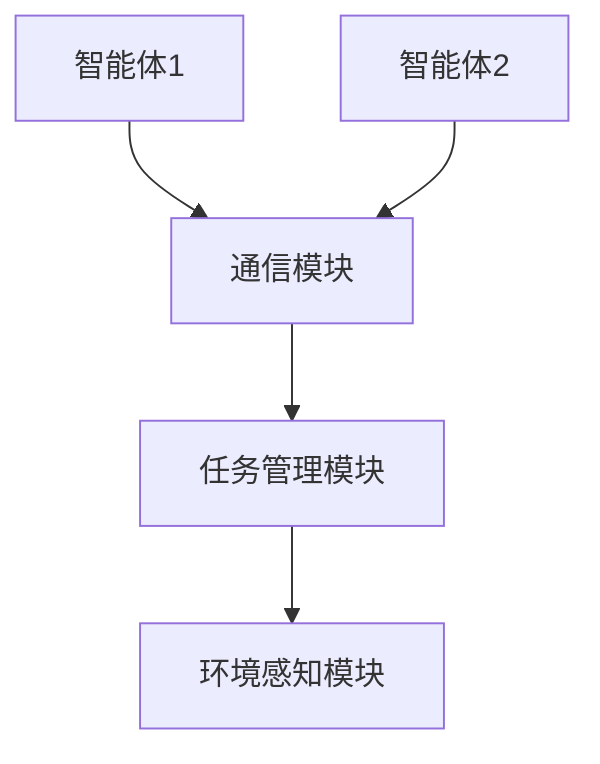
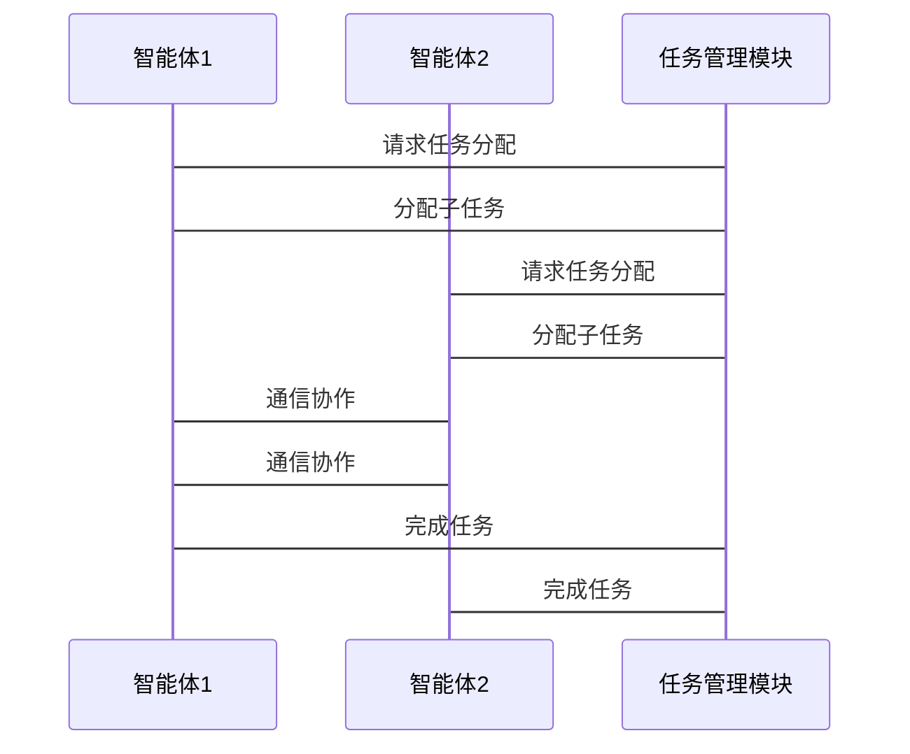

                 


# 构建具有多智能体协作能力的AI系统

---

## 关键词：
- 多智能体协作
- AI系统
- 智能体设计
- 协作算法
- 系统架构
- 应用场景

---

## 摘要：
本文详细探讨了构建具有多智能体协作能力的AI系统的核心原理、设计方法和实现技术。从多智能体协作的基本概念出发，逐步深入分析其算法原理、系统架构、项目实战和未来趋势。通过丰富的案例和详细的代码实现，帮助读者全面理解如何设计和实现一个多智能体协作系统，并掌握其在实际应用中的关键要点。

---

# 第一部分: 多智能体协作的背景与基础

## 第1章: 多智能体协作的定义与背景

### 1.1 多智能体协作的定义

#### 1.1.1 多智能体系统的定义
多智能体系统（Multi-Agent System, MAS）是指由多个智能体（Agent）组成的系统，这些智能体能够通过协作完成复杂任务。智能体是具有感知、推理和行动能力的实体，可以是软件程序、机器人或其他智能设备。

#### 1.1.2 多智能体协作的核心概念
多智能体协作是指多个智能体通过通信和协调，共同完成一个或多个目标的过程。其核心在于智能体之间的协作，而不是单个智能体的独立运行。

#### 1.1.3 多智能体协作的背景与现状
随着人工智能技术的发展，多智能体协作在许多领域得到了广泛应用。例如，在自动驾驶中，多个车辆需要协作以避免碰撞；在分布式系统中，多个节点需要协作以完成任务。

---

### 1.2 多智能体协作的特点

#### 1.2.1 智能体的自主性与协作性
智能体具有自主性，能够独立决策和行动，同时通过协作实现共同目标。

#### 1.2.2 多智能体协作的优势与劣势
优势：
- 高效性：多个智能体可以同时处理不同的任务。
- 灵活性：智能体可以根据环境变化动态调整协作策略。
- 可扩展性：可以通过增加智能体的数量来扩展系统的处理能力。

劣势：
- 复杂性：智能体之间的协作需要复杂的通信和协调机制。
- 冲突管理：智能体可能因为利益冲突而产生矛盾。

#### 1.2.3 多智能体协作的应用场景
- 自动驾驶：车辆之间需要协作以避免碰撞。
- 智能交通系统：道路监控和交通管理需要多个智能体协作。
- 分布式计算：多个节点协作完成任务。

---

### 1.3 多智能体协作与单智能体的区别

#### 1.3.1 单智能体的特点
单智能体独立完成任务，不需要与其他智能体协作。

#### 1.3.2 多智能体协作的独特性
多个智能体通过协作完成任务，强调通信和协调。

#### 1.3.3 多智能体协作的复杂性
由于需要协调多个智能体，系统的复杂性显著增加。

---

## 第2章: 多智能体协作的核心概念

### 2.1 多智能体协作的基本原理

#### 2.1.1 智能体的结构与功能
智能体通常包括感知模块、推理模块和行动模块。感知模块负责获取环境信息，推理模块负责决策，行动模块负责执行动作。

#### 2.1.2 多智能体协作的通信机制
智能体之间需要通过通信机制交换信息。常用的通信方式包括发布-订阅模型和点对点通信。

#### 2.1.3 协作任务的分配与协调
协作任务需要分解成多个子任务，并分配给不同的智能体。子任务的分配需要考虑智能体的能力和当前状态。

---

### 2.2 多智能体协作的模型与框架

#### 2.2.1 基于任务的协作模型
任务驱动的协作模型将任务分解为多个子任务，并分配给不同的智能体完成。

#### 2.2.2 基于行为的协作模型
行为驱动的协作模型关注智能体的实时行为，通过动态调整行为实现协作。

#### 2.2.3 基于角色的协作模型
角色驱动的协作模型将智能体分配到不同的角色，每个角色负责特定的任务。

---

### 2.3 多智能体协作的核心要素

#### 2.3.1 智能体的协作目标
协作目标是智能体协作的核心，通常包括全局目标和局部目标。

#### 2.3.2 协作任务的分解与分配
任务分解是将协作任务分解成多个子任务，任务分配是将子任务分配给不同的智能体。

#### 2.3.3 协作过程中的冲突与协调
智能体在协作过程中可能产生冲突，需要通过协调机制解决冲突，确保协作顺利进行。

---

## 第3章: 多智能体协作的算法原理

### 3.1 分布式协作算法

#### 3.1.1 分布式协作的基本原理
分布式协作算法强调智能体之间的分布式决策和协作，通常采用去中心化的架构。

#### 3.1.2 分布式协作的数学模型
分布式协作的数学模型可以用图论表示，例如图模型中的节点代表智能体，边代表协作关系。

#### 3.1.3 分布式协作的实现步骤
1. 智能体感知环境。
2. 智能体决策自己的行动。
3. 智能体通过通信机制与其他智能体协作。
4. 智能体执行动作。

---

### 3.2 基于博弈论的协作算法

#### 3.2.1 博弈论的基本原理
博弈论研究智能体之间的策略选择和互动，可以用于多智能体协作中的决策制定。

#### 3.2.2 博弈论协作的数学模型
博弈论协作可以用纳什均衡等概念描述，帮助智能体找到最优协作策略。

#### 3.2.3 博弈论协作的实现步骤
1. 确定博弈空间和可能的策略。
2. 计算纳什均衡或其他博弈论概念。
3. 智能体根据博弈结果制定协作策略。

---

### 3.3 基于强化学习的协作算法

#### 3.3.1 强化学习的基本原理
强化学习是一种通过智能体与环境互动来学习策略的方法，适用于多智能体协作中的动态环境。

#### 3.3.2 强化学习协作的数学模型
强化学习可以用马尔可夫决策过程（MDP）描述，适用于多智能体协作中的动态协作。

#### 3.3.3 强化学习协作的实现步骤
1. 确定智能体的观测空间和动作空间。
2. 确定奖励函数。
3. 智能体通过强化学习算法学习协作策略。

---

## 第4章: 多智能体协作的系统架构

### 4.1 系统架构设计

#### 4.1.1 系统功能模块
多智能体协作系统通常包括智能体模块、通信模块、任务管理模块和环境感知模块。

#### 4.1.2 系统架构图


#### 4.1.3 系统架构的特点
去中心化的架构设计、模块化设计和动态调整能力。

---

### 4.2 系统接口设计

#### 4.2.1 智能体间的通信接口
智能体之间通过通信接口交换信息，常用的通信接口包括发布-订阅接口和点对点接口。

#### 4.2.2 任务管理接口
任务管理模块通过任务管理接口协调智能体的任务分配和协作。

#### 4.2.3 环境感知接口
环境感知模块通过环境感知接口获取环境信息，并向智能体提供反馈。

---

### 4.3 系统交互流程

#### 4.3.1 交互流程图


---

## 第5章: 多智能体协作的项目实战

### 5.1 项目背景

#### 5.1.1 项目介绍
本项目旨在构建一个多智能体协作系统，用于解决电商推荐系统中的协作问题。

#### 5.1.2 项目目标
实现一个多智能体协作的电商推荐系统，提升推荐的准确性和用户体验。

---

### 5.2 系统核心实现

#### 5.2.1 环境安装
需要安装Python、Pandas、NumPy、Scikit-learn等库。

#### 5.2.2 核心代码实现
```python
class Agent:
    def __init__(self, id):
        self.id = id
        self.state = None

    def perceive(self, environment):
        # 根据环境感知状态
        self.state = environment.get_state()

    def decide(self):
        # 根据状态决策
        return self.state

    def act(self, action):
        # 执行动作
        pass

class MAS:
    def __init__(self, agents):
        self.agents = agents

    def coordinate(self):
        # 协调智能体协作
        for agent in self.agents:
            agent.perceive(self.get_environment_state())
            action = agent.decide()
            self.execute_action(agent.id, action)

    def get_environment_state(self):
        # 获取环境状态
        return "environment_state"

    def execute_action(self, agent_id, action):
        # 执行动作
        pass
```

#### 5.2.3 代码应用解读与分析
上述代码定义了一个智能体类和一个多智能体系统类。智能体类包括感知、决策和行动方法，多智能体系统类负责协调智能体的协作。

---

### 5.3 实际案例分析

#### 5.3.1 案例背景
电商推荐系统中，多个智能体协作完成用户推荐。

#### 5.3.2 案例分析
通过多智能体协作，系统可以实时调整推荐策略，提高推荐的准确性和用户体验。

---

## 第6章: 高级主题与未来趋势

### 6.1 多智能体协作的高级主题

#### 6.1.1 联邦学习
联邦学习是一种分布式学习方法，适用于多智能体协作中的数据隐私保护。

#### 6.1.2 边缘计算
边缘计算将计算能力推移到数据源附近，适用于多智能体协作中的实时性要求。

---

### 6.2 多智能体协作的未来趋势

#### 6.2.1 人机协作
未来的多智能体协作将更加注重人机协作，实现人与智能体的无缝协作。

#### 6.2.2 自适应协作
智能体协作将更加自适应，能够根据环境变化动态调整协作策略。

---

## 第7章: 总结与展望

### 7.1 总结

本文详细探讨了构建具有多智能体协作能力的AI系统的核心原理、设计方法和实现技术。从多智能体协作的基本概念出发，逐步深入分析其算法原理、系统架构、项目实战和未来趋势。

---

### 7.2 展望

随着人工智能技术的不断发展，多智能体协作将在更多领域得到广泛应用。未来的研究方向包括人机协作、自适应协作和边缘计算等。

---

## 作者信息

作者：AI天才研究院/AI Genius Institute  
联系邮箱：[contact@ai-genius.org](mailto:contact@ai-genius.org)  
官方网站：[https://www.ai-genius.org](https://www.ai-genius.org)

