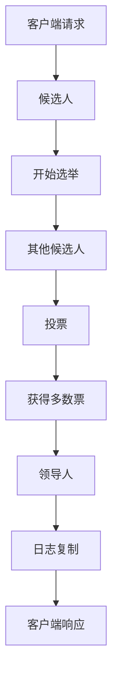
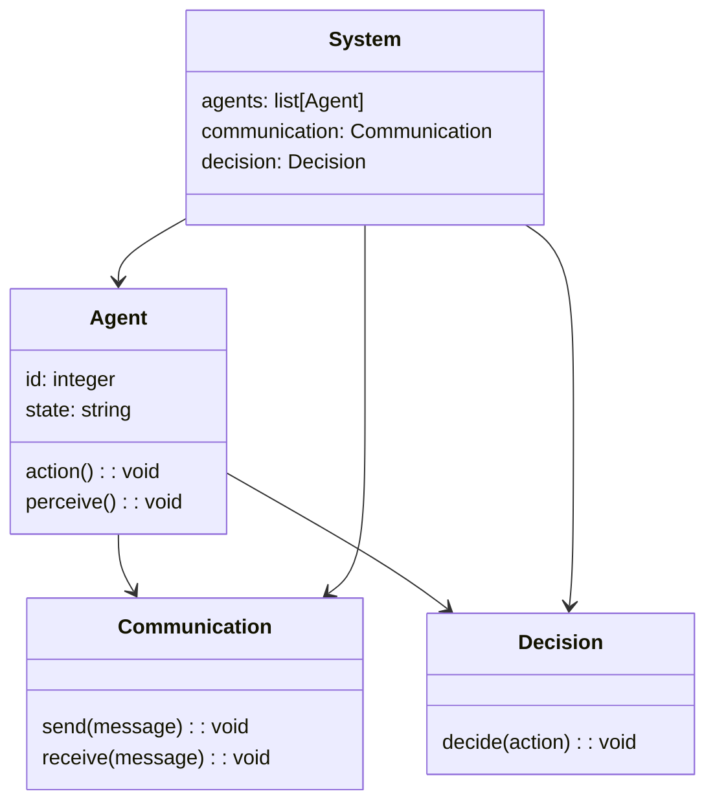
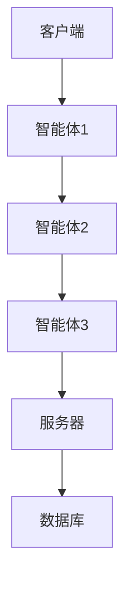
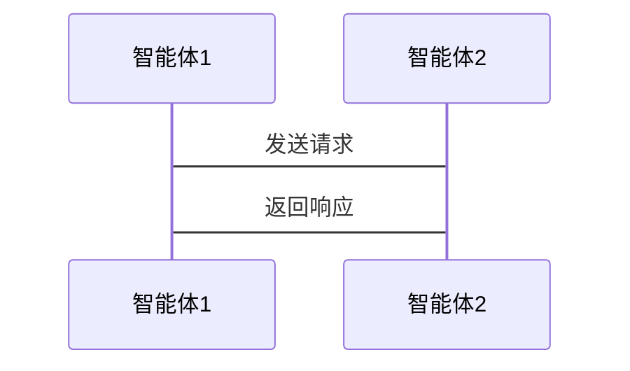

                 


# 构建具有多智能体协同决策能力的系统

> **关键词**：多智能体系统、协同决策、分布式计算、一致性算法、系统架构设计、智能体通信协议

> **摘要**：  
> 本文详细探讨了构建具有多智能体协同决策能力系统的各个方面，从基本概念到算法实现，再到系统架构设计和实际项目案例。文章首先介绍了多智能体系统的核心概念和应用场景，然后深入分析了多智能体系统的结构与组成，详细讲解了分布式计算与一致性算法的原理与实现，探讨了系统架构设计的关键点，最后通过项目实战展示了如何在实际场景中应用多智能体协同决策技术。文章还总结了最佳实践、注意事项，并展望了多智能体系统的未来发展趋势。

---

# 第一部分: 多智能体协同决策系统概述

## 第1章: 多智能体协同决策系统基础

### 1.1 多智能体系统的基本概念

#### 1.1.1 智能体的定义与特点
智能体（Agent）是指能够感知环境并采取行动以实现目标的实体。智能体的特点包括自主性、反应性、主动性、社会性和学习性。  
- 自主性：智能体能够独立决策，无需外部干预。  
- 反应性：智能体能够感知环境并实时响应。  
- 主动性：智能体能够主动采取行动以实现目标。  
- 社会性：智能体能够与其他智能体或环境进行交互。  
- 学习性：智能体能够通过经验改进自身的决策能力。

#### 1.1.2 多智能体系统的定义
多智能体系统（Multi-Agent System, MAS）是由多个智能体组成的系统，这些智能体通过协作完成复杂的任务。多智能体系统的特点包括分布性、异步性、动态性和智能性。  
- 分布性：智能体分布在不同的位置，具有独立的计算能力。  
- 异步性：智能体之间通过异步通信进行交互。  
- 动态性：系统环境和智能体状态可能动态变化。  
- 智能性：智能体具备一定的推理和学习能力。

#### 1.1.3 协同决策的定义与内涵
协同决策是指多个智能体通过协作，共同完成决策任务的过程。协同决策的核心在于信息共享、任务分配和决策优化。  
- 信息共享：智能体之间共享环境信息和决策信息。  
- 任务分配：根据智能体的能力和环境状态，动态分配任务。  
- 决策优化：通过协作，优化单个智能体的决策，提高整体系统的性能。

### 1.2 多智能体系统的应用场景

#### 1.2.1 分布式计算与多智能体
分布式计算是多智能体系统的重要应用场景。在分布式系统中，多个智能体协作完成计算任务，例如分布式数据库的事务处理、分布式计算任务的分配与协调。

#### 1.2.2 机器人协作与多智能体
在机器人协作领域，多智能体系统用于实现机器人之间的协同作业。例如，在工业生产中，多个机器人协作完成组装、搬运等任务。

#### 1.2.3 自动驾驶与多智能体
在自动驾驶领域，多智能体系统用于实现车辆之间的协同决策，例如交通流量优化、道路规划和车辆避障。

### 1.3 多智能体系统与传统AI的区别

#### 1.3.1 单智能体与多智能体的对比
单智能体系统由一个智能体完成任务，而多智能体系统由多个智能体协作完成任务。单智能体系统适用于简单任务，而多智能体系统适用于复杂任务。

#### 1.3.2 协同决策与单一决策的差异
协同决策需要多个智能体协作，而单一决策仅由一个智能体完成。协同决策能够通过信息共享和任务分配，提高系统的整体性能。

#### 1.3.3 多智能体系统的复杂性与挑战
多智能体系统的复杂性主要体现在智能体之间的通信、协作和决策优化。主要挑战包括信息共享的效率、任务分配的公平性以及系统的鲁棒性。

### 1.4 本章小结
本章介绍了多智能体系统的基本概念、应用场景以及与传统AI的区别，为后续章节的学习奠定了基础。

---

# 第二部分: 多智能体协同决策的核心概念

## 第2章: 多智能体系统的结构与组成

### 2.1 智能体的结构与类型

#### 2.1.1 智能体的基本结构
智能体的基本结构包括感知层、推理层和行动层。感知层负责感知环境信息，推理层负责分析和推理，行动层负责执行行动。

#### 2.1.2 智能体的类型划分
智能体可以分为反应式智能体和认知式智能体。反应式智能体仅根据当前感知信息进行决策，而认知式智能体具备长期记忆和推理能力。

#### 2.1.3 智能体的属性与行为
智能体的属性包括目标、知识和能力。智能体的行为包括感知、推理和行动。

#### 核心概念对比表
| 属性 | 反应式智能体 | 认知式智能体 |
|------|--------------|-------------|
| 目标 | 响应环境变化 | 长期目标导向 |
| 知识 | 当前状态信息 | 全局知识和记忆 |
| 行为 | 实时反应 | 计划与推理 |

### 2.2 多智能体系统的协同机制

#### 2.2.1 协同决策的基本原理
协同决策的核心在于智能体之间的信息共享和任务分配。通过信息共享，智能体能够了解彼此的状态和意图，通过任务分配，智能体能够合理分配资源和责任。

#### 2.2.2 协同方式的分类与对比
协同方式可以分为基于通信的协同和基于计算的协同。基于通信的协同通过智能体之间的直接通信实现，而基于计算的协同通过算法实现。

#### 2.2.3 协同过程中的信息交换
智能体之间的信息交换需要通过通信协议实现。常见的通信协议包括HTTP、WebSocket和DDS（Data Distribution Service）。

### 2.3 多智能体系统的通信协议

#### 2.3.1 通信协议的定义与作用
通信协议是智能体之间进行信息交换的规则。通信协议的作用包括数据格式化、数据传输和数据同步。

#### 2.3.2 常见的通信协议类型
- HTTP：基于请求-响应模式的通信协议。
- WebSocket：双向通信协议，适用于实时数据传输。
- DDS：高性能分布式实时通信协议，常用于工业自动化和自动驾驶。

#### 2.3.3 通信协议的选择与设计
选择通信协议需要考虑系统的实时性、可靠性和带宽要求。在设计通信协议时，需要明确数据格式、通信频率和错误处理机制。

### 2.4 本章小结
本章详细介绍了多智能体系统的结构与组成，重点分析了智能体的类型、协同机制和通信协议。

---

## 第3章: 分布式计算与一致性算法

### 3.1 分布式计算的基本原理

#### 3.1.1 分布式系统的特点
分布式系统由多个计算节点组成，节点之间通过网络进行通信。分布式系统的特点包括并发性、异步性和一致性。

#### 3.1.2 分布式计算的核心问题
分布式计算的核心问题是数据一致性。数据一致性是指系统中多个副本的数据保持一致。

#### 3.1.3 分布式计算的数学模型
分布式计算的数学模型包括状态机模型和一致性模型。状态机模型描述了系统中每个节点的状态变化，一致性模型描述了系统中数据一致性保证的机制。

### 3.2 一致性算法的原理与实现

#### 3.2.1 一致性算法的定义与作用
一致性算法是通过分布式系统中多个副本的数据保持一致的算法。一致性算法的作用包括数据同步和冲突解决。

#### 3.2.2 常见一致性算法的对比
常见的一致性算法包括raft算法和paxos算法。raft算法通过选举领导人来实现一致性，而paxos算法通过协商一致来实现一致性。

#### 3.2.3 一致性算法的数学模型
raft算法的数学模型包括选举协议和日志复制协议。选举协议通过心跳机制和超时机制来选举领导人，日志复制协议通过日志同步来保证数据一致性。

#### raft算法的mermaid流程图


#### raft算法的Python代码实现
```python
class Raft:
    def __init__(self):
        self.leader = None
        self.voted_for = None
        self.votes_count = 0
        self.log = []

    def request_vote(self, candidate_id):
        if self.voted_for == candidate_id:
            return True
        if self.voted_for is None and self.votes_count >= len(nodes)/2:
            self.voted_for = candidate_id
            self.votes_count += 1
            return True
        return False

    def election(self):
        if self.leader is None:
            for node in nodes:
                if node.request_vote(self.id):
                    self.leader = node.id
                    break

    def replicate_log(self):
        for node in nodes:
            if node.id != self.id:
                node.log = self.log
```

### 3.3 一致性算法的实现案例

#### 3.3.1 算法实现的步骤
一致性算法的实现步骤包括初始化、选举领导人、日志复制和数据同步。

#### 3.3.2 算法实现的代码示例
```python
class Node:
    def __init__(self, id):
        self.id = id
        self.log = []

    def append_entry(self, entry):
        self.log.append(entry)

    def replicate(self, leader_log):
        self.log = leader_log
```

#### 3.3.3 算法实现的优化与改进
一致性算法的优化包括减少选举次数、优化日志同步机制和提高网络传输效率。

### 3.4 本章小结
本章详细介绍了分布式计算与一致性算法的原理与实现，重点分析了raft算法和paxos算法的对比与实现案例。

---

## 第4章: 系统架构设计

### 4.1 系统功能设计与实现

#### 4.1.1 系统功能需求分析
系统功能需求包括智能体的注册与发现、智能体之间的通信、协同决策算法的实现和系统管理与监控。

#### 4.1.2 功能模块之间的关系
功能模块之间的关系包括智能体管理模块、通信模块、决策模块和监控模块。

#### 4.1.3 功能模块的实现方式
功能模块的实现方式包括基于消息队列的通信、基于一致性算法的数据同步和基于分布式计算的决策优化。

#### 4.1.4 系统功能设计的mermaid类图


### 4.2 系统架构设计

#### 4.2.1 系统架构的定义与作用
系统架构设计是系统设计的核心部分，决定了系统的功能、性能和可扩展性。

#### 4.2.2 常见的系统架构类型
常见的系统架构类型包括单体架构、微服务架构和分布式架构。

#### 4.2.3 系统架构的选择与设计
系统架构的选择需要考虑系统的规模、性能和扩展性。在设计系统架构时，需要明确系统的模块划分、数据流和通信协议。

#### 4.2.4 系统架构设计的mermaid架构图


### 4.3 系统接口设计

#### 4.3.1 系统接口的定义与作用
系统接口是智能体之间的通信接口，用于实现智能体之间的信息共享和任务分配。

#### 4.3.2 系统接口的设计原则
系统接口的设计原则包括简单性、一致性、可扩展性和安全性。

#### 4.3.3 系统接口的实现方式
系统接口的实现方式包括基于HTTP的REST接口、基于WebSocket的实时通信接口和基于消息队列的异步接口。

### 4.4 系统交互设计

#### 4.4.1 系统交互的定义与作用
系统交互是指智能体之间的通信与协作过程，是实现协同决策的核心环节。

#### 4.4.2 系统交互的mermaid序列图


### 4.5 本章小结
本章详细介绍了系统架构设计的关键点，重点分析了系统功能设计、架构设计和接口设计。

---

## 第5章: 项目实战

### 5.1 智能交通系统案例分析

#### 5.1.1 项目背景与目标
智能交通系统的项目目标是通过多智能体协同决策，实现交通流量的优化和车辆的协同行驶。

#### 5.1.2 系统环境安装与配置
系统环境安装包括安装操作系统、安装开发工具和配置网络环境。开发工具包括Python、Java和C++，网络环境包括局域网和互联网。

#### 5.1.3 核心代码实现
核心代码实现包括智能体的注册与发现、智能体之间的通信和协同决策算法的实现。

#### 5.1.4 代码实现的详细解读
核心代码包括智能体的注册与发现、智能体之间的通信和协同决策算法的实现。

#### 5.1.5 项目测试与优化
项目测试包括功能测试和性能测试，项目优化包括算法优化和系统调优。

### 5.2 项目小结
本章通过智能交通系统的案例分析，展示了多智能体协同决策技术在实际场景中的应用。

---

## 第6章: 高级主题与未来展望

### 6.1 多智能体系统的高级主题

#### 6.1.1 边缘计算与多智能体系统
边缘计算是一种分布式计算范式，能够将计算能力推向数据源的边缘，减少数据传输的延迟。

#### 6.1.2 多智能体系统的自适应机制
自适应机制是指系统能够根据环境变化自动调整智能体的行为和协作方式。

#### 6.1.3 多智能体系统的安全与隐私保护
多智能体系统的安全与隐私保护是当前研究的热点问题，包括数据加密、身份认证和访问控制。

### 6.2 多智能体系统的未来发展趋势

#### 6.2.1 多智能体系统的智能化
多智能体系统的智能化是未来发展的主要方向，包括智能体的自主学习和智能协作。

#### 6.2.2 多智能体系统的分布式计算
分布式计算是多智能体系统的重要技术，未来的发展将更加注重计算的高效性和数据的一致性。

#### 6.2.3 多智能体系统的应用场景扩展
多智能体系统的应用场景将更加广泛，包括智能制造、智慧城市和自动驾驶等领域。

### 6.3 本章小结
本章展望了多智能体系统的未来发展趋势，重点分析了智能化、分布式计算和应用场景扩展的方向。

---

## 第7章: 总结与展望

### 7.1 核心知识点总结

#### 7.1.1 多智能体系统的核心概念
多智能体系统的核心概念包括智能体的结构、多智能体系统的协同机制和通信协议。

#### 7.1.2 分布式计算与一致性算法
分布式计算与一致性算法是多智能体系统的重要组成部分，包括raft算法和paxos算法。

#### 7.1.3 系统架构设计
系统架构设计是多智能体系统实现的关键，包括功能设计、架构设计和接口设计。

### 7.2 最佳实践 tips

#### 7.2.1 系统设计中的注意事项
在系统设计中，需要考虑智能体的自主性、反应性和社会性，确保系统的可扩展性和可维护性。

#### 7.2.2 代码实现中的注意事项
在代码实现中，需要考虑智能体之间的通信协议、数据一致性保证和系统性能优化。

#### 7.2.3 项目实施中的注意事项
在项目实施中，需要考虑系统的测试与优化、安全与隐私保护和系统的可扩展性。

### 7.3 未来研究方向

#### 7.3.1 多智能体系统的智能化
多智能体系统的智能化是未来研究的主要方向，包括智能体的自主学习和智能协作。

#### 7.3.2 多智能体系统的分布式计算
多智能体系统的分布式计算将更加注重计算的高效性和数据的一致性。

#### 7.3.3 多智能体系统的应用场景扩展
多智能体系统的应用场景将更加广泛，包括智能制造、智慧城市和自动驾驶等领域。

### 7.4 本章小结
本章总结了多智能体系统的知识点，并展望了未来的研究方向。

---

## 作者：AI天才研究院/AI Genius Institute & 禅与计算机程序设计艺术 /Zen And The Art of Computer Programming

---

**感谢您的阅读！**  
**如需转载请注明出处。**

