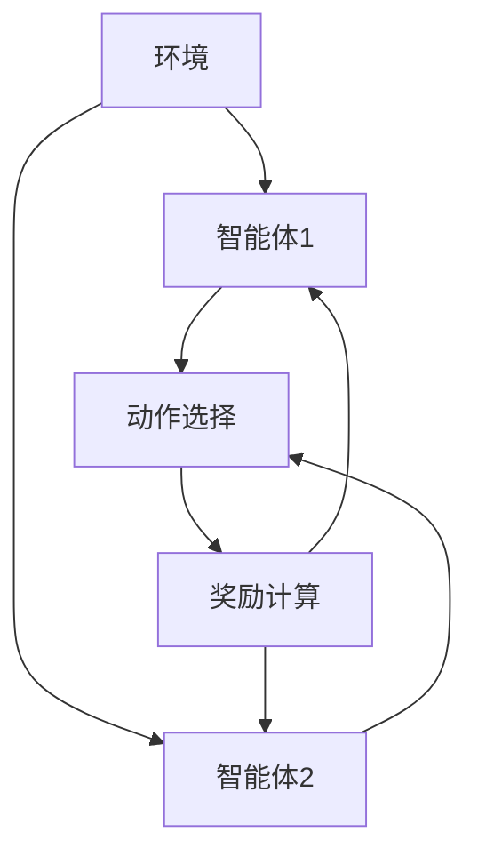
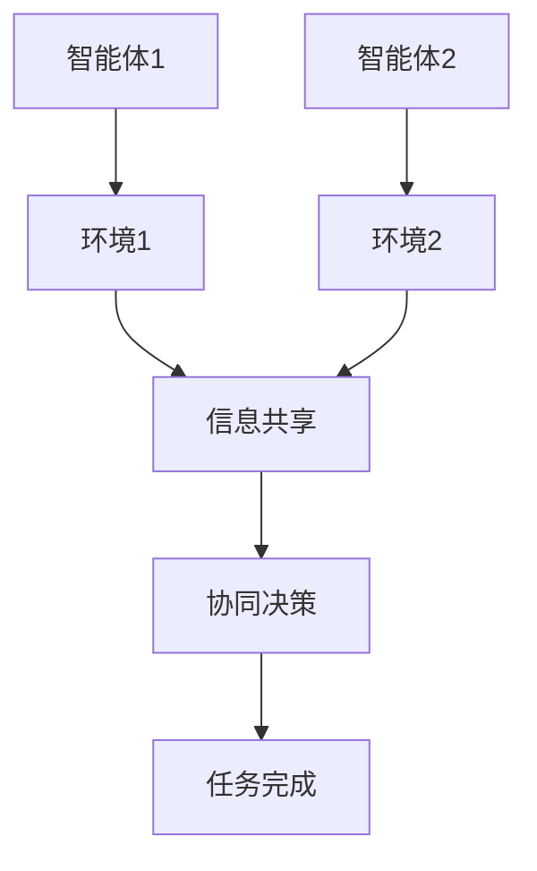
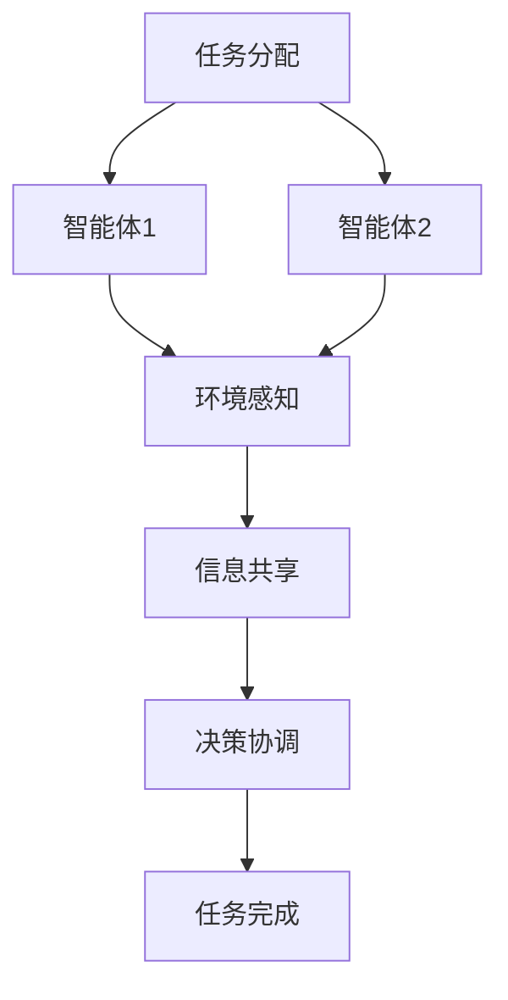
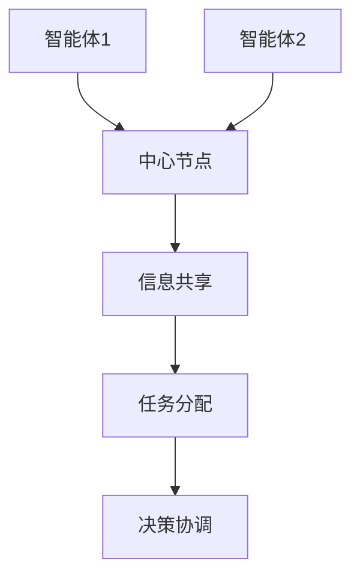
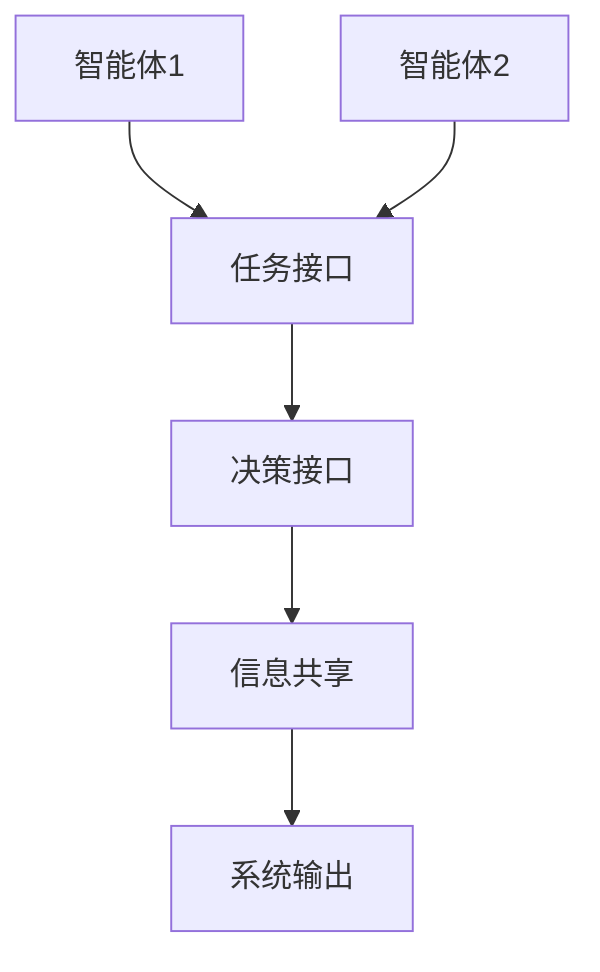
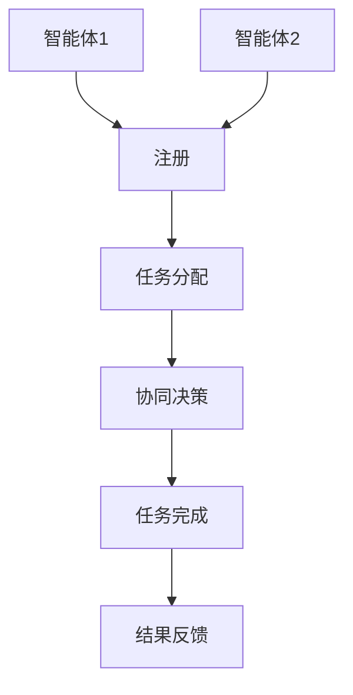

                 


# 构建具有多智能体协同学习能力的系统

---

## 关键词：
多智能体协同学习, 智能体, 强化学习, 分布式系统, 系统架构, 协作学习

---

## 摘要：
本文深入探讨了多智能体协同学习的系统构建方法。首先，我们介绍了多智能体协同学习的基本概念、问题背景及其重要性。接着，我们分析了多智能体协同学习的核心概念，包括智能体的定义、类型以及协同机制。然后，我们详细讲解了多智能体协同学习的算法原理，重点介绍了多智能体强化学习、分布式优化算法及其异构环境下的实现方法。随后，我们从系统架构的角度，分析了多智能体协同学习系统的功能设计、架构设计及接口设计。最后，我们通过项目实战，展示了如何在具体场景中实现多智能体协同学习，并总结了最佳实践和未来研究方向。

---

# 第一部分: 多智能体协同学习的背景与核心概念

## 第1章: 多智能体协同学习的背景与问题背景

### 1.1 多智能体协同学习的定义与问题背景
#### 1.1.1 多智能体系统的基本概念
多智能体系统（Multi-Agent System, MAS）是由多个智能体（Agent）组成的分布式系统，这些智能体能够通过协作完成复杂任务。智能体是指能够感知环境、自主决策并采取行动的实体。

#### 1.1.2 协同学习的定义与特点
协同学习（Collaborative Learning）是指多个智能体通过协作，利用彼此的知识和经验共同完成学习任务的过程。其特点包括分布式性、协作性和智能性。

#### 1.1.3 多智能体协同学习的核心问题
多智能体协同学习的核心问题是如何在分布式环境下，通过智能体之间的协作实现共同的学习目标。这涉及任务分配、信息共享、决策协调等多个方面。

### 1.2 多智能体协同学习的问题描述
#### 1.2.1 协同学习的基本问题
协同学习的基本问题包括：如何确保智能体之间的信息共享，如何协调智能体的决策，如何处理智能体之间的冲突等。

#### 1.2.2 多智能体协同学习的挑战
多智能体协同学习的挑战包括：智能体之间的通信开销、分布式环境下的计算复杂度、智能体之间的信任与安全问题等。

#### 1.2.3 问题解决的思路与方法
为了应对上述挑战，我们需要从算法设计、系统架构、通信协议等多个方面进行优化，以实现高效、安全的多智能体协同学习。

### 1.3 多智能体协同学习的边界与外延
#### 1.3.1 多智能体协同学习的边界
多智能体协同学习的边界包括：智能体的类型、任务的复杂度、环境的动态性等。

#### 1.3.2 多智能体协同学习的外延
多智能体协同学习的外延包括：与其他分布式系统（如分布式计算、分布式数据库）的区别，与其他协作技术（如分布式机器学习、分布式优化）的联系。

---

# 第二部分: 多智能体协同学习的核心概念

## 第2章: 多智能体协同学习的核心概念

### 2.1 智能体的定义与类型
#### 2.1.1 智能体的定义
智能体是指能够感知环境、自主决策并采取行动的实体。智能体可以是软件程序、机器人或其他分布式实体。

#### 2.1.2 智能体的类型
智能体的类型包括：
1. **自主式智能体**：能够自主决策，无需外部干预。
2. **反应式智能体**：根据环境反馈实时调整行为。
3. **基于模型的智能体**：通过内部模型进行决策。
4. **基于强化学习的智能体**：通过强化学习算法优化行为策略。

#### 2.1.3 智能体的核心属性
智能体的核心属性包括：感知能力、决策能力、行动能力、协作能力。

### 2.2 多智能体协同学习的协同机制
#### 2.2.1 协同机制的定义
协同机制是指智能体之间通过某种方式协作，共同完成任务的规则和流程。

#### 2.2.2 协同机制的类型
协同机制的类型包括：
1. **直接协作**：智能体之间直接共享信息并共同决策。
2. **间接协作**：智能体通过中间媒介进行信息共享和协作。
3. **分布式协作**：智能体通过分布式协议实现协作。

#### 2.2.3 协同机制的核心要素
协同机制的核心要素包括：通信协议、任务分配、决策协调。

### 2.3 多智能体协同学习的数学模型
#### 2.3.1 智能体的数学表示
智能体可以用状态、动作、奖励等数学变量进行表示。

#### 2.3.2 协同学习的数学模型
协同学习的数学模型包括：马尔可夫决策过程（MDP）、分布式强化学习模型等。

#### 2.3.3 协同学习的数学公式
$$ V_{\pi}(s) = \max_{a} [ r(s, a) + V_{\pi}(s') ] $$

---

# 第三部分: 多智能体协同学习的算法原理

## 第3章: 多智能体协同学习的算法原理

### 3.1 多智能体强化学习算法
#### 3.1.1 多智能体强化学习的定义
多智能体强化学习是指多个智能体通过强化学习算法协同完成任务的过程。

#### 3.1.2 多智能体强化学习的算法步骤
1. **环境感知**：智能体感知环境状态。
2. **动作选择**：智能体根据策略选择动作。
3. **奖励机制**：智能体根据动作获得奖励。
4. **策略更新**：智能体根据奖励更新策略。

#### 3.1.3 多智能体强化学习的流程图


### 3.2 分布式优化算法
#### 3.2.1 分布式优化算法的定义
分布式优化算法是指在分布式系统中，通过智能体之间的协作优化全局目标的过程。

#### 3.2.2 分布式优化算法的实现步骤
1. **任务分配**：将任务分配给多个智能体。
2. **局部优化**：每个智能体在分配的任务上进行优化。
3. **全局优化**：将局部优化结果汇总，进行全局优化。

#### 3.2.3 分布式优化算法的数学公式
$$ \min_{x_i} \sum_{i=1}^{n} f_i(x_i) $$

### 3.3 异构环境下的协同学习算法
#### 3.3.1 异构环境的定义
异构环境是指智能体运行在不同环境或平台上。

#### 3.3.2 异构环境下的协同学习算法
1. **环境感知**：智能体感知所在环境。
2. **信息共享**：智能体之间共享环境信息。
3. **协同决策**：基于共享信息进行决策。

#### 3.3.3 异构环境下的协同学习流程图


---

# 第四部分: 多智能体协同学习的系统架构

## 第4章: 多智能体协同学习的系统架构

### 4.1 多智能体协同学习的系统功能设计
#### 4.1.1 系统功能模块
1. **智能体管理模块**：负责智能体的注册、管理。
2. **信息共享模块**：负责智能体之间的信息共享。
3. **任务分配模块**：负责任务的分配与协调。
4. **决策协调模块**：负责智能体的协同决策。

#### 4.1.2 系统功能流程图


### 4.2 系统架构设计
#### 4.2.1 系统架构类型
1. **集中式架构**：所有智能体通过一个中心节点进行通信。
2. **分布式架构**：智能体之间直接通信，无中心节点。

#### 4.2.2 系统架构设计


### 4.3 系统接口设计
#### 4.3.1 系统接口类型
1. **智能体接口**：智能体与系统的交互接口。
2. **任务接口**：任务分配的接口。
3. **决策接口**：协同决策的接口。

#### 4.3.2 系统接口设计


### 4.4 系统交互设计
#### 4.4.1 系统交互流程
1. **智能体注册**：智能体通过接口向系统注册。
2. **任务分配**：系统根据智能体的能力分配任务。
3. **协同决策**：智能体通过接口进行信息共享和决策协调。
4. **任务完成**：智能体完成任务并反馈结果。

#### 4.4.2 系统交互流程图


---

# 第五部分: 多智能体协同学习的项目实战

## 第5章: 多智能体协同学习的项目实战

### 5.1 项目背景与目标
#### 5.1.1 项目背景
本项目旨在实现一个多智能体协同学习系统，用于解决复杂的分布式任务。

#### 5.1.2 项目目标
通过本项目，掌握多智能体协同学习的系统构建方法，包括算法实现、系统设计、项目部署等。

### 5.2 项目环境与工具
#### 5.2.1 项目环境
1. **操作系统**：Linux/Windows/MacOS
2. **编程语言**：Python
3. **开发工具**：PyCharm/VS Code
4. **依赖库**：TensorFlow/PyTorch/Multi-Agent-Environment

### 5.3 项目核心实现
#### 5.3.1 系统核心代码
```python
class Agent:
    def __init__(self, id):
        self.id = id
        self.state = None
        self.action = None
        self.reward = None

    def感知环境(self, 状态):
        self.state = 状态

    def选择动作(self):
        # 根据策略选择动作
        pass

    def获得奖励(self, 奖励):
        self.reward = 奖励

class MultiAgentSystem:
    def __init__(self, agent数量):
        self.agents = [Agent(i) for i in range(agent数量)]
        self.任务分配模块 = TaskAllocator()
        self.信息共享模块 = InformationSharingModule()

    def运行(self):
        while True:
            for agent in self.agents:
                agent.感知环境(当前状态)
                self.任务分配模块.分配任务(agent)
                self.信息共享模块.共享信息(agent)
                agent.选择动作()
                agent.获得奖励(奖励)
```

#### 5.3.2 代码实现解读
1. **智能体类**：定义了智能体的基本功能，包括感知环境、选择动作、获得奖励等。
2. **多智能体系统类**：定义了多智能体系统的运行流程，包括任务分配、信息共享、协同决策等。

### 5.4 项目实战案例分析
#### 5.4.1 实际案例分析
以一个多智能体协同学习系统为例，分析其在实际应用中的表现。

#### 5.4.2 系统优化与改进
根据实际运行结果，优化系统性能，改进算法效果。

### 5.5 项目小结
#### 5.5.1 项目总结
通过本项目，我们掌握了多智能体协同学习的系统构建方法，包括算法实现、系统设计、项目部署等。

#### 5.5.2 项目经验与教训
在项目实施过程中，我们遇到了一些问题，例如智能体之间的通信延迟、协同决策的效率低下等，通过优化算法和改进系统架构，最终解决了这些问题。

---

# 第六部分: 多智能体协同学习的最佳实践

## 第6章: 多智能体协同学习的最佳实践

### 6.1 多智能体协同学习的最佳实践
#### 6.1.1 系统设计建议
1. **模块化设计**：将系统划分为多个模块，便于维护和扩展。
2. **分布式架构**：在复杂场景下，选择分布式架构可以提高系统的容错性和扩展性。
3. **高效通信**：选择高效的通信协议，减少通信开销。

#### 6.1.2 算法优化建议
1. **算法选择**：根据具体场景选择合适的算法，例如在动态环境中选择反应式智能体。
2. **并行计算**：利用并行计算技术，提高系统的计算效率。
3. **模型优化**：通过模型优化技术，提高算法的性能和效果。

### 6.2 多智能体协同学习的未来研究方向
#### 6.2.1 新的算法研究
1. **强化学习算法的改进**：研究更高效的强化学习算法，例如基于深度强化学习的多智能体协同学习。
2. **分布式优化算法的改进**：研究更高效的分布式优化算法，例如基于异构计算的分布式优化。

#### 6.2.2 系统架构创新
1. **新的系统架构设计**：研究新的系统架构，例如基于边缘计算的多智能体协同学习系统。
2. **智能体协作机制的创新**：研究新的智能体协作机制，例如基于区块链的智能体协作机制。

### 6.3 多智能体协同学习的注意事项
#### 6.3.1 系统设计注意事项
1. **系统的可扩展性**：确保系统的可扩展性，以便在需要时增加智能体数量。
2. **系统的容错性**：确保系统的容错性，以便在部分智能体故障时，系统仍能正常运行。
3. **系统的安全性**：确保系统的安全性，防止智能体之间的信息泄露和攻击。

#### 6.3.2 算法实现注意事项
1. **算法的可解释性**：确保算法的可解释性，以便在出现问题时，能够追溯问题根源。
2. **算法的效率**：确保算法的效率，以便在大规模数据下，系统仍能高效运行。
3. **算法的鲁棒性**：确保算法的鲁棒性，以便在动态环境中，系统仍能稳定运行。

---

# 作者

**作者：AI天才研究院/AI Genius Institute & 禅与计算机程序设计艺术 /Zen And The Art of Computer Programming**

---

* 摘要：以上内容涵盖了多智能体协同学习的背景、核心概念、算法原理、系统架构、项目实战和最佳实践。通过系统的分析和详细的讲解，帮助读者全面理解多智能体协同学习的理论和实践。

