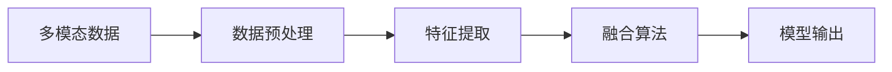
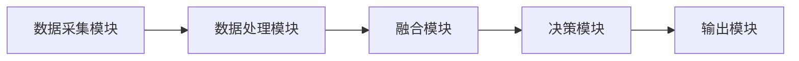
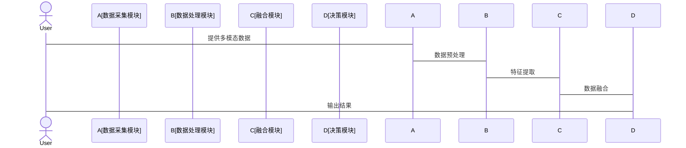

                 


# 构建具有多模态融合能力的AI Agent

> 关键词：多模态AI Agent，多模态融合，注意力机制，对比学习，图神经网络

> 摘要：随着人工智能技术的快速发展，AI Agent在多个领域展现出巨大的潜力。为了提升AI Agent的智能性和适应性，多模态融合技术逐渐成为研究热点。本文将详细介绍构建具有多模态融合能力的AI Agent的关键技术，包括多模态数据的处理、融合算法的设计与实现，以及实际应用场景中的系统架构设计。通过理论与实践相结合的方式，本文为读者提供一个多模态AI Agent的系统性视角。

---

# 第一部分: 多模态融合AI Agent的背景与概念

## 第1章: 多模态融合AI Agent的背景与问题背景

### 1.1 多模态AI Agent的定义与特点

#### 1.1.1 多模态数据的定义
多模态数据指的是来自多种感官渠道的数据类型，如文本、图像、语音、视频、传感器数据等。每种数据类型都有其独特的特征和信息，通过融合这些数据，可以提升AI Agent的理解和决策能力。

#### 1.1.2 多模态融合的必要性
在单一模态数据的基础上，引入其他模态数据可以弥补单一模态的不足，提升AI Agent的感知和处理能力。例如，文本和图像的融合可以提供更丰富的语境信息，帮助AI Agent更好地理解用户的意图。

#### 1.1.3 多模态AI Agent的核心特点
- **多感官数据输入**：能够同时处理多种类型的数据。
- **信息互补性**：通过融合多模态数据，提升信息的理解深度。
- **实时性与响应能力**：能够在实时场景中快速处理和响应。

### 1.2 多模态融合AI Agent的应用背景

#### 1.2.1 当前AI Agent的发展现状
AI Agent已经广泛应用于智能助手、推荐系统、自动驾驶等领域。然而，现有的AI Agent大多基于单一模态的数据处理，难以应对复杂场景中的多样化需求。

#### 1.2.2 多模态数据在AI Agent中的重要性
在复杂场景中，单一模态的数据往往不足以提供足够的信息。例如，在智能客服场景中，结合语音和文本数据可以更准确地理解用户的情感和需求。

#### 1.2.3 多模态融合AI Agent的潜在应用场景
- **智能助手**：通过融合语音和文本数据，提供更智能的交互体验。
- **自动驾驶**：结合视觉、雷达和激光雷达等多种数据源，提升车辆的感知能力。
- **智能安防**：融合视频、音频和传感器数据，提高监控系统的智能性。

### 1.3 多模态融合AI Agent的问题描述

#### 1.3.1 多模态数据的异构性挑战
不同模态的数据具有不同的特征和表示方式，如何有效地将这些数据进行融合是一个关键问题。

#### 1.3.2 多模态融合的技术难点
- 数据的异构性导致难以直接进行融合。
- 融合方法的选择需要根据具体场景和任务进行调整。
- 如何平衡不同模态数据的重要性是一个复杂的优化问题。

#### 1.3.3 多模态AI Agent的性能瓶颈
在复杂场景中，多模态数据的处理和融合会带来计算开销和延迟，这对实时性要求较高的场景提出了挑战。

### 1.4 多模态融合AI Agent的边界与外延

#### 1.4.1 多模态融合的边界
多模态融合的边界在于如何选择和处理输入的数据源，以及如何定义融合的目标和任务。

#### 1.4.2 多模态AI Agent的外延
多模态AI Agent的外延包括其应用场景、功能扩展以及与其他技术的结合。

#### 1.4.3 多模态融合与其他技术的关系
多模态融合技术与其他技术（如深度学习、自然语言处理）密切相关，这些技术为多模态数据的处理提供了理论基础和工具支持。

### 1.5 本章小结
本章从多模态AI Agent的基本概念出发，分析了其在当前背景下的重要性，指出了多模态融合的技术挑战和应用场景，并为后续章节的展开奠定了基础。

---

## 第2章: 多模态融合的核心概念与原理

### 2.1 多模态数据的处理流程

#### 2.1.1 数据采集与预处理
数据采集是多模态融合的第一步，需要根据具体场景选择合适的数据采集方式。预处理包括数据清洗、标准化和格式转换等步骤。

#### 2.1.2 数据融合方法
数据融合方法可以分为基于特征的融合、基于决策的融合以及基于模型的融合。基于特征的融合在早期阶段对数据进行处理，而基于模型的融合则将数据直接输入到学习模型中进行处理。

#### 2.1.3 数据表示与编码
不同的数据类型需要不同的表示方法。例如，图像数据可以使用卷积神经网络（CNN）进行特征提取，文本数据可以使用词嵌入（如Word2Vec）进行编码。

### 2.2 多模态融合的算法原理

#### 2.2.1 基于注意力机制的多模态融合
注意力机制是一种有效的多模态融合方法，它通过计算不同模态数据的重要性，动态调整各模态数据的权重。

#### 2.2.2 对比学习在多模态融合中的应用
对比学习通过最大化同一对象在不同模态下的相似性，来提升多模态数据的表示能力。

#### 2.2.3 图神经网络在多模态融合中的应用
图神经网络可以有效地处理多模态数据之间的关系，适用于需要考虑数据间复杂关联的场景。

### 2.3 多模态融合的数学模型与公式

#### 2.3.1 注意力机制的数学表达
$$
\alpha_i = \frac{\exp(s_i)}{\sum_{j} \exp(s_j)}
$$
其中，$s_i$表示第i个模态的注意力得分，$\alpha_i$表示第i个模态的注意力权重。

#### 2.3.2 对比学习的损失函数
$$
L = -\log \frac{\exp(s_{pos})}{\exp(s_{pos}) + \exp(s_{neg})}
$$
其中，$s_{pos}$表示正样本的相似性得分，$s_{neg}$表示负样本的相似性得分。

#### 2.3.3 图神经网络的边权重计算
$$
W_{ij} = \frac{1}{1 + \exp(-\beta x_{ij})}
$$
其中，$x_{ij}$表示节点i和节点j之间的关系强度，$\beta$是一个超参数。

### 2.4 多模态融合的实体关系图



### 2.5 本章小结
本章详细介绍了多模态融合的核心概念和算法原理，为后续章节的系统设计和实现奠定了理论基础。

---

## 第3章: 多模态融合算法的核心原理

### 3.1 注意力机制在多模态融合中的应用

#### 3.1.1 注意力机制的原理
注意力机制通过计算不同模态数据的重要性，动态调整各模态数据的权重，从而实现多模态数据的融合。

#### 3.1.2 多模态注意力网络的结构
多模态注意力网络通常包括编码器和解码器两个部分，编码器用于提取各模态的特征，解码器用于融合这些特征并生成最终的输出。

#### 3.1.3 注意力机制的实现代码
```python
def attention(query, key, value):
    scores = torch.matmul(query, key.T)
    scores = torch.softmax(scores, dim=-1)
    output = torch.bmm(scores, value)
    return output
```

### 3.2 对比学习在多模态融合中的应用

#### 3.2.1 对比学习的基本原理
对比学习通过最大化同一对象在不同模态下的相似性，来提升多模态数据的表示能力。

#### 3.2.2 对比学习的实现代码
```python
def contrastive_loss(positive, negative):
    loss = -torch.log(torch.sigmoid(positive) + 1e-7) - torch.log(1 - torch.sigmoid(negative) + 1e-7)
    return loss
```

### 3.3 图神经网络在多模态融合中的应用

#### 3.3.1 图神经网络的基本原理
图神经网络通过构建数据之间的关系图，利用图的结构信息进行特征提取和表示。

#### 3.3.2 图神经网络的实现代码
```python
def graph_convolution(x, adjacency_matrix):
    output = torch.matmul(x, adjacency_matrix)
    return output
```

### 3.4 本章小结
本章通过具体的算法示例和代码实现，展示了多模态融合的核心技术，为后续章节的系统设计提供了理论支持。

---

## 第4章: 多模态融合AI Agent的系统架构设计

### 4.1 问题场景介绍
在实际应用中，构建一个多模态融合AI Agent需要考虑数据采集、处理、融合和输出等多个环节。

### 4.2 项目介绍
本项目旨在设计一个能够处理多种模态数据的AI Agent，实现多模态数据的融合与智能决策。

### 4.3 系统功能设计
- **数据采集模块**：负责采集多种模态的数据。
- **数据处理模块**：对采集到的数据进行预处理和特征提取。
- **融合模块**：将不同模态的数据进行融合，生成最终的输出。
- **决策模块**：基于融合后的数据，生成相应的决策和响应。

### 4.4 系统架构设计


### 4.5 系统接口设计
系统接口设计需要考虑模块之间的通信方式和数据格式，确保各模块能够协同工作。

### 4.6 系统交互设计


### 4.7 本章小结
本章通过系统架构设计，展示了如何将多模态融合技术应用于实际场景，为后续章节的项目实现提供了指导。

---

## 第5章: 项目实战

### 5.1 环境安装
需要安装的环境包括Python、深度学习框架（如TensorFlow或PyTorch）以及相关的库和依赖。

### 5.2 系统核心实现源代码
```python
import torch

def multi_modal_agent(query, key, value):
    # 注意力机制
    scores = torch.matmul(query, key.T)
    scores = torch.softmax(scores, dim=-1)
    output = torch.bmm(scores, value)
    return output

# 示例代码
query = torch.randn(1, 10)
key = torch.randn(1, 10)
value = torch.randn(1, 10, 5)

result = multi_modal_agent(query, key, value)
print(result)
```

### 5.3 代码应用解读与分析
代码实现了基于注意力机制的多模态融合，通过计算不同模态数据的注意力得分，动态调整各模态数据的权重，生成最终的输出。

### 5.4 实际案例分析
以智能客服场景为例，展示如何通过多模态数据的融合，提升客服系统的智能化水平。

### 5.5 项目小结
通过实际案例的分析和代码的实现，展示了多模态融合技术在实际场景中的应用潜力。

---

## 第6章: 总结与展望

### 6.1 本章总结
本文详细介绍了构建具有多模态融合能力的AI Agent的关键技术，包括多模态数据的处理、融合算法的设计与实现，以及实际应用场景中的系统架构设计。

### 6.2 未来展望
未来的研究方向可以包括更高效的多模态融合方法、多模态数据的实时处理技术，以及多模态AI Agent在更多领域的应用探索。

---

## 作者：AI天才研究院/AI Genius Institute & 禅与计算机程序设计艺术 /Zen And The Art of Computer Programming

---

本文通过系统性的分析和实践，深入探讨了构建具有多模态融合能力的AI Agent的关键技术，为读者提供了一个全面的视角，帮助他们理解并掌握多模态融合的核心原理和实际应用。

