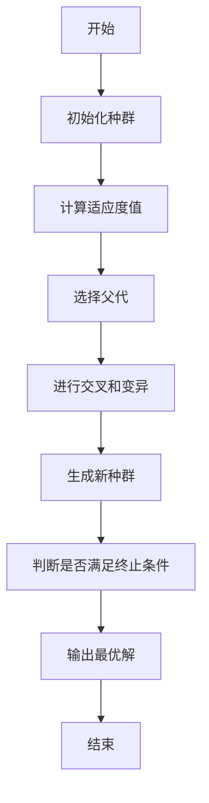

                 

# 构建具有多目标优化决策能力的AI Agent

## 关键词：AI Agent，多目标优化，决策系统，强化学习，系统架构

## 摘要：本文详细探讨如何构建一个具有多目标优化决策能力的AI Agent。从背景知识到算法实现，从系统架构到实战项目，层层深入，帮助读者全面理解多目标优化AI Agent的核心原理和实现方法。

---

# 第一部分: 多目标优化决策AI Agent的背景与概念

## 第1章: 多目标优化决策AI Agent概述

### 1.1 多目标优化决策的背景与问题背景

#### 1.1.1 传统单目标优化的局限性
在实际应用中，许多问题往往涉及多个目标的优化，例如在交通调度中，不仅要考虑时间最短，还要考虑能源消耗最低。传统单目标优化方法难以兼顾多个目标，容易导致次优解。

#### 1.1.2 多目标优化的必要性
多目标优化能够同时优化多个目标，帮助我们在复杂问题中找到最佳折中的解决方案。AI Agent通过多目标优化，可以在复杂环境中做出更优决策。

#### 1.1.3 AI Agent在多目标优化中的作用
AI Agent作为决策者，能够实时感知环境变化，动态调整策略，使得多目标优化决策更加灵活和高效。

### 1.2 多目标优化决策AI Agent的定义与问题描述

#### 1.2.1 多目标优化的定义
多目标优化是指在多个相互冲突的目标函数下，寻找最优或近优解的过程。这些目标函数之间通常存在冲突，无法同时达到最优。

#### 1.2.2 AI Agent的核心概念
AI Agent是一种智能实体，能够感知环境、自主决策并执行动作。它在多目标优化中的应用，使其能够在复杂环境中做出最优决策。

#### 1.2.3 多目标优化决策AI Agent的边界与外延
多目标优化AI Agent的边界包括感知环境、目标建模、优化决策和执行动作。外延则涉及强化学习、演化算法等领域。

### 1.3 多目标优化决策AI Agent的核心要素

#### 1.3.1 目标函数的构建
目标函数是多目标优化的核心，通常包括多个目标，例如在物流中，目标函数可能包括成本、时间和服务质量。

#### 1.3.2 约束条件的定义
约束条件是优化问题的限制条件，例如在资源分配中，每个资源只能分配给一个任务。

#### 1.3.3 决策空间的建模
决策空间是所有可能决策的集合，建模时需要考虑决策变量、目标函数和约束条件。

## 1.4 本章小结
本章介绍了多目标优化决策AI Agent的背景、定义和核心要素，为后续章节的深入探讨奠定了基础。

---

## 第2章: 多目标优化的原理与算法

### 2.1 多目标优化的基本原理

#### 2.1.1 多目标优化的数学模型
多目标优化的数学模型通常表示为：
$$ \min f(x) = (f_1(x), f_2(x), ..., f_n(x)) $$
$$ s.t.\ g(x) \leq 0, h(x) = 0 $$

#### 2.1.2 Pareto最优解的概念
Pareto最优解是指在不损害其他目标的情况下，无法进一步优化某个目标的解。Pareto前沿是所有Pareto最优解的集合。

#### 2.1.3 多目标优化与单目标优化的对比
单目标优化仅考虑一个目标，而多目标优化同时考虑多个目标，通常需要权衡取舍。

### 2.2 多目标优化算法的核心原理

#### 2.2.1 基于群体智能的算法
基于群体智能的算法，如粒子群优化（PSO）和蚁群算法，通过模拟生物群体的行为来寻找最优解。

#### 2.2.2 基于分解的算法
基于分解的算法，如MOEA/D，将多目标问题分解为多个单目标子问题，分别优化后再组合。

#### 2.2.3 基于权重的算法
基于权重的算法，如加权-sum方法，通过为每个目标分配权重，将多目标问题转化为单目标问题。

### 2.3 多目标优化算法的对比分析

#### 2.3.1 算法的优缺点对比
| 算法类型 | 优点 | 缺点 |
|----------|------|------|
| 群体智能 | 易实现 | 易陷入局部最优 |
| 分解算法 | 高效 | 需要大量计算 |
| 基于权重 | 简单 | 依赖权重设置 |

#### 2.3.2 算法的适用场景分析
- 群体智能适用于连续优化问题。
- 分解算法适用于大规模多目标问题。
- 基于权重算法适用于目标明确且权重可调的问题。

#### 2.3.3 算法的复杂度分析
复杂度主要取决于问题规模、算法参数和优化目标数量。通常，多目标算法的时间复杂度较高，但可以通过并行计算优化。

### 2.4 多目标优化算法的Mermaid流程图

### 2.5 本章小结
本章详细介绍了多目标优化的基本原理和常见算法，为后续AI Agent的构建提供了理论基础。

---

## 第3章: 多目标优化算法的数学模型与公式

### 3.1 多目标优化的数学模型

#### 3.1.1 目标函数的构建
目标函数通常包括多个目标，例如：
$$ f(x) = (f_1(x), f_2(x), ..., f_n(x)) $$

#### 3.1.2 约束条件的表达
约束条件分为硬约束和软约束，例如：
$$ g(x) \leq 0 $$
$$ h(x) = 0 $$

### 3.2 常见多目标优化算法的数学公式

#### 3.2.1 NSGA-II算法的步骤
1. 初始化种群：生成初始种群。
2. 计算适应度值：评估每个个体的目标函数值。
3. 快速非支配排序：将种群分为支配层。
4. 离散化拥挤度计算：计算个体的拥挤度。
5. 选择父代：基于适应度和拥挤度选择父代。
6. 交叉和变异：生成子代。
7. 生成新种群：将父代和子代合并，选择最优解。

---

## 第4章: 多目标优化AI Agent的系统分析与架构设计

### 4.1 系统功能设计
系统功能包括目标建模、环境感知、优化决策和策略执行。

### 4.2 系统架构设计
系统架构包括感知层、决策层和执行层。

### 4.3 系统接口设计
系统接口包括输入接口和输出接口。

### 4.4 系统交互设计
系统交互流程包括感知环境、目标建模、优化决策和执行动作。

---

## 第5章: 多目标优化AI Agent的项目实战

### 5.1 环境安装
安装必要的库和工具，例如Python、NumPy、Scipy等。

### 5.2 核心代码实现
实现多目标优化算法，例如NSGA-II，并将其集成到AI Agent中。

### 5.3 案例分析
通过实际案例展示AI Agent在多目标优化中的应用。

### 5.4 项目总结
总结项目经验，提出改进建议。

---

## 第6章: 最佳实践与小结

### 6.1 最佳实践 tips
- 明确目标函数和约束条件。
- 选择合适的算法和工具。
- 定期优化和调整参数。

### 6.2 小结
本文详细探讨了多目标优化AI Agent的构建过程，从理论到实践，帮助读者掌握多目标优化的核心原理和实现方法。

### 6.3 注意事项
- 确保目标函数和约束条件的准确性。
- 定期测试和优化系统性能。
- 注意算法的收敛性和稳定性。

### 6.4 拓展阅读
推荐相关书籍和论文，帮助读者进一步学习。

---

## 作者：AI天才研究院 & 禅与计算机程序设计艺术

---

通过以上内容，读者可以系统地学习如何构建具有多目标优化决策能力的AI Agent，从理论到实践，全面掌握相关知识和技能。

