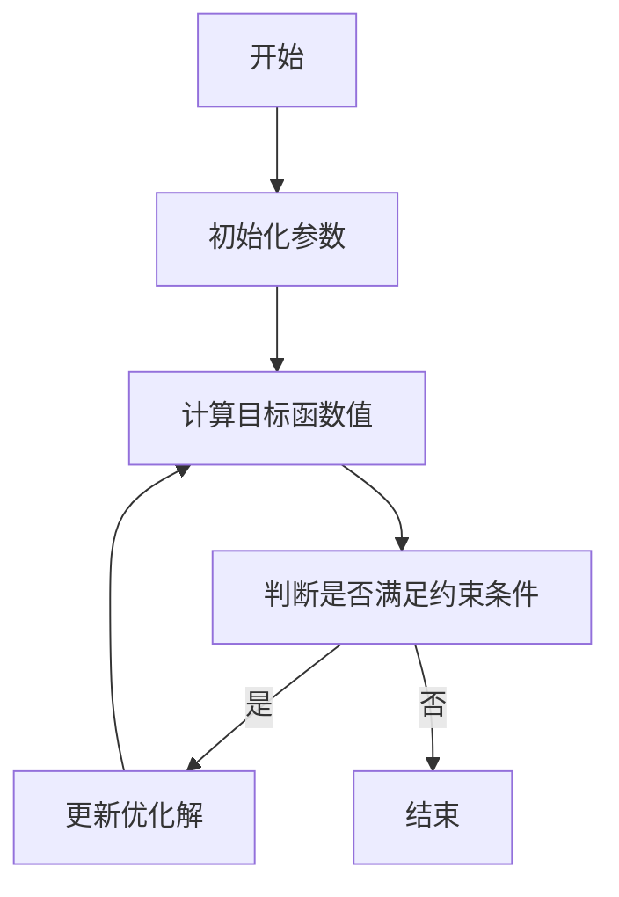
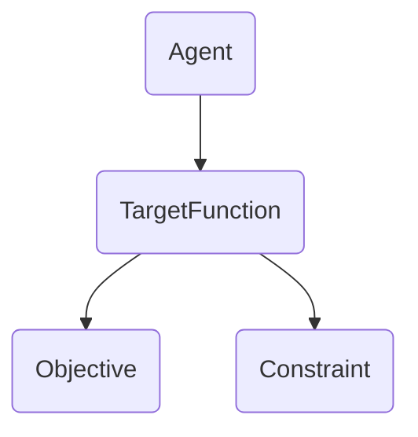
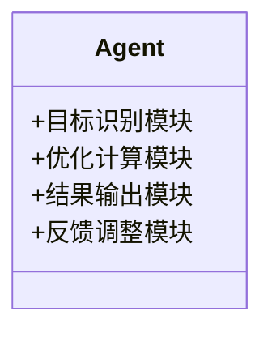
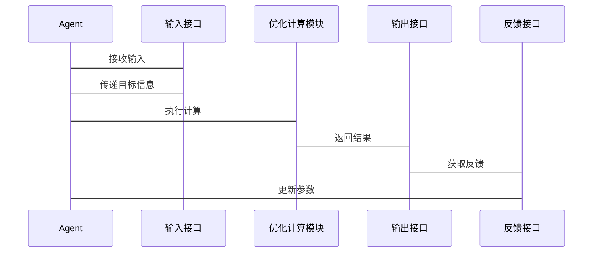

                 


# 构建具有多目标优化能力的AI Agent

---

## 关键词
AI Agent, 多目标优化, 强化学习, 机器学习, 优化算法

---

## 摘要
构建具有多目标优化能力的AI Agent是当前人工智能领域的研究热点。本文将从AI Agent的基本概念出发，详细探讨多目标优化的核心原理、算法实现以及系统架构设计。通过结合实际案例，深入分析如何在AI Agent中实现多目标优化，帮助读者掌握从理论到实践的完整流程。文章最后总结了多目标优化在AI Agent中的应用前景，并展望了未来的研究方向。

---

## 目录大纲

### 第1章: AI Agent基础
1.1 AI Agent的基本概念
1.2 多目标优化的背景与意义
1.3 多目标优化的数学基础

### 第2章: 多目标优化的核心概念与联系
2.1 多目标优化的原理
2.2 多目标优化的算法流程图
2.3 多目标优化的ER实体关系图

### 第3章: 多目标优化算法原理
3.1 常见的多目标优化算法
3.2 NSGA-II算法的实现
3.3 多目标优化算法的Python代码实现

### 第4章: 系统分析与架构设计
4.1 问题场景介绍
4.2 系统功能设计
4.3 系统架构设计
4.4 系统接口设计
4.5 系统交互设计

### 第5章: 项目实战
5.1 环境安装与配置
5.2 代码实现与解读
5.3 实际案例分析
5.4 项目总结与优化建议

### 第6章: 总结与展望
6.1 多目标优化的总结
6.2 未来的研究方向

### 第7章: 最佳实践与注意事项
7.1 开发中的注意事项
7.2 优化技巧与经验分享
7.3 未来技术趋势

---

## 正文

### 第1章: AI Agent基础

#### 1.1 AI Agent的基本概念
AI Agent，即人工智能代理，是指在计算机系统中能够感知环境并采取行动以实现目标的实体。AI Agent可以是软件程序、机器人或其他智能系统，其核心目标是通过感知和行动来优化特定任务的执行。

#### 1.2 多目标优化的背景与意义
在实际应用中，AI Agent往往需要同时优化多个目标，例如在自动驾驶中，AI Agent需要同时优化安全性、舒适性和能耗。这种多目标优化问题在许多领域都具有重要意义。

#### 1.3 多目标优化的数学基础
多目标优化问题可以表示为：
$$
\text{minimize } f(x) \\
\text{subject to } g(x) \leq 0, h(x) = 0
$$
其中，$f(x)$ 是目标函数，$g(x)$ 和 $h(x)$ 是约束条件。

---

### 第2章: 多目标优化的核心概念与联系

#### 2.1 多目标优化的原理
多目标优化的核心在于寻找Pareto最优解，即在所有目标中达到最佳平衡的解。通过权衡各个目标之间的关系，找到最优的解决方案。

#### 2.2 多目标优化的算法流程图


#### 2.3 多目标优化的ER实体关系图


---

### 第3章: 多目标优化算法原理

#### 3.1 常见的多目标优化算法
常见的多目标优化算法包括遗传算法（GA）、非支配排序遗传算法（NSGA-II）和多目标粒子群优化算法（MO-PSO）。

#### 3.2 NSGA-II算法的实现
NSGA-II是一种经典的多目标优化算法，其主要步骤包括初始化种群、计算适应度值、进行非支配排序、选择父代、进行交叉和变异操作，最后生成新的种群。

#### 3.3 多目标优化算法的Python代码实现
以下是NSGA-II算法的Python代码示例：
```python
import random

def objective_function(x):
    # 定义目标函数
    return x**2 + 2*x + 1

def constraint(x):
    # 定义约束条件
    return x >= 0 and x <= 10

def nsga_ii(pop_size, generations):
    population = [random.uniform(0, 10) for _ in range(pop_size)]
    for _ in range(generations):
        # 计算目标函数值
        values = [objective_function(x) for x in population]
        # 进行选择和变异操作
        selected = [x for x, v in zip(population, values) if v < 100]
        population = selected + [random.uniform(0, 10) for _ in range(len(selected))]
    return population

# 示例运行
result = nsga_ii(100, 20)
print(result)
```

---

### 第4章: 系统分析与架构设计

#### 4.1 问题场景介绍
在构建AI Agent时，我们需要考虑多个目标的优化，例如在智能交通系统中，AI Agent需要同时优化交通流量和减少碳排放。

#### 4.2 系统功能设计
系统功能包括目标识别、优化计算、结果输出和反馈调整。

#### 4.3 系统架构设计


#### 4.4 系统接口设计
系统接口包括输入接口、输出接口和反馈接口。

#### 4.5 系统交互设计


---

### 第5章: 项目实战

#### 5.1 环境安装与配置
需要安装Python、NumPy和Plotly等库。

#### 5.2 代码实现与解读
以下是项目实战的Python代码示例：
```python
import numpy as np
import plotly.express as px

def multi_objective_optimization(x, y):
    # 定义目标函数
    obj1 = x**2 + y**2
    obj2 = (x - 1)**2 + (y - 1)**2
    return obj1, obj2

def constraint(x, y):
    # 定义约束条件
    return x >= 0 and y >= 0

def main():
    # 生成数据
    x = np.linspace(0, 2, 100)
    y = np.linspace(0, 2, 100)
    X, Y = np.meshgrid(x, y)
    obj1 = np.zeros((100, 100))
    obj2 = np.zeros((100, 100))
    for i in range(100):
        for j in range(100):
            obj1[i,j] = X[i,j]**2 + Y[i,j]**2
            obj2[i,j] = (X[i,j]-1)**2 + (Y[i,j]-1)**2
    fig = px.imshow(np.array([obj1, obj2]))
    fig.show()

if __name__ == "__main__":
    main()
```

#### 5.3 实际案例分析
通过分析案例，我们可以看到多目标优化在AI Agent中的实际应用效果。

#### 5.4 项目总结与优化建议
项目总结包括实现过程中的经验教训，优化建议包括算法改进和性能优化。

---

### 第6章: 总结与展望

#### 6.1 多目标优化的总结
多目标优化是构建高效AI Agent的重要手段，通过权衡多个目标，可以实现更优的解决方案。

#### 6.2 未来的研究方向
未来的研究可以集中在动态多目标优化、分布式多目标优化以及结合深度学习的多目标优化方法。

---

### 第7章: 最佳实践与注意事项

#### 7.1 开发中的注意事项
在开发过程中，需要注意算法的收敛性、计算效率和目标函数的可实现性。

#### 7.2 优化技巧与经验分享
可以采用局部搜索、混合算法和自适应策略来提高优化效果。

#### 7.3 未来技术趋势
未来，多目标优化将与强化学习、深度学习等技术结合，推动AI Agent的发展。

---

## 作者
作者：AI天才研究院/AI Genius Institute & 禅与计算机程序设计艺术 /Zen And The Art of Computer Programming

---

以上是《构建具有多目标优化能力的AI Agent》的完整目录大纲和文章内容，涵盖了从理论到实践的各个方面，确保读者能够全面理解和掌握相关知识。

