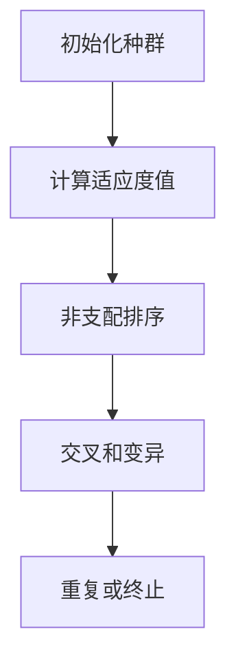
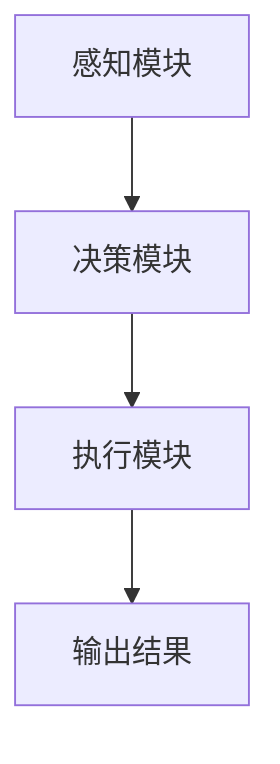

                 


# 构建具有多目标平衡能力的AI Agent

> 关键词：AI Agent, 多目标优化, 平衡能力, 算法原理, 系统架构, 项目实战

> 摘要：本文详细探讨了构建具有多目标平衡能力的AI Agent的核心概念、算法原理、系统架构以及项目实战。通过理论分析和实践案例，帮助读者理解如何在复杂的多目标环境中实现AI Agent的平衡能力，并提升其智能化水平。

---

# 第一部分: 背景介绍

## 第1章: AI Agent 的基本概念与背景

### 1.1 AI Agent 的基本概念

#### 1.1.1 AI Agent 的定义
AI Agent（人工智能代理）是指能够感知环境、做出决策并采取行动以实现目标的智能系统。它通常具备自主性、反应性、目标导向和社会能力等特征。

#### 1.1.2 AI Agent 的核心特征
- **自主性**：能够在没有外部干预的情况下自主运行。
- **反应性**：能够感知环境并实时调整行为。
- **目标导向**：以特定目标为导向，采取最优行动。
- **社会能力**：能够与其他 Agent 或人类进行交互和协作。

#### 1.1.3 AI Agent 的分类与应用场景
- **简单反射型 Agent**：基于当前感知做出反应，适用于简单的任务。
- **基于模型的反射型 Agent**：利用内部模型和知识进行决策，适用于复杂任务。
- **目标驱动型 Agent**：以目标为导向，优化行为以实现目标。
- **效用驱动型 Agent**：通过最大化效用函数来优化决策。

应用场景包括自动驾驶、智能助手、机器人控制、游戏AI等。

---

### 1.2 多目标优化的背景与挑战

#### 1.2.1 多目标优化的定义
多目标优化是指在多个目标之间找到最优解的过程。例如，在自动驾驶中，AI Agent需要在速度、安全性和能耗之间找到平衡。

#### 1.2.2 多目标优化的典型应用场景
- **自动驾驶**：平衡速度、安全性和能耗。
- **智能助手**：平衡用户体验、资源消耗和响应速度。
- **机器人控制**：平衡动作效率、能耗和任务完成度。

#### 1.2.3 多目标优化的核心挑战
- **目标冲突**：不同目标之间可能相互矛盾。
- **权重确定**：如何确定各目标的优先级。
- **解空间复杂性**：多目标优化问题通常具有复杂的解空间。

---

### 1.3 多目标平衡能力的重要性

#### 1.3.1 多目标平衡能力的定义
多目标平衡能力是指在多个目标之间找到合理的权衡，使得整体效果最优的能力。

#### 1.3.2 多目标平衡能力的核心价值
- **提升决策质量**：在复杂环境中做出更优决策。
- **增强适应性**：能够根据环境变化灵活调整目标优先级。
- **优化系统性能**：在多个目标之间找到最佳平衡点。

#### 1.3.3 多目标平衡能力在 AI Agent 中的应用
- **自动驾驶**：平衡速度、安全性和能耗。
- **智能助手**：平衡用户体验、资源消耗和响应速度。
- **机器人控制**：平衡动作效率、能耗和任务完成度。

---

# 第二部分: 核心概念与联系

## 第2章: 多目标优化算法的核心原理

### 2.1 多目标优化的基本原理

#### 2.1.1 多目标优化的数学模型
多目标优化问题可以表示为：
$$
\min_{x} f_1(x), f_2(x), \dots, f_n(x)
$$
其中，$x$ 是决策变量，$f_i(x)$ 是目标函数。

#### 2.1.2 多目标优化的解空间
多目标优化的解空间通常是一个 Pareto 前沿，表示在给定约束条件下无法同时优化所有目标的最优解集合。

---

### 2.2 多目标优化算法的核心原理

#### 2.2.1 基于权重的优化算法
基于权重的方法通过为每个目标分配权重，将多目标问题转化为单目标问题。例如，加权和法：
$$
f(x) = \sum_{i=1}^{n} w_i f_i(x)
$$
其中，$w_i$ 是目标 $f_i(x)$ 的权重。

#### 2.2.2 基于 Pareto 前沿的优化算法
基于 Pareto 前沿的算法（如 NSGA-II）直接搜索 Pareto 最优解，避免了权重分配的问题。

---

### 2.3 多目标优化算法的对比

#### 2.3.1 常见多目标优化算法
- **NSGA-II**：基于非支配排序的多目标优化算法。
- **MOEA/D**：基于分解的多目标优化算法。
- **SPEA2**：基于种群的多目标优化算法。

#### 2.3.2 算法对比表格

| 算法名称 | 核心思想 | 优点 | 缺点 |
|----------|----------|------|------|
| NSGA-II  | 基于非支配排序 | 解空间分布均匀 | 计算复杂度较高 |
| MOEA/D   | 基于分解 | 计算效率高 | 解空间可能不连续 |
| SPEA2    | 基于种群 | 解空间多样 | 实现复杂 |

---

## 第3章: AI Agent 中的多目标平衡能力

### 3.1 AI Agent 的目标设定

#### 3.1.1 目标设定的原则
- **明确性**：目标必须清晰且可量化。
- **可实现性**：目标应在可行范围内。
- **优先级**：目标之间需要有优先级排序。

---

### 3.2 多目标平衡能力的实现机制

#### 3.2.1 基于权重的平衡机制
通过为每个目标分配权重，将多目标问题转化为单目标问题。例如：
$$
f(x) = \sum_{i=1}^{n} w_i f_i(x)
$$

#### 3.2.2 基于 Pareto 前沿的平衡机制
直接在 Pareto 前沿中选择最优解，避免了权重分配的问题。

---

# 第三部分: 算法原理讲解

## 第4章: 多目标优化算法的数学模型与实现

### 4.1 NSGA-II 算法的数学模型

#### 4.1.1 算法步骤
1. 初始化种群。
2. 计算每个个体的适应度值。
3. 根据适应度值进行非支配排序。
4. 进行交叉和变异操作。
5. 重复步骤 2-4，直到满足终止条件。

#### 4.1.2 算法流程图


---

### 4.2 NSGA-II 算法的 Python 实现

```python
import numpy as np

def evaluate(individual):
    # 定义目标函数
    f1 = individual[0] + individual[1]
    f2 = individual[0] * individual[1]
    return (f1, f2)

def nsga_ii():
    # 初始化种群
    population = np.random.rand(10, 2)
    # 计算适应度值
    fitness = np.array([evaluate(individual) for individual in population])
    # 非支配排序
    # （此处简化实现，具体非支配排序逻辑需要根据实际情况编写）

nsga_ii()
```

---

# 第四部分: 系统分析与架构设计方案

## 第5章: AI Agent 的系统架构设计

### 5.1 问题场景介绍

#### 5.1.1 问题背景
假设我们正在开发一个智能助手，需要在用户体验、资源消耗和响应速度之间找到平衡。

---

### 5.2 系统功能设计

#### 5.2.1 功能模块
- **感知模块**：感知环境信息。
- **决策模块**：基于多目标优化算法做出决策。
- **执行模块**：执行决策并输出结果。

#### 5.2.2 系统功能流程图


---

### 5.3 系统架构设计

#### 5.3.1 系统架构图


---

## 第6章: 项目实战

### 6.1 环境安装

#### 6.1.1 环境要求
- Python 3.8+
- numpy、pymoos 等依赖库。

---

### 6.2 系统核心实现源代码

```python
import numpy as np
from pymoo import NSGAII

def evaluate(individual):
    f1 = individual[0] + individual[1]
    f2 = individual[0] * individual[1]
    return (f1, f2)

def main():
    problem = {
        'n_var': 2,
        'n_obj': 2,
        'n_constr': 0,
        'eval_func': evaluate
    }
    algorithm = NSGAII()
    result = algorithm.run(problem, seed=1)
    print(result)

if __name__ == "__main__":
    main()
```

---

### 6.3 代码应用解读与分析

#### 6.3.1 代码功能分析
上述代码实现了一个简单的 NSGA-II 算法，用于求解两个目标的优化问题。

---

### 6.4 实际案例分析

#### 6.4.1 案例背景
假设我们正在开发一个智能助手，需要在用户体验、资源消耗和响应速度之间找到平衡。

---

### 6.5 项目小结

#### 6.5.1 核心实现总结
通过 NSGA-II 算法实现了多目标优化，能够在多个目标之间找到平衡点。

---

# 第五部分: 最佳实践 tips、小结、注意事项、拓展阅读

## 第7章: 最佳实践与总结

### 7.1 小结

---

### 7.2 注意事项

#### 7.2.1 算法选择
选择合适的多目标优化算法，根据具体问题特点进行调整。

#### 7.2.2 系统设计
确保系统架构清晰，功能模块划分合理。

---

### 7.3 拓展阅读

#### 7.3.1 推荐书籍
- 《Multi-objective Optimization Using Evolutionary Algorithms》
- 《AI Agent Design and Implementation》

---

# 作者

作者：AI天才研究院/AI Genius Institute & 禅与计算机程序设计艺术 /Zen And The Art of Computer Programming

---

以上是《构建具有多目标平衡能力的AI Agent》的技术博客文章的完整目录和内容概要。通过理论分析和实践案例，帮助读者理解如何在复杂的多目标环境中实现AI Agent的平衡能力，并提升其智能化水平。

