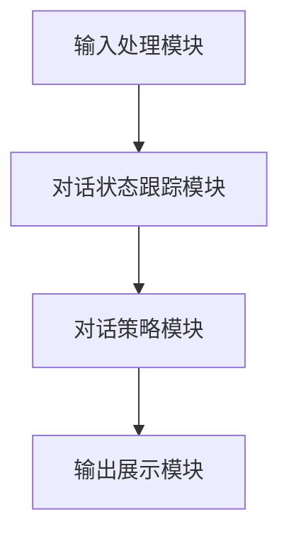
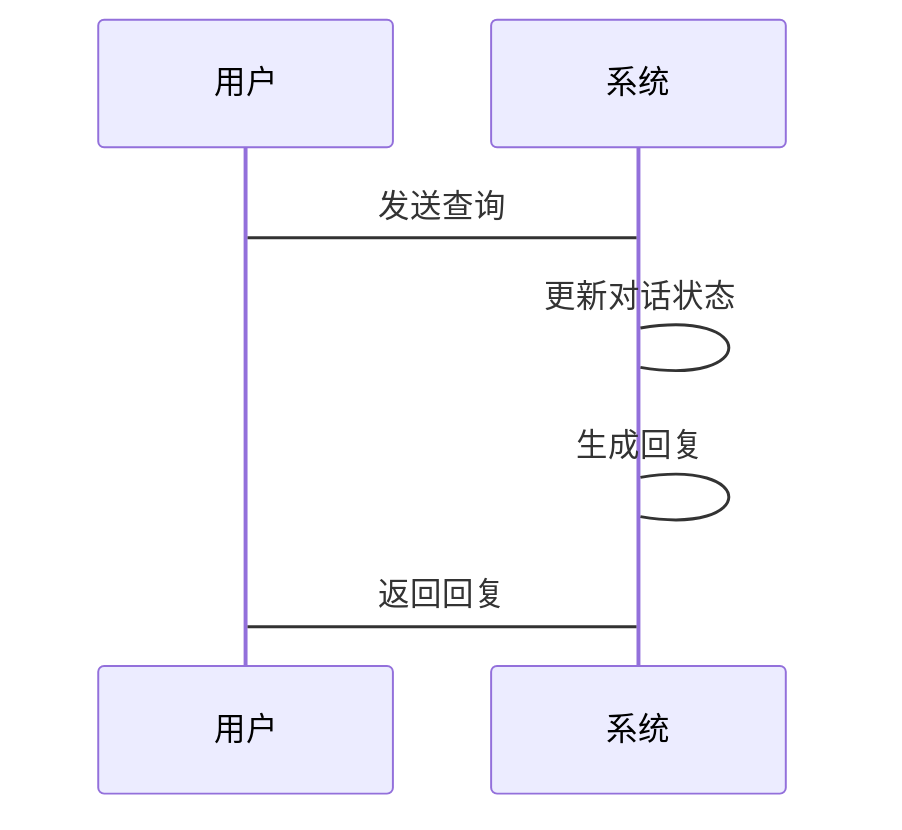

                 


# 构建具有对话管理能力的AI Agent

> 关键词：AI Agent，对话管理，自然语言处理，机器学习，强化学习

> 摘要：本文将详细介绍如何构建一个具有对话管理能力的AI Agent。首先，我们将介绍AI Agent的基本概念及其在对话管理中的重要性。接着，我们将探讨对话管理的核心概念，包括对话状态跟踪和对话策略优化。然后，我们将深入分析对话管理的算法原理，如基于HMM和深度学习的对话状态跟踪方法。之后，我们将讨论对话管理的系统架构设计，并通过实际项目案例展示如何实现一个完整的对话管理系统。最后，我们将总结对话管理的关键点及未来的研究方向。

---

# 第一章: AI Agent与对话管理概述

## 1.1 AI Agent的基本概念

### 1.1.1 什么是AI Agent
AI Agent（人工智能代理）是指能够感知环境、自主决策并执行任务的智能体。AI Agent可以通过与用户交互、分析环境信息并采取行动来完成特定目标。

### 1.1.2 AI Agent的核心特征
- **自主性**：能够自主决策，无需外部干预。
- **反应性**：能够实时感知环境并做出反应。
- **目标导向**：基于目标进行决策和行动。
- **学习能力**：通过经验改进自身性能。

### 1.1.3 对话管理在AI Agent中的重要性
对话管理是AI Agent与用户交互的核心部分，决定了AI Agent能否理解和处理用户的输入，从而提供有效的反馈和响应。

---

## 1.2 对话管理的背景与挑战

### 1.2.1 对话管理的定义
对话管理是指在对话过程中，AI Agent需要跟踪对话状态、理解用户意图并生成合适的回应。

### 1.2.2 对话管理的关键问题
- **对话状态跟踪**：准确理解对话历史和当前上下文。
- **意图识别**：识别用户的深层需求。
- **对话策略优化**：选择最佳的回复策略。

### 1.2.3 当前对话管理技术的发展现状
随着自然语言处理（NLP）和机器学习技术的进步，对话管理已经从基于规则的方法发展到基于深度学习的端到端模型。

---

## 1.3 本书的目标与结构

### 1.3.1 本书的目标
本文旨在通过理论与实践结合的方式，详细讲解如何构建一个具有对话管理能力的AI Agent。

### 1.3.2 本书的结构安排
- 第1章：介绍AI Agent与对话管理的基本概念。
- 第2章：探讨对话管理的核心概念。
- 第3章：分析对话状态跟踪的算法原理。
- 第4章：讲解对话策略优化方法。
- 第5章：设计对话管理的系统架构。
- 第6章：通过实际案例展示对话管理的实现。

### 1.3.3 本书的读者群体
适合对AI Agent和对话管理感兴趣的读者，包括研究人员、开发者和对人工智能技术感兴趣的读者。

---

# 第二章: 对话管理的核心概念

## 2.1 对话管理的定义与分类

### 2.1.1 对话管理的定义
对话管理是AI Agent的核心能力，负责协调对话流程，确保对话目标的实现。

### 2.1.2 对话管理的分类
- **基于规则的对话管理**：通过预定义的规则进行对话控制。
- **基于模型的对话管理**：利用数学模型（如HMM、深度学习模型）进行对话管理。
- **混合型对话管理**：结合规则和模型的对话管理方法。

### 2.1.3 不同对话管理方法的优缺点对比

| 方法类型       | 优点                     | 缺点                       |
|----------------|--------------------------|----------------------------|
| 基于规则       | 实现简单，易于控制       | 难以应对复杂场景           |
| 基于模型       | 能够处理复杂场景         | 实现复杂，需要大量数据     |
| 混合型          | 结合规则和模型的优势     | 实现复杂度高               |

---

## 2.2 对话状态跟踪

### 2.2.1 对话状态的定义
对话状态是指当前对话的上下文信息，包括用户意图、对话历史等。

### 2.2.2 对话状态的表示方法
- **基于向量的表示**：使用向量表示对话历史和当前状态。
- **基于符号的表示**：使用符号逻辑表示对话状态。

### 2.2.3 对话状态跟踪的关键技术
- **上下文记忆网络（Contextual Memory Networks）**：通过记忆网络记录对话历史信息。
- **Transformer模型**：利用自注意力机制捕捉对话中的长距离依赖关系。

---

## 2.3 对话策略

### 2.3.1 对话策略的定义
对话策略是指AI Agent在对话过程中选择回复的规则或模型。

### 2.3.2 基于规则的对话策略
- **简单规则**：如根据关键词匹配生成回复。
- **复杂规则**：如基于对话状态和意图生成回复。

### 2.3.3 基于机器学习的对话策略
- **基于RNN的策略**：如LSTM网络。
- **基于Transformer的策略**：如GPT模型。

---

## 2.4 对话目标与上下文管理

### 2.4.1 对话目标的定义
对话目标是指AI Agent在对话过程中需要实现的具体目标，如解决问题、提供信息等。

### 2.4.2 上下文在对话管理中的作用
上下文信息（如对话历史、用户意图）对对话策略的选择和生成至关重要。

### 2.4.3 上下文表示与更新方法
- **基于向量的表示**：使用词向量或句向量表示上下文。
- **基于序列的表示**：如使用RNN或Transformer模型编码上下文。

---

# 第三章: 对话状态跟踪算法

## 3.1 基于HMM的对话状态跟踪

### 3.1.1 隐马尔可夫模型（HMM）简介
HMM是一种统计模型，常用于时间序列数据的建模。

### 3.1.2 HMM在对话状态跟踪中的应用
通过将对话历史作为观测序列，HMM可以推断出对话状态。

### 3.1.3 HMM的优缺点分析
- **优点**：简单易实现。
- **缺点**：难以处理复杂的对话模式。

---

## 3.2 基于深度学习的对话状态跟踪

### 3.2.1 基于RNN的对话状态跟踪
- **LSTM网络**：通过长短期记忆单元捕捉对话历史信息。
- **GRU网络**：通过门控更新机制捕捉对话状态。

### 3.2.2 基于Transformer的对话状态跟踪
- **自注意力机制**：捕捉对话中的长距离依赖关系。

### 3.2.3 深度学习模型的优势
- **强大的特征提取能力**：能够捕捉复杂的对话模式。

---

## 3.3 对话状态跟踪的数学模型

### 3.3.1 HMM的数学模型
$$ P(O|H) = \prod_{i=1}^{n} P(O_i|H_{i-1}) $$

### 3.3.2 Transformer的数学模型
$$ \text{Attention}(Q,K,V) = \text{softmax}\left(\frac{QK^T}{\sqrt{d_k}}\right)V $$

---

## 3.4 对话状态跟踪的实现步骤

### 3.4.1 数据准备
- **训练数据**：包括对话历史和标注的对话状态。

### 3.4.2 模型训练
- **基于HMM的训练**：使用Baum-Welch算法训练模型参数。
- **基于深度学习的训练**：使用反向传播算法优化模型参数。

### 3.4.3 模型推理
- **基于HMM的推理**：使用Viterbi算法推断最可能的对话状态。
- **基于深度学习的推理**：通过模型生成对话状态的概率分布。

---

# 第四章: 对话策略与强化学习

## 4.1 强化学习的基本概念

### 4.1.1 强化学习的定义
强化学习是一种通过试错方式学习策略的方法，目标是在环境中获得最大化的累计奖励。

### 4.1.2 强化学习的核心要素
- **状态（State）**：对话当前的状态信息。
- **动作（Action）**：AI Agent的回复。
- **奖励（Reward）**：根据对话效果给予的反馈。

---

## 4.2 对话策略优化

### 4.2.1 基于强化学习的对话策略优化
- **策略梯度方法**：通过梯度下降优化策略参数。
- **Q-learning方法**：通过Q值函数学习最优策略。

### 4.2.2 基于Transformer的策略网络
- **编码器-解码器架构**：编码对话历史，解码生成回复。

---

## 4.3 对话策略优化的数学模型

### 4.3.1 策略梯度的数学模型
$$ \nabla J = \mathbb{E}_{\theta} \left[ \nabla \log \pi_\theta(a|s) Q(s,a) \right] $$

### 4.3.2 Q-learning的数学模型
$$ Q(s,a) = Q(s,a) + \alpha \left( r + \gamma \max_{a'} Q(s',a') - Q(s,a) \right) $$

---

## 4.4 对话策略优化的实现步骤

### 4.4.1 环境定义
- **状态空间**：对话状态表示。
- **动作空间**：可能的回复选项。

### 4.4.2 策略网络训练
- **策略梯度训练**：通过梯度下降优化策略参数。
- **Q-learning训练**：通过经验回放更新Q值函数。

### 4.4.3 策略推理
- **基于策略网络的推理**：生成回复并输出。

---

# 第五章: 对话管理的系统架构设计

## 5.1 系统功能设计

### 5.1.1 对话状态跟踪模块
- **功能**：跟踪对话状态，更新上下文信息。
- **模块结构**：包括状态表示、状态更新逻辑。

### 5.1.2 对话策略模块
- **功能**：根据对话状态生成回复。
- **模块结构**：包括策略选择、回复生成逻辑。

### 5.1.3 用户接口模块
- **功能**：接收用户输入，输出回复内容。
- **模块结构**：包括输入处理、输出展示。

---

## 5.2 系统架构设计

### 5.2.1 系统架构图


### 5.2.2 核心模块交互流程
1. 用户输入通过输入处理模块进入系统。
2. 对话状态跟踪模块根据输入更新对话状态。
3. 对话策略模块根据对话状态生成回复。
4. 回复通过输出展示模块展示给用户。

---

## 5.3 系统接口设计

### 5.3.1 对话状态跟踪接口
- **输入**：对话历史、当前输入。
- **输出**：对话状态表示。

### 5.3.2 对话策略接口
- **输入**：对话状态。
- **输出**：回复内容。

---

## 5.4 系统交互设计

### 5.4.1 交互流程
1. 用户输入：用户发送查询或命令。
2. 状态更新：系统更新对话状态。
3. 策略推理：系统生成回复。
4. 回复输出：系统展示回复内容。

### 5.4.2 交互案例


---

# 第六章: 项目实战——构建一个简单的对话管理系统

## 6.1 环境安装

### 6.1.1 安装Python
```bash
python --version
```

### 6.1.2 安装依赖库
```bash
pip install numpy
pip install tensorflow
pip install matplotlib
```

---

## 6.2 系统核心实现

### 6.2.1 对话状态跟踪实现
```python
import numpy as np

def update_state(current_state, input):
    # 简单的状态更新逻辑
    new_state = current_state.copy()
    new_state['intent'] = detect_intent(input)
    return new_state
```

### 6.2.2 对话策略实现
```python
def generate_response(state):
    # 根据状态生成回复
    if state['intent'] == 'greeting':
        return "你好！有什么可以帮助你的吗？"
    elif state['intent'] == 'question':
        return "请问您具体想了解什么？"
    else:
        return "抱歉，我暂时无法处理您的请求。"
```

---

## 6.3 项目小结

### 6.3.1 项目总结
通过本项目，我们实现了对话状态跟踪和对话策略生成的核心功能，构建了一个简单的对话管理系统。

### 6.3.2 项目经验
- **数据准备**：需要大量的对话数据进行训练。
- **模型优化**：需要不断调整模型参数以提高性能。
- **用户体验**：需要关注回复的自然性和流畅性。

---

# 第七章: 总结与展望

## 7.1 总结

### 7.1.1 核心总结
本文详细讲解了如何构建具有对话管理能力的AI Agent，包括对话状态跟踪、对话策略优化、系统架构设计等内容。

### 7.1.2 经验总结
- **数据的重要性**：高质量的数据是对话管理的基础。
- **算法的选择**：根据具体场景选择合适的算法。
- **系统的优化**：需要从多个方面进行优化。

---

## 7.2 未来研究方向

### 7.2.1 对话管理的优化
- **多轮对话优化**：提高对话的连贯性和自然性。
- **跨语言对话管理**：支持多语言对话。

### 7.2.2 新兴技术的应用
- **大模型的应用**：如GPT-3、GPT-4等模型在对话管理中的应用。
- **强化学习的优化**：进一步提升强化学习在对话策略中的表现。

---

作者：AI天才研究院/AI Genius Institute & 禅与计算机程序设计艺术 /Zen And The Art of Computer Programming

